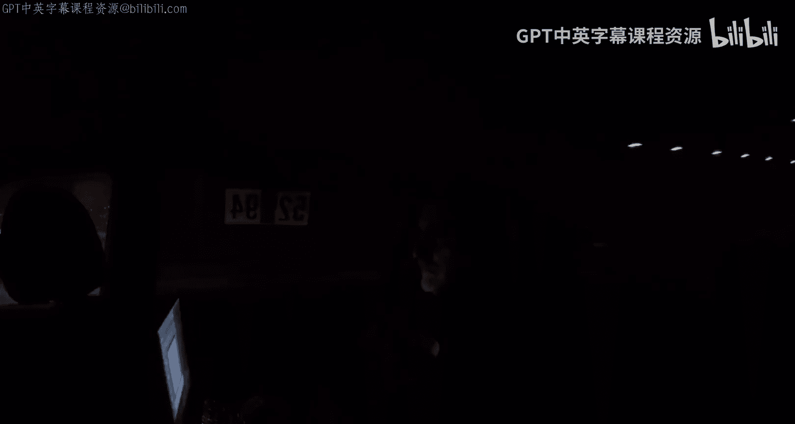
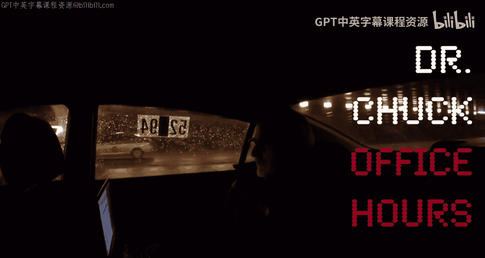

# 143：魁北克蒙特利尔

在本节课中，我们将回顾一次在加拿大蒙特利尔举行的课程附加办公时间。多位来自不同背景的学习者分享了他们学习编程（特别是Python语言）的体验与动机。

***

## 编程教育与学科融合

上一节我们介绍了本次办公时间的背景，本节中我们来看看关于编程在基础教育中角色的讨论。

编程可以与数学和计算机科学紧密结合。计算机科学专业的学生需要学习大量数学课程，其核心内容很大程度上是数学。公式可以表示为：`计算机科学 ≈ 数学 + 编程`。

然而，成为一名技术专家并不必须精通数学。关键在于，在众多高中课程中，可以融入编程教学。这并不意味着要求每个高中生都必须修读12门编程课，而是可以适度安排。例如，学生可能只选修两到三门编程课，同时用一部分化学课的时间，替换为一门入门级的计算机课程。

这种调整的宏观考量在于：我们应该思考，对于13至17岁的学生，什么是可能且有效的教学内容？目标是教授他们能够真正掌握并记住的知识，而不是仅仅作为一种筛选机制。

***

## 学习者的自我介绍与动机

在讨论了编程教育的理念后，让我们听听参与本次办公时间的各位学习者的故事。以下是他们的自我介绍和学习Python的初衷：

*   **Katya**：我修读了两门课程，它们都非常棒，感谢您的教学。
*   **Carl Hanz**：我是一名网站架构师，正在学习更多知识。
*   **Suravvy**：我在麦吉尔大学攻读博士学位，计划从事可再生能源领域的研究。我学习编程是因为未来会使用相关软件和随机评估工具，而Python将用于实现这些工具。
*   **Bni**：我正在享受Python课程。
*   **Jamatist**：我是一名视觉特效艺术家，感谢Dr. Chuck让我通过学习Python成为一名更好的艺术家。
*   **Mcwell**：我最近在蒙特利尔成立了一家科技公司，Python课程非常精彩，我计划夏天再学一遍。
*   **Andreas**：我很高兴从入门开始学习Python，它非常有趣且简单。
*   **Sergio**：我是一名航空分析师，Python为我完全打开了一些新的大门。
*   **Tim Mccherin**：我正在修读“Python与信息学”课程，感谢这次美好的体验。
*   **Olga**：这是我第一次参加Coursera的课程，我感到非常高兴，并希望这能帮助我找到工作。
*   **Steve**：我正在同时学习互联网历史和Python课程，两门课都让我非常愉快。
*   **Nancy**：我代表“编程女性”洛杉矶分会感谢Dr. Chuck。
*   **Flor**：这是我认真学习的**第一门**编程语言，我非常享受这个过程，也很喜欢课程的设置方式。
*   **Joanna**：我正在学习Python课程，这是我的第一门编程语言，体验很棒。
*   **Ramona**：我正在学习互联网历史课程，并计划在夏天学习Python课程。
*   **Pierre**：我已经完成了Python课程，并希望继续学习其他课程。
*   **Matt**：我是一名IT管理员，学习Python已有几年，它对我所做的每件事都很有帮助。
*   **Saib**：我正在跟随Dr. Chuck学习Python。
*   **Dominda**：我是麦吉尔大学的学生，作为一名初学者，今天的活动让我很感兴趣。

***

## 总结

本节课中我们一起回顾了在蒙特利尔举行的一次课程办公时间。我们探讨了编程在通识教育中的定位，并聆听了众多学习者分享他们如何将Python应用于学术、艺术、创业和职业发展等多元领域。尽管参与者众多以至于需要更换场地，但这次交流无疑是一次成功的活动。