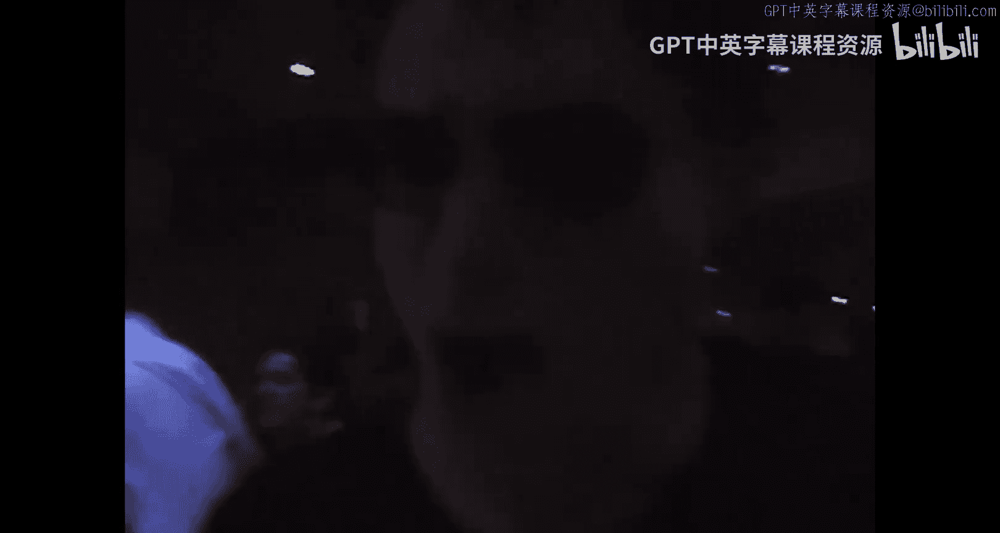
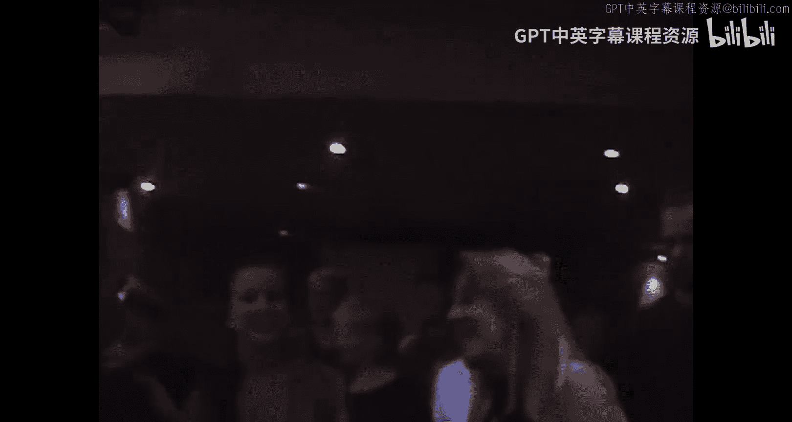
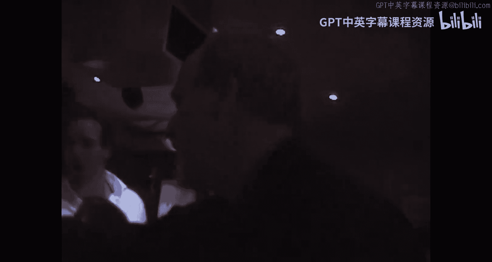

# 密歇根大学《面向所有人的Web应用程序》：p07：趣味环节：Chuck博士在日内瓦唱蓝调 🎸

在本节课中，我们将回顾并整理课程中一个轻松有趣的环节。这个环节展示了课程社区互动的一面，并包含了一些技术演示的片段。

## 概述

本节内容并非严格的技术教程，而是记录了课程进行中的一段插曲。Chuck博士在瑞士日内瓦通过网络与课堂互动，并进行了即兴的音乐表演。这段内容体现了在线课程的灵活性与趣味性。

## 环节记录

上一节我们介绍了课程的核心技术内容，本节中我们来看看这个轻松的互动时刻。

课程进行中，Chuck博士通过网络接入课堂。他邀请大家协助让另一位参与者加入连线。

以下是连线过程中的一些对话与互动要点：
*   所有人都会出现在YouTube Zoom会议中。
*   博士认为那位参与者才华横溢。
*   博士感谢大家的帮助。

随后，环节进入了即兴音乐表演部分。Chuck博士使用了他的设备进行演奏。

以下是表演中的一些歌词和互动片段：
*   演唱了关于“密歇根货运司机”的内容。
*   歌词中混合了多种语言的感叹词。
*   表演中提到了“远程控制”设备。
*   歌词表达了情感与故事。

表演过程中，共享了多张现场或相关的图片，增强了互动氛围。

## 总结

本节课中我们一起回顾了课程中的一个趣味互动环节。这个环节通过音乐和实时连线，展示了在线学习社区生动、人性化的一面，为严谨的技术学习增添了轻松的色彩。