# 密歇根大学《面向所有人的Web应用程序（PHP、SQL、APP、JavaScript和JQuey｜Web Applications for Everybody》 p09 8_HTML标签.zh_en -BV1Lr421A75d_p9-

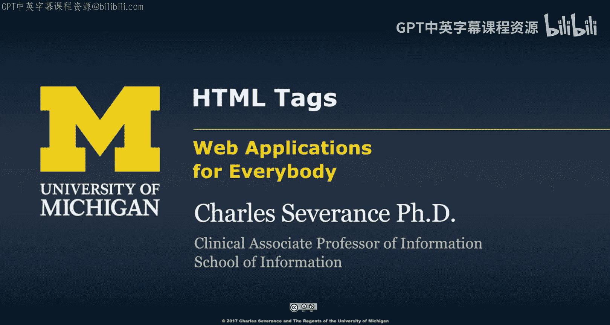

So now we're going to talk a little bit more detail about how HTML works is just some more of the things and again I'm not trying to make you an expert so the first thing talk about is the fact that there are two basic parts to any HTML document there is the HTML tag that is in effect scopes out the doc type talks about the different versions of HTML and I think a lot of people are starting to just not even put doc type out but you might HTML tag sort of is the whole body I mean the whole document and then there is kind of like an HP there is some metadata in the document that doesn't actually show up but describes the document we load CSS in here do other things and then the body is actual visible stuff and I'm not going to show all this in every one of my examples but understand that a page itself kind of is supposed to be bracketed in an HTML tag with head material which is metadata and the page content that is in the body tag。

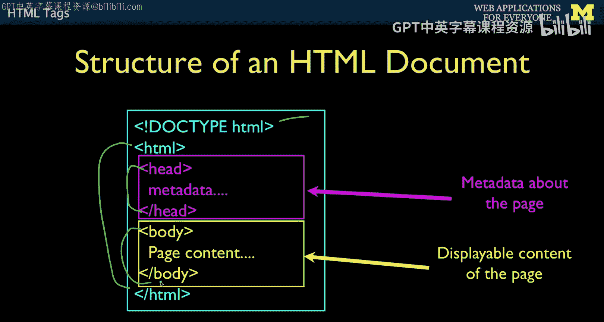

You'll also notice as you start creating HTML files that there are some files that are special。

So if you have like a URL that points to a directory， like blah， blah， blah blah blah， s ABc。

Whi is just a folder。 and ABC is a folder。 Then inside this folder。

 there might be a special file like index htm index hm or index do php。

 And so this is part of that Apache web server。 It has a configuration that says if someone navigates to a folder。

 go look up a particular default and usually indexed HTMLm these days is the most common one indexed Hs kind of old in the old days there was kind of like a Loieda。

 the Uniix people had more than three character suffixes。

 And so this was like the cool unix people and this was the noncool Windows people。

 but no Windows can have longer suffixes。 and so everyone just kind of gave up and uses indexed Hm most of the time so you'll probably build most of your files that are HTML files with a dot Hm suffix。

 Of course， later will'll make Php files that dynamically allowed code to run and dynamically generate Hm。

And that's something that we will do in an upcoming lecture。

 but there is a way when you're using a web server like Apache。

Which means you're in a browser that its local host or you know， blah， blah， blah， then Apache。

 when you go to a folder， it goes and gets the file name as the default view of that folder。

So you can also put multiple files in a folder and so you have kind of this index in this case indexed at HTMLM。

 which is kind of the file that is shown into the browser if the folder is navigated to and other HTML files which you can link between these。

 and then perhaps even image files that are in the same folder。

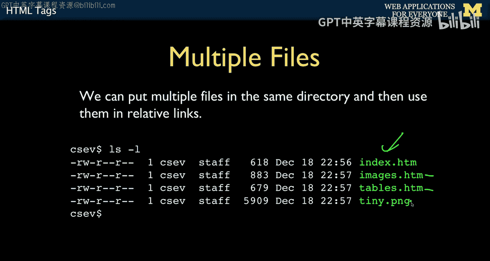

And so like I said， you can have all these tags。 HTML has all these tags that allow you to mark up and you know they start and they stop and you put bold and then these basically show you know bold or italics or whatever。

 Now， the other thing is is that。None of the new lines or the blank lines or the end lines inside the HTML actually matters unless you work extra hard。

 the browser wants， as you resize the width， it resizes these things right So this is not exactly precise presentation that says put the letter A in the upper left-hand corner and put the word the here and put the word developer there。

 No， we basically allow within paragraphs， the wrapping to happen dynamically and so this is allows us depending on you know if this is a really tiny screen or a large screen or maybe you've got a bunch of windows open on your computer。

 a lot of HTML will rerap automatically Now with CSS。

 you can do things like put solid margins on things and some folks like to build websites that don't wrap。

 that's actually sort of a stylistic argument， but this is not a design class for now。

 unless you do otherwise， content will be wrapped dynamically。

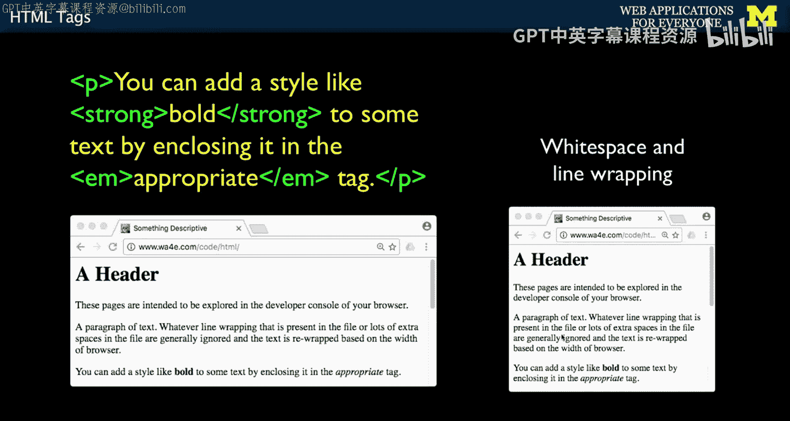

Tags have beginnings and end。So anything in less than greater than pair is a tag and a start tag。

 an end tag is basically the same name as the start tag with a slash。

 and so this is like start bold and bold and it applies to the text in between those tags。

Another thing you can have is attributes on tag， these are called attributes。

 they're key value pairs， so this is an image tag。And so this is also a self closing tag because this basically says wherever''re at。

 put this image here， wherever we're at， and where do you get the source。

 well that is the image file sitting in this same folder that's going to show up in this image。

So these are attributes you can have more of them you don't have to just have one of them。

 you can have as many attributes as you like。

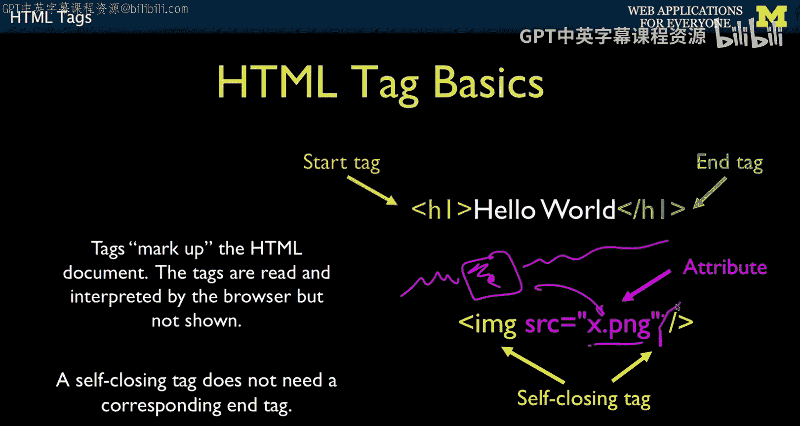

You also need to be able to put in things like less than and greater than because in effect。

 your're writing code。 So HTML is very simple programming is very declarative programming。

 It's relatively easy。 You can kind of look at and go oh I kind of get what that's doing but in this programming language less than is like code right and greater than is code So how do you do this Well。

 we've got these things called HTML entities and Ampersand is also a special character but it's used to。

Escape these Hity。 So ampersand less than semicolon becomes less than Ampersand greater than colon becomes greater than。

 Oh， what about ampersent。 Ha ha， Well， we got that， too， Ampersand Amp。

 And then there's some other fun things。 And you can put special characters and smiley faces and very things like Ampersand heart。

 semicolon and go to look up all these things。 These are called H T M L enes。😊。

I actually like these little arrow guys because then I don't have to have images for arrows。

 I just say， hey， be an arrow， a left arrow， an up arrow， a right arrow and a down arrow。

 And that just our browsers will show you that。 And that's really just a character。 And of course。

 for kids these days， you can make emojis。 So emojis also many emojis even have these kinds of things in them。

 And so its it's cool。 Who knows， eventually we will find that you know。

 these old characters10 years from now。 like what， that's like what ancient people used to write on cave walls。

 We only talk in emoji now。 But who knows if that'll happen。😊。

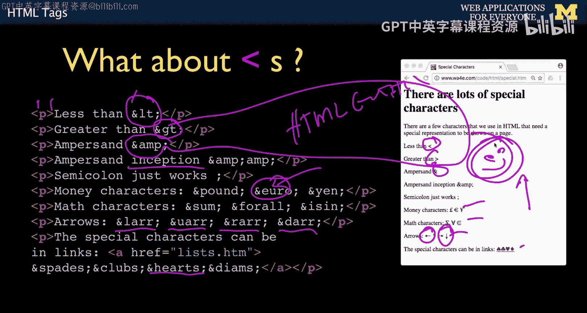

Okay， HTML comments， any programming language needs to have some kind of a mechanism to have comments。

 less than exclamation dash dash。 This is the beginning of comment。

 and then dash dash greater than is the end of comment。

 These can go across multiple lines and this basically is something that shows up in the HTML source but has no effect on the HTML output。

 And if you're a programmer， you kind of know that comments are sometimes there to say something。

 or sometimes you use it to sort of like comment something out like you comment this out by putting less than exclamation dash dash and then dash dash question and then all of a sudden this sort of ceases to exist except you really didn't want to delete it。

 You wanted to suppress it because you're testing something。

 So you can use comments either for annotations for future developers。

 I once saw an organization that basically had less than X dash dash a big thing in their web page that was。

If you are reading this， you might be the kind of person that wants to apply for our job at our company。

 Here is the URL for our job application。 So it's like， oh， who's viewing the source of this H page。

 And if you're that kind of person or running it in developer console。

 then then maybe you're the kind of person that wants to work for our company。

 So people put all kinds of secret things。 the University of Michigan page at one point had like a comment in it。

That had a big blockM in letters， you know， written out in letters。And so that's just like， you know。

 that's like an Easter egg。 So sometimes people put Easter eggs inside their HTML comments。

 but we're just programmers。You can put any drag in if you want。

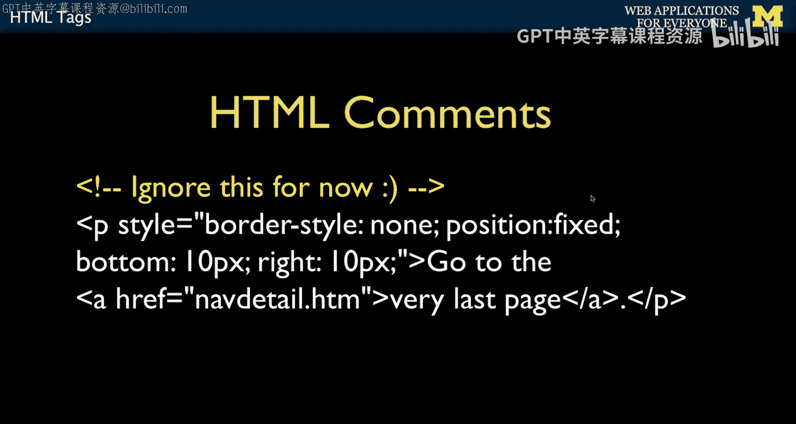

Okay， so let's talk about links because HTMLl stands for hypertext Markup language and hypertext is links to other things。

And so that's the whole idea and literally these hypertext links are like why search engines work。

 it turns out I mean without hypertext links， there would be no search engines。

 I mean it's great for navigation but it's even greater for search engines because search engines effectively look at the links is the way to a discover content and B the way to determine which content is more or less relevant and so it is really kind of very。

 very， very important stuff and so when you build pages。

 the pages that you link to you're creating sort of collective knowledge each website that you build that connects to other websites in effect contributes to the collective knowledge。

So there's one tag that allows you to do links called the anchor tag。

 and that's the a for anchor and it has an attribute。 So a and then Hf is the attribute。

 remember this is the tag Hf equals and then attributes have to have double quotes and then you can say a URL and what you're basically saying and this is the text。

 So there's a beginning tag and an end tag this is the end of the beginning tag， not the end tag。

 this is the end tag。 So between the beginning anchor and the end anchor is the text that's going to be highlighted。

 and you'll notice that because I haven't used CSS， it's styled as blue。

 because I haven't clicked it yet and underlined so blue and underlined and says when I click it now this is a piece of software in this case。

 it's Chrome and it's a browser and this software is running on your computer and you're moving your mouse around and it'sse going click。

 Now then it looks at this and says， oh what did you mean to do and that's where the request response cycle which we talked about in an earlier lecture happens that's an anchor tag。

 how you say this text is supposed to be highlighted。And upon click， go to this place。

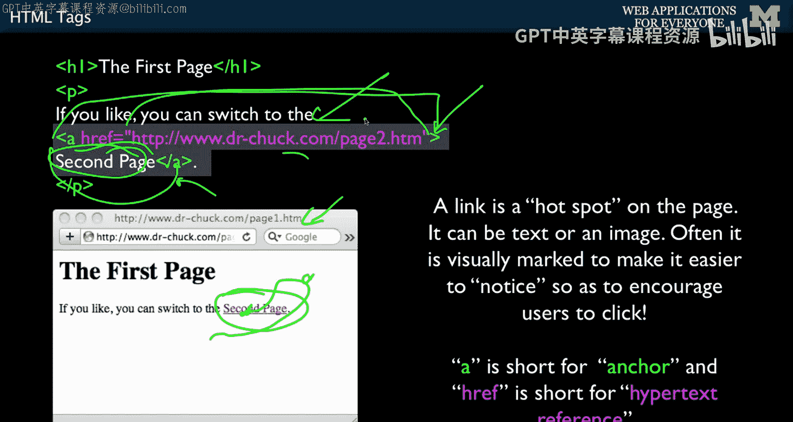

These links can be relative or absolute。 and so if we're in a particular folder and don't put the whole HtTP。

 you can put just the relative， which is a file in the same folder and so we can go back to the first page I clearly have clicked on this because it's now purple The default styling for better for worse again。

 you have to go back 20 years to realize why we do this by default if it's purple and underlined it's a link that hast been clicked on before part of that was keep on going and explore new parts of the world wideide Web that was back when the World wide Web was small enough that we tried to try to get you to go places Now you go places Now all of us go places without really thinking too much。

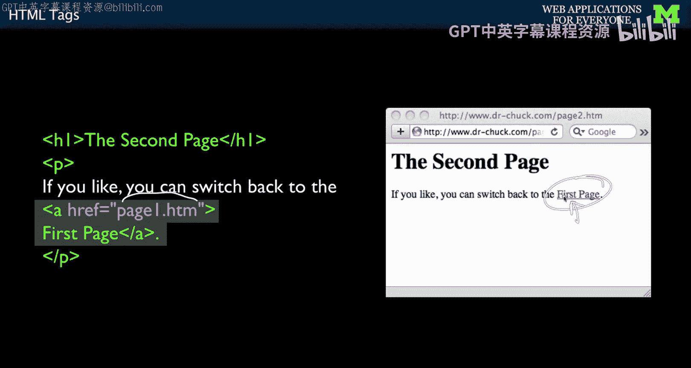

And so these are just two example anchor tags， you know their anchor， the start tag。

 that is the start tag， this is an end tag， and then this is an attribute in that and we can either have a relative or absolute link。

So images are another part of this， actually if you go and you can find perhaps the original arguments。

 whether or not images were supposed to be inlined or not in I don't know， 92，93， 1992， 1993。

 there was an argument that we shouldn't have images on the same page as text and it used to be that all images would open up in a new window and that was a fierce argument and images within the text1。

 and so the image tag。

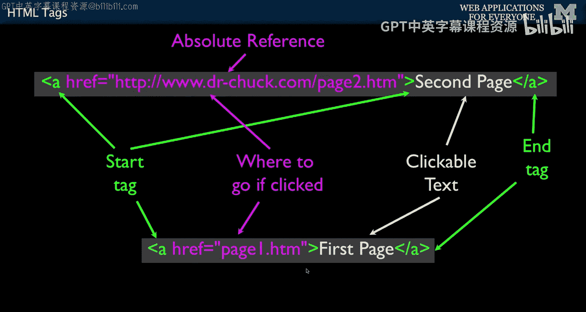

I probably should put a slash here。 I missed that slash。

 The image tag is sort of like the anchor tag has text that it sort of starts and ends right And so the image tag is like a character。

 it's more like a character and so you say images can be right in the middle of text and so this is like images can be right in the middle of text so you can think of this as grab this little tiny image and stick it in the text and it and it reflows And if you change the width of this it would reflow everything and a away you go And you can actually if you think of the image is kind of like just a super special。

 awesome character。 small medium or large。 I put this image in the middle of an anchor tag so here's the start anchor tag here's the end anchor tag and the clickable thing is this little link and so you can go do this and play with this code on you know code images HM you click on that thing and it will go to list HM So you're just going kind of back and forth and all this stuff all this stuff is up there。

You can play with all of these URLs at web applicationsforEbodyy。com。This is a list。

 It's another thing to talk about。 So lists of things。 there's a couple different kind of lists。

 There's lists with numbers and lists with bullets。 We do a lot of lists。 And again。

 we're kind of helping things like Google figure out semantically what this page is about。

 This is somehow some roughly equivalent set of stuff。 And so this is going to be an unnumbered list。

 That's what the U means， which means it's going to have bullets。

And so a numberumbed list and then L to slash li。And so L is the list item and so that's just telling the when to put the bullets in and when to sort of break the justification。

Now you'll see that I also have a paragraph tag and that's because the default styling of list items does not put any white space in between things。

 and so the paragraph says put some white space so this white space here is coming from the paragraph not the list tag and so if you just do this you can do it without the paragraph tag but you won't get this whitespace and it look kind of whatever and so click kind of tight and so the rest of this is just HTML。

 some anchor tags etca， eta， etc cea。 this whole little sample stuff is so you can kind of click back and forth and view source usually you right click and view source。

And you can see this from that page That's one of the wonderful things about HTML is however clever someone was and make an HTML page。

 you can always view source， you might have to turn that on in developer mode so that you can view the source of the web page。

 but it's really， really useful because you can see everybody's cool tricks。

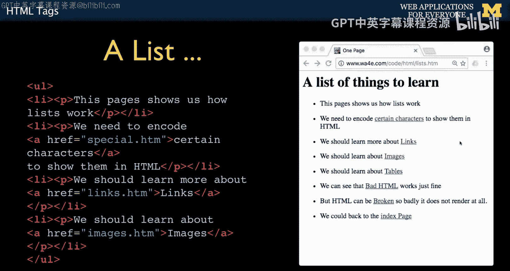

Tables are an important part of HTML for tababular data in the old days。

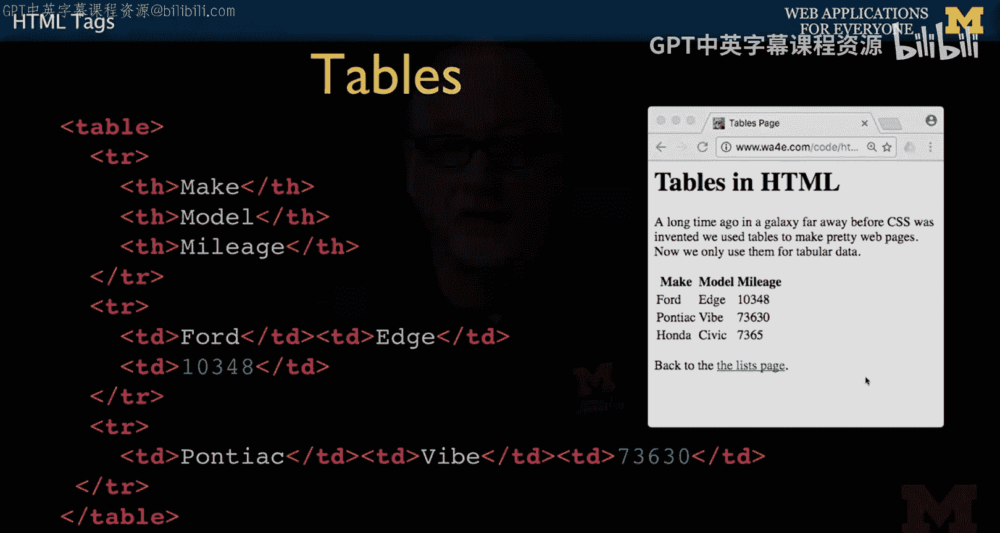

I know I keep going back to the old days and the old days tables were used for graphic layout。

 but that was like super tacky Now we use CSS for graphic layout that's the next thing we're going to talk about。

 but turns out that there are still tables and so tables are like grids or spreadsheets and it's just a set of markup patterns that tell us how to mark up tabular data and so we start with a table tag and end with a table tag and the table has a series of rows。

 one， two， three rows。

Civic's not showing up down here。 And so there's a header。

 there's actuallys there's a T head that I probably should have put in there。

 And the first row is this header row， and there's a T and Nth。 And that's basically， you know。

 making little little grid， you can control with CSS， the wick of these things。 Otherwise。

 it's actually just like it's resizing these things， it resizes these as well。

 and finds ways to fit them on the screen。 Now this is all small。 So we're not really overloading it。

 But if I made one of these things super long。 it would sort of expand these things dynamically。

 And and again， with CSS， you get a lot more control over this。And then now we have a row of data。

 the TD stands for table data， slash TD， so that's one little grid item， one little grid item。

One little grid item。 grid item。 So those are the grid items。 So these tables are pretty easy to do。

 but you only use them when you really have a table of data， when you have a table of data。

 like a bunch of rows or courses or all the students in a course or something you want to use a table。

 because then that is the most semantically accurate way of representing the markup for a table data。

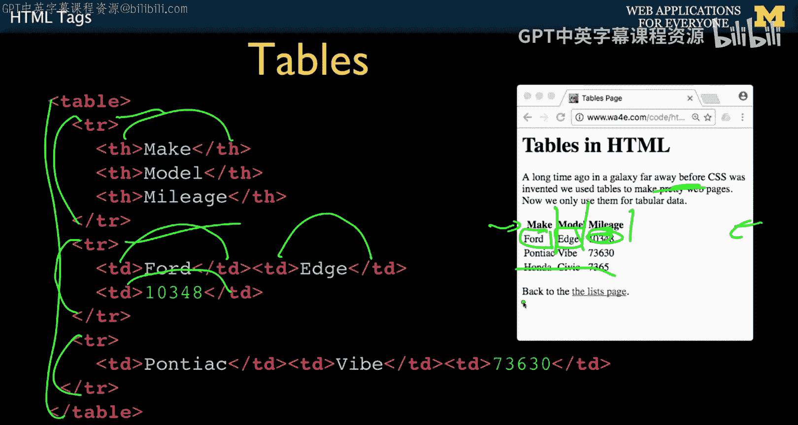

And so you can play with this sample code， go to web applicationsplicationforbody。

com/code/htm if you set it up， you can go here and you can right click and you'll see a thing that says inspect element。

And you can go find it down here and look at this and you can play around。

 and we will over the course of this course， we will learn more and more about this developer console。

 But for now， we're just kind of playing with the source code。 And again， if you've got it set。

 you can also do a right click view source and then it'll pop up in another tab the actual source。

 And so the source is pretty much exactly what the web server sent back to us and。

We'll later realize that this is this is the actual document object model。

 which is the thing that you're viewing。 and for simple pages。

 the document object model and the source are one and the same。 but after a while。

 when we start fooling around and change the document object model in JavaScript。

 we will see situations where this stuff changes， but。This stuff does not。

 but we're kind of getting ahead of ourselves and so there's a view source view of this and there is the inspect element view you will learn to use both of those at the right times。

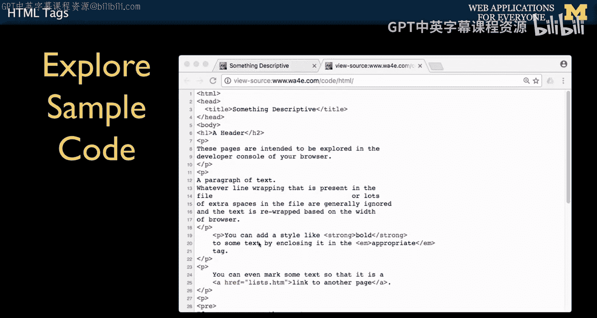

And so that's sort of a zoom through HTML。It started out as a beautifully， elegantly simple。 I mean。

 it we go back to Tim and Robert and。It's so beautifully elegantly simple。

 made by engineers who were limited in their resources。

 and then what we've done is without really throwing it away。

 we've just evolved it to be super beautiful and super flexible Worldwideide Web consortium and many others have really made HTML and CSS a powerful。

 powerful formatting mechanism that's very easy to use and extremely flexible with a high degree of control。

 So up next we're going to talk about CSS and cascading style sheets。

