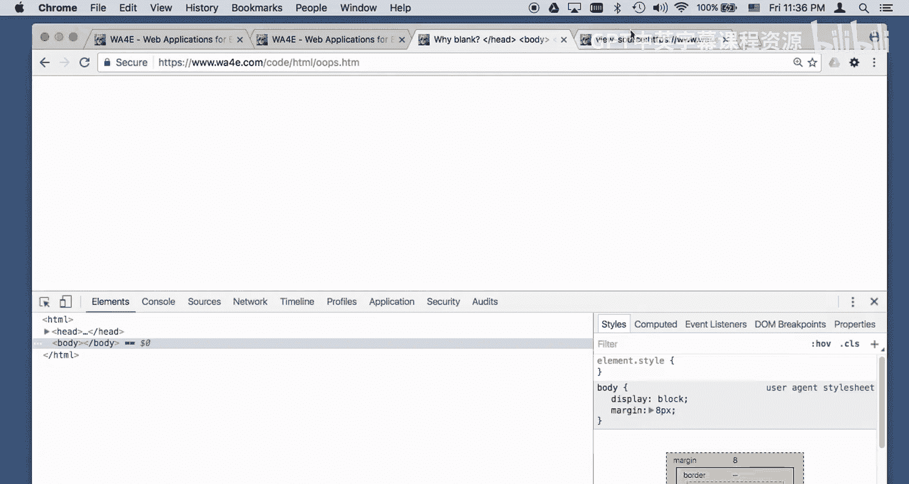

# Web应用程序开发：第10章：HTML代码详解 🧑‍💻

在本节课中，我们将通过分析示例代码来深入了解HTML。我们将探讨HTML源代码与浏览器解析后生成的文档对象模型（DOM）之间的区别，并学习如何查看和调试它们。你可以下载代码在本地操作，也可以直接在浏览器中查看。

---

## 源代码与DOM的区别

上一节我们介绍了课程目标，本节中我们来看看HTML源代码和DOM的核心区别。

**源代码**是服务器发送给浏览器的原始文本文件。你可以通过浏览器的“查看页面源代码”功能看到它。它完全反映了文件在服务器上的内容。

**文档对象模型（DOM）** 是浏览器解析HTML源代码后，在内存中创建的一个结构化、可编程的对象表示。它反映了页面的当前状态，可以通过开发者工具（如“检查元素”）查看。

一个关键点是：**DOM可以被JavaScript动态修改，但源代码永远不会改变**。源代码是静态的，而DOM是动态的。

---

## 基础HTML结构分析

现在，让我们分析一个基础的HTML文档结构。

我们有一个基本的文档，包含 `html`、`head` 和 `body` 标签。在 `body` 中，有标题（`header`）、段落（`p`）等元素。

*   HTML中的空白字符（如空格、换行）通常不影响最终渲染效果，浏览器会忽略大部分多余的空白。
*   一个 `strong` 标签用于加粗文本。
*   一个 `em` 标签用于强调文本。
*   一个 `a` 锚点标签用于创建链接。链接的文本位于开始标签 `<a>` 和结束标签 `</a>` 之间。

链接可以是相对的或绝对的。相对链接基于当前页面的位置，浏览器会自动将其转换为完整的绝对链接。

```html
<!-- 这是一个相对链接的例子 -->
<a href="list.html">转到列表页</a>
```

---

## 列表与特殊字符

以下是关于列表和如何在HTML中显示特殊字符的要点。

**无序列表** 由 `<ul>` 标签定义，列表中的每一项由 `<li>` 标签定义。为了在列表项之间创建间距，我们可以在 `<li>` 内部使用 `<p>` 段落标签。

```html
<ul>
  <li><p>第一项</p></li>
  <li><p>第二项</p></li>
</ul>
```

在HTML中，有些字符是保留的，必须使用**字符实体**来表示。

*   `<` 必须写成 `&lt;`
*   `>` 必须写成 `&gt;`
*   `&` 必须写成 `&amp;`

浏览器内置了对这些字符实体的支持，可以显示各种符号，如 `&clubs;`（♣）、`&hearts;`（♥）等。

---

## 链接与图像

接下来，我们看看如何创建链接和插入图像。

**链接**的 `href` 属性指定目标地址。`target="_blank"` 属性可以让链接在新标签页中打开。

```html
<a href="https://www.example.com" target="_blank">在新标签页中打开示例网站</a>
```

**图像**使用 `` 标签插入，其 `src` 属性指定图片文件的路径。图像本身不产生布局空间，它像一个巨大的字符嵌入在文本流中。周围的 `<p>` 标签会为其添加上下边距。

```html
<p></p>
```

图像也可以作为链接的点击目标，只需将 `` 标签放在 `<a>` 标签内部即可。

---

## 表格与常见错误

表格曾经被用于页面布局，但现在应仅用于展示表格化数据。以下是创建表格的基本结构。

一个标准的表格应包含 `<table>`、`<thead>`、`<tbody>` 和 `<tr>`、`<td>` 等标签。即使你在源代码中遗漏了 `<tbody>`，浏览器在构建DOM时也会自动补全，以使结构完整。

```html
<table>
  <thead>
    <tr><th>姓名</th><th>年龄</th></tr>
  </thead>
  <tbody>
    <tr><td>张三</td><td>25</td></tr>
  </tbody>
</table>
```

HTML非常宽容，浏览器会尽力修复一些常见的编码错误，例如：
*   将标签名自动转换为小写。
*   尝试补全未闭合的标签。
*   修正属性值缺少的引号。

这些修复都体现在DOM中，而不是源代码里。这也是为什么有时调试需要同时查看源代码和DOM。

---

## 动态修改DOM

最后，我们强调DOM的动态特性。这是前端开发的核心概念之一。

使用浏览器的开发者工具，你可以直接编辑DOM中的文本内容，页面会立即更新以反映更改。**但这只改变了内存中的DOM，并未改变服务器上的原始HTML源代码**。

在后续课程中，我们将学习使用JavaScript编写代码来动态地、程序化地修改DOM，从而实现丰富的交互效果。这是现代Web应用的基础。

---




本节课中我们一起学习了HTML源代码与文档对象模型（DOM）的区别，分析了基础HTML元素如列表、链接、图像和表格的用法，了解了浏览器如何容错地解析HTML，并初步认识了DOM的动态可修改特性。理解这些概念是进行Web应用程序开发的重要第一步。