# 面向所有人的Web应用程序：第30课：实现登录与注销功能 🔐


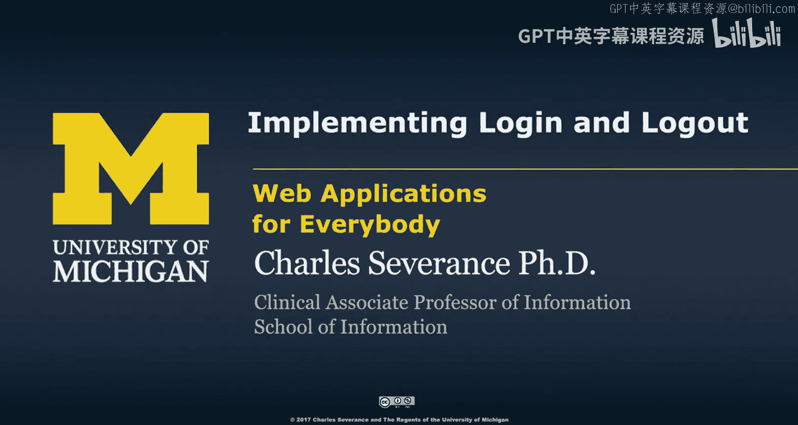


在本节课中，我们将学习如何构建一个功能完整且规范的登录与注销系统。我们将使用会话（Session）管理、页面重定向以及一个称为“闪存消息”的概念来实现这一功能。

## 会话与登录状态

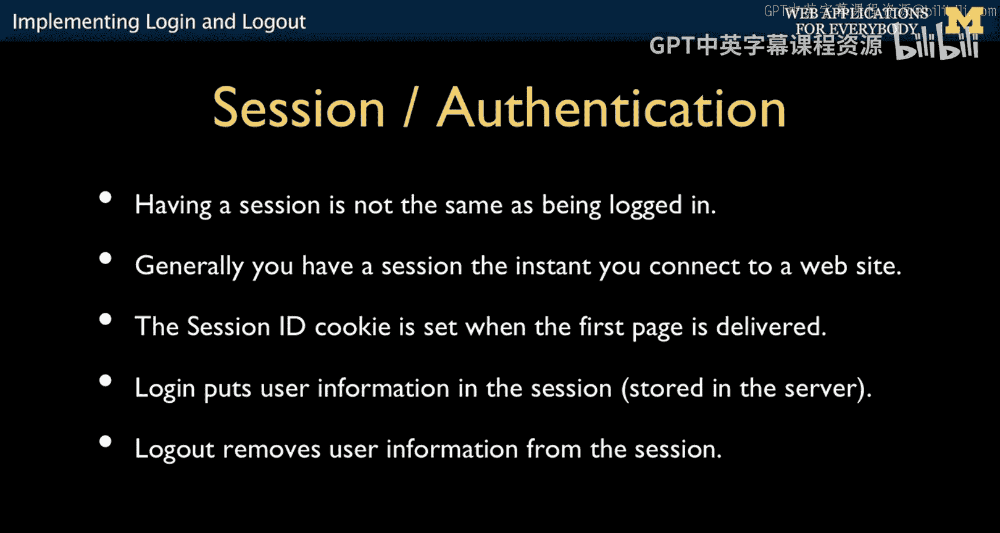

上一节我们介绍了会话的基本概念，本节中我们来看看如何利用会话来管理登录状态。

首先需要明确，会话本身并不等同于登录状态。我们通过在会话中存储一小段数据来**指示**用户是否已登录。当用户访问网站时，会话启动；当用户登录时，会话数据被修改。应用程序的其余部分通过检查会话中的数据来决定用户是否已登录。而注销操作，则仅仅是将会话中的相关信息移除。

## 登录流程概述

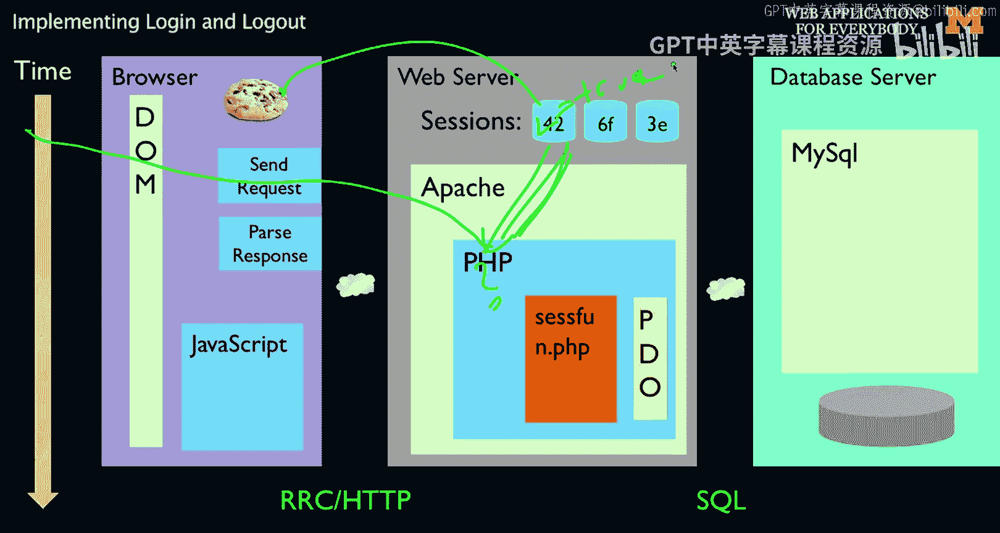

以下是登录功能的核心流程：

1.  用户提交登录表单（POST请求）。
2.  服务器端代码检查提交的数据。
3.  如果登录成功，服务器修改会话数据以标记用户为“已登录”状态，然后执行重定向。
4.  浏览器收到重定向指令，发起一个新的GET请求。
5.  应用程序的其他部分（处理后续GET请求的代码）通过检查会话数据来判断用户的登录状态。

登录后，会话Cookie依然存在，因为它用于确定哪个会话是活跃的。但登录状态本身（例如 `logged_in = true`）是存储在会话数据中的。

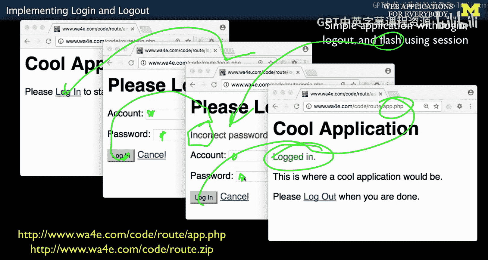

## 构建登录功能：代码解析

接下来，我们通过代码来具体实现登录功能。我们将处理几种使用场景：用户未登录时提示登录、登录失败时显示错误信息、登录成功时跳转并显示欢迎信息。

### 视图代码（View）

以下是显示登录表单的视图代码。它包含一个用于显示闪存消息的区域和一个提交账户密码的表单。

```html
<!-- 显示闪存消息的区域 -->
<p style="color:red">
    <?php
        if ( isset($_SESSION['error']) ) {
            echo($_SESSION['error']);
            unset($_SESSION['error']); // 显示后立即删除，实现“闪存”
        }
    ?>
</p>

<!-- 登录表单 -->
<form method="post">
    <p><label for="account">Account:</label>
    <input type="text" name="account" id="account"></p>
    <p><label for="pw">Password:</label>
    <input type="password" name="pw" id="pw"></p>
    <p><input type="submit" value="Log In"></p>
</form>
```

**关键点**：
*   表单使用 `method="post"`，这是为了安全，避免密码出现在URL或浏览器历史记录中。
*   错误消息从 `$_SESSION['error']` 中读取，显示后立即用 `unset()` 删除，确保只显示一次。

### 模型与控制器代码（Model/Controller）

以下是处理登录逻辑的PHP代码（通常位于 `login.php`）。它负责启动会话、验证凭证、设置会话状态并决定重定向方向。

```php
<?php
session_start(); // 启动会话，必须是文件的第一行代码

if ( isset($_POST['account']) && isset($_POST['pw']) ) {
    // 登录尝试开始，先清除可能存在的旧会话数据
    unset($_SESSION['account']);

    // 简化验证：此处使用硬编码密码，实际应用中应查询数据库
    if ( $_POST['pw'] == 'secret' ) {
        // 登录成功
        $_SESSION['account'] = $_POST['account']; // 在会话中存储账户名，作为登录标识
        $_SESSION['success'] = 'Logged in.'; // 设置成功闪存消息
        header('Location: app.php'); // 重定向到主应用页面
        return;
    } else {
        // 登录失败
        $_SESSION['error'] = 'Incorrect password.'; // 设置错误闪存消息
        header('Location: login.php'); // 重定向回登录页面
        return;
    }
}
?>
```

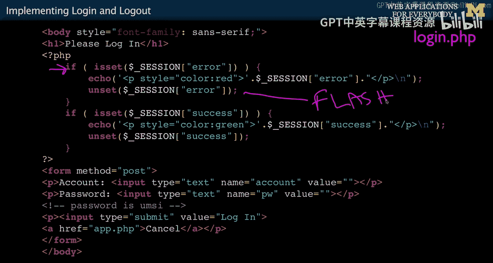


**关键点**：
*   `session_start()` 必须在输出任何内容之前调用。
*   `unset($_SESSION['account'])` 用于在尝试登录前清除之前的登录状态。
*   根据密码验证结果，程序将用户重定向到不同页面（`app.php` 或 `login.php`），并设置相应的闪存消息（`success` 或 `error`）。这是一个典型的控制器路由决策。
*   重定向后立即执行 `return`，确保后续代码不会意外执行。

### 闪存消息机制详解

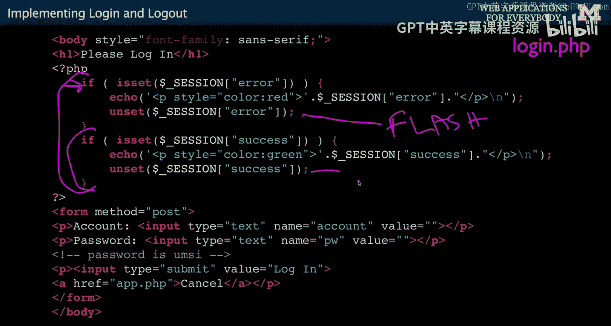

闪存消息是一种只显示一次的消息传递模式。其工作流程如下：

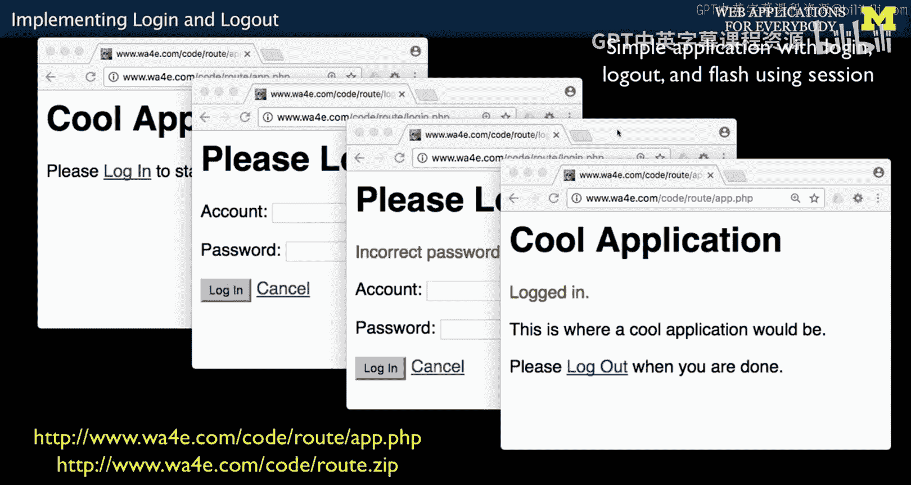

1.  **设置**：在处理POST请求时（如登录验证失败），将消息存入 `$_SESSION`。
2.  **重定向**：执行 `header('Location: ...')` 重定向。
3.  **显示与销毁**：在重定向目标页面（GET请求）中，从 `$_SESSION` 读取该消息并显示给用户，**随后立即将其从 `$_SESSION` 中删除**。

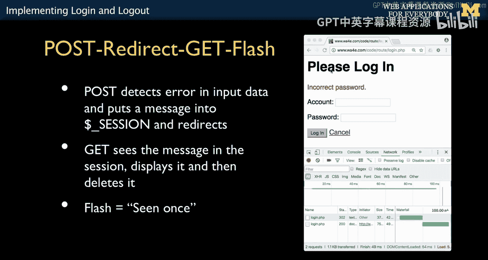

这样，即使用户刷新页面，该消息也不会再次出现，因为它已被清除。这种模式在需要向用户传递一次性通知（如操作成功或错误提示）时非常有用。


## 主应用页面与登录状态检查

用户登录成功后，会被重定向到主应用页面（例如 `app.php`）。该页面负责检查用户的持久登录状态。

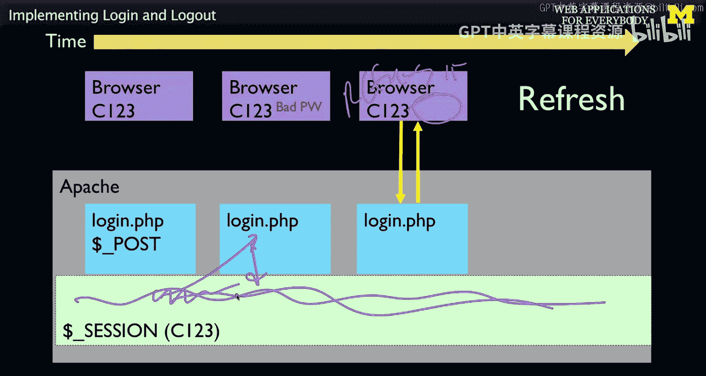

```php
<?php
session_start();
?>
<!DOCTYPE html>
<html>
<head><title>Main Application</title></head>
<body>
<h1>Application</h1>

<?php
// 1. 检查并显示成功闪存消息（如“Logged in.”）
if ( isset($_SESSION['success']) ) {
    echo('<p style="color:green">'.$_SESSION['success']."</p>\n");
    unset($_SESSION['success']); // 显示后删除
}

// 2. 检查持久登录状态
if ( ! isset($_SESSION['account']) ) {
    // 未登录：显示登录提示和链接
    echo('<p><a href="login.php">Please log in</a></p>');
} else {
    // 已登录：显示欢迎信息和注销链接
    echo("<p>Welcome ".htmlentities($_SESSION['account']).", to our cool application.</p>");
    echo('<p><a href="logout.php">Log Out</a></p>');
}
?>
</body>
</html>
```

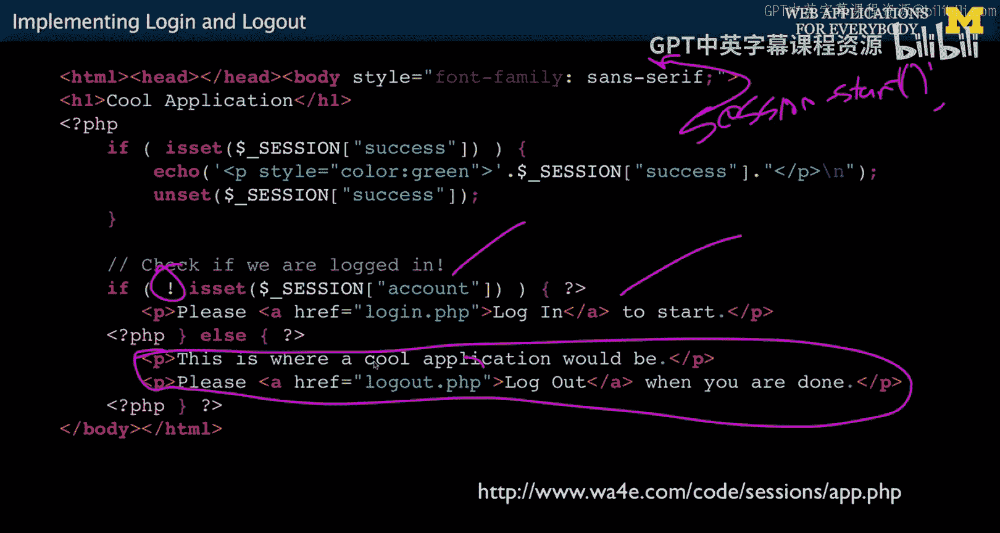

**关键点**：
*   成功登录的闪存消息（`$_SESSION['success']`）在这里被显示并立即清除。
*   通过检查 `$_SESSION['account']` 是否存在来判断用户是否已登录。这个键值对在登录成功后设置，并**持久保留**在会话中，直到用户注销或会话结束。
*   根据登录状态，动态显示不同的内容：提示登录或显示欢迎语及注销链接。

## 实现注销功能

注销功能的实现非常简单，是作者最喜欢编写的代码之一。

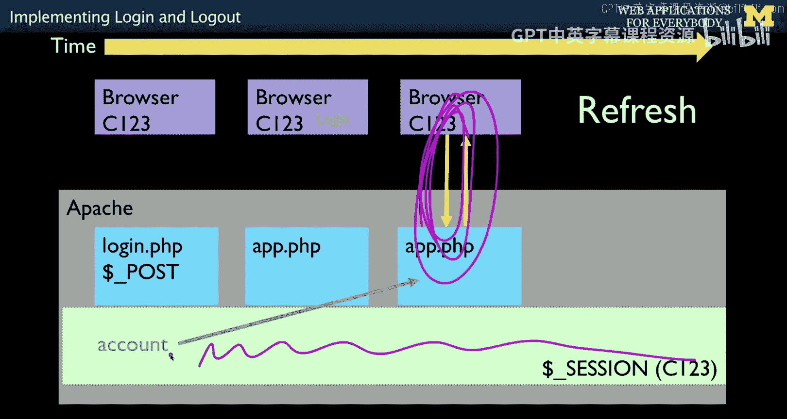

```php
<?php
// logout.php
session_start();
session_destroy(); // 销毁当前会话中的所有数据
header('Location: app.php'); // 重定向回主应用页面
?>
```


**关键点**：
*   `session_destroy()` 函数会清除当前会话中存储的所有数据。
*   重定向到 `app.php` 后，该页面检查 `$_SESSION['account']` 将发现其不存在，从而提示用户重新登录，从而完成完整的登出流程。

## 总结

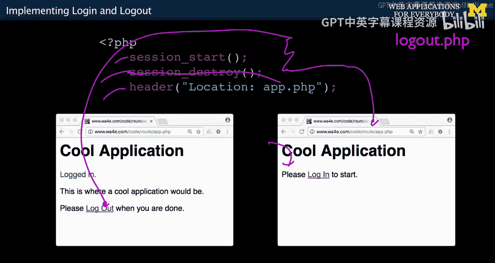

本节课中我们一起学习了如何构建一个完整的登录与注销系统。我们深入探讨了几个核心概念：

1.  **会话管理**：使用 `$_SESSION` 超全局数组在请求间持久化数据（如用户账户名）和传递一次性消息。
2.  **Post-Redirect-Get (PRG) 模式**：通过在处理POST请求后立即重定向到GET请求，来避免表单重复提交和改善用户体验。
3.  **闪存消息**：一种利用会话实现的、只显示一次的消息传递机制，用于显示操作成功或错误提示。
4.  **状态检查**：应用程序的各个页面通过检查会话中特定的键（如 `$_SESSION['account']`）来判断用户的认证状态，并据此决定显示内容。


通过组合这些技术，我们能够创建出安全、用户友好且符合Web最佳实践的认证流程。