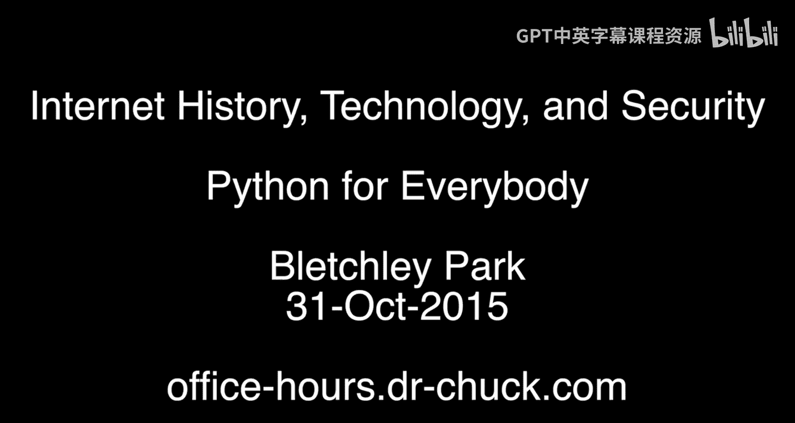

# 面向所有人的Web应用程序：附加办公时间：布莱切利园重聚

## 概述
在本节附加办公时间中，我们将跟随课程来到计算机科学、互联网历史与技术的发源地之一——布莱切利园。这里举办了一场特别的、创纪录的线下见面会，你将有机会认识来自世界各地的同学和导师。

---

我们身处布莱切利园，这里是计算机科学、互联网历史、技术以及所有计算领域的起点。我们举办了一场非常特别的、创纪录的线下办公时间活动。现在，我想让你认识一下你的同学们。

以下是参与本次活动的同学和导师介绍：

*   **史蒂夫**：我是史蒂夫。我是Python系列课程的所有导师之一。
*   **博诺瓦**：嗨，我是博诺瓦，来自法国，现居伦敦。很高兴来到这里。
*   **克雷格**：我是克雷格，正在学习Python网络数据课程。我在线上见过你。
*   **史蒂夫（另一位）**：我是史蒂夫。我完成了第一门Python课程，并打算很快开始学习其他课程。这门课程对我入门这门语言非常有帮助。
*   **珍妮**：嗨，我是珍妮，是一名软件开发人员。我使用《Python for Everybody》课程在泰国清迈的一所国际学校教授编程课。
*   **阿尔诺**：你好，我是来自法国的阿尔诺。我在大学担任Arduino讲师。因为学习了Python课程，我忘记了Arduino的语法，这在我的工作中有点尴尬。
*   **凯文**：凯文，我只从伦敦过来。能听到课程是如何构建的以及你如何制作课程，真的很好，谢谢你。
*   **静和苏**：嗨，我们是静和苏，来自中国，是你的学生。我们目前在英国工作。很高兴在布莱切利园见到你，Python课程很棒。
*   **詹尼斯**：你好，我是詹尼斯。我使用Python很长时间了，但这是我第一次通过课程来系统地学习这门语言。谢谢你。
*   **伊莎贝尔**：你好，我是伊莎贝尔。我用你的课程来刷新我的计算机科学知识。我正在跟你学习Python。我来过布莱切利园至少五次，像你一样，我也是这里的粉丝。
*   **帕特里克**：嗨，我是帕特里克。我学习了互联网历史课程。今天对我来说是非常激动人心的一天，因为学那门课时我说过我想来布莱切利园，今天我来了。我还说过我想参加一次查克博士的办公时间，所以今天我一下子实现了两个愿望。
*   **大卫**：嗨，我是大卫。我学习了你的Python课程和互联网历史课程，非常喜欢。欢迎你，很高兴你在这里。
*   **保罗**：嗨，我是保罗。我学习了Python课程，它们非常棒，谢谢你。
*   **休**：嗨，我是来自剑桥的休。我学习了你的Python课程，目前正在学习Web课程。非常兴奋能在这里和你在一起。我学习它也是为了教孩子们，实际上我学是因为我儿子为了考试正在学Python，这样我就能帮助他。
*   **罗杰**：嗨，我是罗杰。我完成了Python入门课程，刚刚开始学习Web课程，非常期待能顺利完成。
*   **达里乌斯**：嗨，我是达里乌斯，来自波兰，现居英国。我刚刚开始我的Python学习之旅。我应该非常感谢你所做的一切，真的非常棒。
*   **麦迪**：嗨，我是麦迪，住在伦敦北部。我学习了第一门Python课程，主要是为了能跟上我在学校学习Python的小儿子的进度。
*   **安德鲁**：你好，我叫安德鲁。我是一名退休人员，学习Python课程是出于兴趣。我希望能把它与我在树莓派上的一些小项目结合起来。我认为Python课程是一门引人入胜的课程。
*   **马达姆**：你好，我是马达姆，和家人一起来的。我刚开始学习Python。我原本是学生物学的。以后，我想教我的女儿编程。
*   **爱丽丝**：嗨，我是爱丽丝，住在布里斯托尔。我几个月前学习了Python课程，我打算学习你的新课。课程很好，我试过一些别的，但不得不放弃那部分。我是一名……我希望能在工作中使用Python，我会跟着你学习顶点课程。
*   **大卫（另一位）**：我是大卫，来自利物浦。我有兴趣学习Python来提高我的编程技能。我本身是一名学习技术专家。
*   **辛西娅**：嗨，我是辛西娅，正在学习你的Python课程，这门课非常优秀，我强烈推荐给任何想学习编程的人。我现在正处于职业间歇期，在家养育孩子。这门课程对保持思维活跃非常有帮助。
*   **奥拉夫**：嗨，我叫奥拉夫，来自伦敦。我学习了互联网历史与技术课程，并期待学习Python课程。

---

## 总结
本节课中，我们一起在布莱切利园这个具有历史意义的地点，进行了一次特别的课程重聚。我们见到了来自不同背景、怀着不同目标学习课程的同学们，也从导师那里获得了鼓励。这体现了在线学习社区连接全球学习者的力量。希望这次“重聚”能激励你继续在编程与技术的道路上前进。我们网络上再见！