# 密歇根大学《面向所有人的Web应用程序（PHP、SQL、APP、JavaScript和JQuey｜Web Applications for Everybody》 p103 33_创建读取更新删除(CRUD)操作.zh_en -BV1Lr421A75d_p103-

So now it's time for the payoff you've been sort of working through this whole section on PhP and SQL and redirect and all these things。

And now we're going to put it all together to build sort of the canonical。

Basic application that does。One of everything。 call this。

The crud application， because we're going to create， We're going to read。 We're going to update。

 and we're going to delete。 course， we're going to select to do read。 But Crud sounds so much better。

 so。

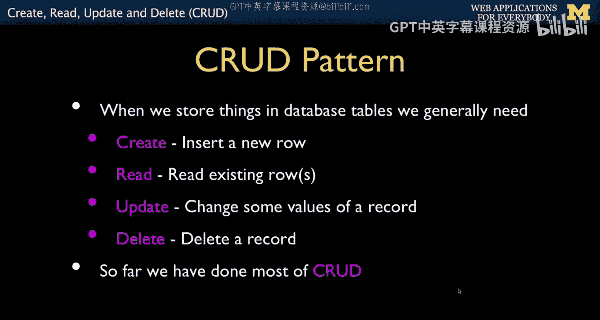

We've actually done most of it， and so it says much now just putting it all together and doing it right with post redirect and flash messages and all those things so that you'll just kind of see how we put this all together to do a basic single table application where you can insert data。

 delete data， update data and delete data。

So the last time we kind of looked at our program， you know， we had a view， the read part。

 we had add。And we had delete。 We did not have update in it， right。

 but we all had this one page that did everything。 and we weren't doing post redirects or anything。

 Okay， and so in general， you tend not in real applications to slam all this stuff into one big blobby user interface。

 So you sort of move this into multiple files。 We call this refactoring。

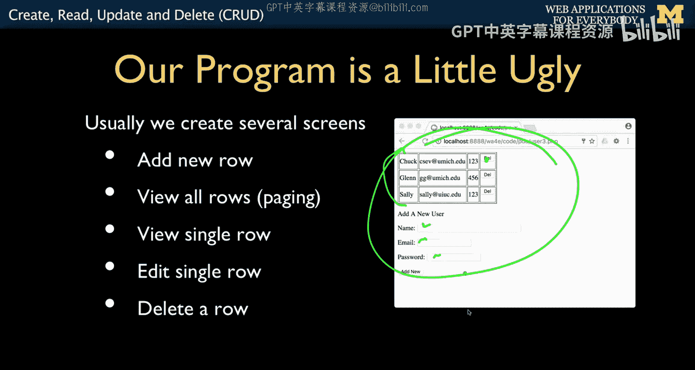

We kind of got it all working， but it's sort of in the wrong place。

 And so we're going to keep it working and we're going to move it around。

 And now that we can redirect back and forth， we can put。

 make files that are sort of more simple and consistent and do one thing。Okay。

 so we're refactoring our code and now we're going then we're going to add to edit because we didn't have edit and any of these other things。

 So that's really what we're doing so。

What we're going to do is we're gonna to have a couple of files，4 or5。

 Our index file is going be the main list of things。

 if you need a detail sort of if there was too many columns and all these little examples。

 I have too few columns。 So we just have an index that shows everything。

 We're going have a separate ad file。 we're gonna have a separate delete file。

 and we're gonna to have a separate edit file。 And so kind of the starting point for all of these things is index PhP。

 and we'll just put them in a directory， put them in a folder。 So we'll have the cru folder。

 and we'll have add delete edit and P do PhP。 that's just to make our database connection。

 and we've been doing that now for long enough that hopefully that P for you had just been working fine for you。

 Okay。

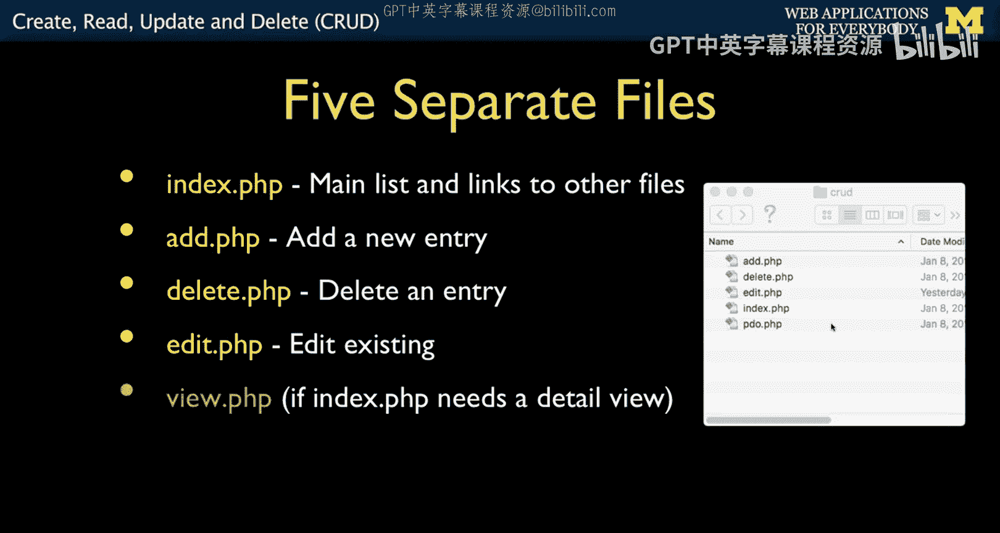

So here is how our code is going to work。Again， think of it as refactoring。

 We're going have this list view， which is the index。 It's the main view of things。

 It's going to have an add button， an edit button in a delete button。 Now。

 these are not forms anymore。 These are anchor tags A H refs。 These are anchor tags， not forms。

 So they're going to go to new pages。 Okay， So the first thing we'll take a look at is how we do an add new。

 So we're going to go now to add dot PhP。 and an add do PhP。

 The view part is going to just be a simple form。 We have a cancel button。

 which is just to go back to index do PP。 or we type in name email password and then submit it。

 So let's took a look at the index do PhP。

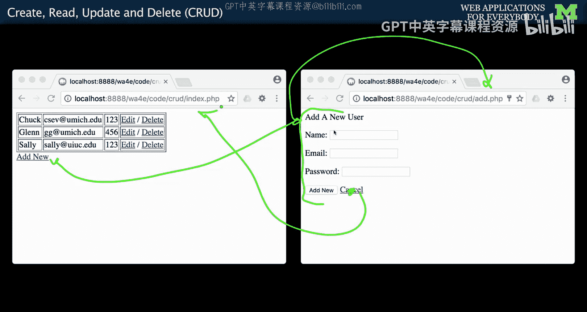

We're going to start with PD。phP to get our database set up， and we're going to start the session。

 and there is no other model up there other than those two things。

 and then the view starts and we're going to put out the flash messages and the flash messages are not the first time you come in。

 but when someone redirects。To come into here， they will often set error or success。

 so it'll be coming from somewhere， coming from the ad PhHP， delete PhHP or edit dot PhP。

 and we'll get a message right， and so we just know that we might have to receive flash messages here。

Now， I did sneak a little bit of select code down into my view。 That's kind of a kind of a no， no。

 I should have selected that above， but will' be okay。 So in the view， we' print out the table。

 We've done this before。 We just print out the name email and the table rows。

 right because these are just grids row end of row TD and TD Hl entities being good about that。

 And so now what we're going to do is in this last little action column。 The last column。

 which is the action column。 We're going to basically put on an anchor tag to go to Hf PP and a get parameter of user ID equals And then the primary key of the user ID edit do P P and delete dot PP。

 So we use transfer to those， but pass in whichever row we're working with。

 So we're going to add a get parameter。Underneath each of those little edit。

 edit and delete buttons with a get parameter。

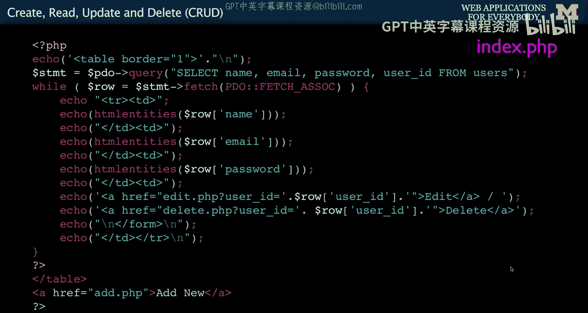

Okay， and so if we look at how this ultimately and we take a look at the source code of this。

 it looks like that edit dot PhP question mark user ID equals 1， a get parameter。

 delete dot PhP user ID equals1， a get parameter， and this one of course。

 is the primary key of that particular row in the database。

 so we know which one we're going to delete or we know which one we're going to edit。

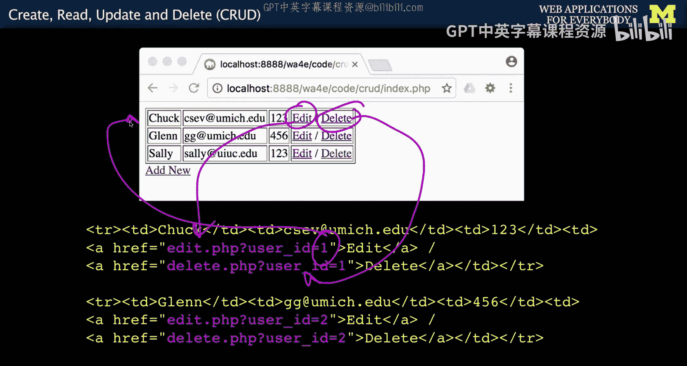

So now let's take a look at the add code。So the add code is a model view controller。

It's really my view controller， model and controllers up here and view is down here。

 It's all starts out blank。 You type in all the stuff and you type add new。

 comes back in with a post post data will be checked for password， we're going to do an insert。

 We've seen this before。 Some of the early stuff I put debug statements in。

 but debug statements here are dangerous because we're going to have to redirect after this post。

 So you got to be careful。 It's often better to log stuff。If you put it out， the redirect won't work。

 then you can put debug statements in there if you're having trouble with your code It's just don't expect the redirect to work。

 and it'll complain。 It'll say headers have already been sent。 don't call header。

 which is okay because you're actually debugging the code。 So be careful。 you have no debug。

Unless you're sending it to the log， send it to the log that doesn't count as output。

 but this is stuff we've been doing before。 we just created an insert statement。

 we do prepare so it handles these little placeholder guys。

 and then we do an execute where we map the placeholders to the data from the post data。

 and then we set a success message and then we redirect back to index that PhP we and BxP， add PhP。

 and then we go to index thatP after the successful post so we don't come back to this thing after the successful post。

 we go back to indexP after the successful post。

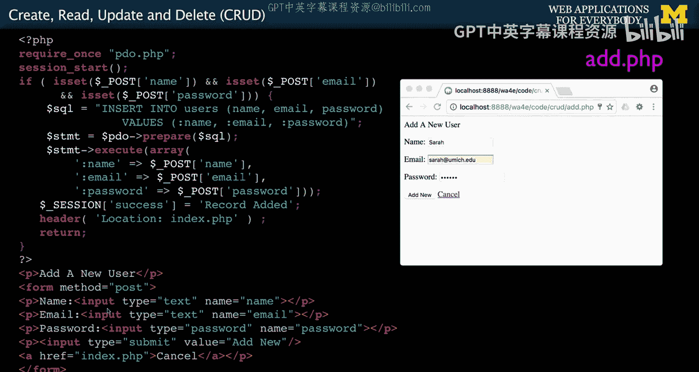

Right so the pattern here is we click add new， we go into add， we type in the stuff。

 we placed add new， it posts in here， it adds the stuff in the database。

And then it sends the session success variable and redirects back to index。phP， and then index。

phP pulls this out of session， shows it once as flash with this little bit of code in indexex。

phP and then gets rid of it。Wips it out， so if you hit refresh at this point that you won't see that message the second time because that was a flash message。

So you see how we wrote the code in index。phP expecting to be redirected back too right so we knew that a was coming back to us and that a would send us a message in success。

 and so we just put those four lines up there to if anyone sends a message to us， we get a success。

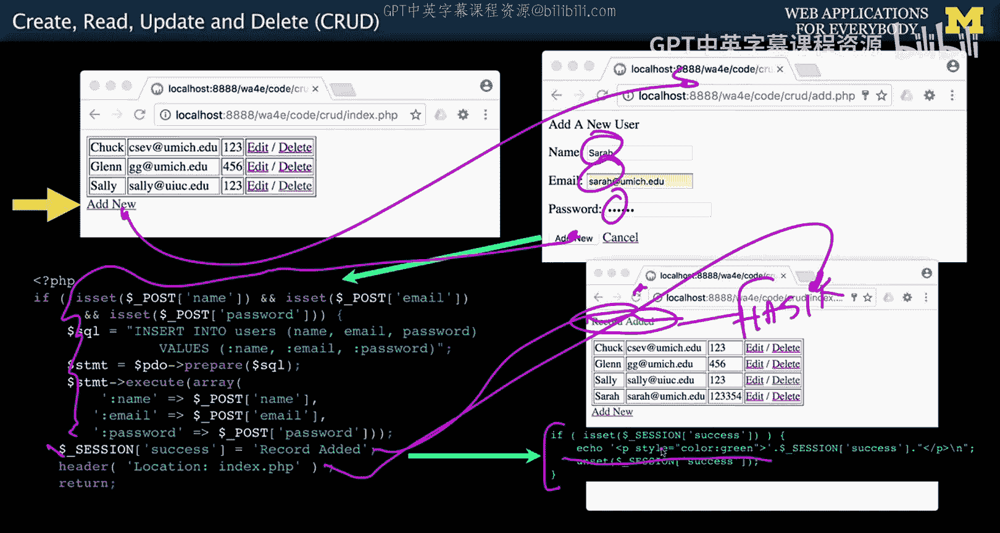

So that's how ad works。

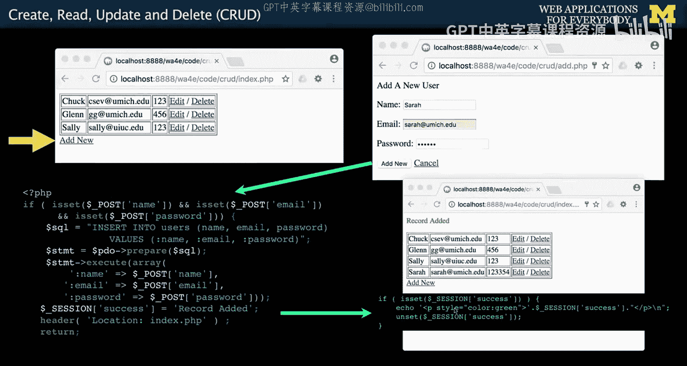

Okay， so let's take a look at delete PP。 so remember delete PhP。 we link to delete PhP。

 and we give the primary key。 So now we have a get request。 Okay， so when we come in first time。

 we're in a get request， right， So after we've pressed the delete button inside the index PP。

 we come here in a get request。 So none of this stuff is here， right， So it goes in。

 there's no post data set。 So now we have a bit of the model code。That we're still in the model now。

 the line between model and view is down here。 We're still in the model。

 So the thing we're going to do in this model is we're going to actually select the data that's going to feed the display。

 We're also going to check to see if there's a bad value here because this could be like 400 and be wrong。

 So we're going to do is take a select name user I from users where user I equals this。

 And then that's， you know， then we're going to take get user I and put that in there。

 And then we're do a fetch。 And if we get a row， That means there was a row。

 And if we have good data。 And that data is an associative array of user I and name in the dollar row variable or false false means we didn't get a row。

 It doesn't blow up。 Remember， not getting a row on a select statement is not a fatal error。

 It's exactly what you want。 You're told you got nothing。

 Your select where clause didn't find anything。 If this is where 4000。 You will get 0 rows。

 but it won't blow up。So it's not a failure to get no rows， but in this case， it's kind of a bug。

 which means we've been past a bad value here。 So what we're going to do is we're going to say something nasty。

 we're going to say in the in the error in the session。

 the flash message we would like to have displayed is bad value for user ID。

 and then we're going to redirect back to index do PhP。

 which we'll see that and print out a red message。😡，And then we return， right， Like I said。

 you'll you'll do these three lines， putting a flash message in。Redirecting and then quitting。

 getting out of this script， because we don't want to fall through here。

 That's why we have the return because we don't want to produce this output now。If the row was good。

 now we have， we fall in。

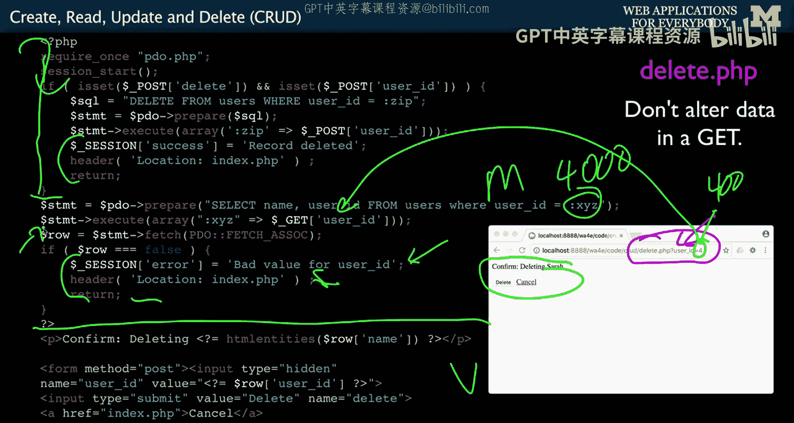

We fall into the view with dollar road defined row name。In humanmanities， yay。So this row of name。

Did it come from the user in this code， it's actually coming from the database。

 but it originally came from the user。And so when we inserted it in the ad， we didn't call HTMLlondy。

 let me go back to that， make that point a little bit。So here。When Sarah put in her email， right？

We did not put HTML entities on this。The pattern is generally the case that if there is data from the user going into the database。

And then coming out of the database， we don't call HTML entities here。

 We only call it when it comes out。 Okay， so we don't put the data in。 We put the raw data in。

 double quote， single quotes， everything and all and。

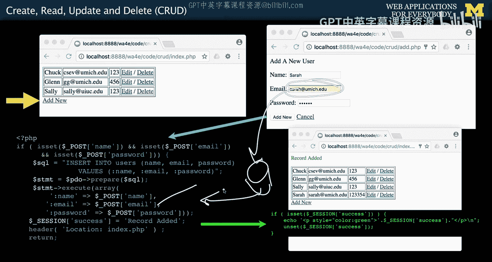

At this point。We have just retrieved that same thing from the database。

It's the raw data the user entered。 We put it in raw， and then we know it's dangerous。

 So we're going to say HTML entities。 And the reason you do this if you don't want to call HTML entities twice。

 you never want to do it。 So you have to have a very strict。

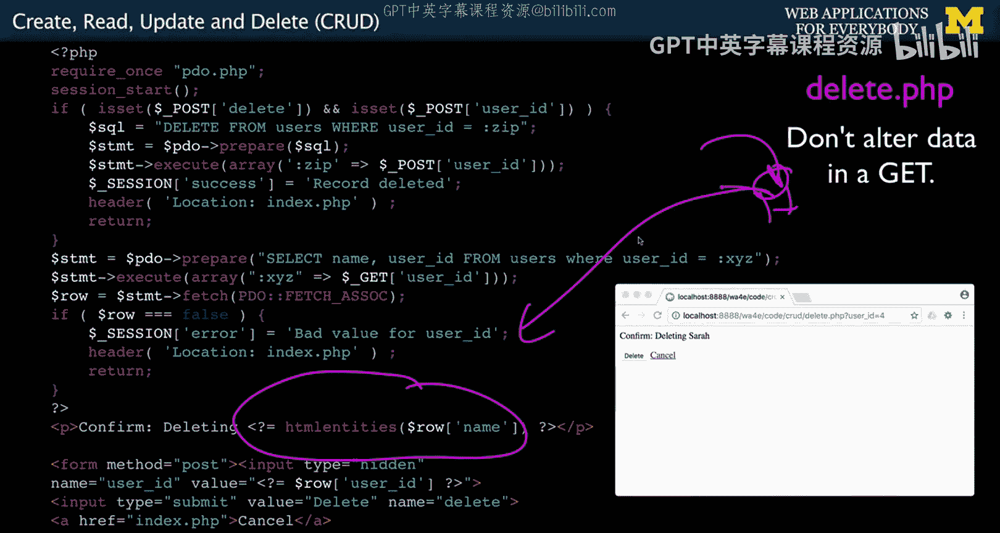

Policy that says we're not going to call HTML entitiesities before we put the data in the database。

 we're going to tall HTMLities after we take the data out of the database。

So even though this came from the database， it originally came from the user。Sarah typed that in。

 she typed her stuff in， we don't know if we can trust it or not， she typed it in。

 we put it in database without testinging it and then it came out of the database to us。

 and so we have to call HTML entities on it and away you go now。

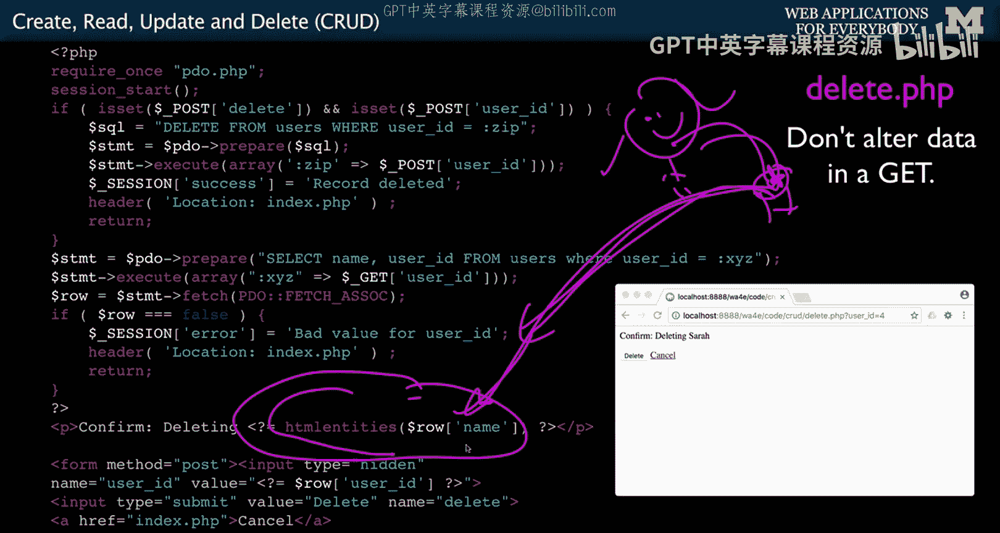

The fact that we did a select is going to give us two things。 First。

 it's going to give us to know whether or not that idea is really a valid idea or not。 And second。

 it's going to give us the person's name so we can make a cute little confirmation dialogue。

 I mentioned before there's a lot of user experience that always has delete confirmation。

 So at least you know what your it both is to avoid doing deletes on getss。

 and to make sure you're deleting the thing that you want to do。 and you're doing that in a post。

 And so we're going to have a delete button here。 and then we will have a hidden。

That's high den，We have a hidden variable here and it's just the user's ID which is just going to be four so that know user ID is going to be four so that when we hit the submit button。

 that's going to come up here and it's going to tell us what if the delete button was pressed and user ID is4 and then it's going to run this delete code which is kind of code we've seen before。

 delete from users where and then whatever that four number is going to be stuck in there and then it runs this。

 we send a success message and we go back to index PhB and we return。So that's a delete。Sweet， huh？

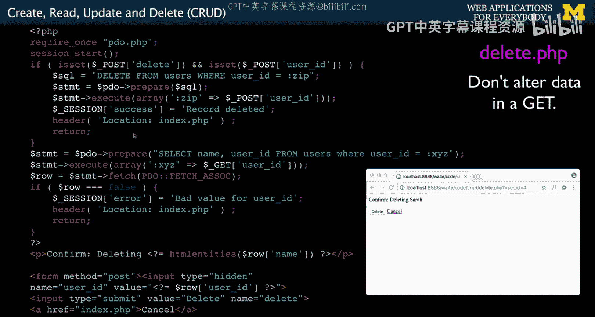

So here's how that one works right， We press the delete button。

I guess we're pressing Sarah's delete buttons。 We come in to delete。We go here， we show it。

And then we press the delete button。 This is a get request。This is a post request。

With the hidden data， this is the hidden。 That's hidden。H data。

 delete from users where ID equals zip code， redirect， put the success message in， record deleted。

 and then redirect index。phP， and index PhP， weve got these lines of code that put this message up。

And then wipe it out of the session。 So it's a flash message。

 and that's how we go in a successful delete from delete dot PhP through the model code。

Doing the update to the database， and then the controller is deciding to send us back to index。

phP with a message。So， that's read。Insert， delete。The one thing we haven't done before is edit。

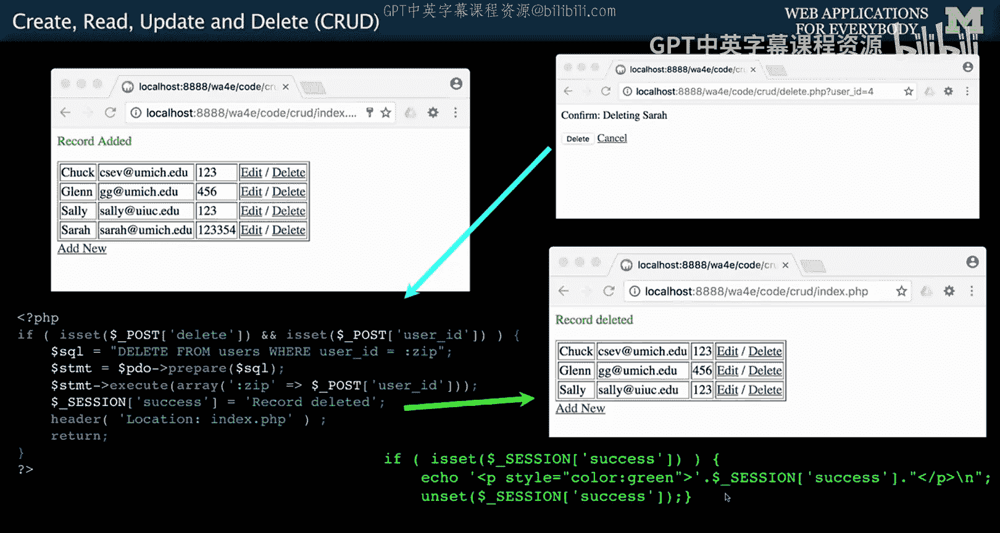

So this is edit dot PhP， and this is how edit dot PhP works。Edit PhP looks a lot like a。

 And as we get later， I just start writing code that has more if statements in it。 But for now。

 we keep our edit separate from a。Because you really want to do updates for edit， right。

 the kind of big difference is we do the update statement for edit because the the records already there update with the where clause and the update is quite different than insert。

 there's some。

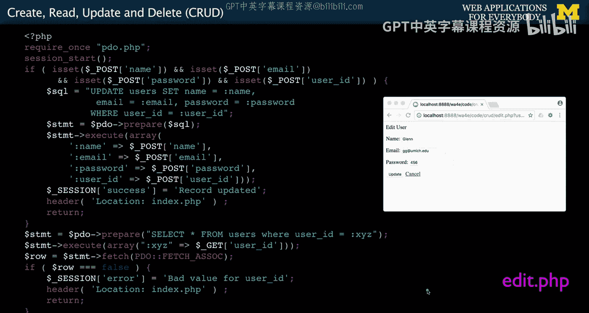

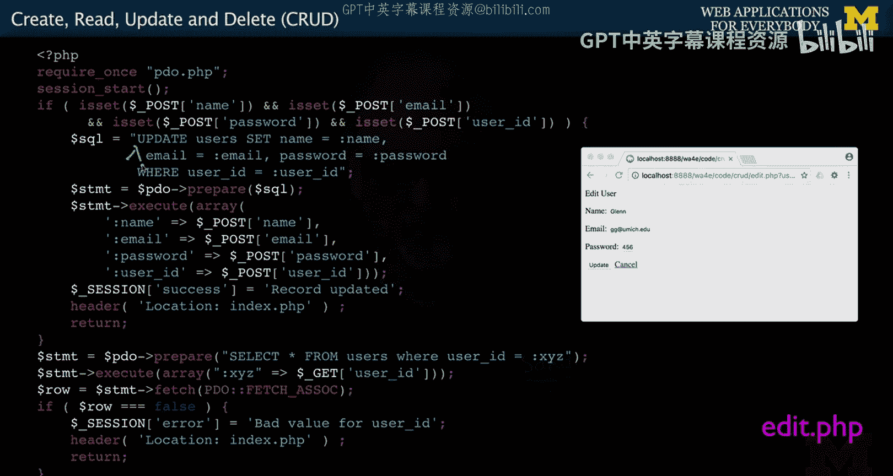

Cool things in in SQL， where you can say insert blah blah bh， blah， blah on duplicate key update。

 but we haven't quite set that up yet。 So for now， we're going to keep our edit and our ad very separate。

So here's edit do PhP。 One thing is you don't see it right here。

 You've got a get parameter of user ID。 Okay， so you know which user you're supposed to edit。

 So edit is not all users， it's editing one user。 So you come in with a get request and you have the user I that you're supposed to do。

 You're going you know open your database connection， start the session。

We don't have any post data the first time in， right？ Now。

 this is actually the code right here is from delete。

 It's from the delete because both the edit and the delete have the problem。

 and you could put a function to do this。And we will later。You both have the problem to check。

 I want to get the old data。😡，And I want to make sure that the idea is even right。

 I want to make sure that it's right。 So we're going to do a select。 It's exactly the same thing。

 We're going to select with a wear clauses on that I， which is this get parameter that comes in here。

 And if we get a row， we've got the old data。 If we don't get a row。

 we set a sad face and send it back to index do PhP with a flash， okay。

So we'll come back to this in a second。Let's go down to the view part that talks about how to produce that。

So。I am going to basically create the create variables N E and P。

 which are just the post HTMLmideities versions of name， email and password。

 You don't have to put HTMLities on a user I D because， you know it's an integer， right。

 It's like in your database。 that didn't come from the user。 You made it。

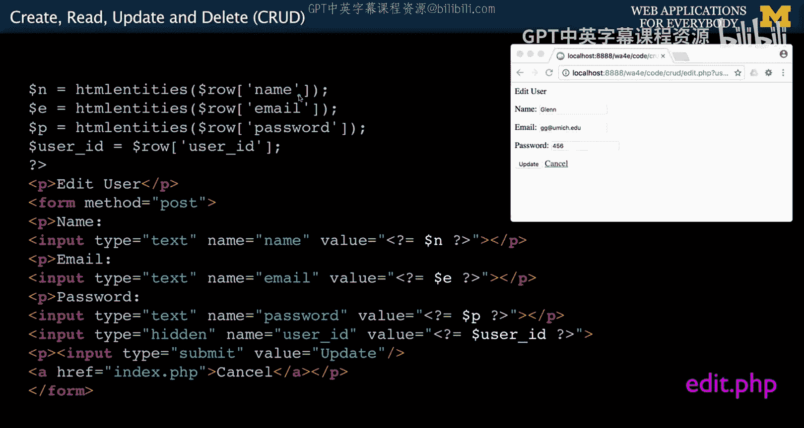

You'll notice that sometimes I don't put HTML entities around the success messages because I am making those messages in my code if there's user data in it。

 you got to two HTML entities， but most of the messages I'm doing are just hard coded constants So you don't have to put HTML entities on the user ID because you know that's an integer and it's always going to be an integer。

 right。

So I've got these variables。And then I fall into the view。 This， this whole thing is the view。

Fall into the view。 And then I'm just going to put。 it's pretty much the same as the addd。

 except I put value equals。 And then I use less than question mark equal sign。

 which is the short version of echo basically。 and that's going to print。Oh， I was like。

 where's the Asianities？I just had a had a moment there， I'm like， did I forget Ht oddities， I no。

 I did it right here， Chuck， it's okay， it'll be okay， don't freak out， man chill。Okay。

 so then this is Glen with Honities。 This is Glenn's email with Honideities right there。

 and this is the password， Glen's password with Hities， he has a very bad choice of passwords。

 and then we have a hidden variable which is right there that you can't see。

 which is the user ID value and then of course， a submit button and an Hf to get out of here。

So then we press this button。And。We press this button and it comes into here because now these three things name。

 email and password and user I are set。So now we're going to read some SQL that you haven't seen at least for some time now。

 it's an update statement。 So updates look different than inserts。

 update users set column equals placeholder， column equals placeholder， column equals placeholder。

 where column equals placeholder。 So we're saying update the name。

 email and password to the new values from the post data where we've hit the right user I。

 So then we're going to prepare it。 And we're going to execute it， taking the name。

 email password and user I。 This one's coming from the hidden one。

The hidden field that's right here is coming in and that's the user ID。

We assume that works and we say we're happy success message， redirect back to index。phP。

 and return out of edit。phP because the next thing a browser are going to do is do a get request to index。

phP。

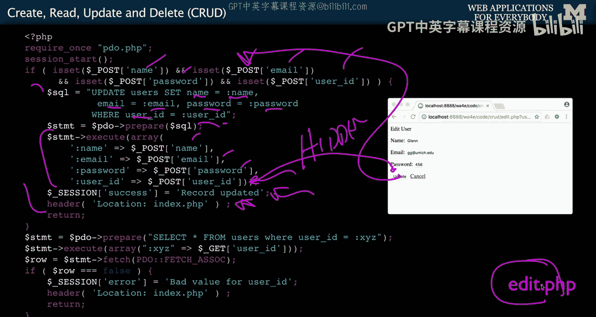

And so this is pretty much how it works， right， We click on Glen's editit button。

It does a select to retrieve the old data。 we HTML entity it， put it in there。 we send this update。

 we click update， it's a post。So these three things come in as post， including the hidden user ID。

Is hidden there。 So that comes in。He's already hidden comes in there。

 We do the update that I just mentioned。 We do the prepare cause we don't want SQL injection。

 So we do prepare， execute。 Don't get lazy and just concatenate this stuff。 That would be bad， bad。

 bad。 Don't do that。 We know S Q L。I， none。 we don't want any SQL injection。

 We want to do happy face。Happy face， use prepared statements。 H face， placeholders， P。

 prepared statements， happy face。And so then we just do the we put the stuff in the session。

 and then we redirect index。phP， this is a get request。And then it's going to pull it out of session。

 and then it's going to wipe it out of session so it's a flash message and a away you go。

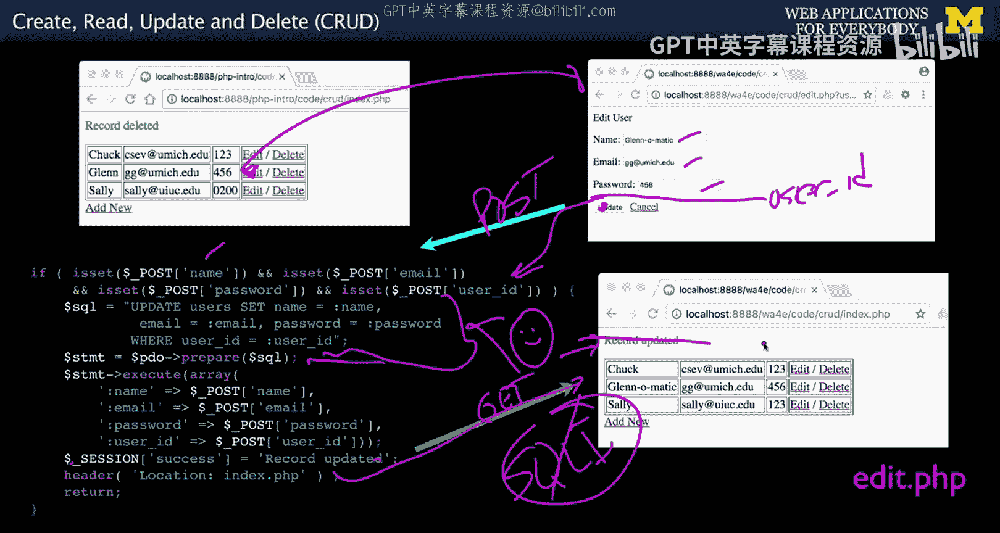

This is like so awesome， because。If you're understanding this。

 think of all the things that you actually had to know。SQL， H TTP Gs。Posts， hidden fields。

 There's like model view controller。 There's so many things， this。

And you should really understand this crud stuff， right。

 you should understand this lecture if you're like， I'm gonna sleep to this lecture。

 and I'll pick it up later。 No， it turns out what I'm gonna do is I'm gonna assume， you know。

 every line of this lecture and going forward， I'm going like crud boom。 You're supposed to know it。

 Oh， yeah， that's that's this， that piece of crud。 Oh， yeah， flash message。

 You're supposed to know this stuff from now on， because I'm going change it。

 This is the simple one that you should understand。

 And when I start throwing things like ajax and J Query and who knows what at ya。 I'm like， hey。

 this is just like the crud And you're like， what was crud。So watch this lecture。

 I know is a little longer than some of them， but watch this lecture a couple of times。

 we have done a whole bunch of stuff in getting this database stuff figured out。

 and this crud is really the moment you fully understand crud is the moment that you can start riffing on this pattern and building real applications。

