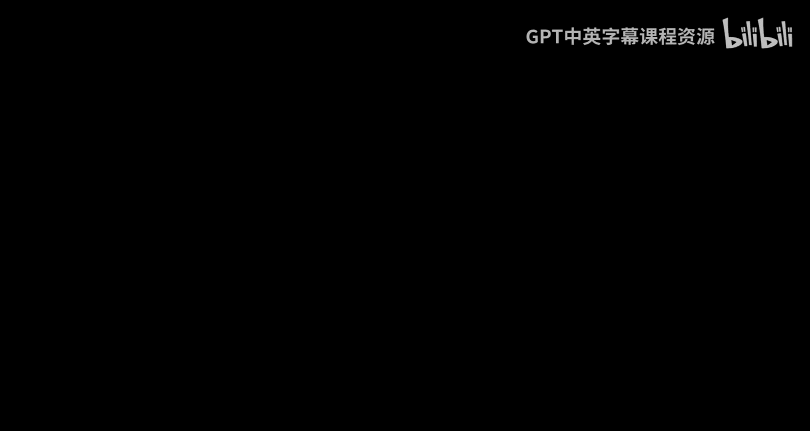
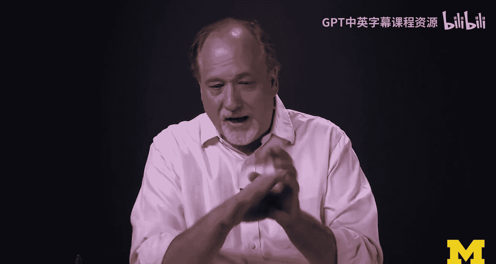

# 密歇根大学《面向所有人的Web应用程序》：0：欢迎学习本课程 🎉

在本节课中，我们将要学习JavaScript、JQuery和JSON。这是我们教授的第四门课程。在上一门课程的结尾，你构建了一个CRUD应用程序，它成功地将PHP与数据库和用户界面连接起来。我们还介绍了**模型-视图-控制器**的概念，其中模型是数据库，视图是用户看到的内容，控制器则是负责在前后端之间传递数据、重定向用户等逻辑的“魔法”部分。

## 课程概述

上一节我们介绍了MVC架构。本节中，我们来看看本课程的核心目标：探索现代Web应用如何将MVC架构的各个部分分布在浏览器、服务器和数据库之间。

到目前为止，你所做的一切都是在PHP中渲染HTML。这是传统的方式。在本课程中，我们将探索如何将一部分HTML的渲染工作从PHP转移到浏览器中。这意味着我们将学习JavaScript。

## 为何学习JavaScript？

构建HTML标记并发送到浏览器是传统的方式。你应该掌握这种方法。但是，要构建酷炫、交互性强、动态的应用，例如无需整页刷新就能弹出新消息的小型聊天应用或通知，就需要交互性。这需要JavaScript，也需要JQuery。

例如，如果你构建一个聊天应用，聊天窗口可以在后台运行，获取新消息并直接显示在窗口中。这种无需完整请求-响应周期、只需重绘网页部分内容而非整个页面的技术，正是我们要学习的内容。这也是现代Web应用有趣的一面。

## 核心技术栈

因此，我们需要学习：
*   **JavaScript**：浏览器端的编程语言。
*   **JQuery**：一个JavaScript库，它极大地简化了与**文档对象模型**的交互以及前后端的数据通信。
*   **JSON**：一种数据格式，我们可以让JavaScript从数据库读取数据，然后在浏览器内部进行格式化。

我们将利用这些技术完成各种酷炫的功能，从而实现更丰富的用户交互体验。

## 学习挑战与价值

这门课程可能比我们之前完成的课程更具挑战性，主要是因为你必须更清楚自己在做什么。课程节奏较快，作业量也稍大，需要你投入更多时间。

你将构建规模稍大的应用程序。但正是在这个阶段，你将迈入一个新的境界。掌握本课程的内容后，你将能够胜任现代Web开发工作。因此，多投入一些时间是值得的。

如果你已经完成了前三门课程并坚持到这里，我为你感到骄傲，也很高兴你依然保持兴趣。学完这门课程后，你将掌握海量的知识。

## 总结

本节课中，我们一起学习了本课程的目标：探索如何利用JavaScript、JQuery和JSON，将部分渲染逻辑从服务器移至浏览器，以构建更动态、交互性更强的现代Web应用程序。我们了解了学习这些技术的必要性，并认识到本课程在成为一名合格Web开发者道路上的重要性。准备好迎接挑战，开始这段学习之旅吧！😊