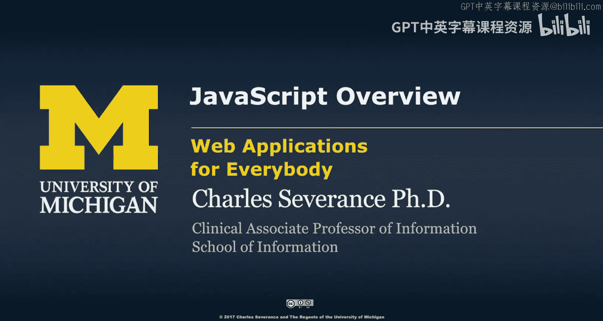
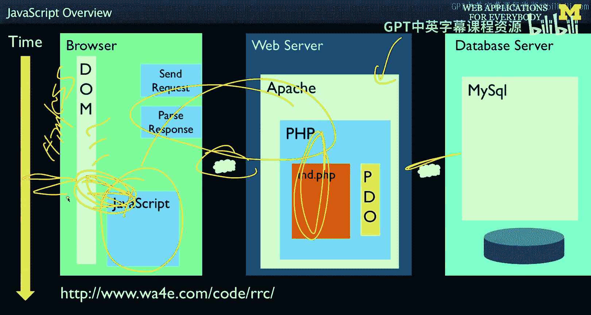
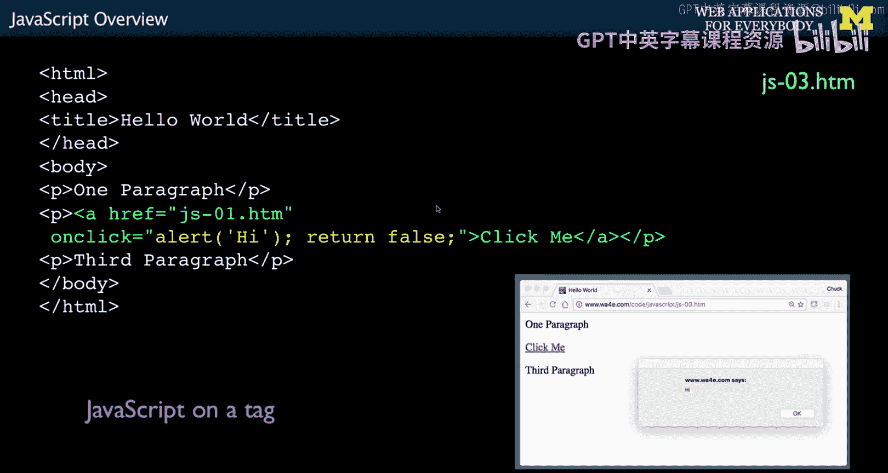
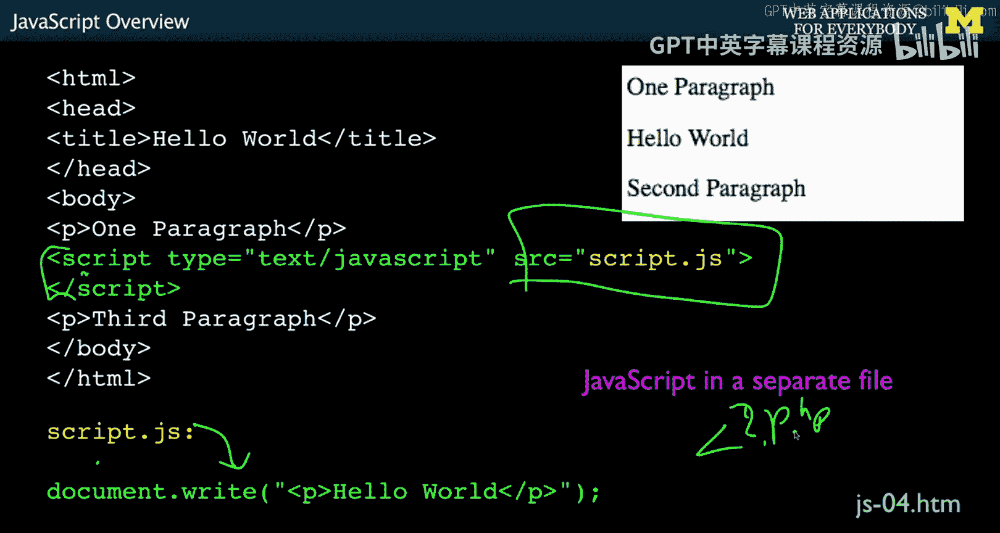

# 密歇根大学《面向所有人的Web应用程序（PHP、SQL、APP、JavaScript和JQuey｜Web Applications for Everybody》 p109 1_JavaScript概述.zh_en -BV1Lr421A75d_p109-

So now we're starting to look at the JavaScript programming language。

 There's a lot of people that might say that the first programming language that you should learn and maybe even the only programming language you should learn is JavaScript。

 and I totally disagree with that。 JavaScriptscript is a wonderful language and it runs in the browser and with things like No dot JS。

 it's increasingly running in the server， and it's a great language。

But it's sort of a powerful language。It's not an easy to learn language。 I mean。

 you really need to understand what's going on and it's a beautifully built language and I'll try to show you some of the really awesome things that are true about JavaScriptscript that I think you can only appreciate。

After you learn a couple other languages like Python and PhHP， SQL。

 and hopefully this is your fourth or fifth programming language that you've actually learned。

The other thing that we're doing now is we're actually moving in a whole new world right。

 we've been programming， we learned SQL， which is the language talking to databases， we learn PhHP。

 which is the language of this server code that we happen to have chosen。

We've talked about the request response cycle， we've talked about HTML。And CS。

And how we format things and make them look pretty in browsers。

And I kept saying the document object model， but now we're actually going to write code that runs in the browser。

 So that's the distinct difference。 Now， if you're running something like no dotjs。

 that means that you are actually running server based ja。

 but for now we're going to talk about ja as a browser based tool。Now。

 JavaScript was invented for the browser and for its first 15 years。

 it pretty much ran in the browser， it was never intended to be only in the browser but it really has been a browser only programming language for a long time and its use in servers is creeping up now。

嗯。And so the concept of。HtML and CS and a document object model has been part and parcel of what jascript has been about from its inception from the first moment that we ever had jascript。

 It's been about the document object model。 and how to manipulate the document object model and add interactivity without request response cycles。

 And so up till now， all the interactivity we've been adding has been by displaying a whole new page of H。

 And sometimes we make it look like the page hasn't changed because everything lines up in some little thing changes。

 but really it's a fullre response cycle。 Now in jascript。

 we're going to learn to play with this document object model and change what we see in the browser quite dynamically。

 So the first thing we're going to learn is we're going to learn about jascript as a programming language。

 And then we're going to learn how to use it in the browser。

 So jascript has a very different history than PhP or Python。

 And I like to share with you the histories of all these programming language is to give you a sense of where they came from because I think it really helps you understand what they're all about。

So JavaScript is about 20 years old now， it was introduced by Netscape in 1995 and Brendan Ike is the developer of it。

 and if you watch my video about Brendan Ike， you will see that it's very。

 very different than the video that I encourage you to watch with Rasmus Leodorf， the creator of PhP。

PHP is designed to be a practical and continually evolving toolkit。

 so PhHP itself is supposed to be a toolkit。Rasmuss didn't have any formal education in how to build languages。

 but Brandrendan has got， I think， a PhD in physics or something like that。

 And he's like a math genius， and he's a language genius。

 and he has been a student of programming languages。

 And so the idea of JavaScriptscript was was supposed to be built as a toy。嗯。

And that's why it's kind of named Javascript。 There's this other language called Java。

 which you may or may not know。 It's a lot harder than jascript。

 And Javascript was supposed to be the easy baby version of it。 But in many ways。

 Brendan was such a brilliant computer scientist that he sneaked so many wonderful things。

 And we talk about。Object oriented jascript， you'll see that it's very different than all the other object oriented things that we've talked about because it has a different sort of foundational notion inside of it called first class functions。

 And so it's a very。Theoretically beautiful language compared to some of these other ones that are kind of compromises and very practical。

 but compromises。 And there's a standardization body called Ecma that standardizes Javascript。

 And so you kind of see it named as Ecma script。 And if you see it named Ecma script。

 don't feel bad about that。 It's， it's all the same。

And so the idea is a JavaScript is a programming language that runs in the browser。

 and so if you compare and contrast this with PhHP， which we get done talking about。

 we'd say less than question mark PHP， and then all this code would run in the server and produce some output。

That would go to the browser， Okay， but that's not what's going to happen in Javascript In ja。

 you are having your HTMLL tags that Javascript is actual text that comes from the server。

 And then as the a is being parsed， it reads this。And runs this code。

 So in between the script and Nscript tag， we are running the language Javascript。 Now。

 it's not just about writing output。 This happens to be writing output。

 There is this thing called document。 This is a variable that's preset for us in jascript in the browser。

 and it is an object that allows us to touch the document object model。 So I keep saying dom， Well。

 dom and document are the same thing。 So what this is is saying right to the dom， a paragraph。

And so that takes this text。 and it puts it here。 So one paragraph came from H。

 Hello world came from jascript， and then second paragraph came from back from H。

 And so it's not like the output of this。 It's not like PhP where the output is automatically put in the document。

 You have to explicitly say that's what I want to do because it turns out we do little things like manipulate existing things more commonly in ja。

 We don't tend to。Write the entire document object model in jascript， But we do sometimes。

 And when we get to doing rendering in the browser。

 we'll start seeing massive changes in the document object model coming from that。

 There's also a no script tag。 You might have an application that would say， you know what。

 I want to function differently if I don't have jascript these days。

 we don't worry too much about that。 You might just say no script。

 none of my application is going to work because everything is so heavily dependent on ja these days。

So。In any programming language， the first thing that you got to do is to figure out how to print Hello world。

And we do this so that we can sort of monitor our code， see what's going on。

 There is a function in jascript called alert， which whatever you pass it a string as a parameter and it pauses execution until you press okay。

 So in this little piece of code and it depends different browsers will render this differently but in this code。

 this browser is actually parsing the document object model and sometimes you might see this one paragraph show up and then it runs this code and it stops。

 And the thing is is when this stops。 it actually has not written done this next line。

 And so that next line is not in here。 So it has to pause that jascript until you press okay。

 And you'll notice that your browser will keep spinning and spinning and spinning and spinning。

 and you sometimes in some browsers， you can't even switch tabs or anything else because this alert has kind of not just stopped jascript。

 but it stopped the entire browser for making any progress on anything。So as a debugging mechanism。

 it's really a powerful thing。 And if you ever like watch me coding when I'm totally lost and totally confused like。

 is my code even working， I'll put alert statements in because they are like stop everything。

 And you can sort of look around and figure what's going on。

 They get annoying when you get like 10 of them。 that's what we'll talk about console log in a second。

 But alert is a great way to do basic debugging。There are three basic ways that you can include jascript。

 One is in line in the document， just like I just showed you， you can have it as part of an HTML tag。

 an event like on click or on。On change on click equals。 and then in between here。

 that's actually JavaScript code， or you can put mostly libraries come in from a large file of JavaScript。

 and as our applications become more and more interactive on the client size。

 the amount of ja that each page is， including is going up and up and up。

So this is an example of an on click we've done this with the location HF and I've used this to like put a button and then change the browser to move to another thing。

 but basically this is an anchor tag， click me right and it says whenever this anchor tag is clicked。

 which means if you click there， then run this JavaScript code and this is JavaScript code is an alert hi and returnturn false now。

See alert， it just runs it two lines of jascript。 Javavascript doesn't care about line ends or anything like that or spacing。

 And so you just concatenate it together with semicolons to indicate the end of each statement。

 And so the return falls， this is like a function call， basically。 and if you return false。

What that does is suppresses。The default default behavior。

And the default behavior would be that you would click here and it would follow this anchor tag。

But if this on click runs， it takes priority， it does the alert and then says， oh。

 don't actually follow that link。Okay， and so you could return true and it would follow the link。

 you could run some JavaScript， and then after your JavaScript ran it would follow the link if that were true。

But when you click on this， it doesn't actually follow the link and it depends on this return value being false or true。

And so there's on change and on click， these are inventing。

This is like in the earliest versions of JavaScript。

 was there was an eventing model that was put into various tags or you could run JavaScript because it's very much tied to the document object model。

Including from a file。It's just like where you put the JavaScript in the middle except you just have a script and an N script and then you say source equals。

 and then there is some code in that this code is not HTML。

 This code in this file is known to be JavaScript， There's no less than question mark PhP that has to happen at the beginning of it。

 It just is JavaScript。

So up next， we'll talk a little bit about how you detect errors when you're writing JavaScript code。

