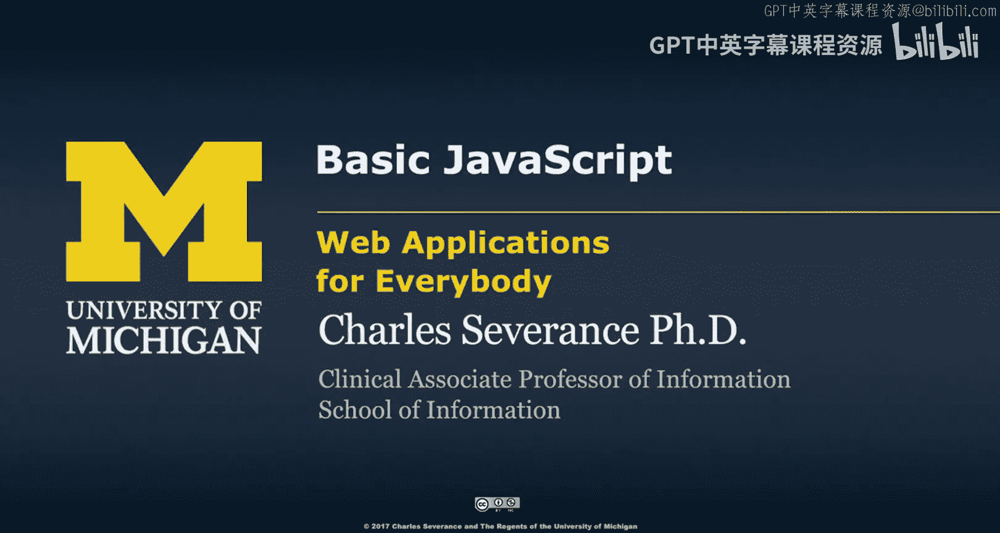
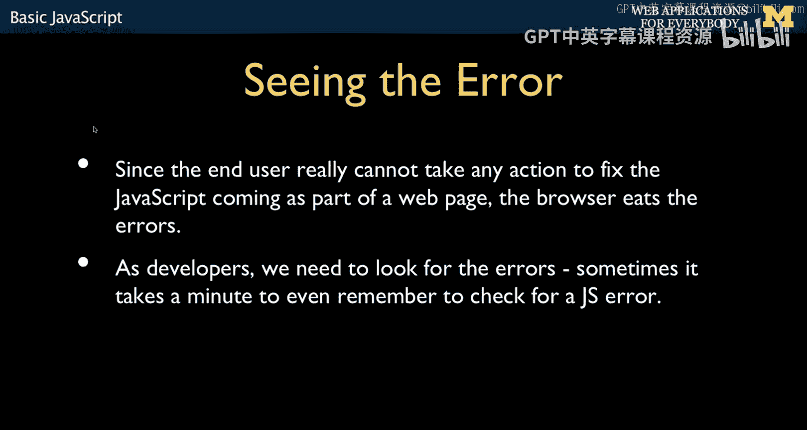
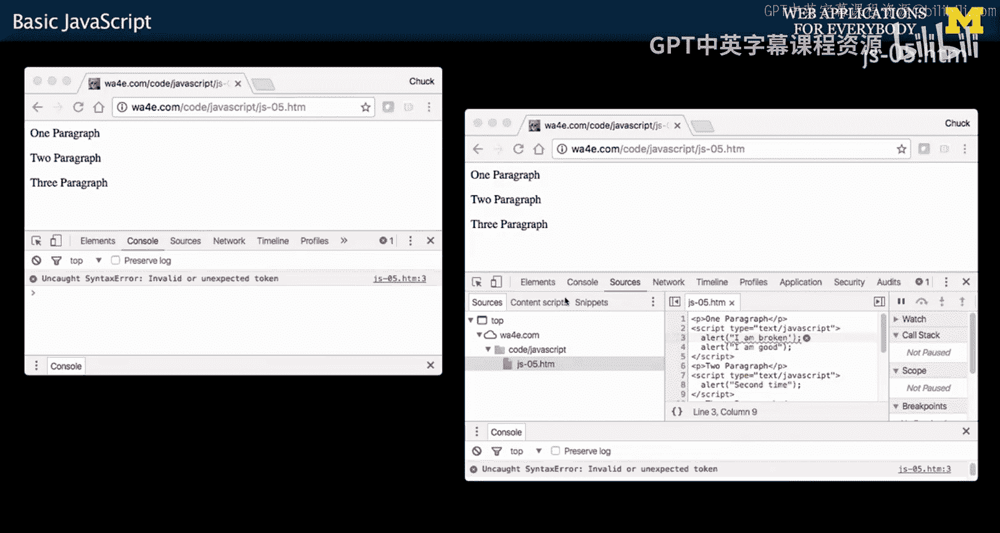
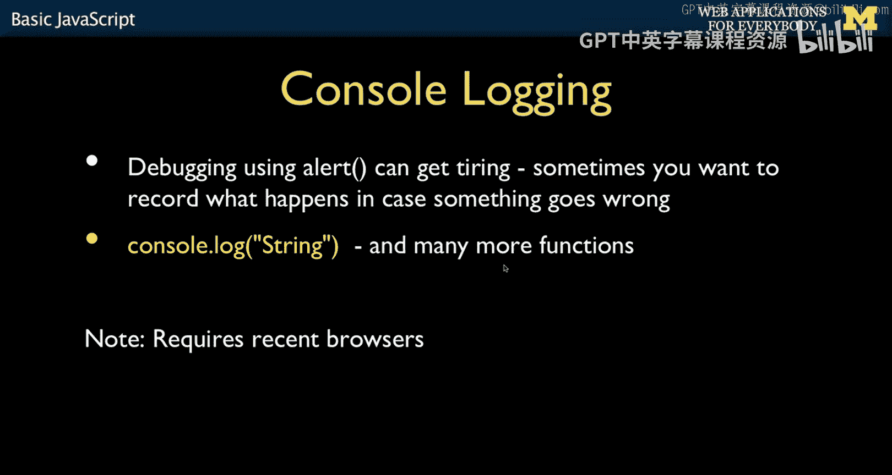
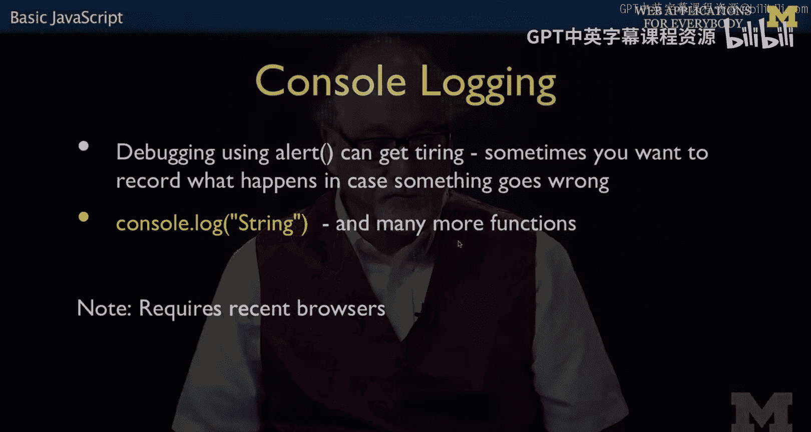
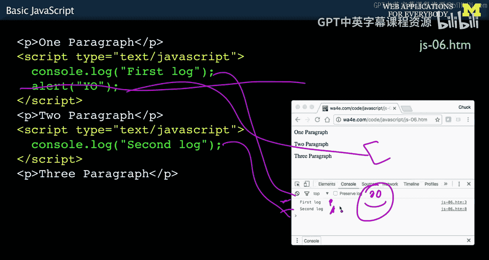
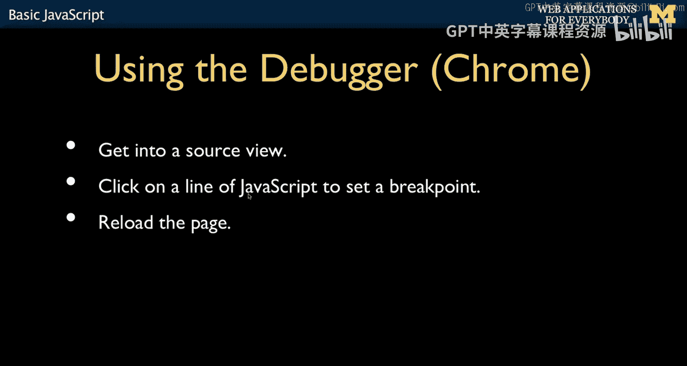
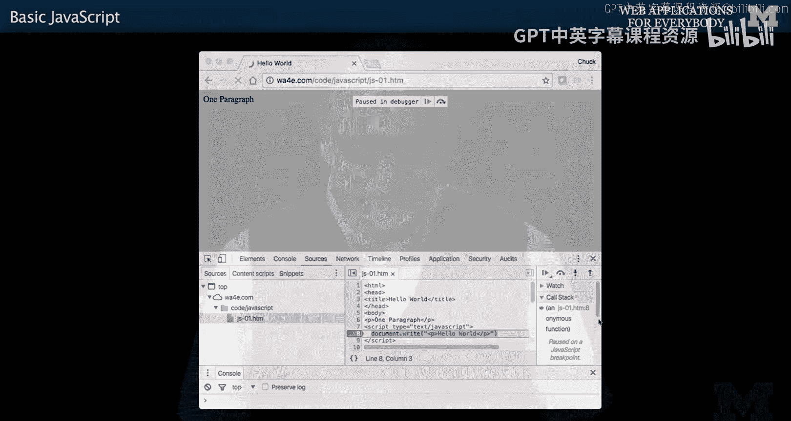

# 密歇根大学《面向所有人的Web应用程序》：2：基础JavaScript




## 概述

在本节课中，我们将要学习JavaScript编程中的两个核心实践：如何发现和处理语法错误，以及如何使用浏览器开发者工具进行调试。理解这些概念对于编写健壮的JavaScript代码至关重要。

## 语法错误与脚本执行

与任何编程语言一样，JavaScript中也可能出现语法错误。但JavaScript的运行环境——浏览器——有其特殊性。

在PHP等服务器端语言中，开发者可以通过配置（如在`php.ini`文件中设置`error_reporting`，或在PDO中设置错误模式）来确保看到错误信息。然而，JavaScript在浏览器中运行，通常是网页加载的“副作用”。浏览网页的用户通常不是代码的开发者，因此浏览器的默认行为是隐藏所有错误。有时浏览器会在右下角显示一个红色标记或问号，但用户通常不会注意到。

当浏览器检测到JavaScript错误时，它会停止执行当前脚本块，但不会通知用户。没有像PHP那样的错误日志。因此，了解如何在开发过程中捕获和发现错误非常重要，因为在开发JavaScript时难免会犯错。

## 错误的影响范围

以下是一个包含错误的JavaScript代码示例：

```html
<script>
console.log('I am broken);
</script>
<script>
console.log('I am good');
</script>
```

第一个`<script>`标签内有一个语法错误：字符串缺少闭合的单引号。在JavaScript中，单引号和双引号是等效的，但字符串必须正确闭合。

当浏览器遇到这个语法错误时，它会停止执行**当前脚本块**中错误之后的所有代码。因此，第一个脚本块中的`console.log`不会执行。但重要的是，它**不会**停止所有JavaScript的处理。浏览器会继续解析HTML，当遇到第二个`<script>`标签时，它会尝试执行其中的代码。由于第二个脚本块语法正确，因此`‘I am good’`会被成功打印。



这意味着，一个脚本块中的错误只会影响该块本身。然而，如果错误发生在定义函数的库代码中，那么这个错误之后的所有函数都将无法被定义。开发者必须意识到，在单个JavaScript文件或`<script>`标签内，一个错误会导致该错误之后的所有代码被“丢弃”。

## 使用浏览器开发者工具

既然错误默认对用户不可见，开发者就需要一种方法来查看它们。幸运的是，现代浏览器都内置了开发者工具（调试模式）。

首先，你需要知道如何在你的浏览器（如Chrome或Firefox）中启用开发者模式。启用后，你可以得到一个分屏界面，甚至可以将其分离到另一个窗口。

在开发者工具中，“控制台”（Console）标签页会显示所有的错误信息。一些开发者习惯始终让控制台保持打开状态。你甚至可以通过JavaScript代码主动向控制台发送日志消息。

控制台非常有效。通常，当错误发生时，你可以直接点击控制台中的错误信息链接，浏览器会直接跳转到源代码的对应行。即使代码被“压缩”（Minified）成难以阅读的单行格式，浏览器也通常提供“代码美化”（Pretty Print）功能，使其恢复可读格式。例如，它可能会提示“Uncaught SyntaxError”，并定位到第3行，明确指出问题所在。

随着你编写越来越多的JavaScript，你很可能会一直开着这个分屏界面。你会经常进行“清除日志” -> “刷新页面” -> “查看新错误”这样的循环，以此调试你的代码。浏览器内置调试器是许多人认为JavaScript适合作为第一门编程语言的原因之一，尽管整套工具对绝对初学者来说可能信息量过大。

## 调试输出：`alert` 与 `console.log`

之前我们提到了`alert()`函数，但它在实际调试中并不实用，因为它会弹出一个阻塞一切的对话框。

```javascript
alert('这是一个提示'); // 这会暂停所有脚本执行
```







`alert`通常只在一切都不对劲、需要立即暂停程序以查看执行顺序时使用。

更实用的调试方法是使用`console.log()`。

```javascript
console.log('这是一个日志消息');
```



`console.log()`可以将字符串输出到控制台。你也可以用它来打印变量的内容，这非常有用。与`alert`不同，`console.log`不会阻塞脚本执行，你可以在控制台中看到按顺序输出的消息。在实际的生产系统调试中，开发者经常查看控制台日志来定位问题。

需要注意的是，运行在浏览器中的JavaScript没有真正的安全性可言。像Cookie一样，代码对用户是可见的。聪明的用户可以查看、甚至修改正在运行的JavaScript。因此，永远不要完全信任客户端JavaScript代码。

## 兼容性与高级调试

在更旧的浏览器中，`console`对象可能只在开发者工具打开时才存在。直接调用`console.log`可能会导致错误。一种兼容性的写法是：

```javascript
if (window.console) {
    console.log('调试信息');
}
```

这段代码会检查`console`对象是否存在，如果存在则执行日志输出，从而避免在旧环境中产生错误。不过，在现代浏览器（如Chrome）中，你可以直接使用`console.log`。

除了日志，浏览器调试器还支持设置断点。你可以在“源代码”（Sources）标签页中找到你的JavaScript文件，点击行号来设置断点（会出现一个蓝色标记）。有时，你需要在设置断点后刷新页面，才能在下一次请求-响应周期中在断点处暂停。

当代码在断点处暂停时，你可以检查当前作用域内的变量值，然后逐步执行代码。这是一个非常强大的功能，虽然对初学者来说可能需要时间熟悉，但它是诊断复杂问题的利器。



## 总结




本节课中我们一起学习了JavaScript错误处理与调试的基础知识。我们了解到JavaScript错误默认在浏览器中被隐藏，但可以通过开发者工具的控制台来查看。语法错误会终止其所在脚本块的执行，但不会影响其他独立的脚本块。我们比较了`alert`和更实用的`console.log`调试方法，并介绍了浏览器调试器的基本用法，如查看错误、输出日志和设置断点。掌握这些工具和方法是有效进行JavaScript开发的关键。