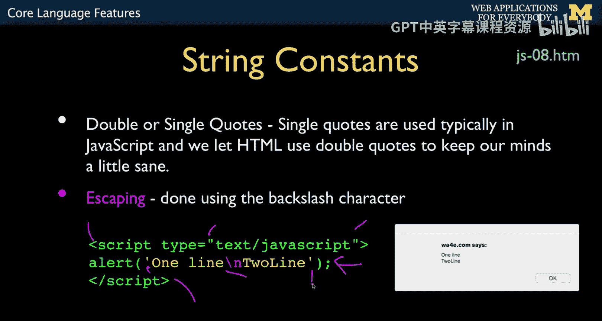

# 密歇根大学《面向所有人的Web应用程序》：3：JavaScript核心语言特性 🧠


在本节课中，我们将要学习JavaScript语言的一些核心特性。我们将从基础语法开始，包括注释、语句、变量命名和字符串常量，并了解它们与PHP等其他语言的异同。这些知识是编写任何JavaScript程序的基础。

## 注释与语句

上一节我们介绍了课程概述，本节中我们来看看JavaScript的基本语法规则。

JavaScript的注释方式与许多C风格语言类似。单行注释使用双斜杠 `//`，多行注释则使用 `/* ... */`。多行注释常用于函数文档说明。与某些语言（如Python）不同，JavaScript拥有真正的多行注释语法。

在语句方面，JavaScript与C语言类似。空白字符（空格、换行、缩进）不影响代码执行，它们仅用于提高代码可读性。语句通常以分号 `;` 结束。虽然在某些情况下可以省略分号，但为了代码清晰和避免潜在错误，建议始终使用分号。

以下是一个展示空白字符无关紧要的极端例子：
```javascript
console
    .
log
(
'Hello'
)
;
```
这段代码虽然格式混乱，但依然能正确执行，打印出“Hello”。然而，为了他人（如你的同事或助教）阅读方便，编写整洁、格式良好的代码是必要的。

## 变量命名规则

了解了基本语法后，我们来看看如何为变量命名。

JavaScript的变量命名规则相对灵活。变量名可以包含字母、数字、下划线 `_` 和美元符号 `$`。以下是具体规则：
*   变量名可以以字母、下划线 `_` 或美元符号 `$` 开头。
*   变量名不能以数字开头。
*   JavaScript是大小写敏感的语言，因此 `myVar` 和 `myvar` 是两个不同的变量。

关于美元符号 `$` 的使用：它被允许是为了让JavaScript看起来更像Perl、Bash等脚本语言，使其更易于上手。但在实际开发中，通常建议避免使用美元符号作为变量名开头，以保持代码风格的一致性。

## 字符串常量

最后，我们来探讨JavaScript中的字符串常量。

JavaScript中的字符串既可以用单引号 `'` 包裹，也可以用双引号 `"` 包裹，两者功能完全相同。字符串中的转义字符（如换行符 `\n`）遵循C语言的惯例。

在实际开发中，尤其是在Web开发中，有一个常见的约定：在JavaScript代码中尽量使用单引号 `'` 来定义字符串。这是因为HTML属性通常使用双引号 `"` 来包裹值。当我们混合编写HTML和JavaScript时（例如在 `document.write()` 中或内联事件处理器里），这种约定可以清晰地区分代码层次，避免引号嵌套混乱。

例如，在编写包含HTML的JavaScript字符串时：
```javascript
let htmlSnippet = '<p class="highlight">Hello World</p>';
```
这里，外层使用单引号定义JavaScript字符串，内层的HTML属性值使用双引号，使得代码结构一目了然。

---




本节课中我们一起学习了JavaScript的核心语言特性。我们了解了其C语言风格的注释（`//` 和 `/* */`）和以分号结尾的语句规则，知道了空白字符仅用于排版。我们还学习了变量命名的规则，包括允许使用的字符和大小写敏感性，并了解了避免使用 `$` 符号的惯例。最后，我们探讨了字符串常量的单双引号用法，以及为何在JavaScript中优先使用单引号以便与HTML的双引号区分开来。掌握这些基础是进一步学习JavaScript编程的关键。