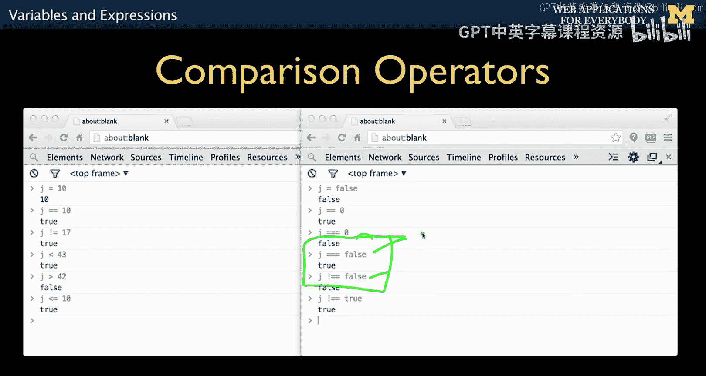
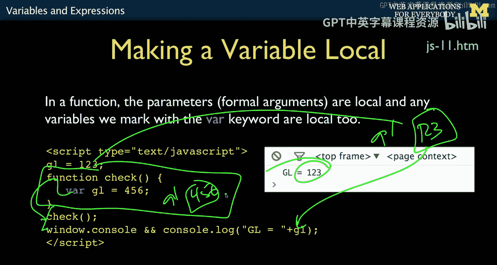

# 面向所有人的Web应用程序：4：JavaScript变量与表达式


## 概述
在本节课中，我们将要学习JavaScript中的变量与表达式。我们将探讨JavaScript的运算符、数据类型、变量作用域以及函数的基本概念。这些是理解JavaScript编程的基础。

## 运算符与表达式
任何编程语言的重要组成部分都包括运算符和表达式。JavaScript的运算符与大多数C语言风格的语言非常相似。

以下是JavaScript中的基本算术运算符：

*   `+`：加法
*   `-`：减法
*   `*`：乘法
*   `/`：除法（与Python 2不同，它总是产生浮点数结果，例如 `9 / 2` 得到 `4.5`）
*   `%`：取模（返回整数除法的余数）

此外，还有一些具有副作用的运算符：

*   `k++` 或 `++k`：等同于 `k = k + 1`
*   `k--` 或 `--k`：等同于 `k = k - 1`
*   `j += 5`：等同于 `j = j + 5`

这些简写形式通常用于使代码更紧凑，但除非有特殊理由，我们倾向于避免过度使用它们。

## 比较运算符
比较运算符与PHP和C语言非常相似。需要记住的重要一点是：单个等号 `=` 是赋值语句，而双等号 `==` 是用于比较的“问号”。

以下是主要的比较运算符：

*   `==`：等于（数值相等或在类型转换后相等）
*   `===`：严格等于（不进行类型转换，比较值和类型）
*   `!=`：不等于
*   `!==`：严格不等于
*   `<`：小于
*   `>`：大于
*   `<=`：小于或等于
*   `>=`：大于或等于

JavaScript有两种相等性运算符。双等号 `==` 是数值等价或在类型转换后的等价。三等号 `===` 是不进行类型转换的比较。

例如：
*   `false == 0` 的结果是 `true`，因为经过类型转换后它们被视为相等。
*   `false === 0` 的结果是 `false`，因为它们的类型不同。
*   `false === false` 的结果是 `true`。



在像PHP和JavaScript这样会进行自动类型转换的语言中，必须有一种能阻止自动类型转换的相等性测试。而在像Java这样的严格类型语言中，你无法比较两种不同类型的值，因为那会导致语法错误。

## 逻辑运算符
逻辑运算符同样直接源自C语言。

*   `&&`：逻辑与（AND）。两边都必须为真，结果才为真。例如：`true && true` 结果为 `true`。
*   `||`：逻辑或（OR）。只要有一边为真，结果就为真。例如：`true || false` 结果为 `true`。
*   `!`：逻辑非（NOT）。例如：`!true` 结果为 `false`。

这些运算符在C语言家族中都是通用的。

## 字符串连接与松散类型
在PHP中，我们使用点号 `.` 进行字符串连接。在JavaScript中，我们使用加号 `+` 进行连接，并且它会自动进行类型转换。

例如：
```javascript
let x = 12;
let result = "hello " + x + " people"; // 结果为 "hello 12 people"
```

JavaScript是一种松散类型的语言。加号 `+` 既可以是数字加法运算符，也可以是字符串连接运算符，这取决于操作数的类型。

让我们看一些例子：
*   `"123" + 10` 的结果是字符串 `"12310"`，因为加号被解释为连接。
*   `"123" * 1` 的结果是数字 `123`，因为乘号 `*` 是严格的数字运算符。然后 `123 + 10` 得到 `133`。
*   `"Fred" * 1` 的结果是 `NaN`（Not a Number）。

## 特殊值：NaN 与 Infinity
当JavaScript尝试进行无效的数字运算时，会产生 `NaN`（非数字）。`NaN` 具有“粘性”，任何涉及 `NaN` 的运算结果通常也是 `NaN`。

例如：
*   `NaN + 1` 的结果仍然是 `NaN`。
*   你可以使用 `isNaN()` 函数来检查一个值是否为 `NaN`。

除以零在JavaScript中不会报错，而是得到 `Infinity`（无穷大）。从数学角度看，这比直接抛出错误更合理。JavaScript的数字处理实现遵循一定的数值计算标准。

## 类型检查
`typeof` 运算符可以告诉你一个值的类型。它返回一个字符串，例如 `"string"`、`"number"`、`"boolean"` 等。

你可以在 `if` 语句中使用它：
```javascript
if (typeof variable === "string") {
    // 执行某些操作
}
```

## 函数与变量作用域
函数是任何编程语言的重要组成部分。JavaScript函数的基本语法与C语言风格类似：

```javascript
function functionName(arg1, arg2) {
    // 函数体
    return value;
}
```

参数默认按值传递，函数可以返回一个值。这部分与其他编程语言类似。

然而，JavaScript函数作用域的行为有一个重要的不同点。默认情况下，在函数内部声明的变量（如果没有使用 `var`、`let` 或 `const` 关键字）可能会成为全局变量，或者引用外部的全局变量。

请看以下代码：
```javascript
let gl = 123;

function check() {
    gl = 456; // 这里修改了全局变量 gl
}

check();
console.log(gl); // 输出 456
```

为了避免这种意外的副作用，**必须**在函数内部使用 `var`、`let` 或 `const` 来声明局部变量。

```javascript
let gl = 123;

function check() {
    let gl = 456; // 这里声明了一个新的局部变量 gl
}



check();
console.log(gl); // 输出 123，全局变量未被修改
```

在函数内部显式声明局部变量是一种良好的编程实践，可以避免变量意外污染全局作用域。这是JavaScript与其他许多编程语言不同的地方。

## 总结
本节课我们一起学习了JavaScript变量与表达式的核心概念。我们探讨了算术、比较和逻辑运算符，了解了JavaScript松散类型的特性以及字符串连接的方式。我们还认识了 `NaN` 和 `Infinity` 这两个特殊值，并学习了如何使用 `typeof` 进行类型检查。最后，我们重点讨论了函数中变量作用域的重要性，强调了使用 `var`、`let` 或 `const` 声明局部变量的必要性，以避免意外的全局变量修改。理解这些基础是编写可靠JavaScript代码的关键。