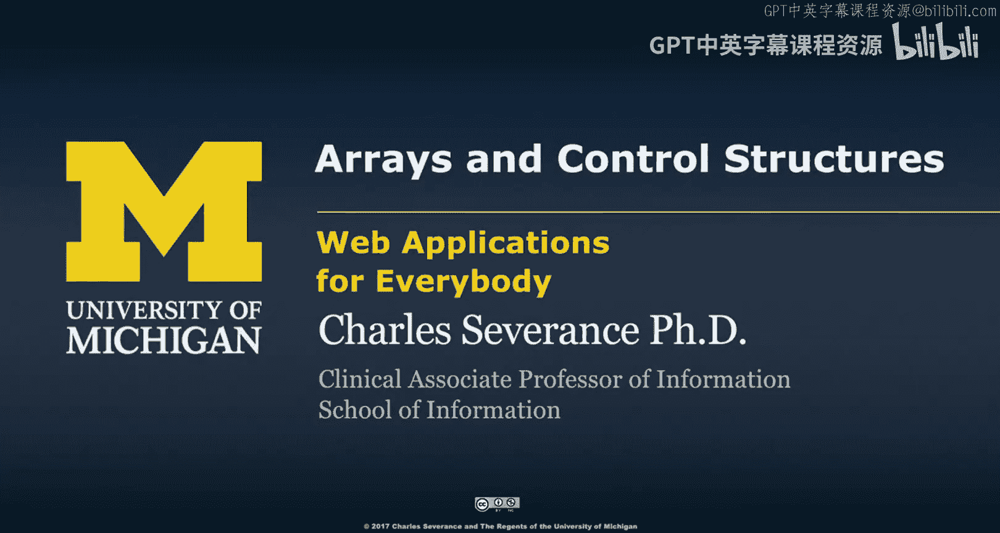
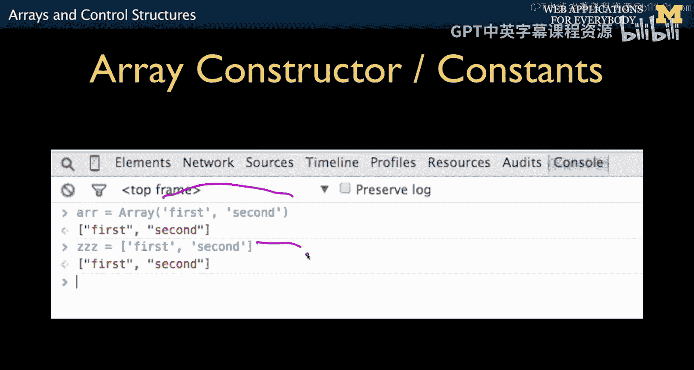
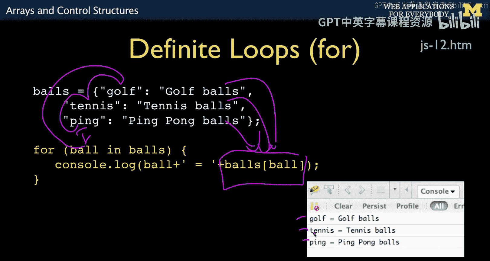

# 密歇根大学《面向所有人的Web应用程序》：5：JavaScript数组与控制结构 🧩




在本节课中，我们将学习JavaScript中的两种核心数据结构：数组与控制结构。我们将了解如何创建和使用数组，并回顾与PHP语法相似的控制流程语句。

## 数组：线性数组与关联结构

与我们已经熟悉的PHP和Python等语言类似，JavaScript也包含线性数组和关联结构。

但JavaScript的关联数组实际上是对象。我们将在下一节关于面向对象编程的主要课程中更详细地讨论它们。有趣的是，在JavaScript中，你不得不比其他语言更早地学习面向对象，这也是我不喜欢将JavaScript作为第一门语言的原因之一。

然而，事实证明JavaScript对象非常强大、灵活且优雅，我们之后会讲到这一点。

线性数组相当直接。你可以使用方括号 `[]` 和逗号来创建。

**代码示例：**
```javascript
let a = [1, 2, 3, 4, 5];
```
这就是一个线性数组，索引为0,1,2,3,4。

你也可以有键值对，但这些是对象，而不是数组，我们稍后会讨论。你可以使用 `a[0]` 来获取数组 `a` 的第一个元素，或者使用 `b[‘name’]` 来获取对象 `b` 中名为 `‘name’` 的属性。

这部分内容有时会让人困惑，因为它基本上是说“进入对象b并查找属性‘name’”。但这里的键是带引号的字符串，这看起来有点奇怪。

不过，你可以暂且将对象视为关联数组。你甚至可以创建一个不包含方法、只包含一组键值对数据的对象。因此，来自像PHP这样期望关联数组具有键值对功能语言的人，通常会直接创建对象而不必过于担心，我们稍后会更详细地讨论对象。

## 构建数组的方法

有多种方式可以构造数组。你可以创建一个全新的空数组，然后使用 `push` 方法将元素添加到末尾。

**代码示例：**
```javascript
let arr = [];
arr.push(‘first’);
arr.push(‘second’);
// 结果: [‘first’, ‘second’]
```
或者，你也可以通过直接为索引赋值来构建数组。

**代码示例：**
```javascript
let arr = [];
arr[0] = ‘first’;
arr[1] = ‘second’;
// 结果: [‘first’, ‘second’]
```
这是另一种从零碎部分构建数组的方法。

你还可以使用构造函数风格，直接列出你想放入数组的元素列表。方括号语法实际上是这种构造函数风格创建数组的一种简写形式。



**代码示例：**
```javascript
let arr = new Array(‘first’, ‘second’);
// 等价于 let arr = [‘first’, ‘second’];
```

## 控制结构

既然你来自PHP背景，控制结构部分我们不会逐一详述，因为其运算符与PHP相同。

`if` 语句类似PHP，`while` 循环类似PHP，`for` 循环类似PHP的计数循环，`break` 和 `continue` 的工作方式也类似PHP。这就是我喜欢先教PHP的原因之一，因为它们都是类C语言，这样我就可以说：“还记得我们在PHP里做过的所有事情吗？”

在确定循环方面有一个区别：在PHP中你使用 `foreach`，但在JavaScript中我们使用 `for…in` 循环。

**代码示例：**
```javascript
let balls = {‘red’: 1, ‘blue’: 2, ‘green’: 3};
for (let color in balls) {
    console.log(color + ‘: ‘ + balls[color]);
}
```
在这个例子中，`color` 是迭代变量，`balls` 是集合（这里是一个对象，但暂时可以把它当作键值数组）。这基本上是说，迭代变量 `color` 将遍历对象中连续的键。然后我们可以使用 `balls[color]` 来查找对应的值。

它没有像Python那样的双迭代变量特性。这个循环会遍历所有键值对。

## 总结



本节课中，我们一起学习了JavaScript的数组与控制结构。我们了解了线性数组的创建与访问，探讨了对象作为关联结构的本质，并学习了使用 `push` 方法和索引赋值来构建数组。在控制结构方面，我们回顾了与PHP语法相似的 `if`、`while`、`for` 循环以及 `break` 和 `continue` 语句，并特别介绍了用于遍历对象属性的 `for…in` 循环。掌握这些基础是理解后续更复杂JavaScript概念的关键。