# 密歇根大学《面向所有人的Web应用程序》：6：JavaScript代码详解

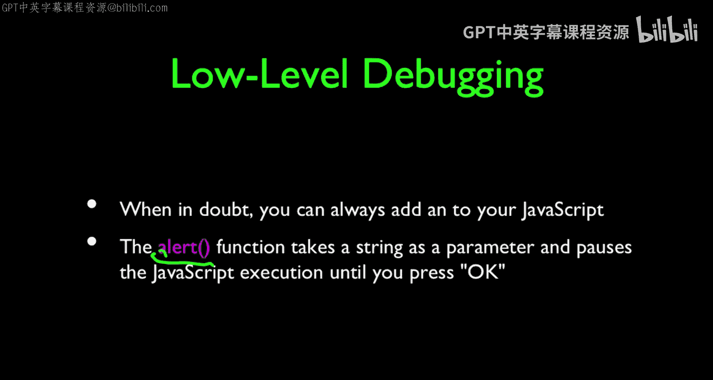

在本节课中，我们将要学习JavaScript的基础知识，包括如何编写简单的代码、调试程序以及理解JavaScript在网页中的不同嵌入方式。我们将从最基础的调试语句开始，逐步深入到更复杂的调试工具和技巧。

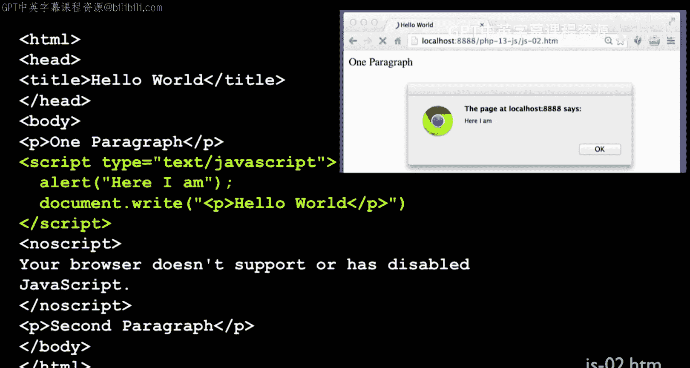

## 概述：JavaScript入门与调试

JavaScript是一种在浏览器中运行的脚本语言，用于为网页添加交互功能。学习JavaScript的第一步通常是了解如何输出信息来调试代码。本节将介绍几种输出信息的方法，并解释JavaScript代码在HTML文档中的不同存在形式。

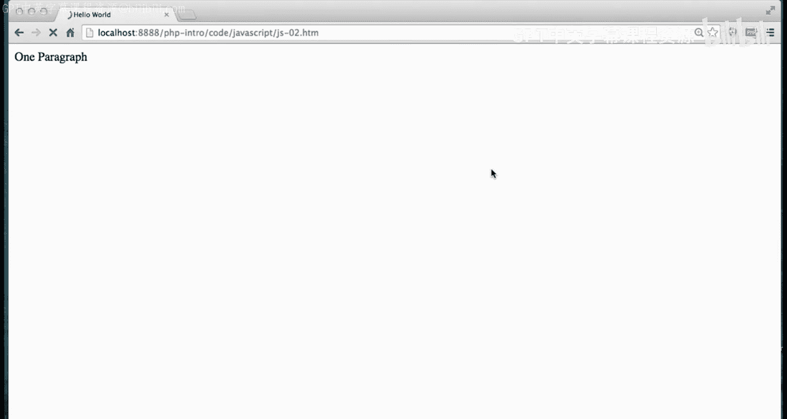

## 使用`alert()`函数进行调试

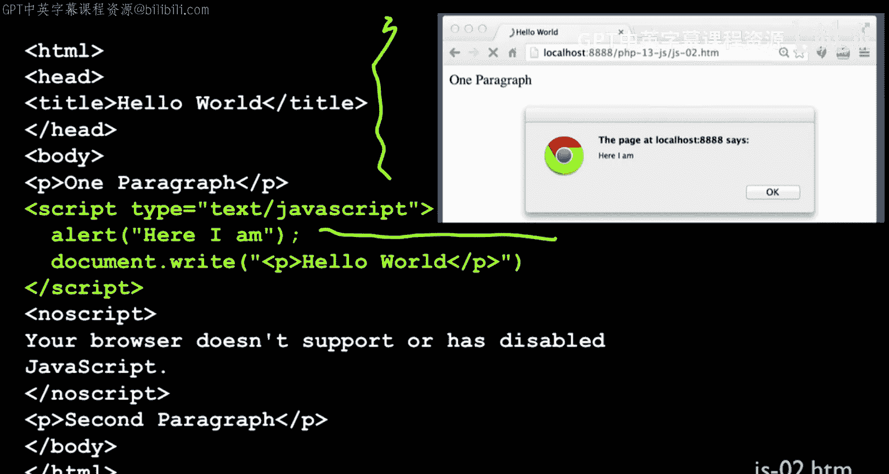

上一节我们介绍了JavaScript的基本概念，本节中我们来看看如何开始编写和调试第一段代码。在编程时，我首先喜欢做的事情之一就是如何输出调试信息。

`alert()`函数是实现这一目的的一个简单方法。它接受一个字符串作为参数，并将其内容弹窗显示给用户。

```javascript
alert("这是一条调试信息");
```

当浏览器执行到这段代码时，它会弹出一个对话框，显示指定的字符串。这个过程会**暂停**JavaScript的执行，直到用户点击“确定”按钮后，代码才会继续运行。因此，`alert()`不仅用于输出信息，也是一种强力的调试手段，因为它能完全中断程序的流程。

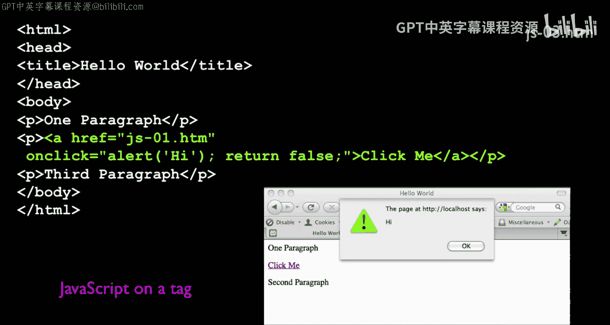

## 在HTML中嵌入JavaScript的三种方式

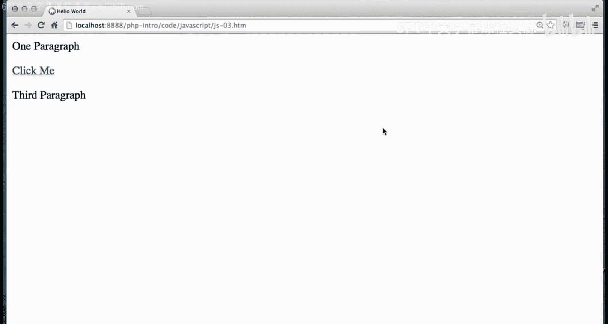

了解了基本的输出方法后，我们来看看如何将JavaScript代码放入HTML文档中。JavaScript可以通过三种主要方式嵌入到HTML中。

以下是这三种方式的详细介绍：

1.  **内联脚本**：使用`<script>`标签直接在HTML文档中编写JavaScript代码。
    ```html
    <script>
        alert("页面加载时弹出的消息");
    </script>
    ```

2.  **事件处理器**：在HTML标签的事件属性（如`onclick`）中直接编写JavaScript代码。
    ```html
    <a href="#" onclick="alert('你点击了链接！'); return false;">点击我</a>
    ```
    在这个例子中，`onclick`属性内的代码会在用户点击链接时执行。`return false;`语句用于阻止浏览器执行链接的默认行为（即跳转到`href`指定的地址）。

3.  **外部文件引入**：通过`<script>`标签的`src`属性引入外部的`.js`文件。
    ```html
    <script src="myscript.js"></script>
    ```
    文件`myscript.js`中只包含纯粹的JavaScript代码，无需再包裹`<script>`标签。这种方式有利于代码的复用和管理。

## 处理JavaScript语法错误

在编写JavaScript时，难免会出现语法错误。然而，浏览器通常不会将这些错误信息直接显示给最终用户，因为用户无法修复它们。浏览器会选择静默地停止执行出错的脚本块，然后继续渲染页面的其余部分。

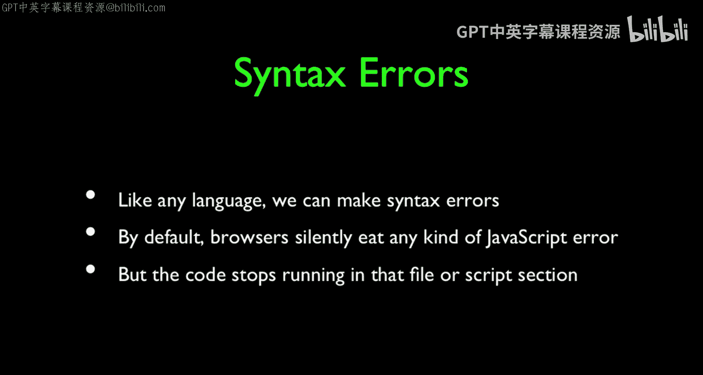

例如，下面这段代码有一个字符串引号不匹配的错误：
```javascript
alert(‘这是一个错误示例); // 单引号未闭合
alert(“这行代码可能不会执行”);
```
执行时，第一个`alert`会因为语法错误而失败，第二个`alert`也不会执行，但页面其他部分可能正常加载。

作为开发者，我们需要主动去发现这些错误。

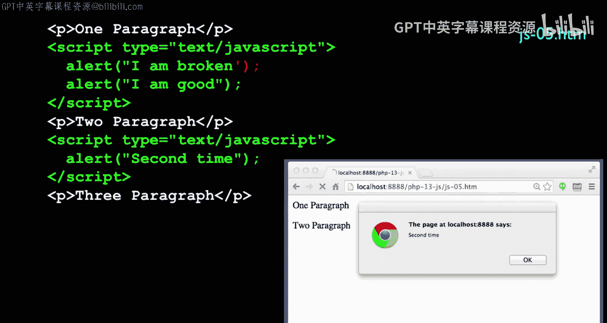

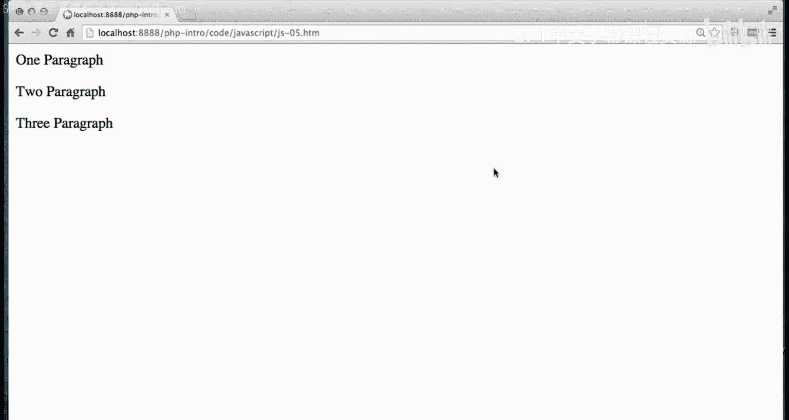

## 使用浏览器开发者工具

为了发现和调试错误，我们必须使用浏览器的开发者工具。所有现代浏览器（如Chrome、Firefox）都内置了强大的开发者工具。

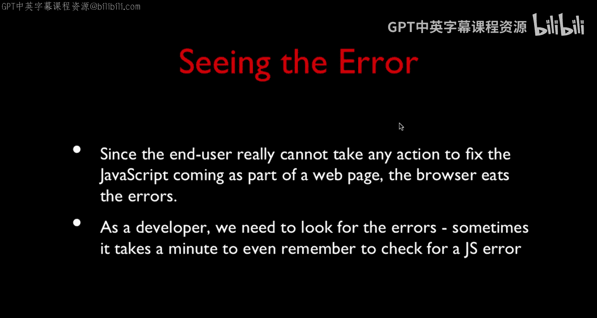

通常，你可以通过右键点击网页并选择“检查”或按`F12`键来打开开发者工具。在“控制台”标签页中，你可以看到JavaScript运行时产生的所有错误和警告信息。这对于定位代码问题至关重要。

开发者工具还允许你查看网页的源代码、网络请求、以及当前的内存状态等。

## 更优雅的调试：`console.log()`

虽然`alert()`有用，但它会中断程序，不适合在循环或频繁触发的事件中使用。这时，`console.log()`方法是更好的选择。

`console.log()`接受一个或多个参数，并将它们输出到浏览器的控制台，而不会中断代码执行。

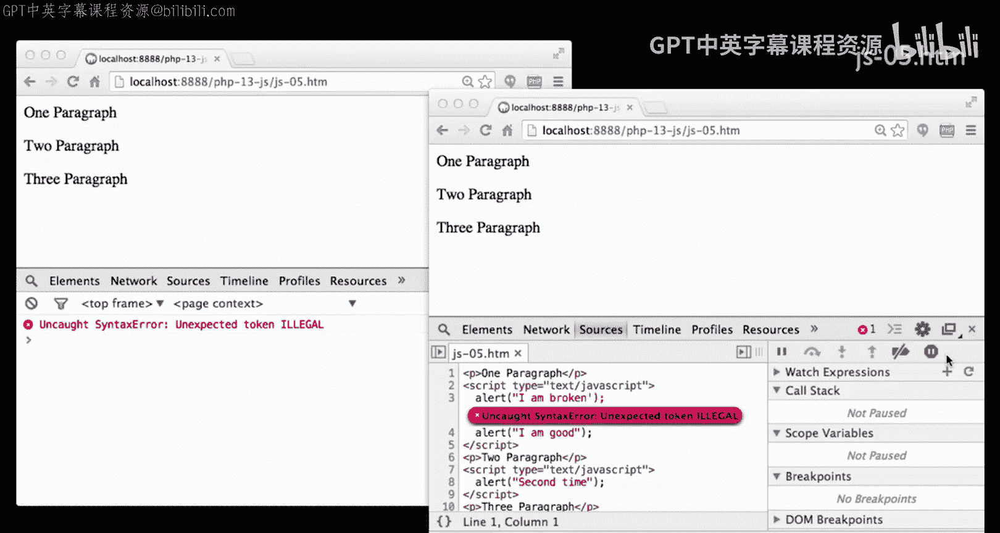

```javascript
console.log("当前计数是：", count);
```

这对于跟踪变量值、程序执行流程非常有帮助。只有打开开发者工具的用户才能看到这些日志，普通用户则看不到。

需要注意的是，在某些环境下（或当开发者工具关闭时），`console`对象可能不存在。为了避免因此产生错误，一个常见的做法是先检查`console`是否存在：

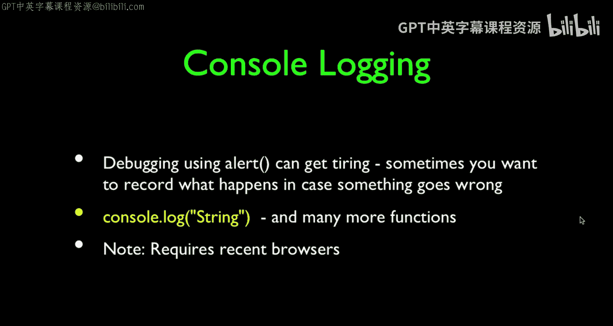

```javascript
if (window.console) {
    console.log("安全地输出日志");
}
```

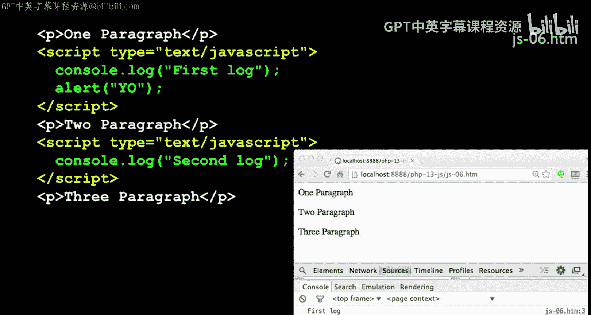

## 使用调试器设置断点

最强大的调试功能是使用JavaScript调试器设置断点。断点可以让代码在指定位置暂停执行，以便你检查当时的变量状态、调用栈等信息。

在开发者工具的“源代码”标签页中，找到你的JavaScript文件，点击行号旁边的区域即可设置一个断点。刷新页面后，代码执行到该行时会自动暂停。

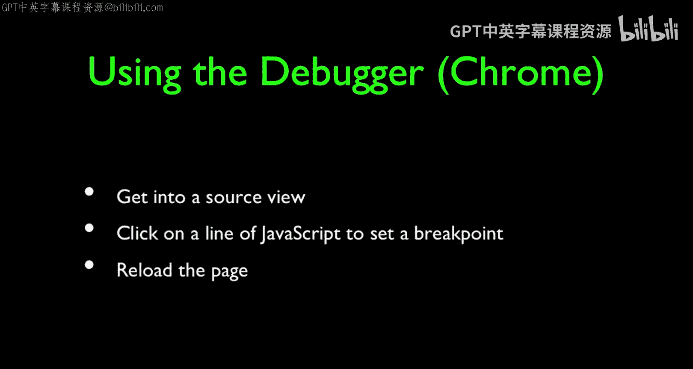

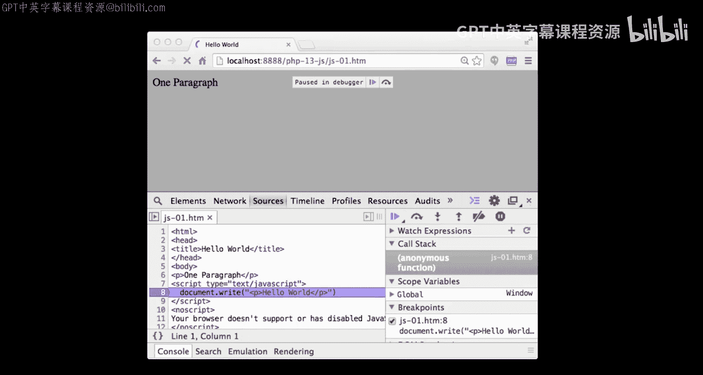

当代码暂停时，你可以：
*   查看和修改当前作用域内的变量值。
*   逐行执行代码。
*   查看函数调用栈。
在调试器面板中，你可以使用继续执行、步入、步出等按钮来控制代码的执行流程。掌握断点调试是解决复杂逻辑问题的关键技能。

## 总结

本节课中我们一起学习了JavaScript编程的起点——调试。我们从最基础的`alert()`函数开始，了解了它如何输出信息并暂停代码执行。接着，我们探讨了将JavaScript代码嵌入HTML的三种方式：内联脚本、事件处理器和外部文件引入。

然后，我们认识到浏览器会静默处理语法错误，因此必须借助开发者工具的“控制台”来发现它们。为了进行更灵活、不中断流程的调试，我们引入了`console.log()`方法。最后，我们学习了如何使用调试器设置断点，这是深入分析代码执行过程、定位疑难问题的终极工具。

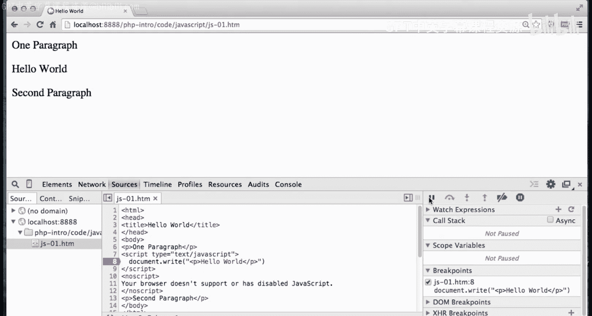

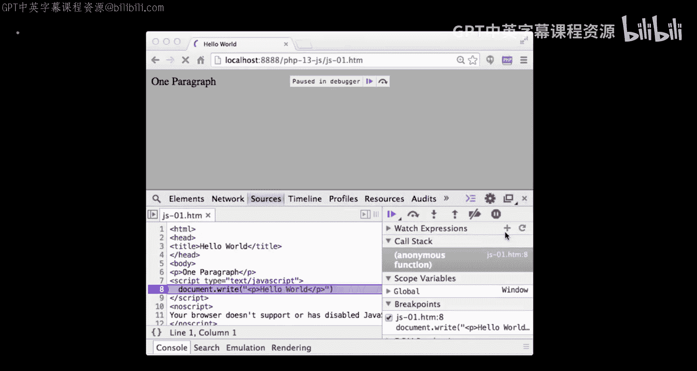

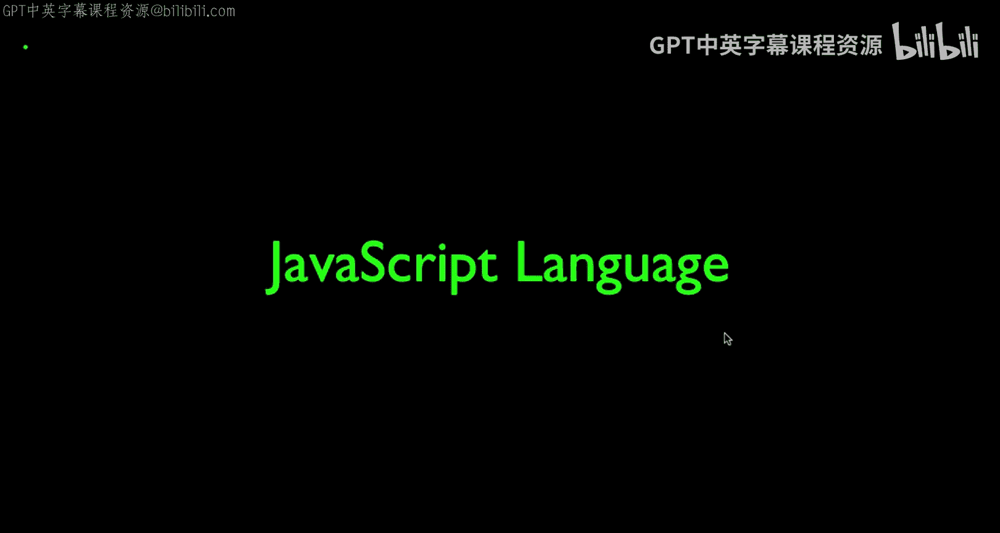

通过掌握这些基础的编写和调试技巧，你已经为学习更复杂的JavaScript概念打下了坚实的基础。