# 面向所有人的Web应用程序：9：JavaScript配置文件详解 🧑‍💻

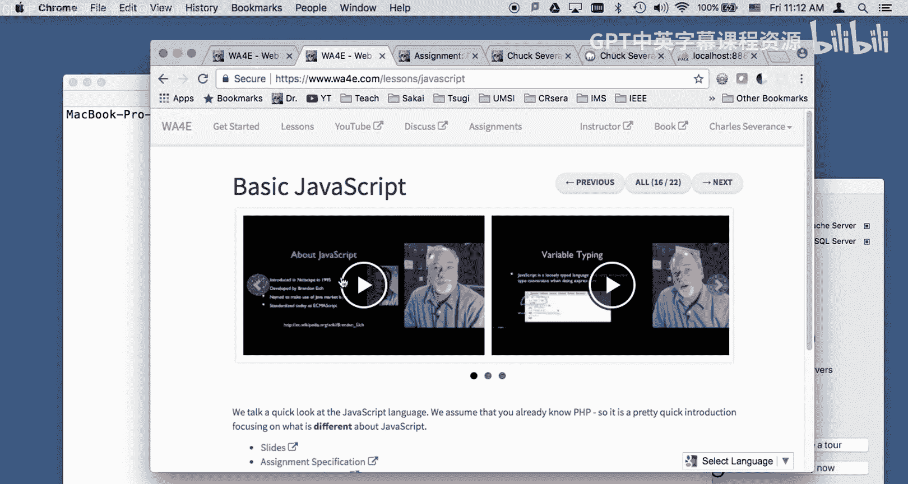

在本节课中，我们将详细讲解与基础JavaScript课程相关的作业。这个作业的核心是构建一个个人资料数据库应用。我们将从设置数据库开始，逐步实现用户登录、数据验证、以及利用外键关联用户与个人资料记录等功能。

上一节我们介绍了课程的整体背景，本节中我们来看看具体的作业要求和实现步骤。

## 概述与作业要求

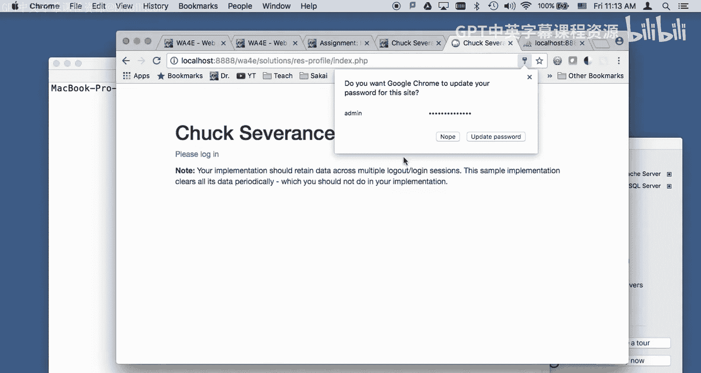

本次作业要求你构建一个个人资料数据库应用。其设计理念是假设你刚刚完成了包含`autos`表和`users`表的“汽车”作业。现在，你需要基于此构建第二个CRUD应用。你可以参考之前的作业获取灵感，但这个应用将是后续几节课作业的基础，因此必须正确完成。如果你在上一个作业中只是勉强让程序运行起来，那么这次应该抓住机会，真正理解代码的运行原理。

这个应用包含一些浏览器端的JavaScript数据验证功能。

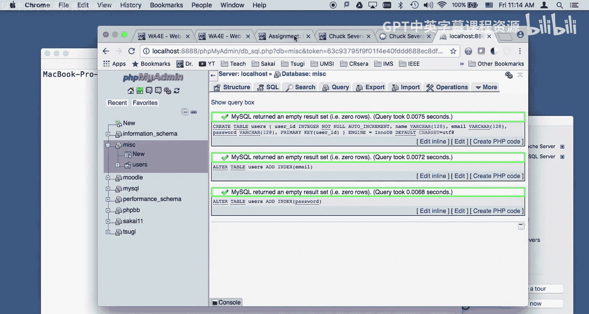

## 数据库表结构设置

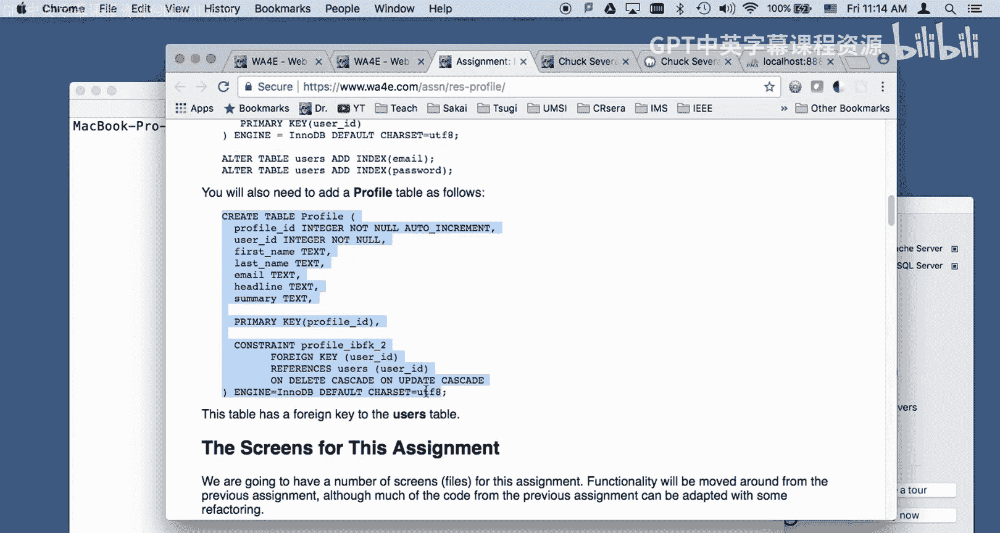

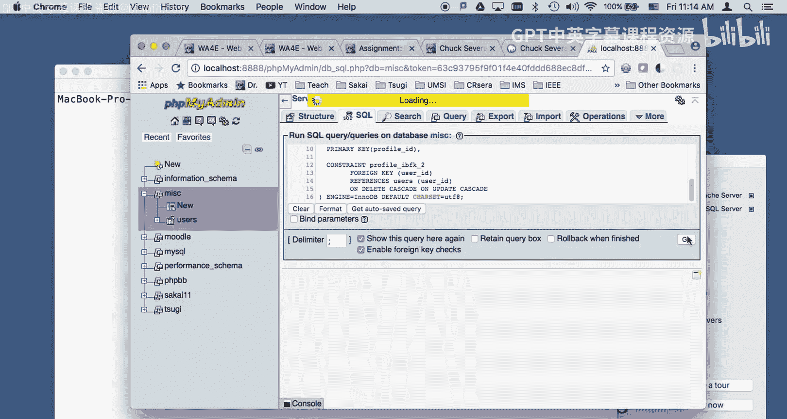

在运行代码之前，我们需要先设置数据库表。以下是创建所需表的步骤。

以下是创建`users`表的SQL语句：

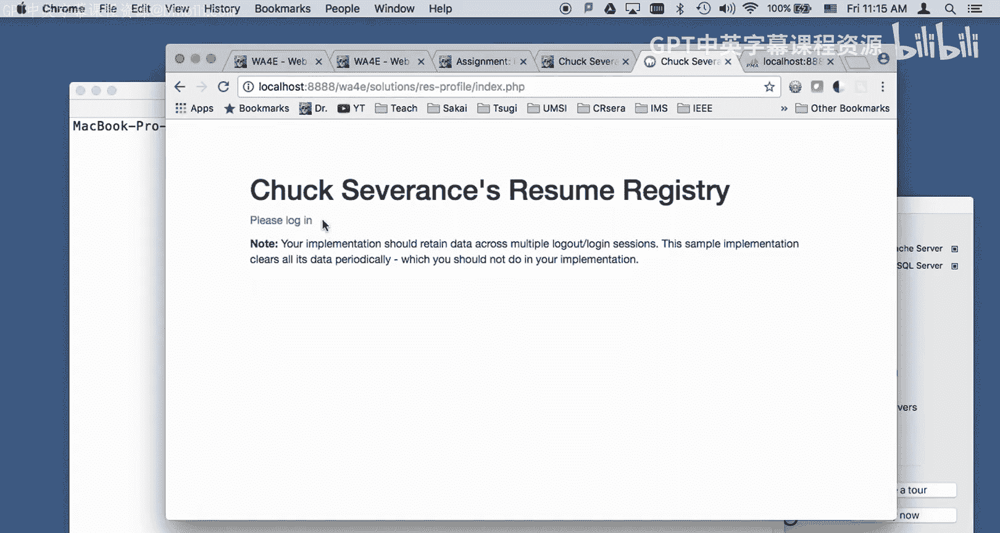

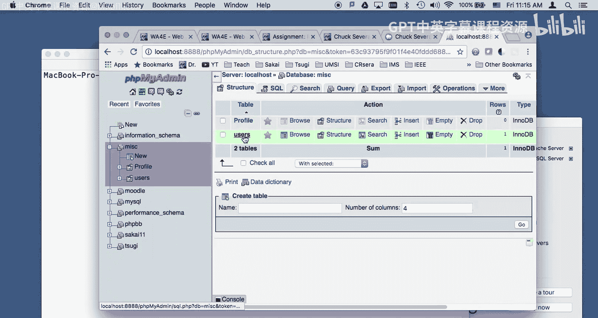

```sql
CREATE TABLE users (
    user_id INTEGER NOT NULL AUTO_INCREMENT,
    name VARCHAR(128),
    email VARCHAR(128),
    password VARCHAR(128),
    PRIMARY KEY(user_id)
) ENGINE=InnoDB DEFAULT CHARSET=utf8;
```

以下是创建`profile`表的SQL语句。请注意，必须先创建`users`表，因为`profile`表包含指向`users`表的外键约束。

```sql
CREATE TABLE profile (
    profile_id INTEGER NOT NULL AUTO_INCREMENT,
    user_id INTEGER,
    first_name TEXT,
    last_name TEXT,
    email TEXT,
    headline TEXT,
    summary TEXT,
    PRIMARY KEY(profile_id),
    CONSTRAINT profile_ibfk_1
        FOREIGN KEY (user_id)
        REFERENCES users (user_id)
        ON DELETE CASCADE ON UPDATE CASCADE
) ENGINE=InnoDB DEFAULT CHARSET=utf8;
```

创建表后，需要向`users`表中插入初始用户数据，例如用户“umsi”及其哈希密码。这为后续的登录功能提供了基础。

## 登录与JavaScript验证

应用的第一部分是登录页面，其中包含了浏览器端的JavaScript验证。

当点击登录按钮时，会触发`doValidate`函数。该函数会验证表单数据，如果有效则返回`true`并提交表单，如果无效则返回`false`并阻止提交，同时弹出提示信息。

JavaScript代码运行在用户的浏览器中，属于请求-响应周期中的客户端环节。这意味着任何人都可以通过查看网页源代码看到这些验证逻辑。因此，在课程材料中，这些代码是公开提供的。

例如，如果电子邮件地址格式不正确（缺少“@”符号），点击登录会触发警告：“无效的电子邮件地址”。如果所有字段都为空，则会提示：“所有字段都必须填写”。

如果客户端验证通过，表单数据将被提交到服务器端（`login.php`）进行进一步检查。服务器端验证包括检查用户名和密码是否与数据库记录匹配。如果服务器端验证失败，会通过重定向和“闪现消息”（flash message）机制向用户反馈错误。

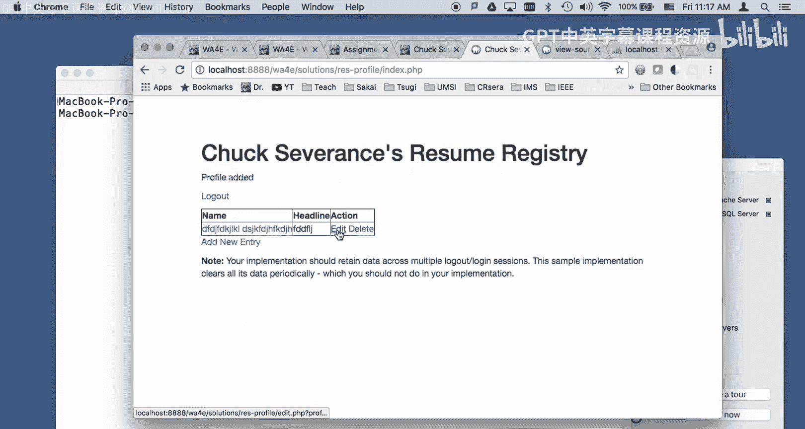

`login.php`文件的结构与你之前编写的登录脚本类似，包含了重定向逻辑、验证逻辑以及嵌入的JavaScript代码。

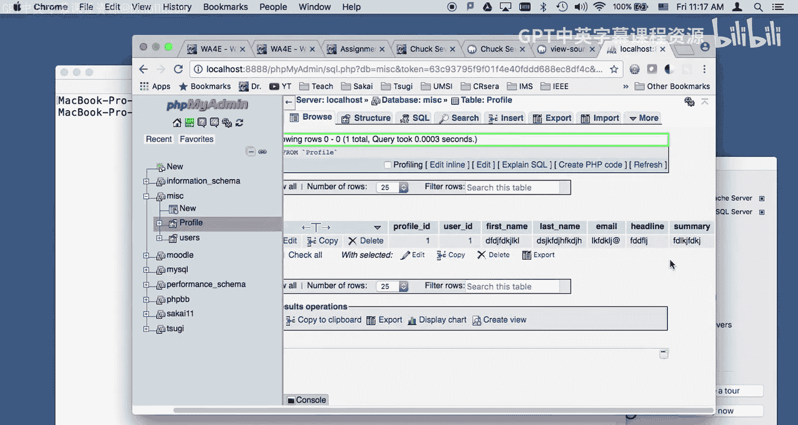

## CRUD操作与数据展示

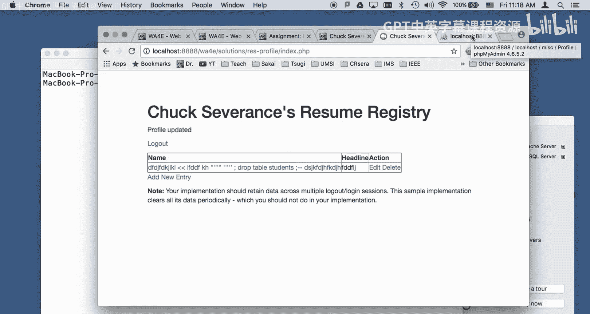

成功登录后，用户将进入主页面，可以对个人资料记录进行增删改查（CRUD）操作。

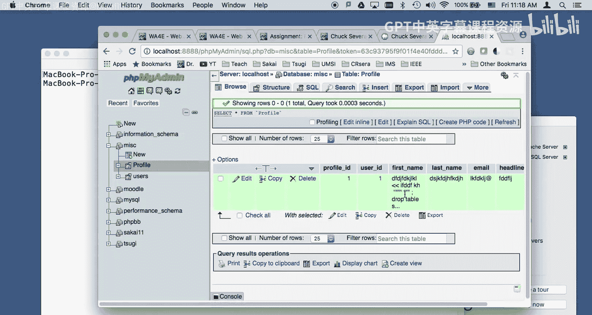

“添加新条目”和“编辑”页面在当前作业中暂时没有加入JavaScript验证（这将是下一个作业的重点）。目前，你需要确保这些页面能够正常工作，例如正确处理表单提交、将数据插入或更新到`profile`表中。

需要处理的数据字段包括：`first_name`、`last_name`、`email`、`headline`和`summary`。这与之前的作业略有不同，但实现难度不大。

一个关键点是必须防范安全漏洞。你需要确保：
1.  使用预处理语句（Prepared Statements）防止SQL注入攻击。
2.  在将数据输出到HTML页面前，使用`htmlentities()`函数进行转义，防止HTML/脚本注入（XSS攻击）。

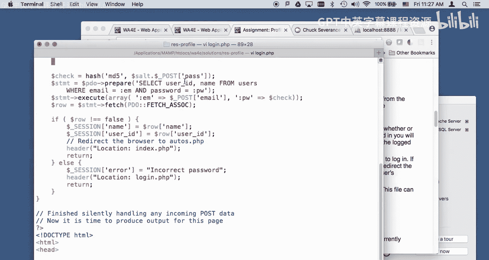

“删除”操作通常包含一个确认步骤，并且同样需要对输出的数据进行HTML实体转义。

## 会话管理与外键关联

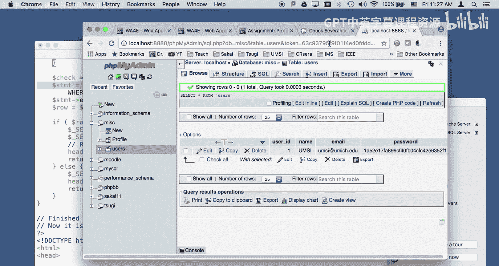

登录过程中一个重要的步骤是会话管理。在`login.php`中，验证用户凭据后，我们会从数据库查询中获取当前用户的`user_id`（这是`users`表的主键），并将其存储在`$_SESSION`超全局变量中。

```php
$_SESSION[‘user_id’] = $row[‘user_id’];
```

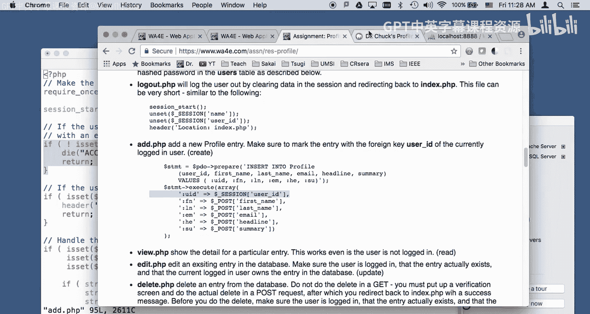

这个存储在会话中的`user_id`用于在后续页面（如“添加新条目”）中判断用户是否已登录，并决定是否允许其执行操作。

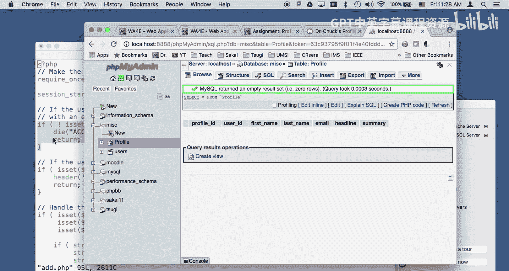

本作业的核心数据库概念是使用**外键**。在`profile`表中，`user_id`字段是一个外键，它指向`users`表中的`user_id`主键。

当用户添加一个新的个人资料记录时，你需要在INSERT语句中，将这个外键字段的值设置为当前登录用户的`user_id`（即从`$_SESSION`中获取的值）。

```php
$stmt = $pdo->prepare(‘INSERT INTO profile (user_id, first_name, last_name, email, headline, summary) VALUES (:uid, :fn, :ln, :em, :he, :su)’);
$stmt->execute(array(
    ‘:uid’ => $_SESSION[‘user_id’],
    ‘:fn’ => $_POST[‘first_name’],
    // … 其他字段
));
```

这样，就在`profile`表和`users`表之间建立了一条关联记录。在某些数据库管理工具中，这个外键甚至会显示为超链接，点击后可以直接跳转到对应的用户记录。

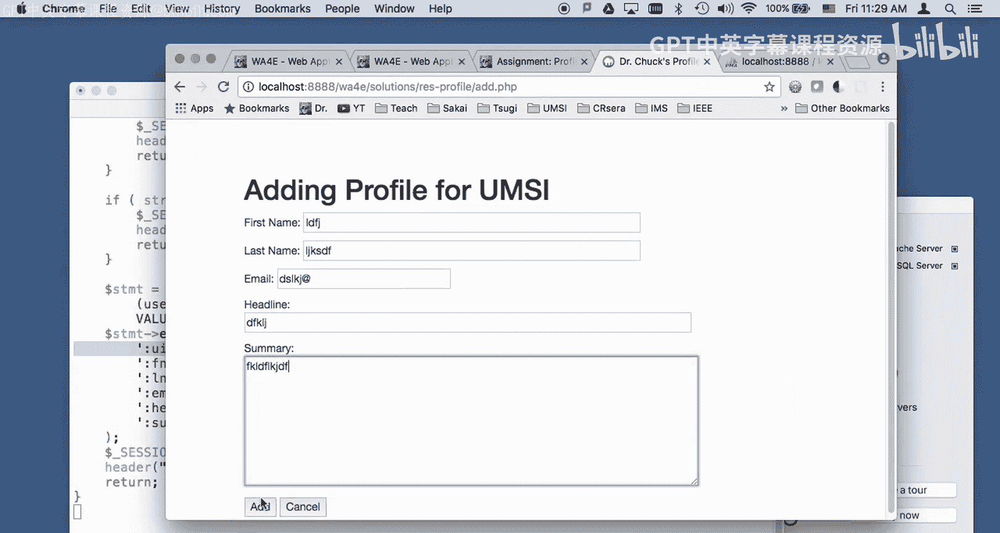

理解并实现这种外键关联至关重要，因为接下来的作业将涉及更复杂的关系：下一节是“一对多”关系，最后一节将是“多对多”关系。

## 总结与建议

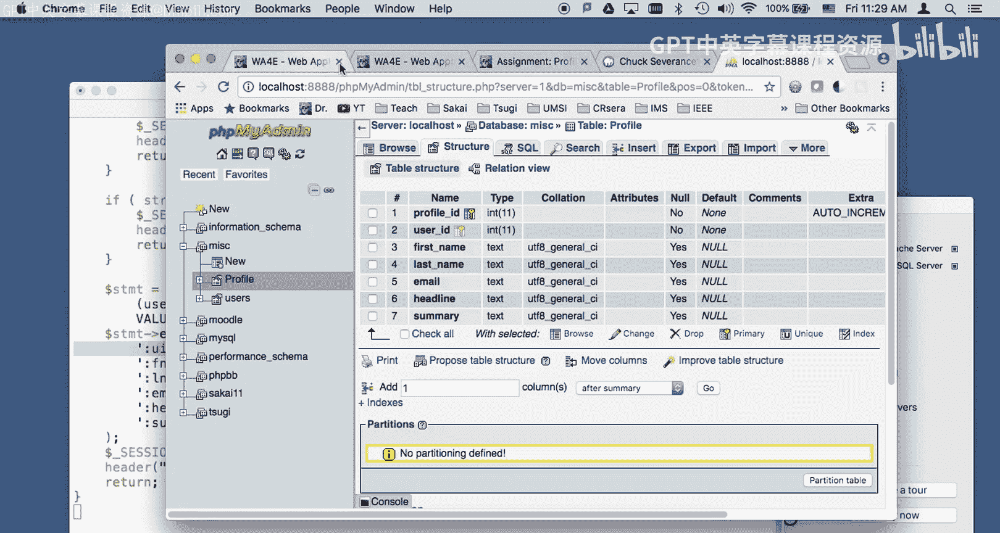

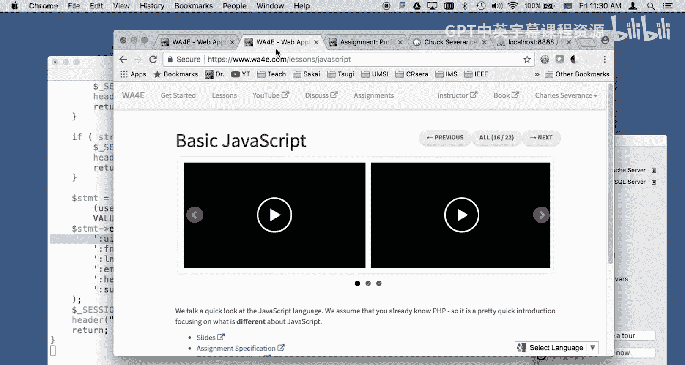

本节课中我们一起学习了如何构建一个包含JavaScript前端验证的个人资料管理应用。我们详细讲解了从数据库表结构设置、用户登录与会话管理，到实现CRUD操作并利用外键关联用户数据的过程。

请认真完成这个作业，花时间理解每一行代码。这是构建后续更复杂应用的唯一途径。祝你好运！