# 面向所有人的Web应用程序：第11章：在Windows 10上安装MAMP 🖥️

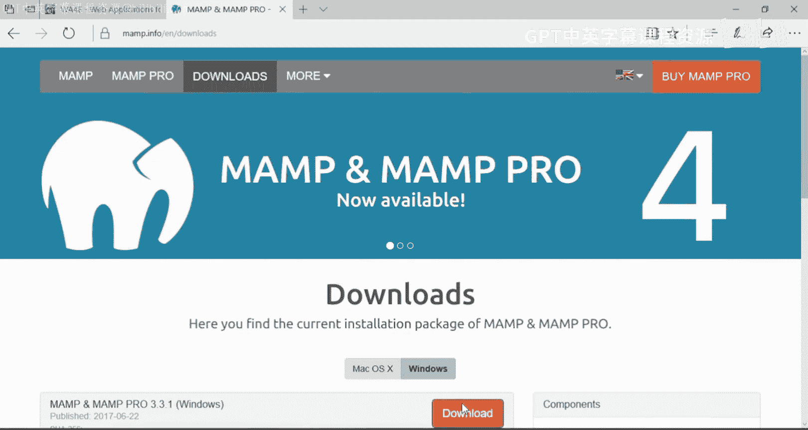


在本节课中，我们将学习如何在Windows 10操作系统上安装MAMP集成开发环境，并配置一个基础的PHP开发环境，以便开始编写和运行Web应用程序。

## 概述

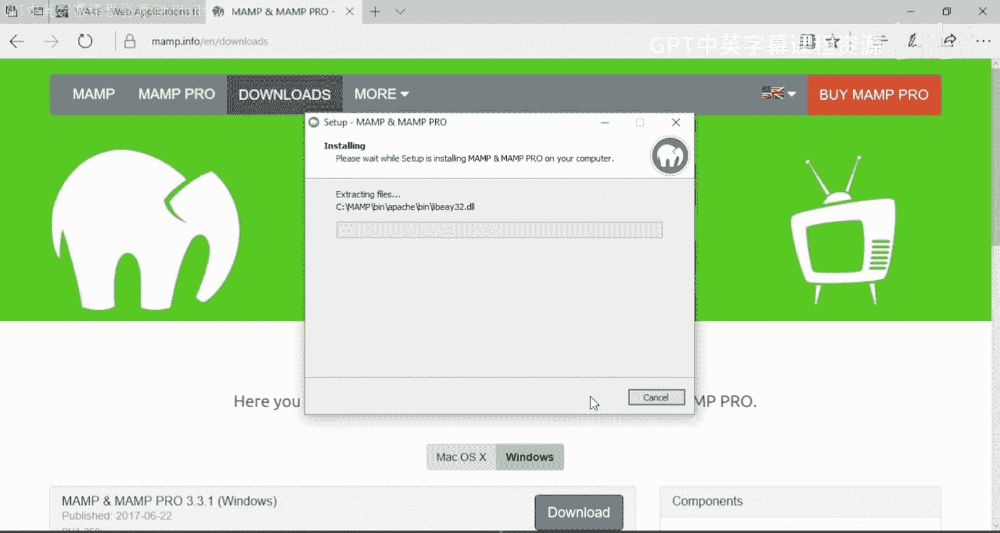

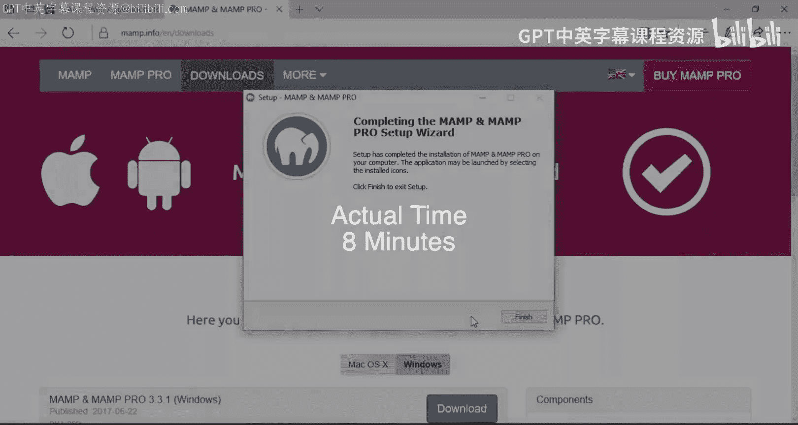

MAMP是一个集成了Apache服务器、MySQL数据库和PHP的软件包，它允许开发者在本地计算机上轻松搭建Web开发环境。本节教程将指导你完成MAMP的下载、安装、基本配置，并编写第一个PHP程序。

---

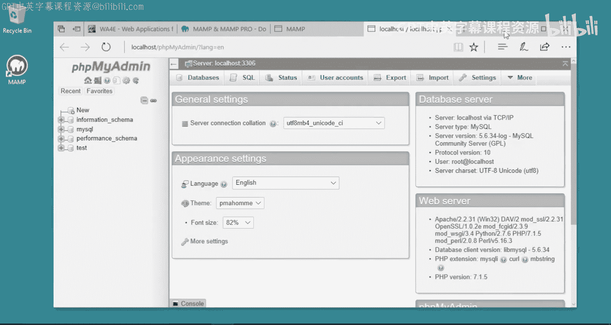

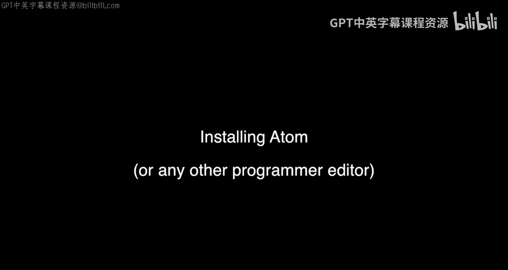

## 下载与安装MAMP

首先，我们需要从官方网站下载MAMP的Windows版本安装程序。

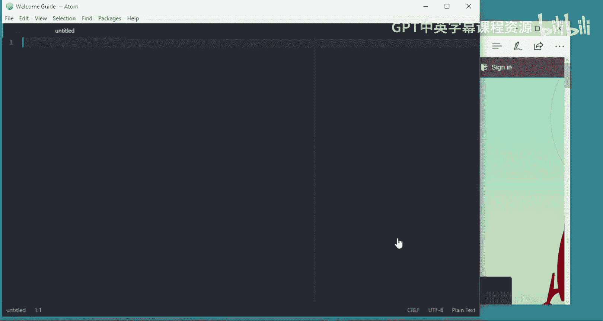

以下是下载和安装MAMP的步骤：
1.  访问MAMP官方网站并下载适用于Windows的安装程序。
2.  运行下载好的安装程序文件。
3.  在安装向导中，选择“English”作为安装语言，然后点击“Next”。
4.  在安装选项界面，取消勾选“安装MAMP PRO”的复选框，我们只需要安装免费的MAMP版本。
5.  阅读并接受软件许可协议。
6.  选择安装目录，建议使用默认路径 `C:\MAMP`。
7.  按照屏幕提示完成后续安装步骤，最后点击“Run”启动MAMP。

安装完成后，MAMP控制面板会自动启动。

## 启动服务器与验证安装

上一节我们完成了MAMP的安装，本节中我们来看看如何启动服务器并验证安装是否成功。

启动MAMP控制面板后，你需要启动Apache和MySQL服务器。

以下是启动和验证服务器的关键步骤：
1.  在MAMP控制面板中，点击“Start Servers”按钮来启动Apache和MySQL服务。
2.  当Windows防火墙弹出安全警报时，务必**允许**Apache HTTP Server和MySQL的通信请求。这是确保服务器能正常工作的关键步骤。
3.  服务器启动后（状态指示灯变为绿色），点击“Open Start Page”按钮，这将在浏览器中打开MAMP的欢迎页面。
4.  在欢迎页面，你可以点击链接查看“PHP Info”页面，它显示了当前PHP的详细配置信息。
5.  更重要的是，点击“phpMyAdmin”链接。如果能成功打开phpMyAdmin的登录或管理界面，如下图所示，则证明你的MySQL数据库服务和PHP环境均已成功安装并运行。


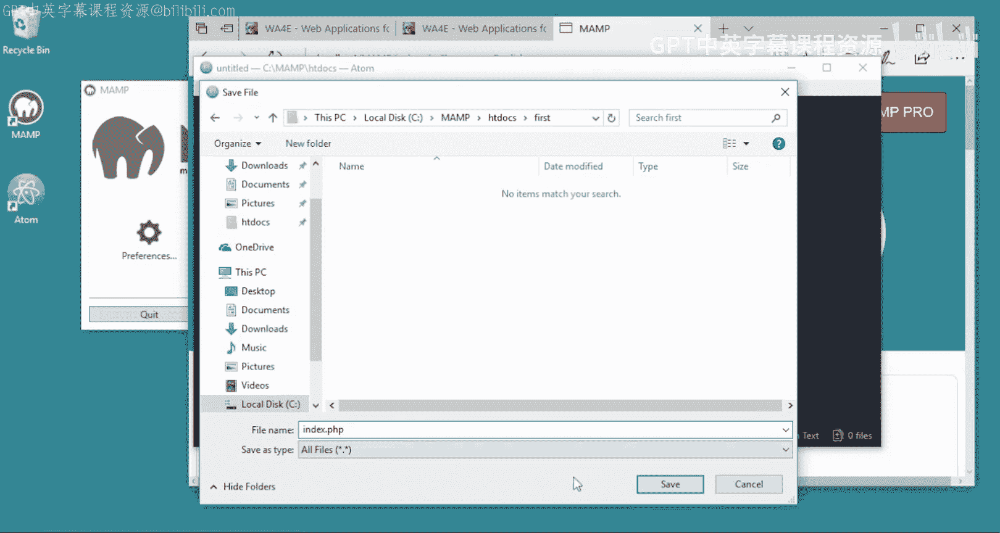

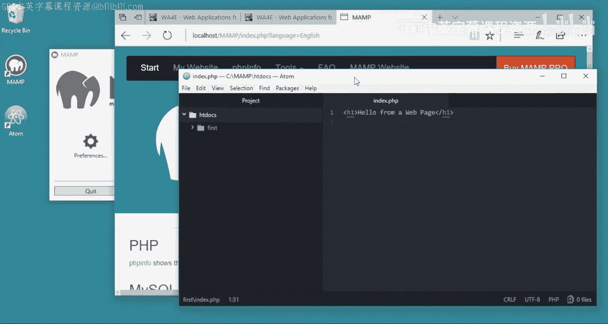

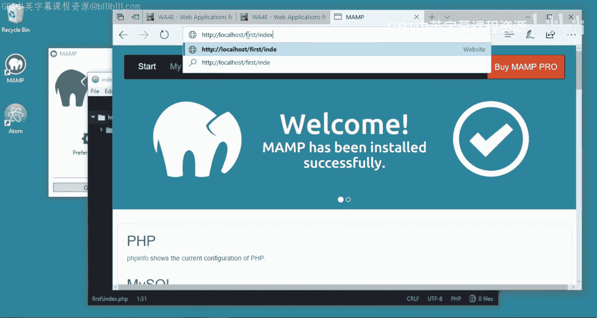

至此，恭喜你已成功安装MAMP。

## 安装代码编辑器（Atom）

为了编写代码，我们需要一个文本编辑器。虽然任何文本编辑器都可以，但强烈建议使用具备语法高亮等功能的专用代码编辑器，而不是记事本或Microsoft Word。

以下是安装Atom编辑器的步骤：
1.  访问Atom编辑器官网，下载Windows版本的安装程序。
2.  运行安装程序并按照向导完成安装。

安装完成后，你就可以使用Atom来编写PHP、HTML等代码文件了。

## 编写第一个PHP应用程序

现在，我们已经准备好了服务器环境和代码编辑器，可以开始编写第一个PHP程序了。

首先，确保MAMP中的Apache和MySQL服务器已经启动。然后，通过MAMP控制面板打开“Start Page”，以便获取Web根目录等重要信息。

Web服务器的文档根目录通常是 `C:\MAMP\htdocs\`。所有需要通过浏览器访问的网页文件都应放在这个目录或其子目录下。

以下是创建并运行第一个PHP文件的步骤：
1.  打开Atom编辑器，创建一个新文件。
2.  输入以下基础HTML和PHP代码：
    ```php
    <h1>Hello from a web page</h1>
    <?php
        echo "Hi there.\n";
    ?>
    <p>Some HTML paragraph.</p>
    ```
    代码说明：
    *   `<?php ... ?>` 标签用于嵌入PHP代码。
    *   `echo` 是一个PHP语句，用于输出文本。
    *   `\n` 是换行符，在HTML中显示为空格，但在查看网页源代码时会体现。
3.  将文件保存到Web根目录下的一个子文件夹中，例如 `C:\MAMP\htdocs\first\`。
4.  将文件命名为 `index.php`。`index.php`是一个特殊名称，当浏览器访问一个目录时，服务器会默认寻找并打开它。
5.  打开浏览器，访问地址：`http://localhost/first/index.php`。
6.  你将看到浏览器中显示了“Hello from a web page”的标题，以及由PHP代码输出的“Hi there.”文本。

这个例子演示了PHP的基本工作原理：服务器执行 `<?php ... ?>` 标签内的代码，并将执行结果（如`echo`输出的内容）嵌入到最终的HTML页面中，一起发送给浏览器。

## 配置PHP错误显示

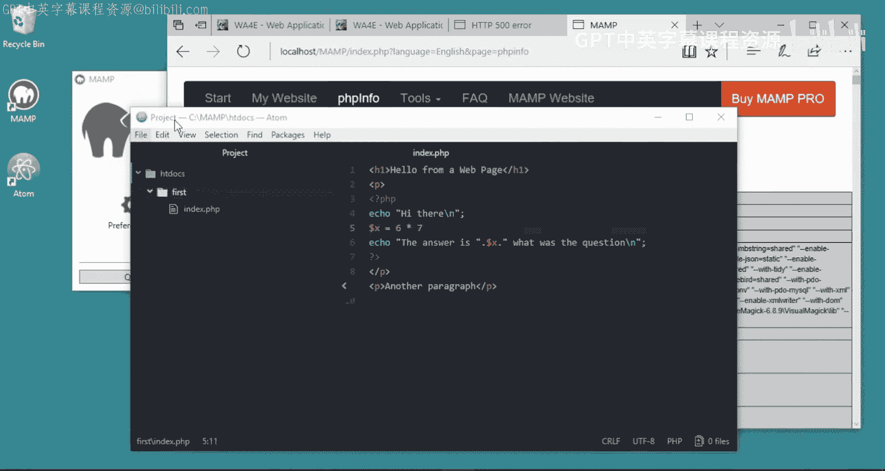

在开发过程中，看到详细的错误信息对于调试代码至关重要。然而，出于安全考虑，MAMP默认关闭了在网页上直接显示错误的功能。

上一节我们编写了简单的PHP代码，本节中我们来看看如何开启错误显示功能，以便在代码出错时能快速定位问题。

如果你在代码中制造一个语法错误（例如删除语句末尾的分号），刷新页面可能只会看到一个不明确的“500内部服务器错误”，这对调试没有帮助。

以下是启用PHP错误显示的步骤：
1.  通过MAMP的“Start Page”打开“PHP Info”页面。
2.  在页面中搜索“Loaded Configuration File”这一行，找到PHP配置文件（php.ini）的路径。例如：`C:\MAMP\conf\php7.1.5\php.ini`（版本号可能不同）。
3.  使用Atom或其他文本编辑器打开这个 `php.ini` 文件。
4.  在文件中搜索 `display_errors` 设置项。
5.  找到 `display_errors = Off` 这一行，将其修改为 `display_errors = On`。
6.  同时，可以将其附近的 `display_startup_errors = Off` 也修改为 `On`。
7.  保存对 `php.ini` 文件的修改。
8.  **重要**：由于修改了服务器配置，需要重启MAMP的Apache服务器才能使更改生效。在MAMP控制面板中，先点击“Stop Servers”，然后再点击“Start Servers”。
9.  服务器重启后，再次访问你的PHP页面。此时，如果代码中存在错误，页面上将会显示具体的错误类型、信息和出错行号，例如：`Parse error: syntax error, unexpected ‘echo’ (T_ECHO) in C:\MAMP\htdocs\first\index.php on line 6`。

根据明确的错误提示，你就可以快速回到代码中修正错误（例如补上缺失的分号）。在开发初期就启用此功能，可以节省大量调试时间。

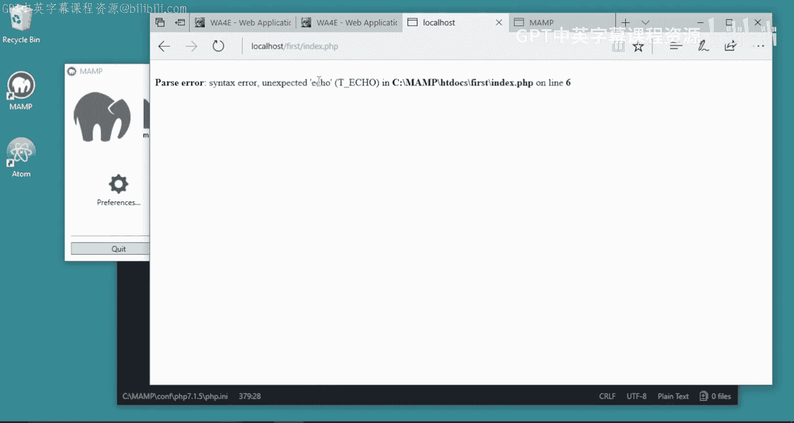

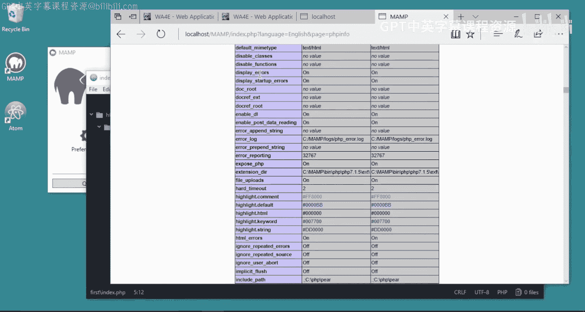

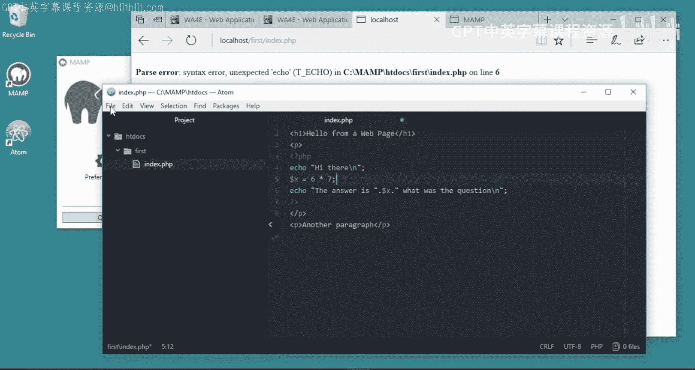

## 总结


本节课中我们一起学习了在Windows 10上搭建PHP开发环境的完整流程。我们首先下载并安装了MAMP集成环境，随后启动了Apache与MySQL服务器，并通过phpMyAdmin验证了安装成功。接着，我们安装了Atom代码编辑器，并在MAMP的Web根目录下创建了第一个PHP文件，理解了PHP代码如何与HTML结合并在服务器端执行。最后，我们完成了关键的一步：配置PHP的`php.ini`文件以开启错误显示功能，这能确保我们在开发过程中获得清晰的错误反馈，极大提高调试效率。现在，你的本地开发环境已经准备就绪，可以开始探索更复杂的Web应用程序开发了。