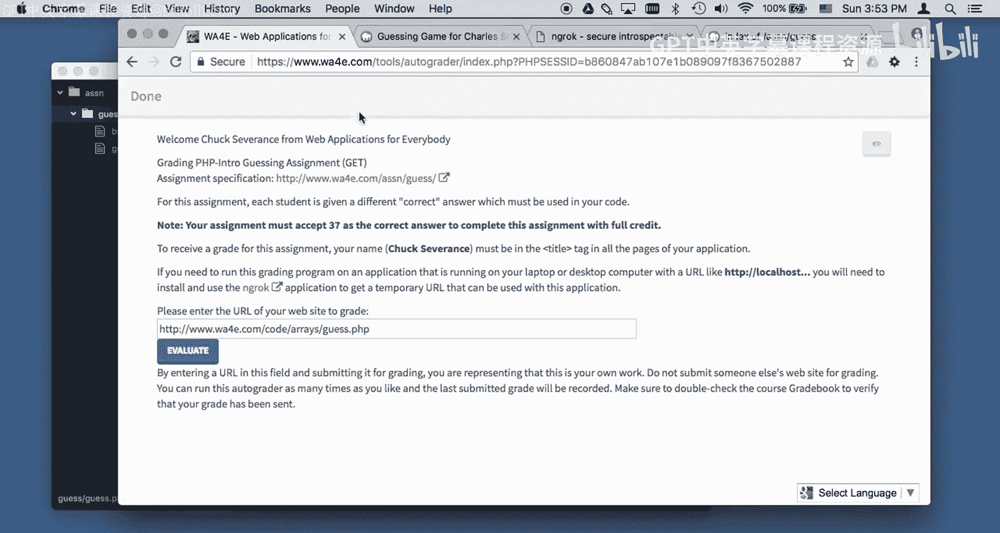
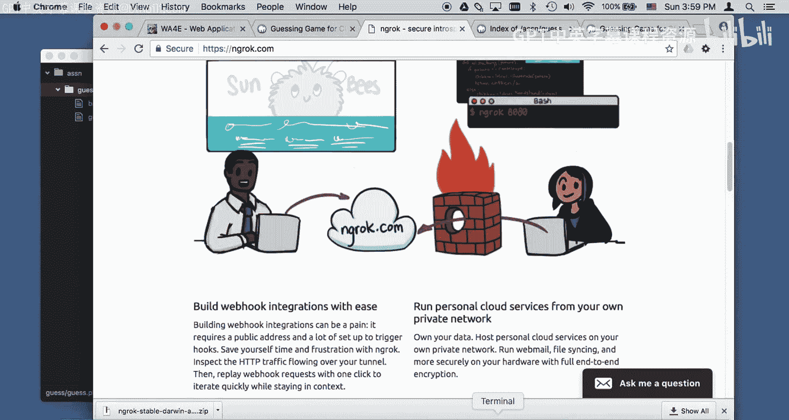
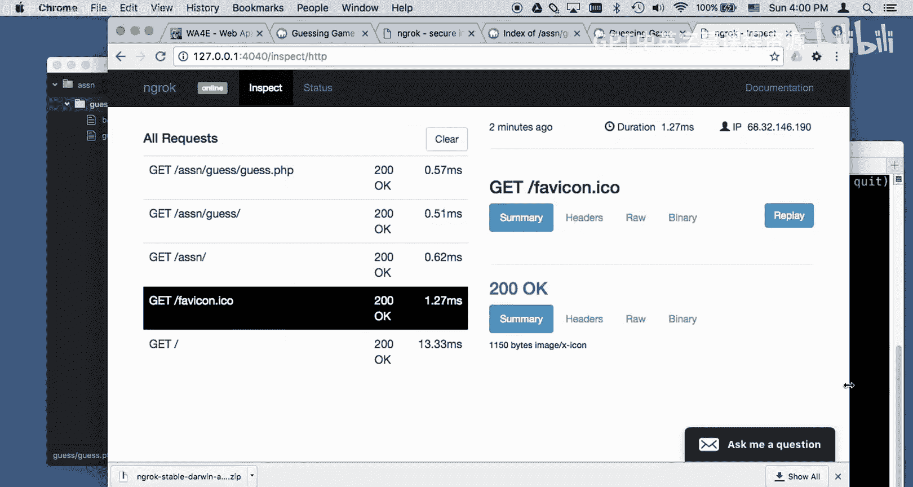
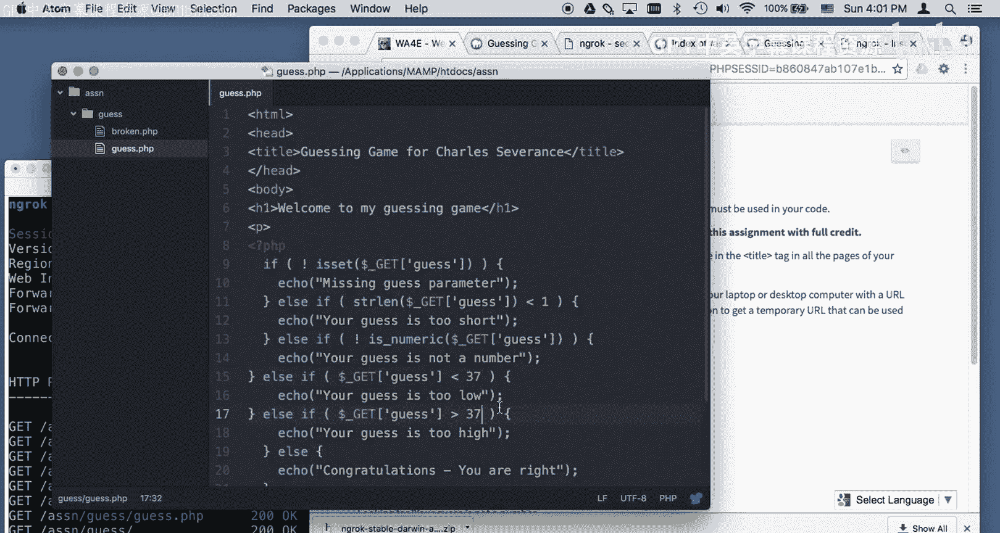
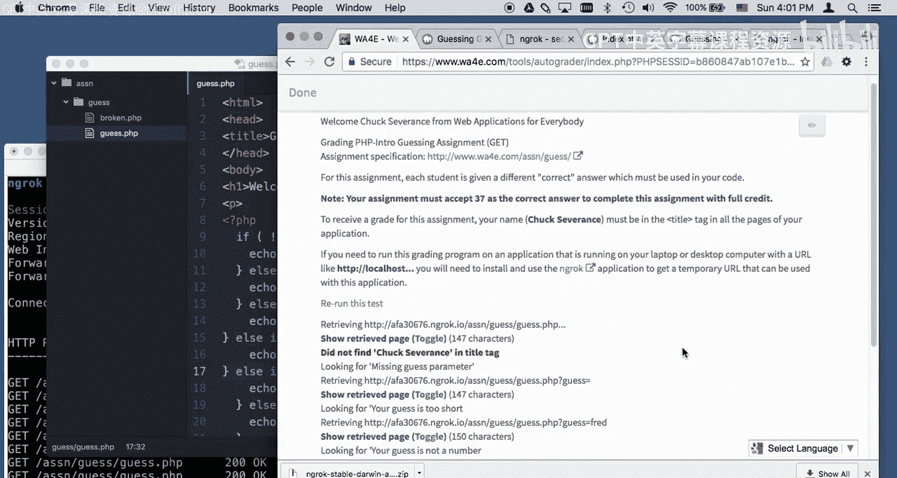
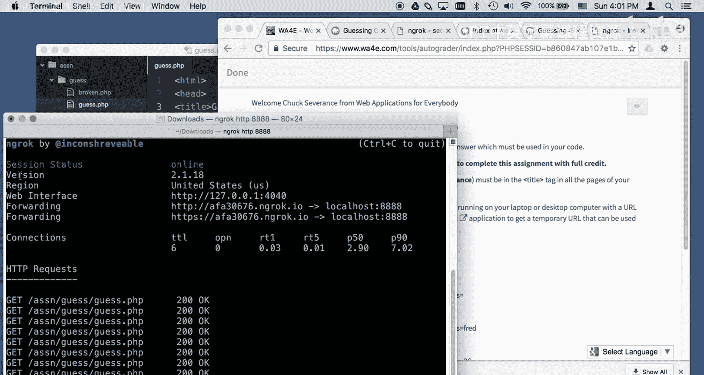
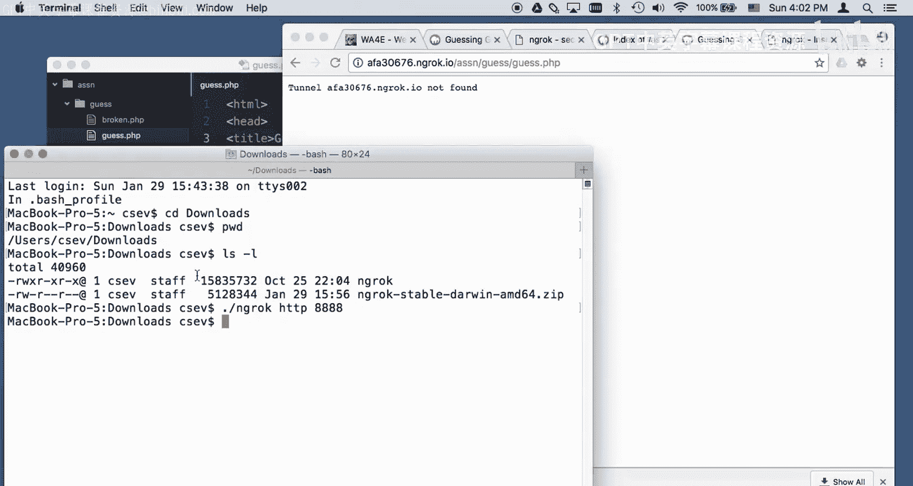
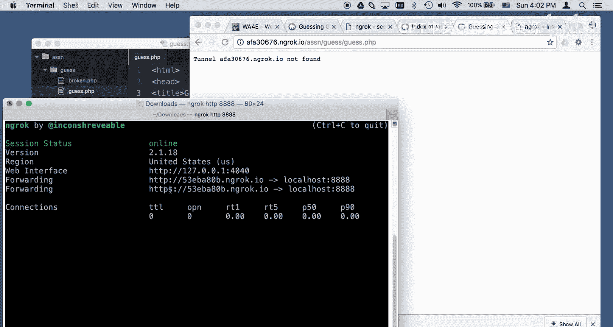
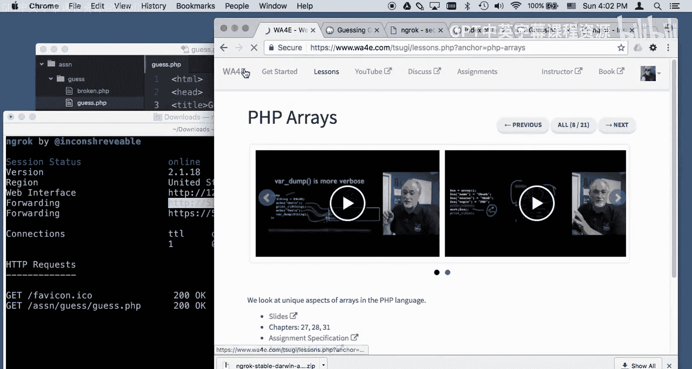

# 密歇根大学《面向所有人的Web应用程序（PHP、SQL、APP、JavaScript和JQuey｜Web Applications for Everybody》 p122 14_Macintosh系统使用Ngrok连接自动评分器.zh_en -BV1Lr421A75d_p122-

Hello and welcome to web applications for everybody today we're going to learn a little bit about NG。

EnGoc is a way that we can get our assignments autod and perhaps you are in the lesson where。

We're doing this grading of the guessing game， right we're grading the guessing game。

We have to put some code here and the problem here is that we have to have this code running on our laptop or our because this。

Server is on the real internet and it can't talk to your laptop。

And so what I've got is I've got some code running here and it's in my applications Ma， HD talks。

 ASSN， subga， subbroken dot PhP， and so I'm running Ma。

 so that code right there is the same as what I'm seeing here。

 and so if I type guess you know I can say guess equals 42。

Well， I get missing guess parameter and our guest equals 42， yay， I'm right， okay。So。😊。

The problem is， if I just take this URL and I put it in the guessing game， I mean。

 if I put it in the auto grader。This autograder is running out there in the internet somewhere and it can't connect to local host because your local host is not also on the internet。

 so we have to find a way so this is going to blow up really badly and it shows you something about the test when things blow up。

 sort of look from the bottom up and look for toggle。And this。It looks icky。 you have to read it。

 This looks like it might be like a bug， but it's not it is a。

It can't connect to port 808088 connect or refuse this URL。

 so don't just assume that the autograde is blown up sometimes the autograr like gets an error and it shows you what it is and it tried to retrieve your file and it couldn't so you know something went wrong okay so that's the problem we've got to get to the point where we can't use this local hostt URL but as I've said there is this wonderful piece of software called EnGoc。

And what Nro does basically， is makes it so that anyone on the real internet can talk to your laptop。

 So over here is where the server is。 This is where your map is。 This is you and your。

So you're running map over here。RightMamp over there and this is the autograder right here。

 the autograder cannot talk to your local host， it can't do that that doesn't work。

 but you can run a piece of software that effectively exports your local host to this place called NGoc。

 co and then the autograder can talk to that and I'm going to show you how to do that Now to get this to work you've got to download some software so let's do that。

Let's go to download。Now it's different from Mac and different from Windows。

 so I'm going to download it。And it's a pretty small piece of code and I'm going to put this in。

 it's going to be in my downloads folder。Where is the downloads folder。There's the downloads folder。

And it's a zip file， there might be different install processes for Windows。

 but you'll get to the get point where you have this Nro running。Okay， so。

So we have this running on localhos and we've downloaded Ncros。

 so what I've got to do is I've got to start a terminal window for command prompt if you're on Windows。

 and I have to get myself in that terminal window。I have got to go into that downloads folder。

And in Macintosh it's user downloads and I do an LS minus L and I can see that this NGoc is here。

 and this was the zip file， and I can start it by saying dot slash Ncro。

 it's important that I don't have to run Nrooc in the same as where my code's at because EnGoc is basically forwarding port 80。

80，88。4our8s to the web， so I'm just going to say dot slash andG。HtDP。

 we're going to fake the HV protocol and local host8888 port on this local host and if all goes well NGC is going to wake up and then it's going to tell you an address Now the key to this is that this address is only going to work while this NGC program is running a program is running now and forwarding all these connections so the thing to do and you'll get a different one of these every time。

And so if I go here and I go to Nrooc IO。You will see exactly what happens if you go to Local Host 8088。

All that stuff。 And my assignments are sitting here in assignments。 I can go to assignments。

 I can go into the guest folder， and now I'm here， except this URL is a real URL。

 This is URL that can run anywhere on the Internet。

This URL can only run on a browser that's2 on my computer sitting at my my local host。

 So now I can use this guest do PhP， and I can turn this into。Oops。The autograder。

 so I got to go back and I got to launch the autograder and give it this URL so now I'm going to say run this。

 this is a real URL anywhere on the internet， including where this auto grader is running from because this auto grader is really running somewhere on the internet。

So what happens is when I hit evaluate。We'll go back to。When I hit evaluate。

 this is going to connect to Enrooc and EnGoc is going to send data to your computer and the request response cycle is going to come back now interestingly。

 if you watch。

You can seek this happen here。And so you've seen I've already done some get requests and there's actually a little there's actually little monitor guy。

That I can put up over here 127，0。 That's another word for local host。

 And this is actually allows me to inspect。The data that's going back and forth。Here。

My autograr talks to Nrok En talks to your computer in a reverse way and you're watching this data that's going back and forth and that's what's going on here and here Okay。

 so both of these are talking so I'll just leave this let's make this a little more narrow now so you can kind of。

Let's put this maybe way over here。

So you can see it。Oops， made it too small I was not looking good， okay。Okay。

 we'll watch it over here。So now I am back where I'm going to do my evaluation。

 you can watch action happening over here。Now one of the things about this assignment depending on who you are gives you a different number and so that's why you've got to change this code so I'm supposed to make 37 be my correct answer to get full credit so I'm going to evaluate it and you can see it's talking see it it went talking didn't find Chuck severance and the title tag guess is too high now the key is is you're like oh what's wrong look at the toggle okay so it's like did not find Chuck severance in the title tag well oh that's because it's Charles severance okay looking for your guess is too high。

It says your guess is too low， you see it's always trying to tell you as much as it can。

 I'm not trying to make this tricky。Okay， and so the problem here is， is this code that I've got。

 that's guess code。

UmI's got 42 is the right answer， so I can fix my program by making。37 be the right answer。37，37。

 save。

Now I can rerun the test and I should pass that stuff。

And these errors went away， but Chuck Ss is still not in the title tag， so I changed that。

Check severance。And then yourun the test。And I got passed， okay， so there we go， everything is good。

 I don't know if that internal errors as probably because I'm an instructor。Yeah。

So there you go so that's the basic idea of how you run NGRAC and the way you finish this when you're all done with this is you just hit control C so remember this AFA 30 something okay。

 so I'm going to hit control C and now this URL ceases to work。

This one will blow up because I'm not there on the other side， so it doesn't find it。

If I run Enrock again， I start the tunnel back up， but you will notice I will get a different number。

5 E B something。 So， so this address no longer works， but this one does。

 So you can start and stop Enrock as many times as you want， but you sort of have to realize that。

Every time you start and stop it， you're going to get a new。

You're going to get a new address now you can actually pay money to them to get more permanent addresses。

 et cea， et cetera， but as long as you know how to switch back and forth and get the right address。

 it should be it should not be difficult whatsoever Okay and so there we go I hope this has helped you understand how to use NGoc so that you can do the send your assignments from your laptop web server all the way to the autograr on the internet。

