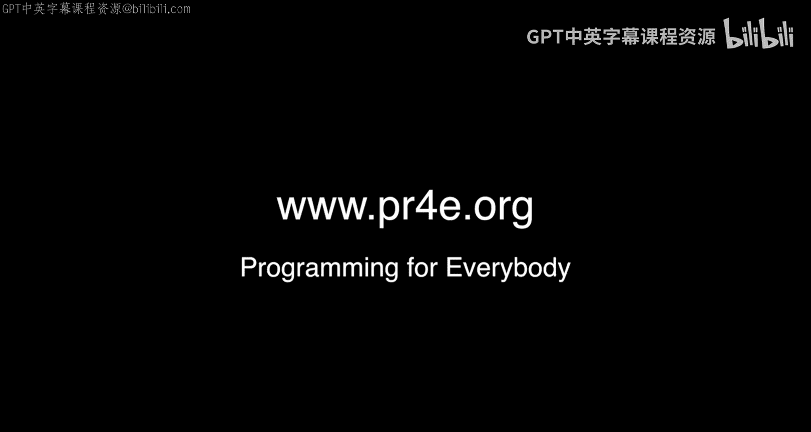

# 密歇根大学《面向所有人的Web应用程序》：附加办公时间：华盛顿州西雅图

## 概述
在本节附加办公时间中，我们将跟随课程团队，了解在西雅图举行的线下学员见面会。你将看到来自不同背景的学员分享他们的学习体验与目标。

---

大家好，欢迎来到24小时内的第二次办公时间。我们从波特兰驱车，在夜色中前往西雅图参加这次办公时间，因为我们致力于办好每一次学员交流活动。

我想向你们介绍一些你们的同学，并请他们向其余学员说几句话。那么，我们开始吧。请告诉我们你的名字，并对班级说些什么。

以下是学员们的自我介绍：

*   **An:** 大家好，我叫An，谢谢邀请我。学习“面向所有人的Python”专项课程很有趣。我希望每个人都享受这门课程。谢谢。
*   **Lee:** 大家好，我是Lee。西雅图很棒。你们所在的地方也很棒。
*   **Charles（教师）:** 是的，我们还没看到有人扔鱼呢。（*注：此处指西雅图派克市场著名的“飞鱼”表演*）
*   **Steph:** 大家好，我是Steph。编程让我感到非常快乐。编织也是一种编程，你们知道吗？随着你们教育的深入，会明白这一点。我是一名生态学家和教师，正尝试转向数据分析和报告工作，因为这样我可以同时运用我的统计学知识和教学技能。这正是我们做这些事的目的。
*   **Tony:** 大家好，我是Tony。我喜欢Python课程，教授也很聪明。我希望每个人都享受这门课程。谢谢。我也喜欢Python课程。😊
*   **Nicole:** 大家好，我是Nicole。请继续学习Python，并加入我，成为一名数据分析师。我分析的是IP协议数据，也就是网络数据。很酷。
*   **Joanna:** 大家好，我是Joanna。永远不要放弃，并且在你自己钻研问题15分钟后，一定要寻求帮助。
*   **Sha:** 大家好，我是Sha。我在Expedia做数据分析，喜欢处理Expedia的旅行数据。我喜欢Python课程，因为它帮助我的女朋友学习了编程。
*   **William:** 大家好，我是William。我正在学习“面向所有人的Python”课程，直到上了这门课，我才意识到自己之前对字典（`dictionary`）的操作掌握得如此糟糕。欢迎你。

以上就是学员们的分享。

我们下一次计划举办的办公时间将在英格兰的布莱切利公园。届时我会提前发布详细通知。通常我不会提前太多通知，但像布莱切利公园这样的活动，我会提前几周通知，以便大家安排行程。

那么，我们网络上再见。

---

## 总结
本节课中，我们一起了解了西雅图办公时间的现场情况，聆听了多位学员的学习心得与职业目标。从教师到数据分析师，从生态学家到网络工程师，大家因编程而相聚，分享着学习Python的乐趣与挑战。记住，学习路上永不孤单，适时寻求帮助是进步的关键。我们下次活动再见。