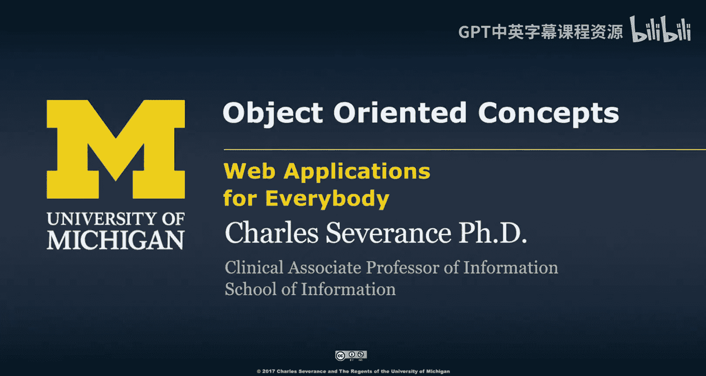
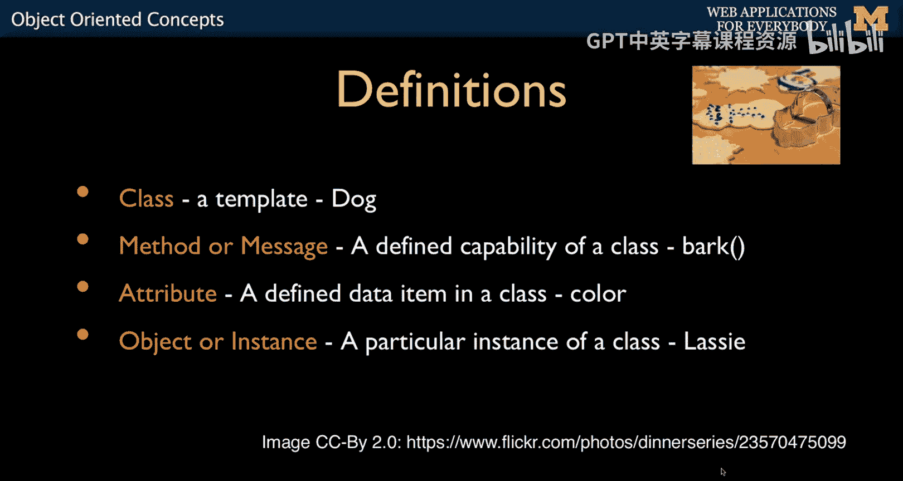
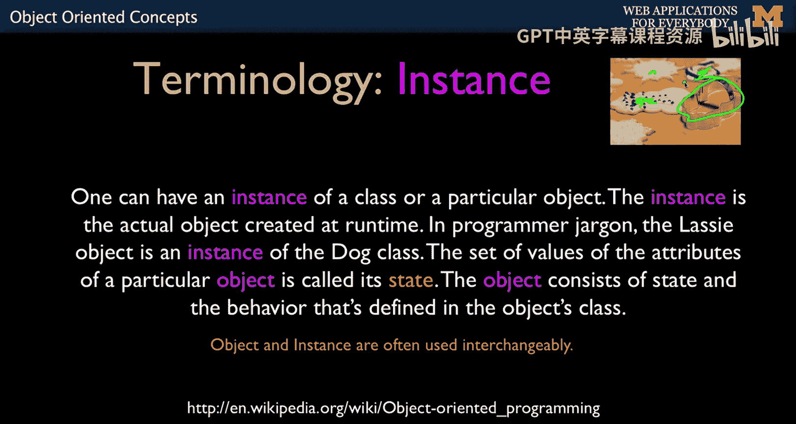
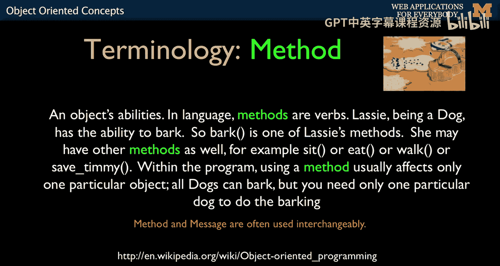
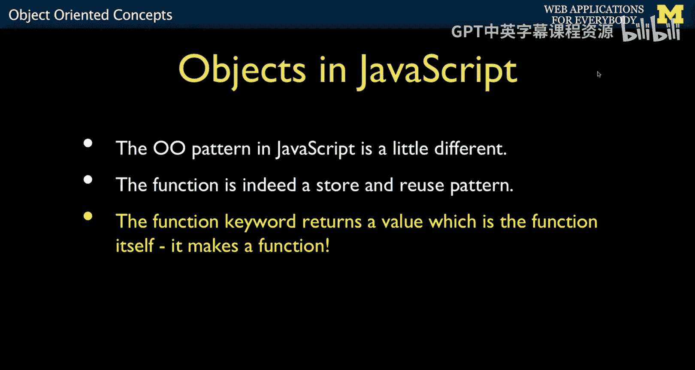
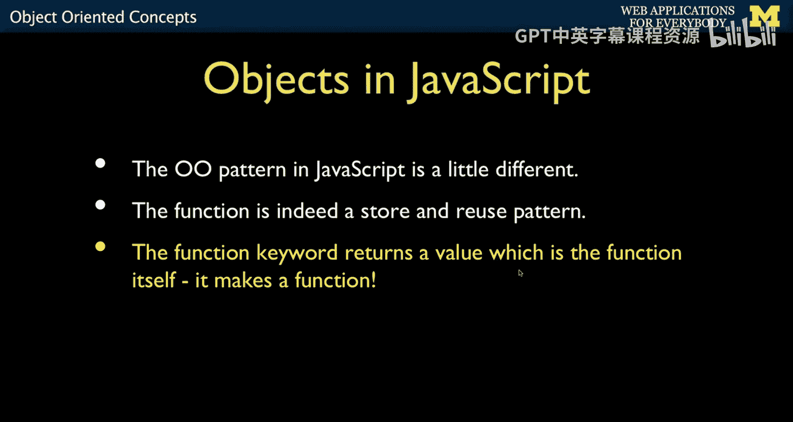
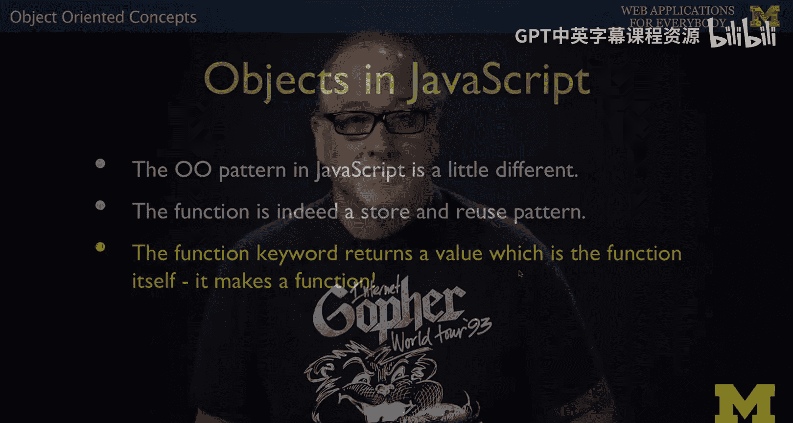
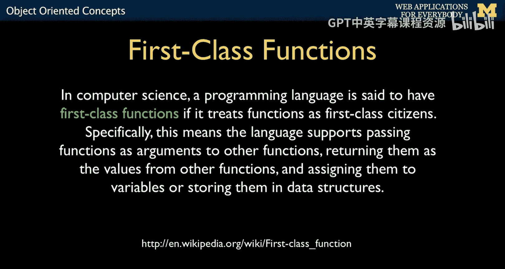

# 面向所有人的Web应用程序：125：JavaScript面向对象概念 🧩




在本节课中，我们将要学习JavaScript中的面向对象编程概念。如果你已经学习过Python或PHP的面向对象编程，你会发现核心思想是相通的。本节将介绍类、实例、方法等基本概念，并重点解释JavaScript实现面向对象的独特方式——通过“一等函数”。

## 概述：面向对象的核心思想

上一节我们介绍了JavaScript的基础知识，本节中我们来看看面向对象编程在JavaScript中的体现。

面向对象编程的核心思想在所有语言中都是相似的。其基本概念是存在一个称为“类”的模板。在类中，我们定义称为“方法”或“消息”的代码，以及称为“属性”的数据。然后，我们使用这个模板（好比饼干模具）来制作出具体的“饼干”。这些具体的“饼干”，即实物而非形状，被称为“对象”或“实例”。




这就是所有面向对象模式的共通之处。因此，在多种语言中学习面向对象编程尤其有益，因为你会意识到：“哦，是的，这只是语法上的一点不同。”


## 类与实例 🍪

就像在所有面向对象概念中一样，**类**是一个模板，它定义了共享的特征，是一个蓝图。例如，“狗”是一个通用概念，所有狗共享品种、毛色等特征。

**实例**是我们根据模板“印刻”出来的具体事物。在我们的饼干模型中，所有的饼干都是实例。你会注意到有些饼干以一种方式装饰，有些以另一种方式装饰，但它们最终都源自同一个模板。



“实例”的另一个常用词是“对象”。所以，“类与对象”或“类与实例”是等价的。我认为“实例”更能捕捉这个想法，因为你可以从一个类创建多个实例（对象）。

## 方法与对象内部结构 ⚙️


对象有点像程序中的一个小程序。程序内部有一些数据结构，代码则操作这些数据结构来解决问题。解决问题是构建巧妙的数据结构和编写巧妙利用这些数据的代码的结合。有时你把更多的巧思放在数据结构中，有时则全部放在代码中。因此，在使用数据结构和代码实现目标之间存在一种平衡。

对象内部也是如此。程序是大的，而对象就像它自己独立的小空间，里面有代码和数据。

**方法**是存在于类（以及我们创建的对象）内部的函数。它是我们与对象交互、从中获取信息等方式的体现。



## JavaScript的独特之处：一等函数 🎯


上一节我们介绍了类与实例的基本关系，本节中我们来看看JavaScript实现面向对象的独特方式。



JavaScript中的面向对象模式有所不同。它更像是一种“存储与复用”的模式。JavaScript核心中的函数既相同又不同。

`function` 关键字本身是可执行的，并且它有一个返回值。通常你认为 `function blah() { ... }` 只是创建了一个名为 `blah` 的新东西。但在JavaScript中，这个函数语句本身是一个可执行语句。


因此，你可以这样写：
```javascript
x = function() { blah blah blah };
```
关键是，这定义了一个函数。如果我们将其命名为 `y`，它就定义了一个函数，但同时它也返回该函数的代码，以便你可以将其放入一个变量中。这非常酷。这是一种非常不同的思考函数的方式。





我最初用Fortran编程，我们称它们为“子程序”，后来也称为函数。你说“子程序”，它就是在命名一个东西并进行存储和检索，是纯粹的“存储与复用”。

在JavaScript中，它也是“存储与复用”，但你还能从中获得一个返回值。这正是我们用来进行面向对象编程的东西。

这在计算机科学中被称为**一等函数**。这意味着函数本身就是数据，代码和数据更加等价。“一等函数”意味着你可以获取某段代码，将其赋值给一个变量，并携带这段代码。这是JavaScript中一个根本性的架构概念，它深刻地改变了你在JavaScript中的编码方式。

正如我之前所说，JavaScript不适合作为你的第一门编程语言来学习，但作为第四门语言来学习则非常棒，因为你会惊叹：“哇，我能理解这种东西了！”因为如果我刚开始就把函数赋值给变量，你可能会困惑：“不，我不理解。”我热爱将Python作为第一门编程语言。

## 总结与预告 📝




本节课中我们一起学习了JavaScript面向对象编程的基本概念。我们回顾了类、实例和方法的通用定义，并重点探讨了JavaScript通过“一等函数”实现面向对象的独特机制。这种机制允许函数像数据一样被赋值和传递，为JavaScript的面向对象模式奠定了基础。


接下来，我们将运用所有这些理念，编写一些示例代码，具体看看对象在JavaScript中是如何工作的。