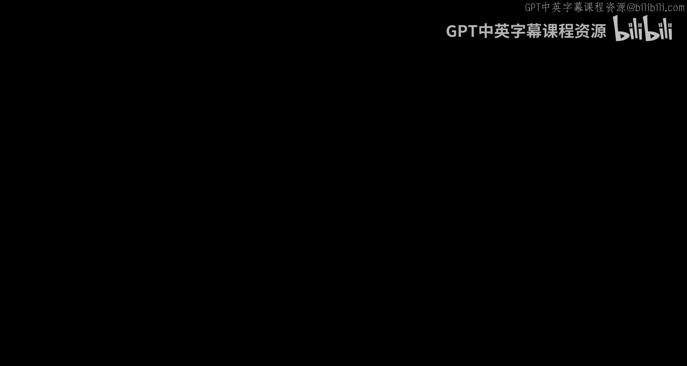
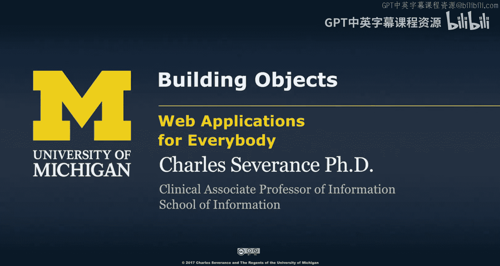
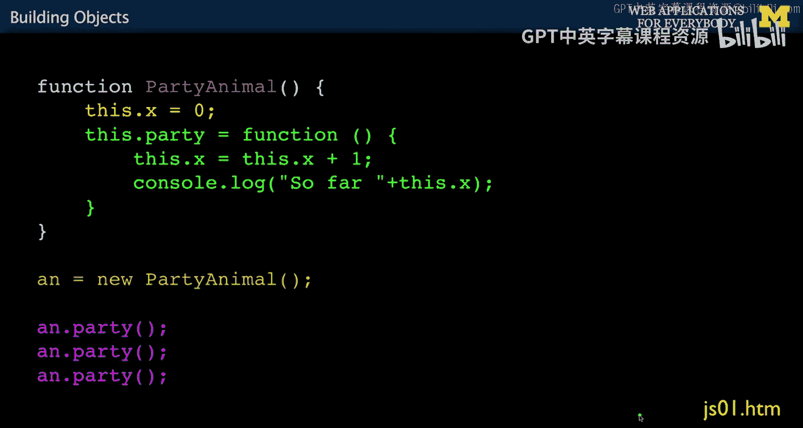
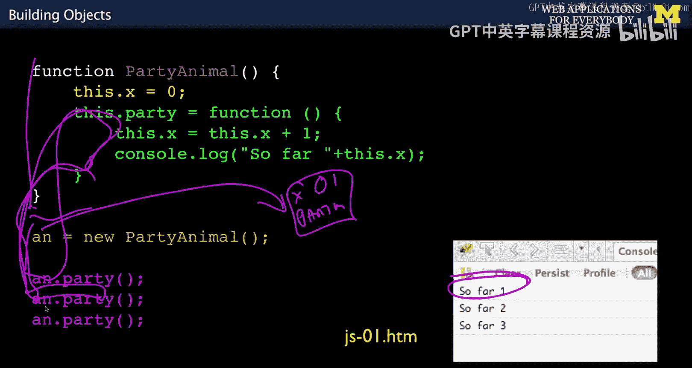
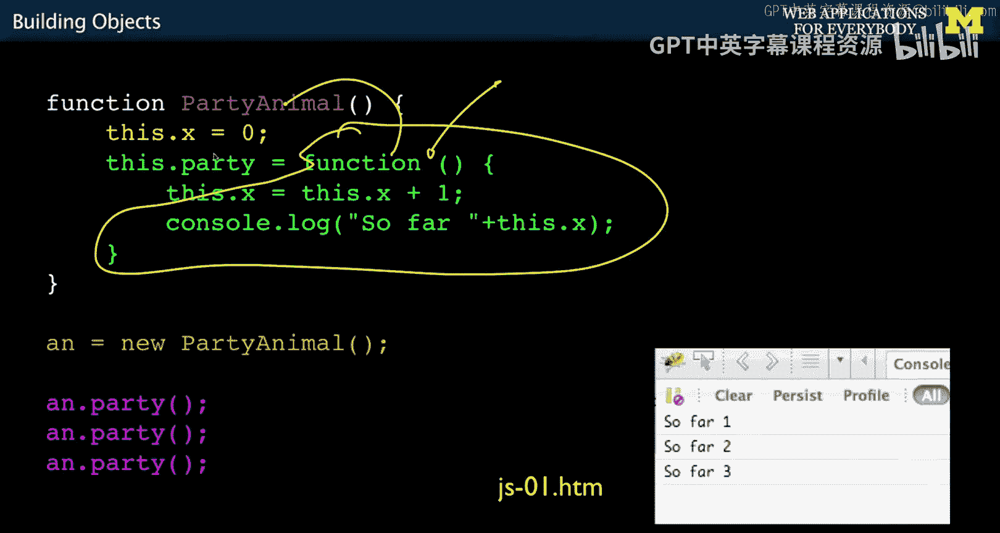
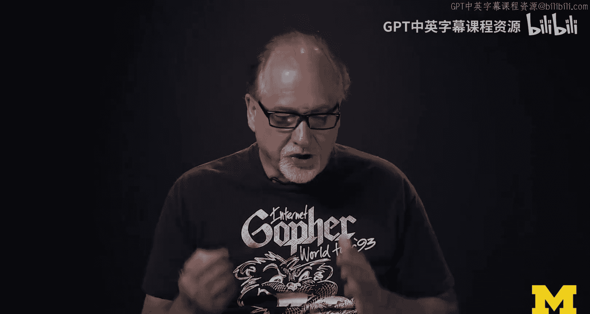
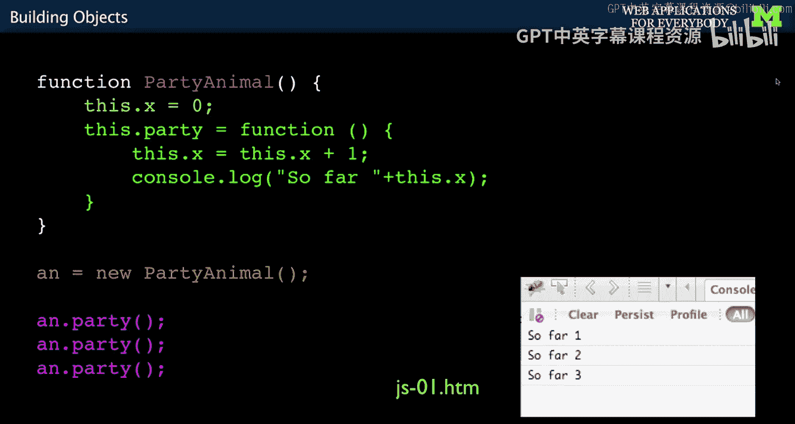

# 密歇根大学《面向所有人的Web应用程序（PHP、SQL、APP、JavaScript和JQuey｜Web Applications for Everybody》 p126 18_JavaScript对象构建.zh_en -BV1Lr421A75d_p126-

So before we start going through jascript sample code for objects。

 I want to talk a little bit about this shirt。 This shirt for those of you don't know。

 is a gopher shirt。 This shirt was made in 1992。 And so it's a rare commodity。

 So for those of you don't know。We have this thing called the Worldwideide Web。

 and it's HttP yada yada。 Worldwide Web was invented in 1980， and Gopher was invented in 1980。

 and Gopher was invented by Mark McKayhill at the University of Minnesota。

 And Gopher was really popular until about 1993，94。 and all of a sudden， the Web took off。

 And so Gophers like the forgotten web like technology。

 But the key thing about Gopher is that we might not have the web if it weren't for Gopher。

 So for a while， the web in Gopher competed。 and the gopher was winning。

 and then the web had to get better and better and better。 And then at some point。

 the web became the thing。So why do I tell you this well。

In this class I teach you a lot of basic things， I teach you basic JavaScript， I teach you basic PhP。

 I teach you basic SQL， and you might be sitting there thinking。

How come you're not teaching me something fancy like Ruby on Rails or Angular or something really cool。

And the answer is the basics are way far more important than the fancy stuff because once you know the basics。

 the fancy stuff can happen and so just like Gopher is not what you use to surf the web today。

 PhP and basic JavaScript might not be how you write web applications going forward。

 but you will come back to all the basics， and you will appreciate all the basics okay。Enough。

 enough enough enough。 But classics， the classics matter。

 and just because it isn't the thing that you ultimately use doesn't mean that it didn't contribute profoundly to your understanding。

Back to JavaScript and object orientation。So this is a beautiful piece of code right here。

So we don't have a keyword called class。

So every other language that we've looked at so far has a keyword class which just says we're starting an object。

 That's not how it works。 We are in effect using additional features of functions to implement the object oriented pattern okay and so。

We just say function。 This is creating a named function。And then in this function。

Every time we create it， we're going to get a new instance of it。

 so remember the class is the template。The instance is this instance that we have。And in it。

 we're going to have data and code。And like。Virtually all object oriented patterns when you have multiple instances and you're in the code of the class。

 you have to have a this。That points to whichever of the instances you're currently working on。

 and we'll talk about that more in a second。And so when this function starts。

 when you call it with this new， and so the new， this is a keyword。

 says let's take the party animal template and let's make a new instance of it。

 let's make a second one。You know， we could actually call this function。

 but it doesn't work the same way。 So we say new and it says， oh， let's make a copy of this。

And now we got one of these things， and then we're actually going to run it。

So it's going to come in here， and this。Is pointing to it。 And so this dot x。

 the dot is the object running operator in in most languages。 Again。

 that's kind of a C structure influence。 This dot x basically says。

 let's make a variable name X and stick that in there。 and let's put a 0 in there。

 And that's how you put attribute。 So that seems， that seems instinctive enough。

But this next set of code， this dot party means we're going to make a function a method。

Inside of this object， and it's going to have code in it。

 this is the first class function bit and I probably should use a different color。

This is a function definition。And you'll know there's no name here。So。I need an eraser， too。

 There's no name。 There could be function。 Bob could be function， Sarah， whatever， but it's not。

 It's an anonymous function because really， the name of the function is going to be under party。

 So we got this object with excellent and party in it。And inside that is all this code。

X has a zero in it。 This has code。 And again， the this is pointing at whichever one we're talking about。

 And so we can look at the member variables， the instance variables at that same time。

 And so within here， we can see the x that belongs to our current thing。

 and we're going to add one to it， and then we're going to print it out。Okay， and so。

What happens is now this just creates a template， it doesn't really run code， it makes the template。

 and so by calling new party animal， it's not just party animal， it's making the function code。

 making a copy of this。Making a copy of all that code。

And then setting it up with X and party inside of it。And then。Storing it in AN。

 So AN is now a pointer to this instance。Or object。

And now we're going to call a and party once twice three times。

 which means we're going to call party within this， not this one， but within this instance。

 call the party， and that's going to increment one。We said all that stuff。So if this runs。

It's going to define the template。Create the object。A points at the object。

 it's going to have an excellent party inside of it。Now it runs down here， calls party。

 which means it runs this， so this x goes from 0 to 1 and then prints it out， so it prints that out。

 then it comes back down here， does it again， then does this again， and now comes so far two and 3。

So that's the basic mechanism。 And and again， sort of the real beauty of this。

Is this notion here of anonymous functions and the fact that this can be made an assignment statement into that variable。

 That's cool。 You can do this whole concept of taking function code and assigning into variables outside of objects as well。

 That just means that the function keyword， whether it's here or here can return the code that makes up the function。

And we name it by sticking it in a variable。 That's， it's just so pretty。

 And so all other languages like。Python in Java， they sort of create this additional structure whereas all they did。

 all Brendan Ike did in Java was said functions are going to be first class citizens with they're just data and where you go。

 and this is inspired by things like small talk。And list。

This kind of equivalence between data and code comes from the sort of the more pure side of00。

 So there's kind of2，2，00 things。 There's sort of like this pure one。

And then there's kind of like a bunch of syntactic craft。Hate to say Python， PhP。

 and Java and C+ Ps are on the craft thing and small talk Lisp and JavaScript。Of all things。

 cruddy little jascript， little thing that we just do to make fun stuff happen in the browser has kind of like the more pure and more beautiful object orient pattern。

 And again， that's why it's a great language to eventually learn。

 But only when you are ready to understand it。😊。

Okay， so the next thing I want to talk about is sort of this object life cycle and then more than one instance and how that all works。

