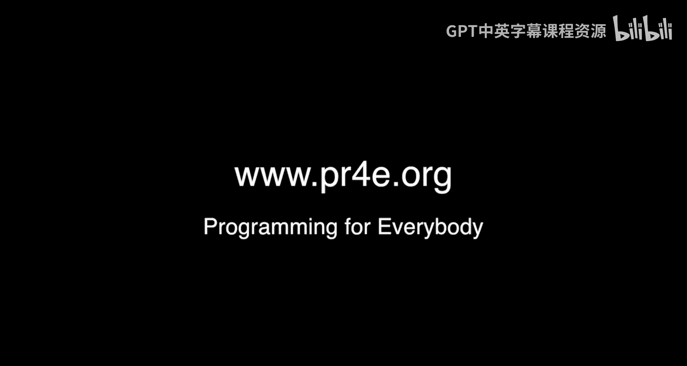

# 密歇根大学《面向所有人的Web应用程序（PHP、SQL、APP、JavaScript和JQuey｜Web Applications for Everybody》 p128 20_附加办公时间：韩国首尔.zh_en -BV1Lr421A75d_p128-

🎼，Hi there。I'm on the way to office hours in Seoul Korea and like always when I'm on the way to office hours。

 I have no idea how many people I'm going to see， I have no idea if I'm going to see。

One person or zero people。Or 20 people， but that's part of the fun of it。

It's like a blank date with 700，000 people。We'll see what happens nextHello everybody here we are at yet another office hours it's a gigantic office hours we are here in Seoul Korea。

 we are a short distance from the statue of the crossed arms ofsi celebrating the Gm style video that apparently is really important and so they made a statue about it so like always I want to introduce you to your fellow classmates and let them say hi and whatever else they want to say but it'll take a little while because we got a whole bunch of people Okay so let's start with you okay ready so so go ahead my name is I say is short this for a real post。

So were ahead to you are studying Python Okay thank you and your name Hi I'm Shelby I actually studied creative writing so this isn't in my focus but I'm interested in linguistics so I took the Python course and I've taken like was it three of them since this summer I just have a lot of time Well we got you addicted right Yeah and you probably agree with the part that it's like writing but it's different Yeah I like all sorts of things of writing and languages for me that's what that's the example I use in the beginning。

i hellello， my name is Shiino。IActually， I just followed her Shelby。

But I'm really thinking of taking this course a Python， which is really great。Computer language and。

Also your class seems really great also too cool so yeah， thank you。

🎼introduce yourself hi my name is Victor Lee， I translate Pson Pomes in Korea and I today I oh oh。

 let's grab a copy of the book so we can show the book。Hgan。Your， you break everything， Okay。

 so come back。🎼小熊。Signed by Victor and signed by Chuck。

And we're going to have a big round of applause for Victor。So Victor I。I'm terrible at selfieies。

 but I really appreciate everything that you've done translating this into Korean for us all today。

As you got the assignment to translated in Python Python3 book again so tell everyone how much I paid you to translate this into Python 2。

I paid you one beer。We paid you one beer， I'll pay you like on a couple more beers to translate into Pthon three no we've graciously appreciate it and part of this whole thing is everybody gives something and Victor has given us something and so we thank you so much okay you。

🎼Hi， my name。 my name is Su Yuin and。🎼H song is very interesting language。🎼I use stay free and。

🎼Tctorry every day， so nice to meet you， and thank you very much。 Thank you。😊，🎼Hi。

 I'm Johnong Gsong and I'm pleased to meet that here and I feel like I'm meeting a celebrity。😊。

Well I'm happy I been already seen display in a laptop， so it was a great time to see。

🎼Him thanks thank you you Hi my name is Chong Min and have fun with your courses Thank you。Hello。

 I'm Honalo from Brazil， I love Python， I love learning。

 and I'm on vacation here in Seoul with my fiance， Priscilla， I Prisilla。

It was a very happy coincidence the the office hours， its right now。

In September I did an office hours in Las Vegas and no one that came to office hours was from Las Vegas everyone everyone who was at the office hours was on vacation in Las Vegas Hi I'm Amber I just started Python for everyone Oh it's great to join everyone Okay。

 welcome to the course You'll stay we are going to like having you round。Hi I'm Joine。

 I'm good to see you in Korea at D Cha。😊，Have and I just want to thank you for making sure everybody got beer。

You did all the translation to make sure that we got all the orders that we needed thank you hi I'm Yo and I've really enjoyed Dr。

 C's courses and I'm so happy to be here Great Hi I'm Shiang and I started Python programming with his course and now I'm working at a laboratory programming about bioinformatic algorithm and I couldn't even imagine what I'm doing without his course so I really really Yes really。

So I really want to appreciate about。What were you doing before？

I was just studying about life science。🎼Oh， yes， then I。Learn Python programming with your course。

 and now I became a beginning programmer。Yeah。😊，So congratulations， I really wanted to thank you。

 Thank you very much。 So you're not alone， and I really want to。😊。

Be with you and welcome to the course。Hi。I'm Hang and it is so awesome to be in class meeting video。

Drctor Cho is my first programming teacher and Python is my first programming language and I really appreciate it Well welcome to being a programmer thank you。

I am Michelle originally from Chicago but I started working in Korea with finance and I used to study like garden sets before but we actually used Python in finance too and it was such a great language and yesterday I got this email and I was like ohly shit what to。

Yeah， it was nice that's how it always works， it's very random。

No predicting when I'm going to be somewhere。Hi， my name is Huen。

 I'm register for upcoming courses I'm so motivating because I'm here。

 I can't wait to watch my own face on courseair to see。Hi。

 my name is C Lee about two years ago I started this course in Python programming and in that time I had no I was zero based on programming。

 but now I became a developer， become a developer and I really loved teaching Python programming to girls and I am also one of the Jego Garal organizer this is my beautiful maco。

Jjainggo girls in Korea you just had an event of helping people。50 participants，50 people mostly。

 and we want to inspire more women in programming world。

And so you went from not being a programmer at all to inspiring other women to be programmers throughjango girls Okay now I want my sticker back。

I'm going to put this sticker on my laptop， and so you'll see future recordings we'll have a picture of Django Girl from Seul on my laptop。

Thank you hi， I'm Hassan and I'm living in Korea for a long time。

🎼Actually I speak Python So that's very simple。 Yeah so for my office work。

 I use other languages but in my free time I just use Python and whenever someone talks with me and wants to learn programming language I just to install Python and just start with your course so yeah very like I'm really happy to meet you because I finished this course in 2014 and I waited two years to meet you and yeah thank you very much。

 Well thank you So what a fun time we've been here for about an hour and had some drinks and and we almost got kicked out but then we reorganized the room so we didn't get kicked out I don't know where the next office hours is it might be like in Phoenix or Chicago I've had two office hours in Chicago So I don't know where the next one will be but I'll let you know as as soon as I figured out cheers。

🎼Okay。🎼。

