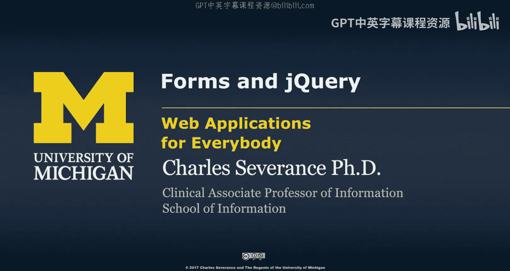
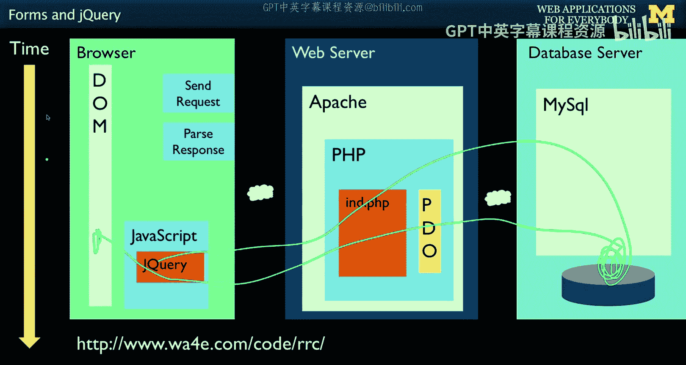
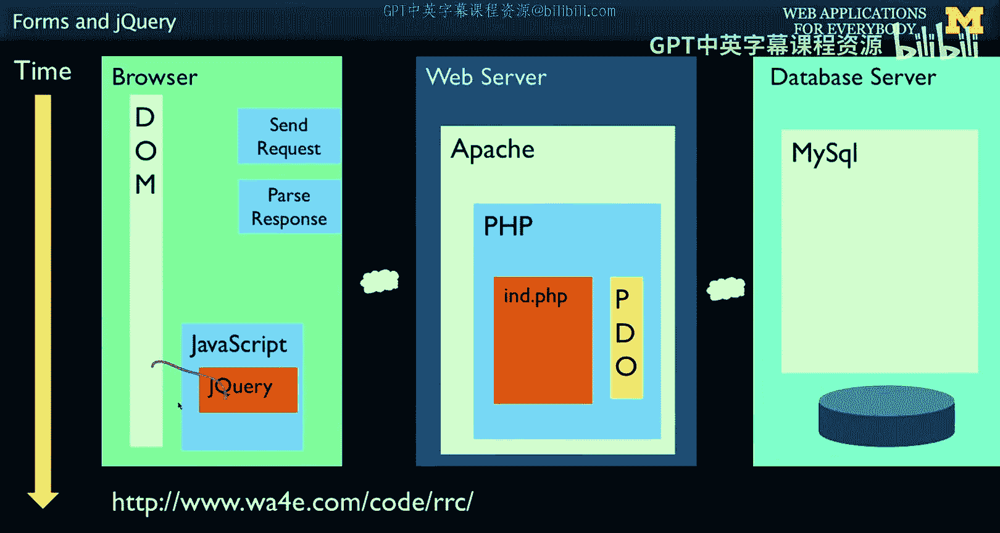
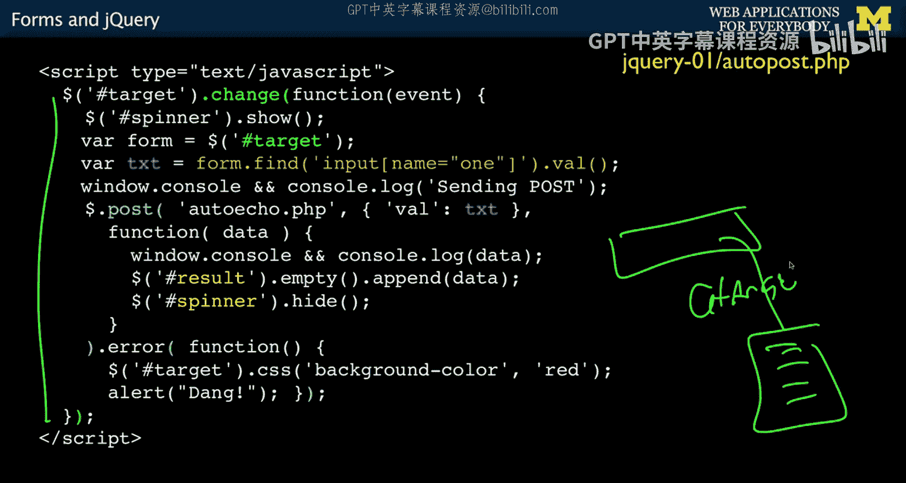
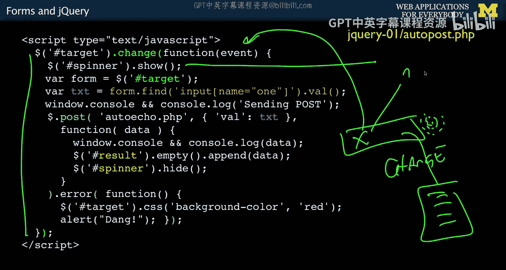
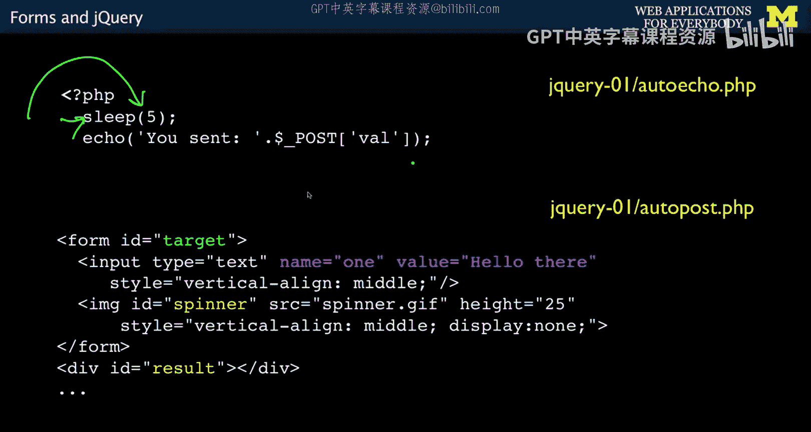
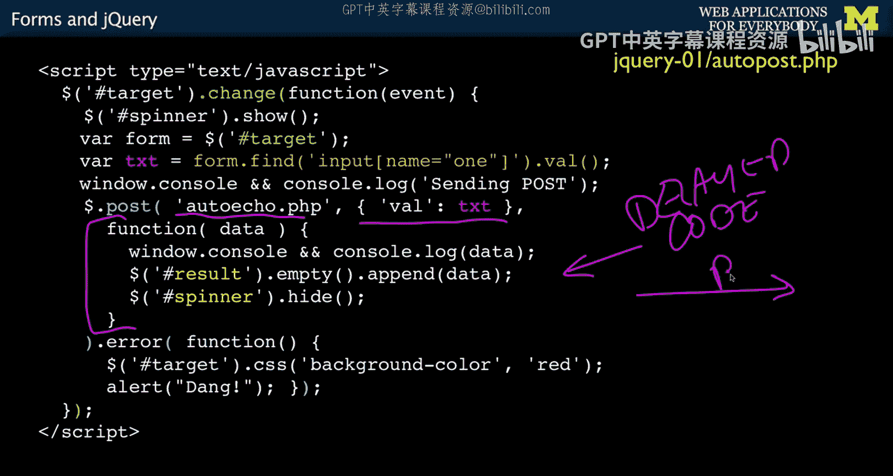
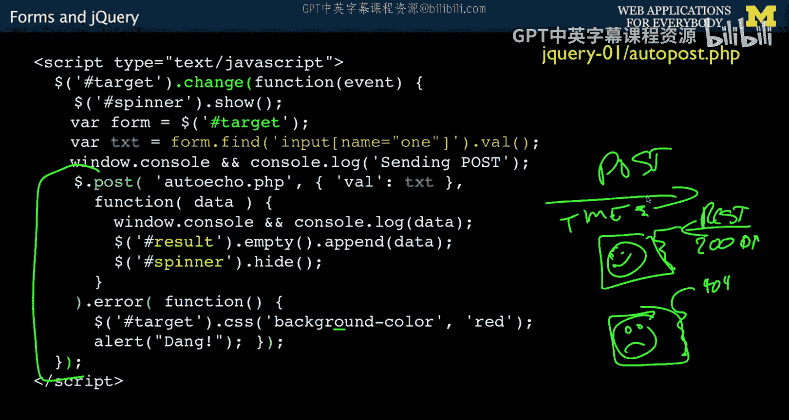
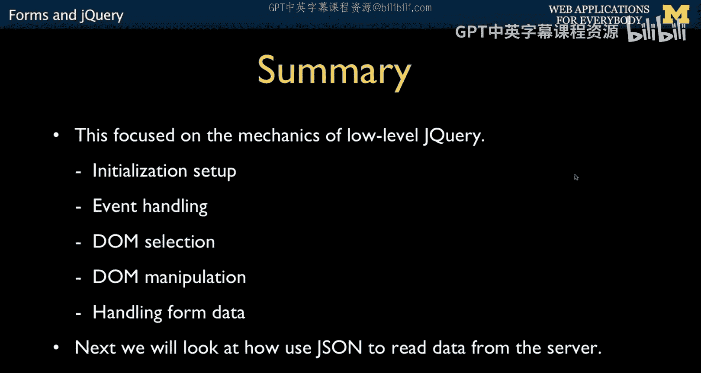

# Web Applications for Everybody： 23： 表单与jQuery 🧩





在本节课中，我们将学习如何使用jQuery处理表单，并实现无需刷新页面即可与服务器通信的功能。我们将通过一个具体的例子，演示如何捕获表单变化、向服务器发送数据、处理响应并动态更新页面内容。

---




## 概述



到目前为止，我们主要使用jQuery与文档对象模型（DOM）进行交互，例如注册事件、修改元素样式等。本节我们将迈出重要一步：让jQuery不仅能操作DOM，还能与服务器进行通信。这意味着jQuery可以主动发起请求-响应循环，而不仅仅依赖用户点击链接或提交表单。这种技术是实现现代网页动态交互（如实时消息通知）的基础。

## 静态HTML表单结构

首先，我们来看一个简单的HTML表单。这个表单没有传统的提交按钮，其交互将由jQuery控制。

```html
<form id="target">
    <input type="text" name="one" value="hello there">
    
</form>
<div id="result"></div>
```

*   **表单 (`#target`)**：包含一个文本输入框，其初始值为“hello there”。
*   **加载动画 (`#spinner`)**：一个GIF动画图片，初始状态为隐藏（`display: none`）。它将在与服务器通信时显示，以提示用户等待。
*   **结果容器 (`#result`)**：一个空的`<div>`，用于接收并显示从服务器返回的数据。



## jQuery事件处理与异步编程


上一节我们介绍了静态页面结构，本节中我们来看看如何用jQuery为它添加动态行为。以下是实现交互的核心JavaScript代码。



```javascript
$('#target').change(function(event) {
    // 1. 显示加载动画
    $('#spinner').show();

    // 2. 获取表单输入框中的值
    var form = $('#target');
    var text = form.find('[name=one]').val();
    console.log('Sending:', text);

    // 3. 向服务器发送POST请求
    $.post('server_script.php', { val: text })
        .done(function(data) {
            // 请求成功时执行
            console.log('Response:', data);
            $('#result').empty().append(data);
            $('#spinner').hide();
        })
        .fail(function() {
            // 请求失败时执行
            console.log('*** Error ***');
            $('#result').html('<b>Failed</b>').css('color', 'red');
            alert('Failed to contact server');
            $('#spinner').hide();
        });
});
```


以下是这段代码执行流程的详细分解：

### 1. 注册`change`事件
代码 `$('#target').change(function(event) { ... });` 为ID为`target`的表单注册了一个**事件处理器**。这意味着花括号 `{ ... }` 内的代码不会立即执行，而是被“挂起”，等待特定事件发生。

*   **触发条件**：当用户在文本输入框中修改内容并**移开焦点**（例如点击其他地方或按Tab键）时，会触发`change`事件。
*   **异步特性**：这是一种**异步、基于事件**的编程模式。注册事件的代码会立刻执行，但事件处理器内部的代码则要等到事件触发时才会运行。



### 2. 事件触发后的操作
当`change`事件被触发后，处理器内的代码开始按顺序执行：

*   **显示加载动画**：`$('#spinner').show();` 让之前隐藏的旋转动画显示出来，给用户一个“正在处理”的视觉反馈。
*   **提取表单数据**：通过 `$('#target').find('[name=one]').val()` 这行jQuery代码，我们定位到表单中`name`属性为`one`的输入框，并获取其当前的值（例如用户输入的“X”），存储在变量`text`中。


### 3. 发起异步POST请求
接下来，我们使用 `$.post()` 方法向服务器发送数据。这是整个流程的核心。



*   **方法调用**：`$.post('server_script.php', { val: text })`
    *   第一个参数是服务器端脚本的URL（例如 `server_script.php`）。
    *   第二个参数是要发送的数据，这里是一个对象 `{ val: text }`，意味着将表单值以 `val` 为键发送给服务器。
*   **处理响应**：`$.post()` 方法会立即返回，浏览器不会等待服务器响应。我们通过 `.done()` 和 `.fail()` 方法**链式调用**来定义服务器响应返回后应该执行的代码。
    *   **`.done(function(data) { ... })`**：当服务器成功响应（例如HTTP状态码200）时，这里的回调函数会被执行。参数 `data` 包含了服务器返回的内容。在这个函数里，我们：
        1.  将返回的数据 `data` 添加到 `#result` 容器中。
        2.  隐藏加载动画 `#spinner`。
    *   **`.fail(function() { ... })`**：如果请求失败（例如遇到404或500错误），则执行这里的回调函数。通常我们会在这里进行错误处理，例如显示错误信息。


**关键理解**：`$.post()` 本身是异步操作。我们在一个异步的`change`事件处理器中，又发起了一个异步的网络请求。服务器响应可能需要时间（示例中故意等待了5秒），在此期间，浏览器可以自由处理其他任务。当响应返回时，jQuery会自动调用对应的 `.done()` 或 `.fail()` 回调函数。这就是实现页面无刷新更新的机制。

## 服务器端脚本示例

为了配合前端，我们需要一个简单的服务器端脚本（例如PHP）来接收和处理数据。以下是一个示例：

```php
<?php
// server_script.php
sleep(5); // 模拟长时间处理，让前端 spinner 保持显示
$receivedValue = $_POST['val'] ?? 'Nothing received';
echo "You sent: " . htmlspecialchars($receivedValue) . ". Server processed successfully.";
?>
```

这个脚本会休眠5秒来模拟处理耗时，然后回显接收到的数据。



## 总结

本节课中我们一起学习了jQuery处理表单并与服务器通信的完整流程。

1.  **事件驱动**：我们使用 `.change()` 方法监听表单变化，这是与用户交互的起点。
2.  **异步通信**：通过 `$.post()` 方法，我们可以在不刷新页面的情况下向服务器发送请求并接收数据。
3.  **链式响应处理**：利用 `.done()` 和 `.fail()` 方法，我们优雅地处理了请求成功和失败两种场景。
4.  **动态更新DOM**：根据服务器的响应，我们使用 `.append()`、`.html()` 等方法动态更新页面内容，并控制加载动画的显示与隐藏。





这种“前端jQuery捕获事件 -> 异步发送数据到服务器 -> 接收响应 -> 局部更新DOM”的模式，是现代Web应用实现丰富、流畅交互的基石。掌握了这个模式，你就具备了构建像实时消息提示、动态内容加载等高级功能的基础能力。