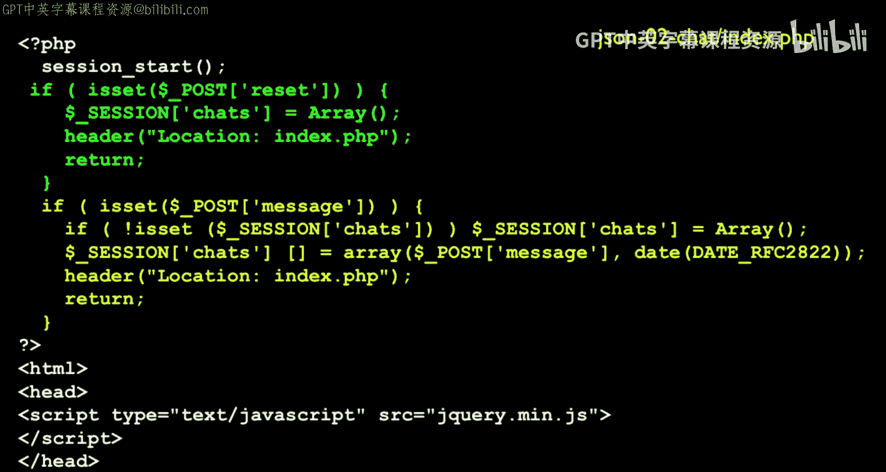
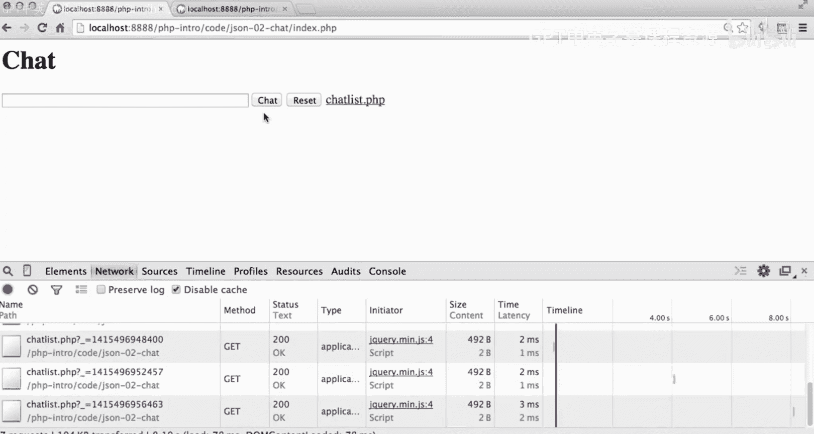
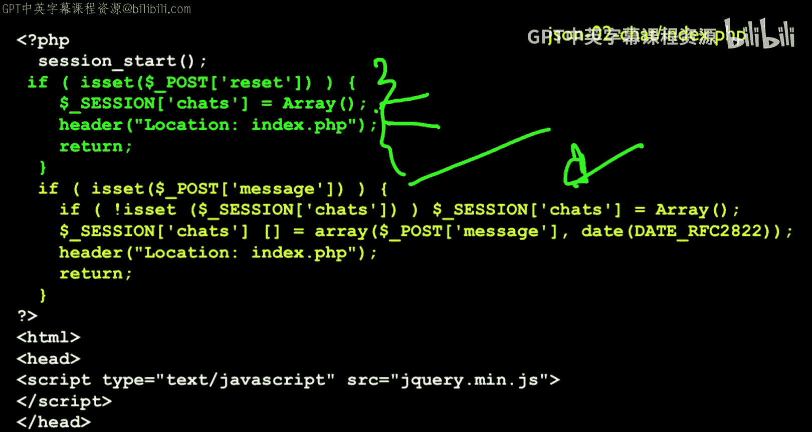
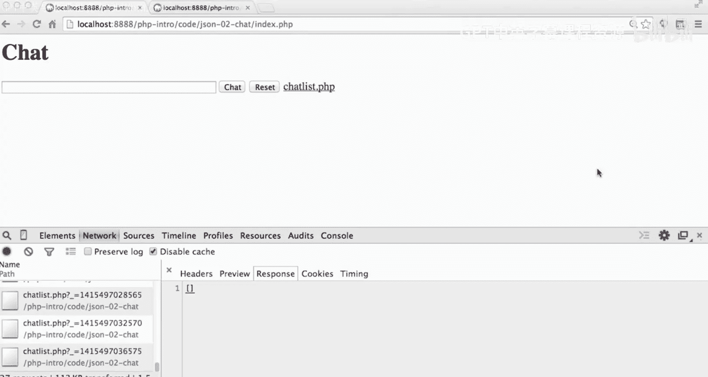
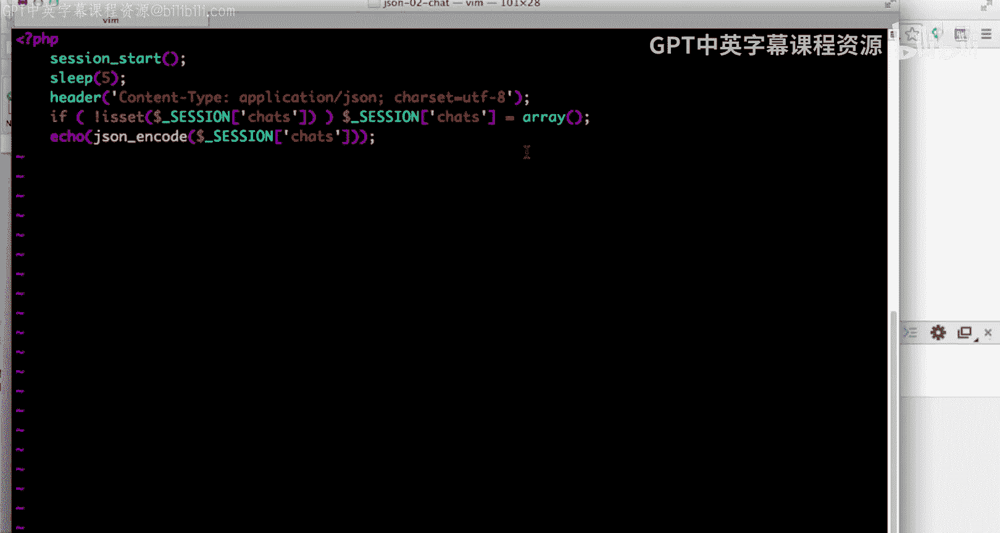
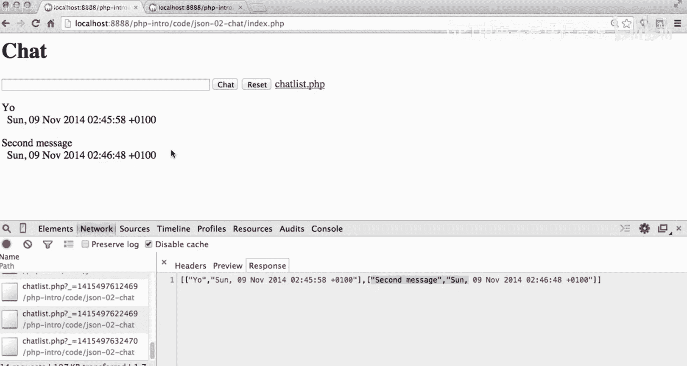

# 密歇根大学《面向所有人的Web应用程序（PHP、SQL、APP、JavaScript和JQuey｜Web Applications for Everybody》 p132 24_代码详解：表单与jQuery.zh_en -BV1Lr421A75d_p132-

So let's talk about an application that is is going to。Make use of some of this。

So this is one that I really like， it's basically a chat。

With a asynchronous updating of the chat data。

So at the beginning of this。Now let let's just play with it first so here is this application running and basically the idea is is I can say hi。

And it says hi back to me， and I can actually open this in a second window as a different person。

So Ive got two windows now and this both windows are going to see so I can come over to this window and say window2 and I hit chat and I come over here。

To window1 and it sees that from window 2 right so this guy。

 they are asynchronously updating and getting each other's chats and the way to see this is the developer console。

And what's happening is it's using JSON to get all of the if I go to network here。

 it's using it's calling chatlist。php and it's getting a list of the current chats。

 And so when I change the current chats another in window2。A moment later。

 it goes and grabs it with another chat list PhP， and so there's a third chat。

 and so it's using JSON and JQury and a timer loopbe to sort of keep all these windows simultaneously up okay and going at the same time。

Okay so it's this asynchronous chat and then I can reset all the chats and then this guy I'll reset as well I don't have to hit the reset both sides because a couple of seconds later so that's what's going on with this chat so let's examine some of what's going to happen here so。

The first thing that we've got is the standard posting request response cycle stuff and if it's a reset we' going to store the chat we're going to store the chats as just an array in the session because we don't want to use a database quite yet and so if we see the if we get the reset and button set which。

We can just say is set post reset because we named the reset button reset in the HTML HTML。

And we change the session and then we re back to ourselves if there's a message。

It actually creates either an empty an array if it needs to。

 but then it puts in the date and the actual message that came in and redirects。

And so that this post will take this array of chats and go。And so if we see that in the code。

If we see that in the code。You know， we see this array of chats。嗯。

We see this array of chests that comes back。Well， now the chats are， it's an array。

 it's an empty array because I just reset it， okay？

Okay， so that is the top part of this file then down here in the middle we load JQury and then we go down and we see the chat code and here we got a basic form that posts back to ourselves。

 we have a text field， we have a submit， I've got a little link to chatlist。phP in here as well。

 and then we got a reset button。And then we have a div。

And it's called chat content with an idea chat content。

 we stick this idea in because we can grab that with JQuery， right， and we put a spinner in there。

Okay， you put a spinner in there。So that it shows loading with an alt text of loading so the spinner is there while it's loading then。

Continuing down。We have a function called updatedate messages。Okay。

And what this basically does is it'll start on a timer every four seconds and we'll talk about how the timer works does a log。

It does an Ajax call to get to this。This URL called chatlist。

phP cacheache equals false keeps your browser from only retrieving at once and believing that it already has the data。

 it does this by adding a get parameter well of the time so that it forces the browser to get a new one every time。

And if we have a success， then we get the JSON data back and we log it， we log the actual data。

 we empty out the chat content。And you will see that this is a list。

 it's a list of an array of arrays with message comma date on it， and so we write a for loop。

 this is a JavaScriptscript for loop right and so4 var equals I less than date to the length I plus plus that's going to loop through all the chat messages。

 and then it pulls out the chat message and the sub0 entry is the actual message and the sub1 entry is the date of the message。

And then once that's all done， so once we have cleared out the chat content and read the data from the return JSON and stuck it into the chat content of div。

 we emptied out and then we append line line line a paragraph paragraph paragraph。

 each of these things is a separate paragraph and then we do a set time out。

 this is a JavaScript call， not a jQuery call that says wait four seconds and then call us ourselves again so update message sort of grabs the data。

empties out the chat div and then puts all the chats in the chat div and then says。

Ca me again in four seconds。And so it calls the night then。

ItIt defines the function and says start complete， and then it calls update message once at the beginning of the program to get the whole thing started。

 so it retrieves the messages right away now。One of the things I should probably do here。

Is I should probably just put this sleep in all the time in chatlist PhP。

All it does is it sends back JSON to our application。

And S5 makes it so the thing moves slowly enough so we can see what's happening。

 And I should probably just leave the S5 in all the time。 And so header content。

 So we put a header a content type header and this is good hygiene。 Everything we've done so far。

 it's been application text content type， but by telling it it's real JSsonN。 that's good。

 So this is a good thing to put into the before any data has been sent。

's another header just like location header except this is a content type header saying what I'm about you to send you is not just HTML。

 It's not text。 It's not a JpeEg image， It is actual Json， and it's going to be a UTF character set。

So I just checked to see if I have any chats yet， if I don't， I create an empty array。

 but then I simply echo using JSON and code the variable that's in session chats， which is an array。

Of two item arrays where the message and the date。Message date。And so it just takes this whole thing。

 Jsononic code turns that into a string and echoes it out， so we will see checklist。phP， okay？

So let me show you sort of again how that works， let me go in first。Let let's come back。Yeah啊。

So in chatlist。phP， I'm going to unment this five second sleep just because it makes it easier to see what's going on。

Okay， so so I'm going to clear the console log and then sort of start fresh。

 I'm going to hit index phP。 And what we see is we see the spinner because we haven't yet overwritten what's in the chat content div。

 So there's chat content div。 Go back and take a look。 There's a chat content div。

 Now we've asked for chat list but chat list is taking a long time。

 So but finally chat list came back。 And so we got no chat messages。

 but we did overwrite the spinner。 So the spinner's gone now。

 Okay so now I'm going to go over into the other window and I'm going to type yo。

And then I'm going to come back and we're waiting， we're waiting。 and at some point。

 our four second timer is going to expire。 But remember it takes， it sleeps 5 seconds。

 So it's going to be around 9 seconds。 So at some point down here， there we go。 So at some point。

We did this JSON request， it's going to happen every four seconds now。

 we did this JSON request and we emptied out that chat content div and then we got back an array of arrays so this is the first element of this is the message the second element is the date of the message so we loop through this little list we wiped this out and then we loop through the list and put it in。

 so I'm going to go over in the other screen and I'll put it put a second message in。

So I'm going to hit chat now we'll come over here and in a moment it's going to do another four second timeout and then five second delay。

 and then it will get another one， so here we go we just got another one。I think， oh， it's waiting。

 it's not done yet。 It's starting。 Now we got a response。 So that that was the five seconds。 Okay。

 so now you see we have two messages so that little JavaScript for loop clears this whole div out and then it loops through and prints out the message in the date of the first one。

 the message in the date of the second one and it puts that thing out。 And so that's how we achieve。

This， right， it's basically if we take a look at the code。

We are having every four seconds call this function， and then we get some JSON。

 we ask for the URL chatlist。phP， and when this is done it calls our success function after it's parse the data so it's really in JavaScript as an array at this point。

 so we write a little for loop。And make a little paragraph for each of the entries and the zero entry is the message and the one entry is the date。

So again， this is all pretty simple stuff。But you can kind of see how you can compose these things to have JQuery cause JavaScript to happen with a timer to use JSON and then change the dom。

 so we're sort of flipping between JavaScript and JQury and eventually we're changing the document object model without a full request response cycle。

🎼，🎼。