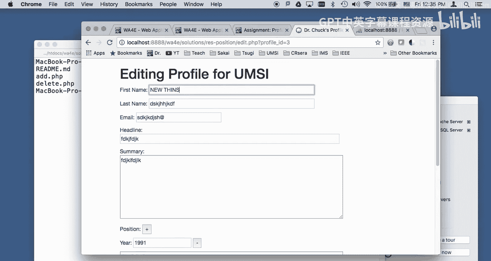
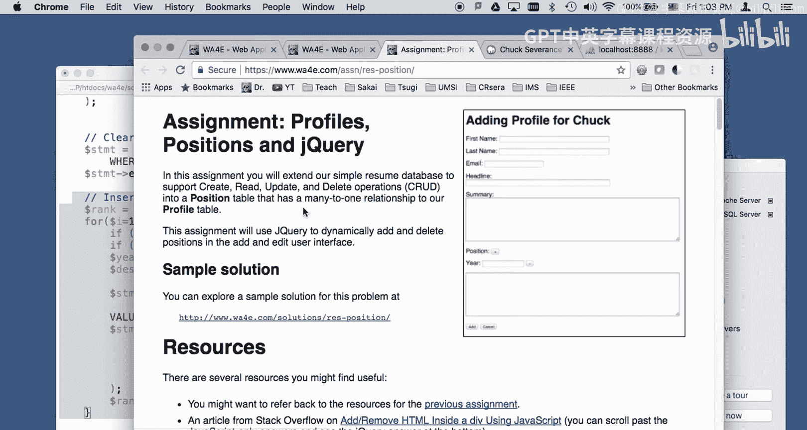

# 密歇根大学《面向所有人的Web应用程序（PHP、SQL、APP、JavaScript和JQuey｜Web Applications for Everybody》 p133 25_代码详解：配置文件定位与jQuery.zh_en -BV1Lr421A75d_p133-

Welcome to Web applications for everybody In this little video we're going to talk a little bit about the code that it takes to build this assignment。

 the auto grader with profiles and positions， The focus of this of course is JQury So here's the assignment and it really like most assignments builds heavily on the previous assignment so we're keeping where we have that hopefully that code works。

If you're just trying to type it in from this lecture， you're not going to do so well。

 so go back and do it one piece at a time that's how it's intended to be done。So I keep saying that。

So we're going to need another table， this one's going to be a position。

 let's just walk through the code first， I'll come back to that。

So I'm going to walk through it on my local system， actually to walk through it on my local system。

 I'm going to have to make this table。Because I have a。

The profile and user table already from the previous。And I'm going to say go， okay。

 so now I've got all three of them， so I'm going to log in。And it all goes well。嗯。MM S I E P， H， P，1。

2，3， that， of course is。Checking in user's table and checking you know with an SQL query。

 hashing the password and checking to see if the hash password matches。So log in。

And so we're going to add a new entry。So， this is the。

Exactly the same and the only real difference here is。We can add multiple positions。

 So this is going to be a many to one relationship。 The positions， there's a user。

Depending on how you did it， you might end up with a many one profiled user。

 but right now it's kind of a one to one profiles and users。And so。

 but then we're going to allow many positions so what we've done is are we using JQu we've got this little plus box and。

And I can put my first position and then I can add another one， I can say 2001。

 and then I can add this whole thing。So put some of that in。And now if I take a look。

 you will see that I have two positions and if you take a look in the database。

 what you will see is we have one user。We have。One profile。And then， we have。

Two positions two positions that are foreign keyed to the same profile so this is the many part to the one part in the profile so there's one profile and then there are many positions to that one profile so continuing along we got the view code that had to change notice that we keep sending this gi parameter along because that's how we got to move things back and forth so we know which one it is the edit codes a little tricky right。

You're supposed to be able to do。All， make the normal changes。

 this is kind of like from the previous assignment。

Let's go ahead and start in this index code， here we are。

So let's see a couple of bits of information here。Make this a little bigger。UT。

 I've collected some common things that I want to do over and over into this u and put them into functions。

 we'll go through these as I go through later and I just pull it in very beginning I in pull my PD to get my database connection and I just define all these functions。

It's kind of a perfect little thing where it's got no side effects。

 there's a less than question mark PhP it's you don't put a question mark question mark like that at the end in case because you don't want to put an extra space after that or it will trigger the you know the output that says you can't do headers so when you make library code like that。

So the first thing I did is I got and I don't want to repeat myself and so this is flash messages that we've been typing this over and over and over again well for the rest of the semester。

 I am not going to type that anymore， so we're here every time I want to put those flash messages out after this H1 I'm going to put them out right there and that's basically those eight lines of code。

So we got logging in， logging out and you'll notice that this will show the profiles even when you're logged out and so。

 but if you're not logged in， so if there is no user ID in the session。

 no primary key of the user in the session， it's going to show you， please log in。Right here。

 or is's going to show you， please log out。So then let's go ahead into the login。

If we take a look at。Login。phP。It's kind of similar to what we've been doing all along， let's see。

 you know， setting the session up if it was a successful， we do the lookup。

 we did that on the last assignment。do validate all that and that's really just from the same the previous assignment。

 so there's not much in there that's different。I do use flash messages。I use flash messages in login。

 so that's about all I need to show you in login。So let's go ahead and log in it's going to do the same I mean it's it just it carries over。

Carries over from the previous count， PhP 1，2，3。Wagan。Okay， so now let's take a look at the， oh。

 let's look at one more thing here just just so you know。

 because I got all this sort of bootstrappy stuff going on like we have and I got tired of typing that all over over and over again。

 so I have this require once head dot PhP and head dot PhP。Head dot PhP。

 this doesn't it's not really PhP code， this really HTML code， some oops。

This is just HTML and that's this that's a set of links that get me into get me get my bootstrap and bootstrap JavaScript。

 et cetera， et cetera， et cetera， and that I sort of grabbed from a。

From website to tell me how to do that。Get out of there。Okay。

 so let's go into the ad code because the ad code is the interesting stuff。So this is again。

Coode that's very similar to the code that we did before right I mean。

 a lot of this is coming across these lines here， I bring in you till， of course。

 but these lines here， the exact same thing， the model part of checking to see this is a little bit different and I'll show you that in a second。

 There's some more stuff。 I'll get to that。 and then you know flash messages and then we have a form and there's a few little things in here but a lot of this is the same and that's why it's really important that you do a good job on the previous assignment before you dig into this assignment okay。

So。Let's follow a few things through。 So I've changed some of this code。 Let's take a look here。

 So this part here is pretty similar， but this part here is different。

 So this is sort of the model code that's going to execute if there's some post data。 Now。

 I normally we validate the data。 But I've moved that into utility dot php。

 because I have to do it both in the ad and the edit。

 And so here we are in the utility code and utility dot PhP。

 So I'm doing the kinds of things that I'm supposed to do remember dollar post is a superg。

 So it passes seamlessly between main code and utility code。

 So I'm checking to see if the length of the fields， just like we always do。 and I return a string。

 And if something's wrong with email， I return a string， but if everything's fine， I return true。

 this notion of returning a string or something else。

 I'm changing both the type and the value that I'm returning And in a language like PhP that handles this sort of mixed typing we can do that。

And so if we take a look here in add dot PhP， I get back message。

 I don't know if that's a true or if it's a string， but if it is a string。

 I know that I've got an error and that the message contains the error。

 so I'm kind of sending two pieces of information back in one variable using sort of the pattern of mixed。

If something's wrong， I just redirect back to addt PhP and again my by taking the code that would normally be here and moving into u。

 PhP I can save myself effort now here's validating the position I'll show you that later。

Here is one new thing getting the insert I because when we're putting in the positions。

 we're going connect them to profiles。 we need to get the key， the primary key。

 I've mentioned this before that， oh， it'll be easy in PhP because you'll get to see the primary key。

 Well， this is the call to say， hey， you just didn an insert。 Tell me what key that you gave to that。

 So that's pretty cool。 Okay， this next bit I'll show as we're doing it。

 Then walking through the code， we basically see， you know， normal stuff。

 last mehes of the form pretty much the same。 And then there is this bit here。

 which is the plus sign。Here's the plus sign hang on。

It's this plus sign right here that makes it so that you can do the addd and we're going to do something to that in JavaScript using JQury in a second。

 oh， I want to inspect it。So it's just sitting there in the at some point and then Jqueery is going to attach something to it。

 I'll straight that in a second and again， like JavaScript to JQury， I have a little div。

 this little div lives carefully。Carefully between as div is empty and it lives between the plus and the add and the cancel。

 right， the plus and the add in the cancel。And then this is the add in the cancel。

 and then that's the end of the form。So we're going to have sort of a little code that runs at the beginning。

 that's what this is。And。Just out print a message， so dollar pound sign and pose that looks up。This。

Says go find the。Element that has ad pose as its ID and dot click says let's register an event。

 meaning when we click on the plus， when we click on the plus click I'm not going to do right now。

 call this code。So what it's kind of inception here where we're having a thing that is called when JakeC declares that the document is completely loaded and then what we're going to do is add an event。

So this is the code that runs every time I have a plus now let's take a look at what happens here。

When I add the plus， so let's even come down here and look at position fields。

So what's going to happen is this plus is going to add HTML to this div and I'll show you how it works。

 So now all of a sudden there is actually stuff inside here。

There's stuff in there and it's all the document， the document of your mouth has been changed。

 that's what's going on here， so let's see how I change it。

So this is the code that ran right from here to here is the code that runs when the click happens。

I say event prevent default， that's kind of like returning false in old style JavaScript。

We're going to have a global variable called called count position remember JavaScript is funky and that variables are global unless you use you tell them otherwise yikes。

But that's okay， I'm going to use that global variable to keep track of how many times this click has happened and what that does is。

If you hit the plus too many times， plus plus plus plus plus plus plus plus this is okay。

 you can only have nine of these things， I just made that so let's get out of here and you get back in。

So I'm hit plus again， so I think're going to show up。

So then I'm adding one and that basically says I can't keep doing this forever because you'll see later I depend on this going from one to nine。

Okay， so I'm also showing them a niceSO console log view developer console。系。I'm adding position one。

 see that that console came out。Then what I do is I go grab that div position fields。

 that's that empty div， and then I'm going to append。This bit right here， so at this point。

 this is just a big long string concatenation。And so I'm going to put a div with an ID and then string position is probably easier for you to see at this point with inspect element what I produced。

This is talls like。咁冇。So I have a div。That is generated right I made this up right and inside there there's position one。

 now you'll see why I have to do that in a second。And then I have a paragraph。

So there's a P tag and then the year and then I have an input type text and then year one。

 So what I'm doing is I'm putting more form fields in so this is name year one， right。

And this is a text area with desk one right here， count pose， so I've added one comp pose here。

 but I just am concatenating these are just concatenation， just a big long string concatenation。ok。

Now the only bit right here that is kind of tricky is right there， okay？We look at this。

 this is again jQury so I'm saying Do go find position one well that's a div I just made。

 go find it and then remove it， dot remove and then return false and that's so that this doesn't actually submit it so what happens is I've got a little onclick event。

I'm going to say minus， and it's going to just wipe this guy out。

 so watch the watch the dom change when I hit the minus。Could you。Now it's gone。She。😊，Can add it。

And now if I look in position fields it's back it's two now because this count pause didn't go back down so i've got position two description two and then i've got this little onclick guy that's going go wipe out the position two do so that gets rid of that so you see how i'm sort of。

Constructed this。Form I'm really extending the form at this point。

 so let me cancel and do another one。 So then let me show you what happens when we submit the form Okay。

 so when we submit the form。And then I'm going to say one， two， three。Blah。

 I'm going to add another one。4，5，6。不。So look。Let's inspect element and take a look at what we got as a result of this。

 So I've got two of these things， two divs， I got a desk one， and I got a year one。

 So I have a series of post values when I hit add， when I hit add boom， when I hit that ad。

 it's going to send year one， desk one， whatever I've typed in。

 this is going to be the year two variable and this is going to be the the year one variable desk1。

Year two deit， and I constructed that by carefully building this little bit of string。Okay。

 so then when I hit that post。So when I hit the post。It's going to go and send in。

Not just the top fields， but however many of these fields， and they've been named very carefully。

So I have to validate the profile， that's the top bit of fields。

 but then validate all the positions and that is code in uil。 PhP， so let's take a look at that。So。

Validate the positions。So here what we're doing is。

We're going through because remember there's somewhere between year one and year9 that's just a string right that's not an array。

 just a string So what I'm doing is I'm checking to see all of the years from one to9 if it's not set I'm going to continue and if the description is not there for this particular。

 I'm going to continue and then I'm going to basically say oh I'm going grab the year out year one。

 year two year3 year4 whichever one is there and then if they're missing。

 I'm going to complain about required and if it's not the year is not numeric I'm going to say it's not numeric otherwise I'll return true so in the add dot PhP this is going to validate all of those entries up from one through9 and I get an error message and I go back if there's a mistake。

But let's assume that works， so it's coming down here。

So now because I'm down at this point right here， I know that I've got valid data in year there might be no year data。

 there might be year one through9 might not exist De1， but if they do they're valid。

 so I'm going to go through and loop through again and now what I'm going to do is check to see if there is data if there's not I'm just skipping if there is I'm going to pull it out I don't have to validate it here because I prevalidated it before and then I'm going to insert into the position which is。

The year I got the description and then rank I just use rank as a way to put these in order so they're order by so they're the same order。

 so rank is going to be one for this one， two for that one is's just a way to make sure that they show up in order you can see this the rank is just goes up one two for each of the profile。

But then what I need to do is I need to set the foreign key right。

 I need to set the foreign key to the profile that this position is I'm inserting a position。

 it's going to be associated with a profile， and I just got done inserting the profile。Profile ID。

So that is the foreign key for the new position row pointing back to the profile。

So let me go ahead and after all that bus。Press the add button， hopefully I don't have any errors。

So there we go。And it has two of these guys。So let's take a look at the edit code I just got done talking about add。

 let's take a look at the edit code。Most of this is pretty cool。 Now。

 recall that when we're in the middle of an edit， you have to have a。Get parameter。

 so let's go through the first thing。We'll talk a little bit about this。

 but first I'm going to just make a mistake， okay， and I'm going to post it so this is going to be posted。

 And so when I hit the post button I hit save。It says all fields are required。

 but the biggest mistake that you're going to find is that you need to add this on the redirect right so this edit do PhP because there was a post and then there was a redirect because of the header so let's take a look at the validate profile and so you'll see that what I'm doing is I'm in add I didn't have to do this。

Because add， you're not really， we just redirected back to add dotphp， right， oops？In edit。

 we have to redirect， but we're still editing the profile right。

 so we need that as a get parameter because we're going to use that later down here。In the you know。

 we're going to use this to load up the positions and go that stuff is in u。

Lo pause loads an array of positions from a particular database connection for a particular profile ID。

And so that's going to do that and then we're going to loop through those things in our edit and we did that to to create these things we had to loop through and reconstruct all of the。

You know we had to reconstruct all of the HTML for these things， position， submit， and pose。

 position fields， these things are all here now these are I had to reconstruct these。

 but in this case they're not coming from JavaScript， they're coming from the database okay。

So that's all down here， but it just know that you got to when you're redirecting with a get parameter。

 you want to make sure you put the get parameter on there so the get parameter you're redirecting to it so you don't lose track of which profile you're editing。

Here's a tricky thing。 So Valdate positions。 It's nice that that's sitting in u till。

 Thank heaven I wrote that once I use it in the ad and I use it in the I use both these things and both the ad in the edit saves me a little bit of coding over and over but here's the trick。

 So let me show you what I need to be able to do right it's one thing if I'm going to make change1 to just make this be 999。

Hello。Just edit stuff。Okay， so what'll happen is what I'm going to do is。As a simplifying thing。

I am actually going to wipe out all of these rows every time I edit because all the data that I'm submitting。

Of all the positions， it's kind of like a new ad。RightAnd so what I'm going to actually do。

 I could write much more complex code， but what I'm really doing is I'm just going to wipe out the old positions。

 not the old profile with a single delete， and then I'm going to reinsert them and so this is pretty much the code straight out of add。

So it's re editingiting so the net effect of this that's just a way to make your life simple okay。

 the net effect of this when I hit this save is you will see that these will be updated but then the position Is I'm going to kind of be wasting primary keys there are trickier ways to do this but for now let's not worry too much about the trickier ways to do it。

So if I go back here， you'll see that these are three and four and I would browse again， oh。

 was that because I added a new one？I must， oh， oh， there's two of them。All， there's two of them。

Cause I added them。Let's change them again。F fine， fine fine。8888， save it again。Yeah。

 so you saw seven and eight went away and nine and10 replaced him。

 so I actually got more than one profile going on here， I should be all see that if I just get out。

Yeah， I's got two more than one profile let's go here to that guy， so now'll make more sense， Yeah。

 nine in 10， let's update it again。So you will see that this is 9 and10。Become 11 and 12。 Now。

 the interesting thing is this also allows me to easily add a situation where I can get rid of one of these things。

And then add another one。And so if you look at this one， this is going to be number two。

Because I deleted the first one， so year two is there， so there's no year one。

RightThere's a position 2 and a position 3， this position 2。This one here came from the database。

 this position this one here came from the database， this one here is new and that's position 3。

 so in a sense I've still got this code down here at the bottom to add more stuff right that code is still there and so I'm on the edit page I can I I can edit existing ones or I can add new ones and so in this case。

I'm going to sort of get rid of 11 and 12， so every time I wipe out all of them and then I read them all。

So。So now should be a 111 because I deleted one， I hit the minus up there you can go back and scroll back and then I'm going to save it and now because effectively I do a delete and read。

 it makes my life really， really simple and I can reuse code from delete and add and so there they are 13 and 14 and。

I mean， I could probably have put。Some of this in u right I could have this code right here。

 I could have put this in u because that is exactly copied literally from add so doing all the inserts。

I'm going to move that into u if I wanted to。There you go。

might have a easy walkthrough of the profiles positions at JQury。

 where we have a basically a many to one relationship where you can have many positions mapping to one profile cheers。

