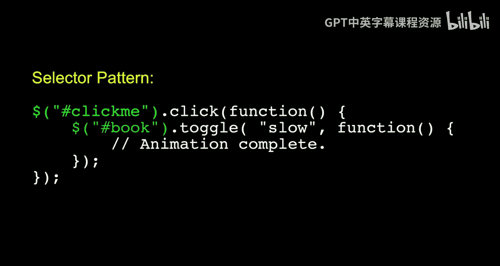

# 密歇根大学《面向所有人的Web应用程序》：特别内容：John Resig谈jQuery

## 概述
在本节特别内容中，我们将跟随jQuery的创始人John Resig，了解这一流行JavaScript库的诞生背景、设计理念和发展历程。这对于理解现代前端开发工具的演进非常有帮助。

---

我于2005年开始开发jQuery。在此之前，jQuery并不存在。它最初只是我编写的一系列工具集合。

这主要是因为我当时创建了许多网站和相关资源。我一直希望拥有一些特定的工具来简化我的开发工作。其中一部分原因是为了解决当时存在的浏览器兼容性问题，比如Internet Explorer和Firefox之间的差异。

同时针对所有这些不同的浏览器进行开发非常困难，这是一个主要问题。

另一个问题是，我觉得当时已有的开发工具，尤其是JavaScript开发工具，可以做得更好。

当时最流行的库是Prototype JavaScript库。这个库与Ruby on Rails框架捆绑在一起，因此随着Rails的流行而迅速普及。

我发现那个库极具启发性。那是我第一次看到一个以优美、清晰、面向对象方式编写的JavaScript库，其中内置了许多优秀的功能范式。

我那时并未意识到JavaScript可以如此优美和优雅。看到Prototype后，它激励我想构建更好的东西。我意识到Prototype主要关注JavaScript语言本身，而很少有工具专门关注浏览器环境中的JavaScript，特别是操作HTML和DOM。

这里存在一个空白，一个巨大的可用性鸿沟。

因此，我开始构建不同的工具和库。最终，所有这些逐渐融合成一个单一的库，我将其命名为jQuery。

我原本打算叫它JSelect，但那个域名已被占用，所以我最终选择了jQuery。

我于2006年1月发布了它。需要说明的是，当时我还在上大学。我在大学期间从事所有这些工作，这些不同的项目只是我进行的各种副业，jQuery正是从这些副业中衍生出来的。

可以说，那些副业项目都已不复存在，只有jQuery留存至今。

选择器模式至少来源于一位英国开发者Simon Willison编写的库。他创建了一个名为`getElementsBySelector`的方法，它允许你编写一个简单的CSS选择器来查找元素。

但它非常原始，只能进行最基本的查询，不支持完整的CSS2和CSS3等功能。

因此，我想要的东西之一是那个库的更好、更全面的版本。

此外，我还想优化在页面中附加事件的过程。因为当你构建交互式JavaScript应用程序时，需要监听用户执行的某些操作。所以，查找元素并为其附加事件这个过程，我想彻底优化。

这确实是jQuery最初的核心。直到后来，我才开始添加其他功能，比如动画。甚至在我发布之后，我才添加了Ajax等功能，那是因为其他人需要它，我个人当时并不使用。

它确实受到了其他开发者及其库的启发。我只是觉得它们还不够完美，我想把它们整合得更好一点。

那么，它是如何从我制作并分享的东西，演变成具有自己生命力的项目呢？因为它很快就独立发展起来了。

感觉它花了很长时间才获得自己的生命力。我在2006年1月发布了它。

从一开始，我就做了几个设计决策，这些决策帮助很大。

一个是我提供了明确的插件架构，以便人们可以编写插件并将其添加到jQuery库中，从而充分利用这个框架的优势。

另一个决策是，在发布的第一天，我就编写了文档。我坐下来，仔细研究了每个方法，记录了它的工作原理，并提供了小例子。

我认为有趣的一点是，从2006年1月我们发布这个库，到2007年1月，jQuery是唯一一个有文档的JavaScript库。其他库都只是说“阅读源代码”或“查看版本控制记录”之类的。这总是让我很惊讶。我想这只是开发者的一个副作用：你想写代码，不想做写文档这类枯燥的工作。

至少就库的发展而言，我做了很多决策。

在其历史进程中，许多决策与代码无关。我一直试图强调的一点是，当你试图管理一个好的项目，尤其是一个好的开源项目时，代码只是整个方程中很小的一部分。

你必须花费大量时间和精力去创造一些人们愿意学习、易于学习的东西，并且确保他们学会后不会因为受挫而离开。你必须确保在每一步，人们都感到满意、快乐，并且在学习。这通常需要做一些事情，比如确保你有一个清晰的网站，方便下载你提供的东西，确保文档非常清晰，有一个非常好的入门指南，此外还要围绕它建立一个社区。

我邀请加入jQuery团队的第一个人，或者说，当时只有我，下一个我邀请的人实际上是来帮助管理社区的，而不仅仅是另一个开发者（尽管他本身也是开发者）。我这样做的原因是，我想确保如果有人遇到任何问题，他们的需求都能得到考虑，并且我们能够帮助解决他们遇到的任何问题。因此，我们在修复浏览器问题、发现库中的一般性问题方面非常积极主动。

从2006年夏天到2006年底，我实际上在Y Combinator，这是Paul Graham在波士顿运营的创业加速器。当时我和一些朋友搬到了波士顿，我们尝试创业，但最终失败了。我们没有获得足够的资金，创业项目没有成功。之后，我加入了Mozilla。

在那里，我主要担任了多年的JavaScript布道师。我的工作是推广JavaScript，让人们了解规范中即将加入的内容、工具等等。但同样，我并不是在工作时间内开发jQuery。我仍然是在空闲时间处理邮件列表、修复bug以及所有这类必须做的事情。

直到大约我在Mozilla的最后一年，也就是2010年到2011年左右，他们才说：“好吧，你可以全职从事jQuery工作。”于是我开始全职投入其中。这很棒，因为在那段时间里，我投入了大量精力来确保基础设施到位，这样即使我不再每天参与工作，它也能继续存在。

其中一部分工作是建立一个非营利组织，并确保有足够的人员负责它的各个方面。这样，当我最终加入可汗学院时，我实际上从jQuery项目中退了下来。自那以后，一切运行都非常顺利，我现在可以作为一个快乐的用户来使用jQuery了。

---

## 总结
本节课中，我们一起学习了jQuery创始人John Resig分享的库诞生故事。我们了解到jQuery的初衷是为了解决浏览器兼容性问题、优化DOM操作和事件处理，并受到Prototype等早期库的启发。它的成功不仅源于优秀的代码，更得益于清晰的文档、插件架构、积极的社区管理以及完善的项目基础设施。这段历史揭示了成功开源项目在技术之外所需的关键要素。