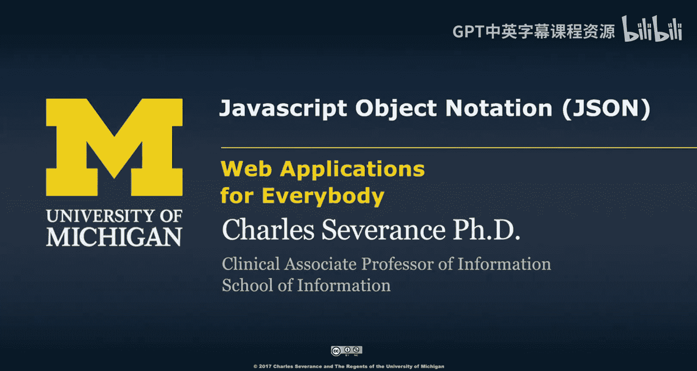
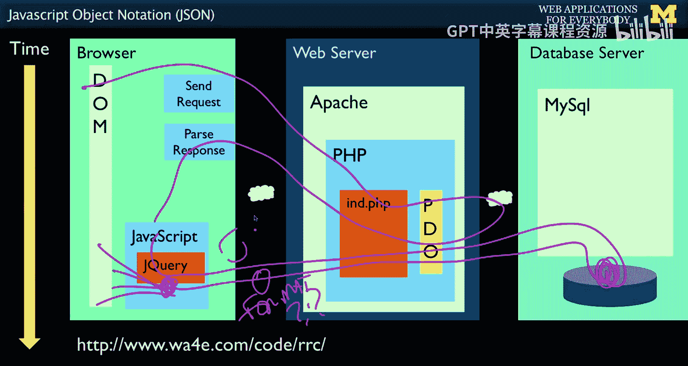
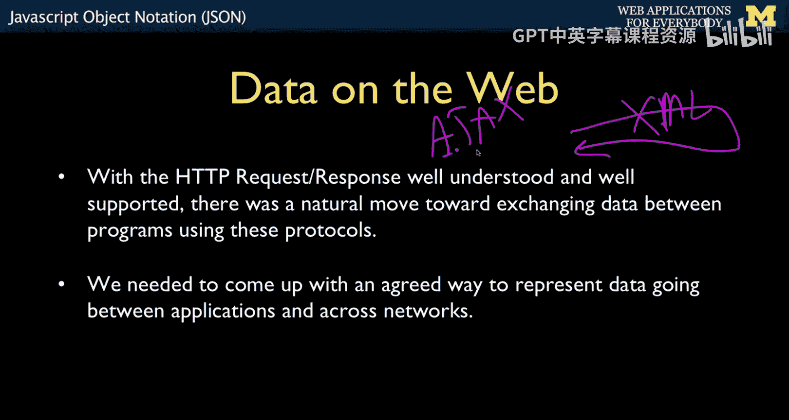
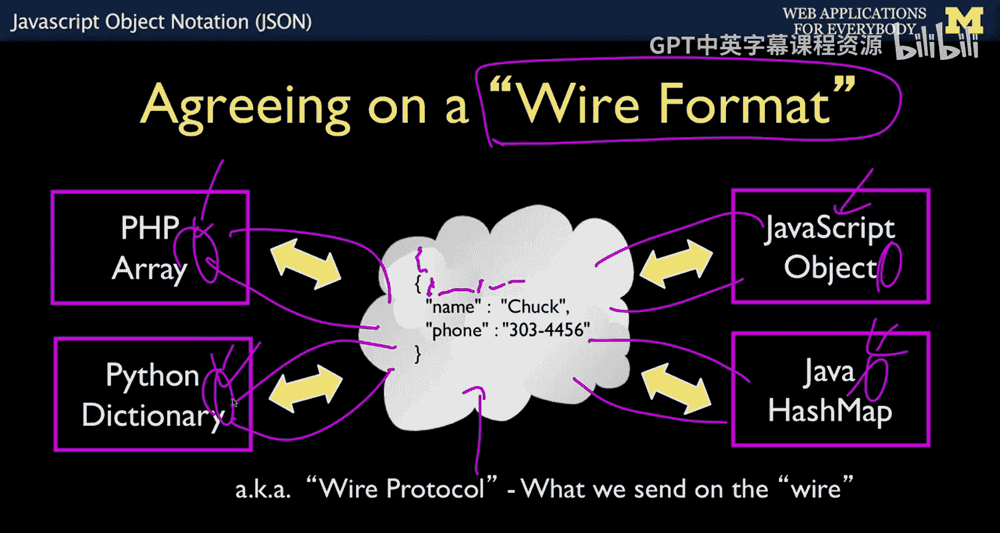
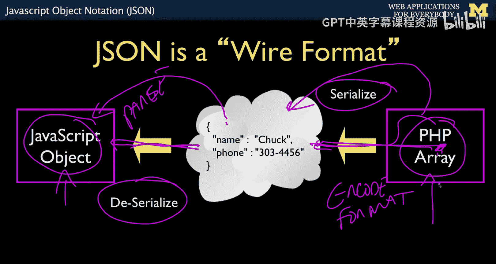
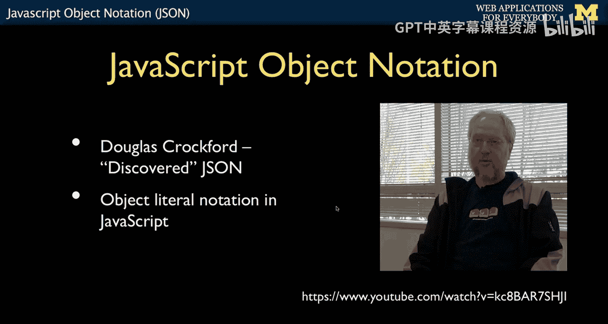
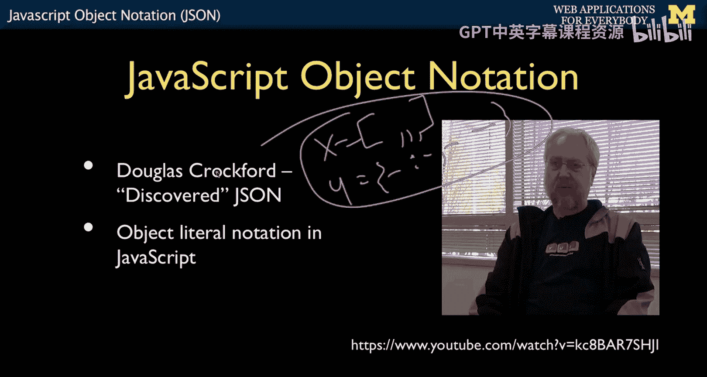
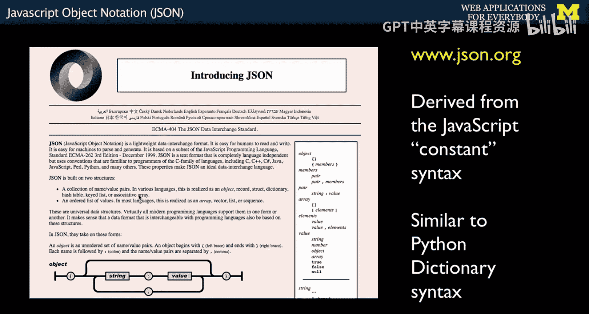

# 面向所有人的Web应用程序：28：JavaScript对象表示法(JSON) 📚




在本节课中，我们将要学习JavaScript对象表示法，即JSON。这是一种在服务器和浏览器之间传输数据的通用格式。我们将了解它的重要性、工作原理以及如何在PHP和JavaScript中使用它。

## 概述

在之前的课程中，我们学习了浏览器中的JavaScript如何与DOM交互，以及如何通过发送POST数据与服务器进行通信。之前我们发送和接收的是HTML。然而，在实际应用中，尤其是在需要与数据库交互并获取记录时，我们更希望发送和接收的是**数据**本身。JSON正是为此目的而设计的通用数据格式。



## 请求-响应循环与数据格式

上一节我们介绍了浏览器与服务器之间的基本通信。本节中我们来看看数据传输格式的演变。




早期的Web开发中，当JavaScript向服务器发起请求时，返回的数据格式主要是XML。这催生了所谓的“AJAX”模式。


**AJAX** 代表 **A**synchronous **J**avaScript **A**nd **X**ML。

然而，XML格式在处理上有时显得繁琐。因此，业界开始探讨更优的返回数据格式。问题的核心在于，服务器端可能运行着PHP、Python等语言，而浏览器端是JavaScript。每种语言对“键值对”等数据结构都有其内部表示方式。为了在互联网上传输数据，我们需要约定一种通用的“线格式”。

**线格式** 是一种已知的语法，它可以被转换成PHP数组、Python字典或JavaScript对象，也可以从这些数据结构转换而来。之所以称为“线格式”，是因为数据本质上是通过网络线缆（或光纤）传输的字符流。



## 什么是JSON？🔗


那么，什么是当前主流的线格式呢？答案在95%的情况下是**JSON**。

JSON代表 **J**avaScript **O**bject **N**otation。它的核心思想是利用JavaScript中定义对象和数组常量的语法，作为通用的数据交换格式。



这个过程涉及两个关键操作：
*   **序列化**：将服务器内部的数据结构（如PHP数组）转换为JSON字符串（线格式）以便传输。
    ```php
    // PHP 示例：序列化数组为JSON字符串
    $php_array = ["name" => "张三", "age" => 30];
    $json_string = json_encode($php_array); // 序列化
    ```
*   **反序列化**：在接收端（如浏览器中的JavaScript）将接收到的JSON字符串解析为本地数据结构。
    ```javascript
    // JavaScript 示例：将JSON字符串解析为对象
    var jsonString = '{"name":"张三","age":30}';
    var jsObject = JSON.parse(jsonString); // 反序列化
    console.log(jsObject.name); // 输出：张三
    ```


Douglas Crockford是JSON的推广者，他幽默地声称自己“发现”而非“发明”了JSON，因为它本就存在于JavaScript的语法中。他创建了json.org网站来规范这种格式，最终使其成为了分布式计算中不可或缺的基础设施。

JSON并非万能，对于复杂的层级结构（如Word文档），XML可能更合适。但对于在Web应用中传输数组或对象这类数据，JSON是绝佳的选择。



## JSON的优势与特点


上一节我们了解了JSON的定义和基本概念。本节中我们来看看它为何如此受欢迎。



JSON在PHP和JavaScript中都得到了极佳的支持，使用起来非常简便。

以下是JSON的一些关键特点：
*   **语法简单**：基于JavaScript对象和数组的字面量语法。
*   **易于读写**：对人友好，同时也易于机器解析和生成。
*   **语言无关**：虽然源自JavaScript，但已成为多种编程语言的通用标准。
*   **轻量级**：相比XML，JSON的数据结构通常更简洁，冗余更少。


一个简单的JSON对象示例如下：
```json
{
  "name": "李四",
  "age": 25,
  "isStudent": true,
  "courses": ["数学", "物理", "计算机"]
}
```

## 总结




本节课中我们一起学习了JavaScript对象表示法。我们了解了从XML到JSON的数据交换格式演变，理解了“线格式”和“序列化/反序列化”的核心概念。我们认识到JSON是一种利用JavaScript常量语法、轻量且通用的数据格式，它极大地简化了服务器与浏览器之间的数据通信。在接下来的课程中，我们将通过具体的示例代码，学习如何在PHP和jQuery中实际使用JSON进行数据交互。