# 密歇根大学《面向所有人的Web应用程序（PHP、SQL、APP、JavaScript和JQuey｜Web Applications for Everybody》 p138 30_代码详解：JavaScript对象表示法.zh_en -BV1Lr421A75d_p138-

So now I want to talk a bit about JavaScript object notation， otherwise known as JSON。

 so you can take a look at the interview that I did with Douglas Crockford about the discovery of JSON。

 the key thing and he's very very humorous when he talks about this JON is not something that he really invented it's really just part of JavaScript and it's been sort of extract it from JavaScript in ways that are used outside of JavaScript and it's a way to serialize data and transmit it from say PhP to JavaScript and so it's a wire protocol。

 a serialized wire protocol。That just happens to be inspired by how constants are written in JavaScript。

And so just to sort of review， JavaScript has two kinds of list container objects。

 the first is a list， which is just a linear zero base list sub0 sub1 sub2 with square brackets as the constant and is the index operator but it also then has objects which are key value pairs。

 and the thing that's a little weird about JavaScript is that objects。

And associative arrays are kind of the same thing。 they're just key value pairs。

 and so the thing that has confused me over the years。

 the thing that confused me over the years was that。

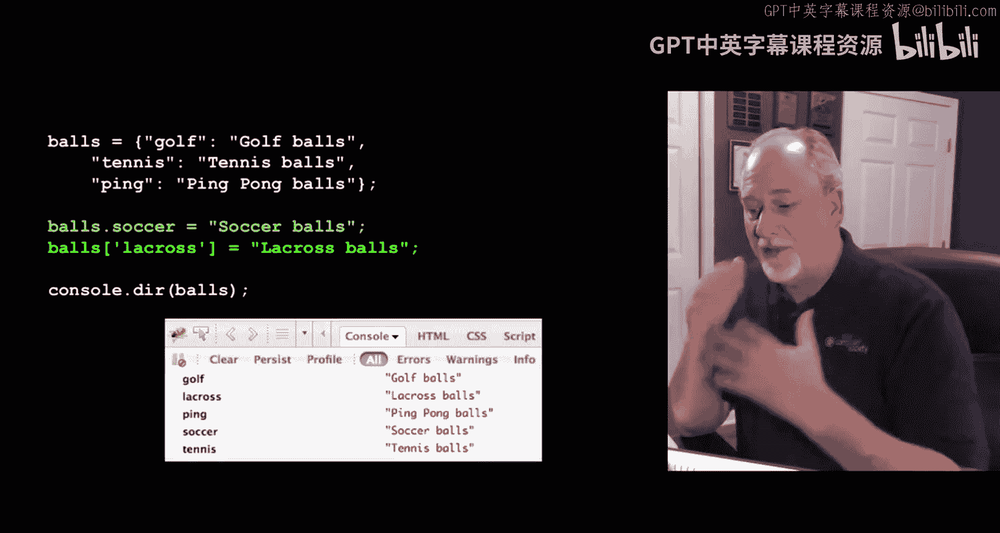

You could use syntax that looks like object orient syntax like balls dot soccer or。

Asssoociate race syntax， balls sub quote Larosse， and they are the same by the time it's all said and done。

 they are the key value pairs and so。This syntax， which in a language like Python or other we'd think oh。

 that's a dictionary and there's a different language for objects well this turns out to be an object。

In JavaScript and that' thats。Not a big deal， it's just that after a while。

You get a little confused if you see somebody using the same thing with these two syntaxes。

 they're really equivalent。Okay。And so the JSON syntax is a simplification of the JavaScript constant syntax。

 and so you can have things like strings， you can have integers， you can have booles。

 you can have a list or an array， so use square brackets for lists and curly brackets for objects and so you can nest these things and so here we have an object named who and it has a。

An element or a member or a key of offices that itself is a list of strings here we have a key of skills which itself is an object so we have an outer object and then we have inner object within it listed as skills and so you can nest these as much as you want。

 you can have lists of objects or objects with lists and it can go further and further。

 I mean you could have in here this could itself be another list or another object so it can go as deep as it needs to go in a very hierarchical way。

And so。Once this JSON syntax was identified as something useful to go across multiple languages。

 then people went， it always worked in JavaScript， but then people built JSON libraries in languages like PhP and Java and C and CSharp and all these other languages so that those languages could generate JSON。

And then the JSON could be consumed by languages now you could easily have a PhP talking to another PP and they're exchanging Json。

 it happens to be JavaScript syntax but。It's JSON okay and so there's really useful and great libraries inside most programming languages so let's take a little look at a little bit of code。

 This is in JSON01。ziIP zip in my PhP intro website and the first thing I want to just show you is the syntax Now this is kind of a little weird in that this is JavaScriptscript and this looks like JSON okay it's kind of the JSON I just showed you This is executable JavaScript this is the constant syntax。

 the syntax for defining constants in the JavaScriptscript programming language。That's what it is。

So who equals is just a variable equals an object with these four。Keys in it。

 Ch 29 Tru a list of strings and's another object。And so it just window。cons。 log。

 so let's just sort of take a look at this。

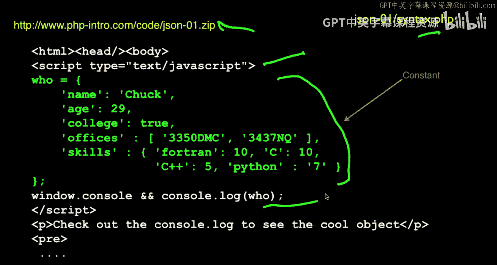

Okay， let me clear this clear this。Json 01。JSON syntax， right， when we show the log。Okay。

 so this is now an object， right， and it just was。Javascript， yeah， it's executable JavaScript。

 So that's kind of the weird thing about JSO is not only is it a syntax for serialization and deserialization。

 it also is legitimately executable JavaScript。Crazy。And cool， at same time。O。

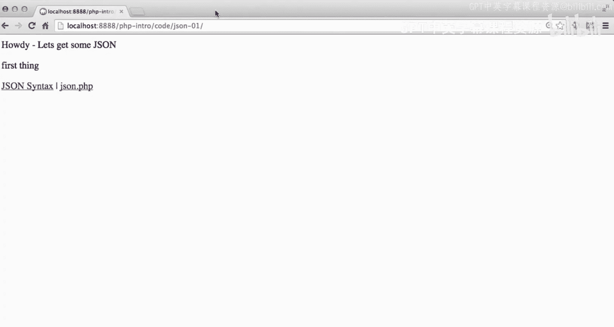

So the next thing I want to show you。So that's how you kind of make JSON in JavaScript。

But now I want to show you how you make JSON in PhP and then how you pull JSON from the server and pull it into JavaScriptscript So the first thing I want to show you actually is this right here。

 this JSsonN。 PhP。So this is a bit of code that creates a PH PhP code JsonN。phP， it creates an array。

With the key first map to the string first thing， second map to the string second thing。

And then it calls this built in function。 I mentioned that when JON became popular。

 all these languages added JsonN libraries。 Well PP has it built right in JsonN underscore encode code。

 what you pass in to JON underscore encode code is a PhP object or PP array。 whatever it is。

 it'll look through it， look through the hierarchy of it， and it will produce a string。

 So JON encode code returns a string with curly braces and greater than and square brackets and colons and quotes that's legit JsonN based on this。

 So it's as simple as。Here is a PhP data item and give me the JSON representation for that。

 and then I echo it just to print it back out。So let's take a look at how that works。

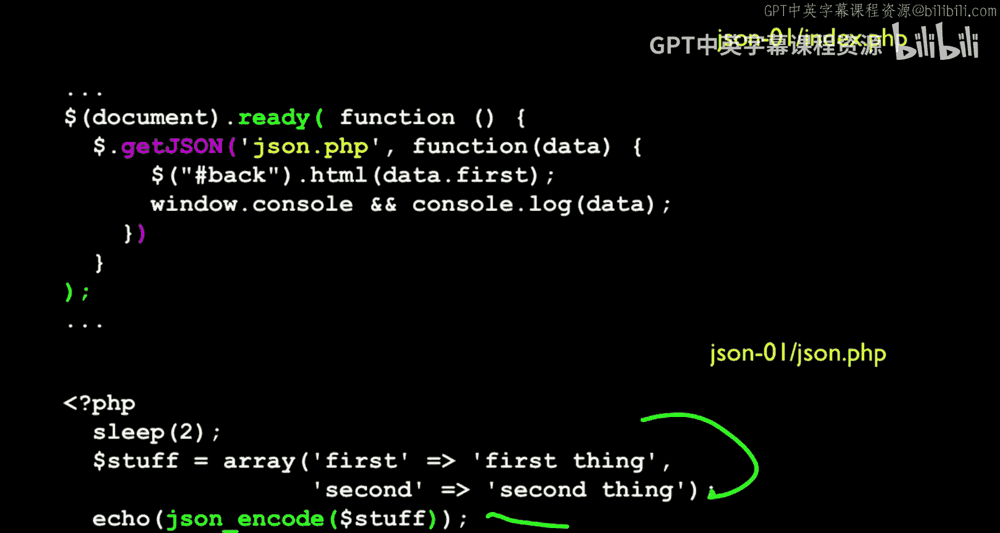

So if I just run Json。tphP。It comes out as curly brace， first colon， first and second colon。

 second string。 So this now is legt Json。 This is a Json constant， and it is the output。

 So if I do a view developer console。Now it takes a second。

 so if I do a network and let me just hit refresh here。

It takes a second because there's a sleep one on purpose there， okay？

Now this is all sort of extra junk， don't worry about that。

 that's just CSS my browser's adding so ignore that the thing that really matters is this。

So I am hitting the URL， JSON。 PhP， I'm doing a get request。

 it's a get request to that and the response is this curly brace first， this is the output of my PhP。

 it's the output。

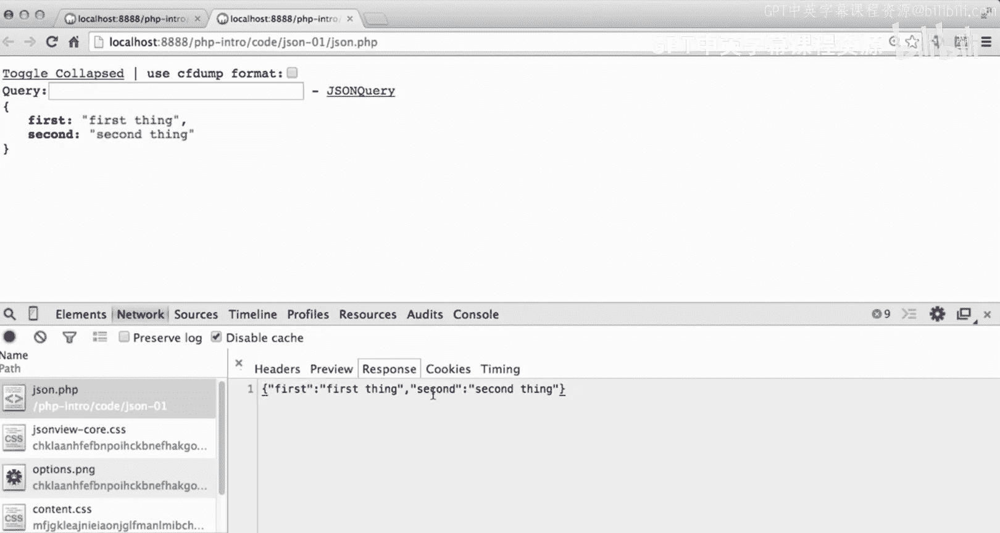

Of the encode statement。This is super powerful and super simple。

I keep saying in a bunch of times so that you get it right。 super powerful and super simple。

 This is stuff is a PhP variable Json and code creates。

 gives you back a string with curly braces and quotes and colons and stuff and echo just echoes that out。

 and that's exactly what we're seeing What we're seeing up here is kind of a pretty printed version of it。

 This is really what came back。 It's trying to pretty print it for us to make it a little bit easier。

 All this other junk is just my browsers adding that but this is what really came back。

 This is the output。

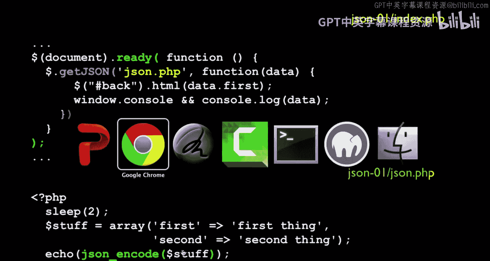

This here is the output。Of JSON Underscoring code， I echoed it， of course。

 and that's why it comes out as the response to the thing。Okay。I hope you get that。

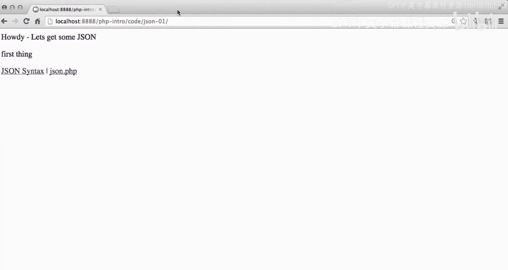

Okay。So now what I want to do is I want to show you。

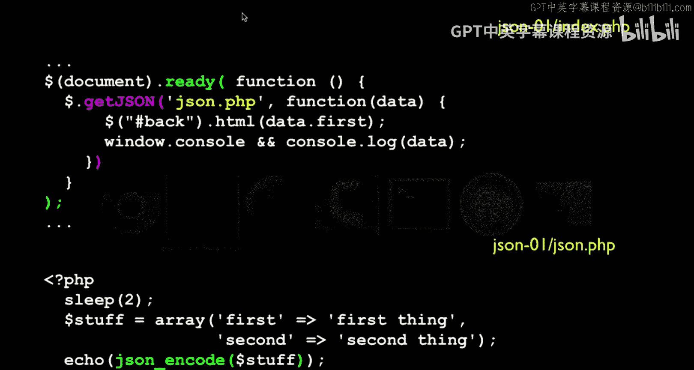

Indexed。phP， and this is the code that is running right here， it's index。phP。

So there's a bunch of stuff in here。But the interesting thing that it does is。It load。JayQury。

And then it calls document ready， this is the pattern to say when the document is finally loaded。

 then run this code。And if you recall， when I did the postcode said Dollar post。

 this is a different thing that's kind of like Dollar Post， but it's called Dollar get JSON。

 which means it's going to do a get request and pull back to a URL and then pull back the data。Okay。

 so it's going to call the URL JSUN。t PhP。And then it's going to do a request that when the response comes back。

 it is going to call us and put in call us dysfunction， the second parameter。

 which is our function and call us。And pass in the data。But the difference is this point。

 it's not a string。It's a JavaScript， object or list。Whi means it's been parsed right。

 so the curly brace in this case is an object variable with a method weller with a key of first and second。

 and so it's already parsed。And so then what I can do is I can just say data dot first and what is data dot first。

 well that's the the string， that's the key first in the return JSO and away we go and we'll just console log it so we can kind of see it so let me clear this。

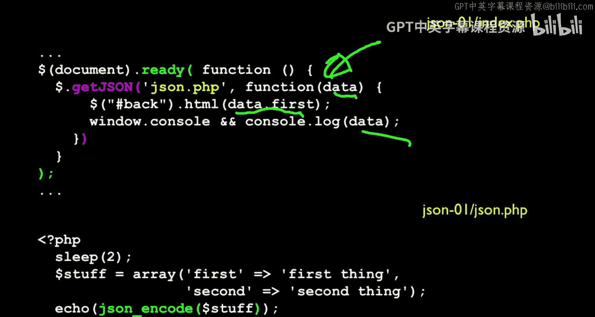

Clear that。So if I view the network。Here， JavaScript console， if I view the JavaScript console。

Let me clear this and then I'm going to hit the refresh。So this index， let me just do a view source。

 view page source， there we go。So here we see it all。

 it loads JQury and it says when this document is done。Loading， then go grab some Json。

 And then it's really only going to， it's going to put some stuff in。Here。

Starts the word before is in ID equals back， dollar back says go find the tag with the ID back and change this HTML to data first。

That's data sub firstt， I guess， is the best way to think about that。And it says before。

And then does some console messages so watch this it's going to be cool in slow motion。

 let's see should I see the console messages or the network。Let's do the network。Now。

I hope you can see this should take about a second。First thing。

When I hit refresh it's going to say before and then a second later is going to turn to first thing。

 so watch when I hit refresh。Says before， now it's getting some JSON， oh。

 it retrieved the JSON and pulled something out of the JSON。So if you look。

The response to the original get。Had that string as before， and then it loaded JQu because it had to。

 and then it called JON and got that variable。First thing。

 second thing right so first maps to first thing， second maps to second thing。

 and then if you look at the code。I simply go and say， go in grab data dot first。

 which is this string。Because this is a string when it comes back from the server。

 but by the time it's coming in here， it has been parsed and it's an object。

Because the curly braces have been parsed， it's decialalized。It's parsed。

And so just pull out data dot first and that's how first thing ends up here。

And then if I go take a look at the log。You can see that this isn't the。We are logging data。

 which is the parameter that came back， but it is the JSON， but it's the converted JSON。

 it's converted to an object。And we console log it and it's an object。

 and has a key of first that maps to first thing and a key of second that maps to second thing。So。

In just a few lines。

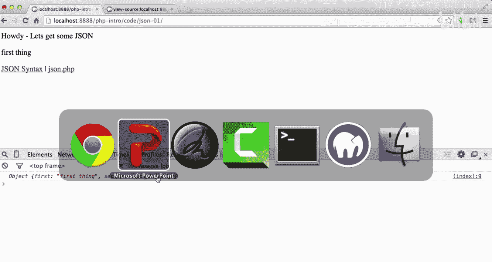

I mean， it's very misleading that this is so few lines of code。

I basically have in one programming language。An object or an associative array。

With this line and this line。So I make an object in PhP， and then I do this。

 and then I have the same object converted to JavaScript。So I basically make objects in PhP。

Fire them out as JSON， pull them in to JavaScript as JSON， automatically parse them。

With the help of JQury， and I just access the member variables that are in there。

 access the key value pairs that are in there。And so in a sense between here and here。

 there's a lot of work going on。A lot of work going on。

But we don't have to worry too much about all that work。It's pretty dang。

 impressive actually if you think about it。It's so much easier than serialization was like 10 years ago。

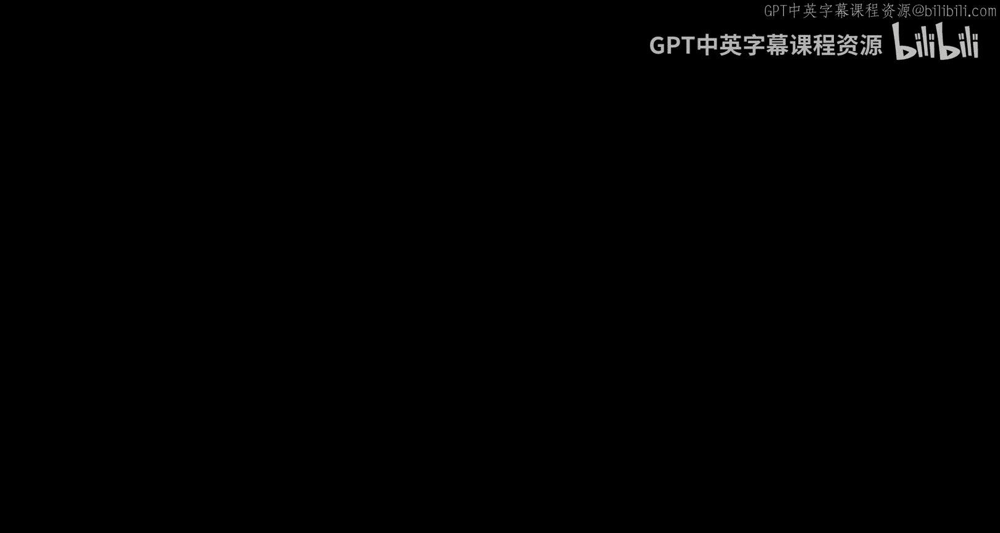

🎼。