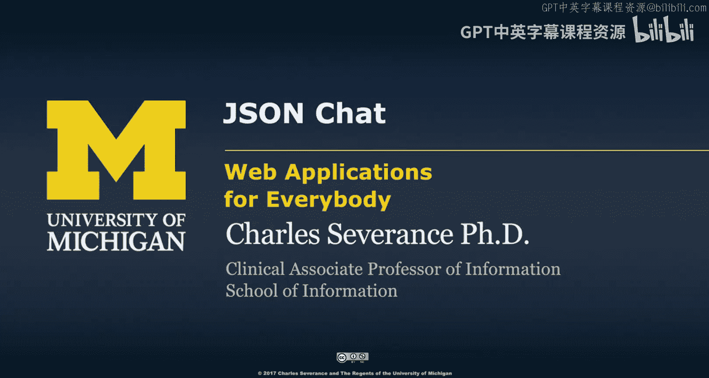
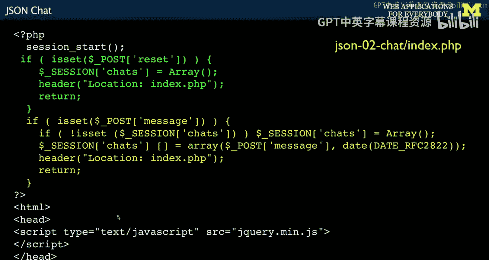
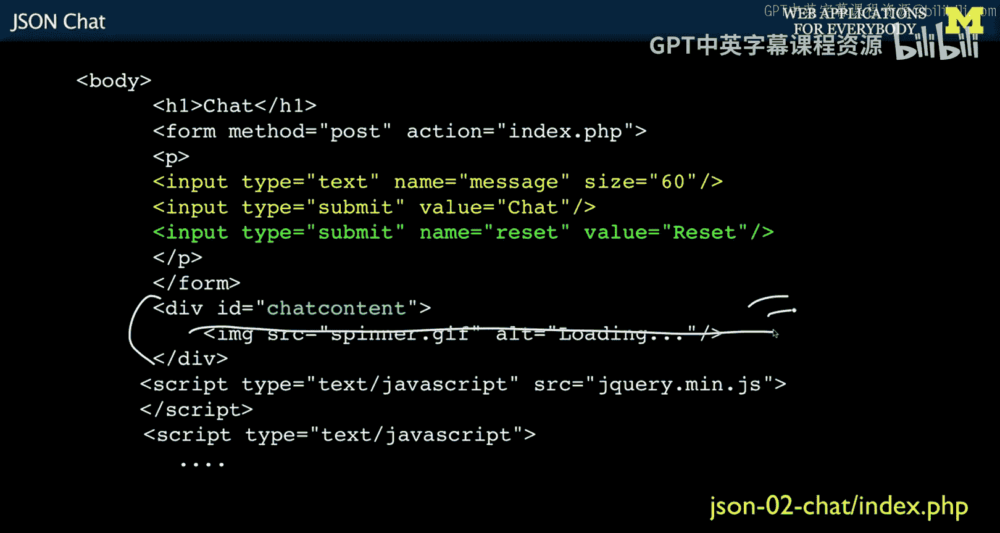
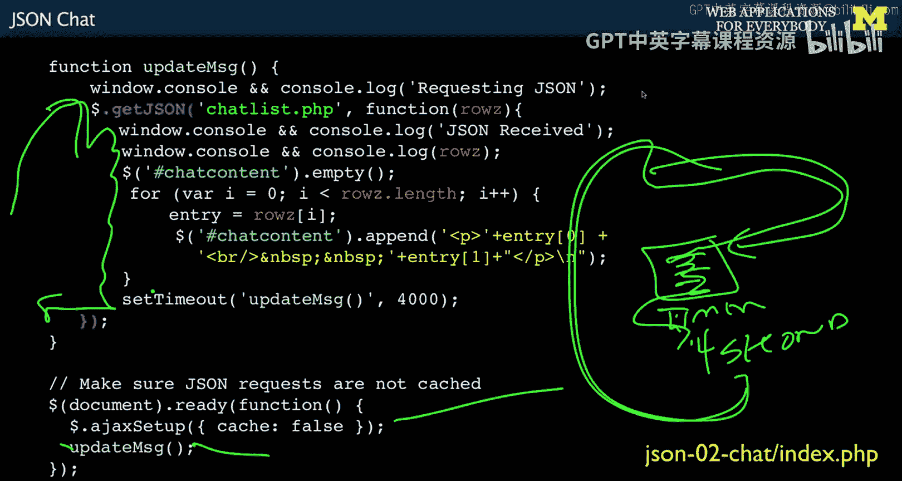
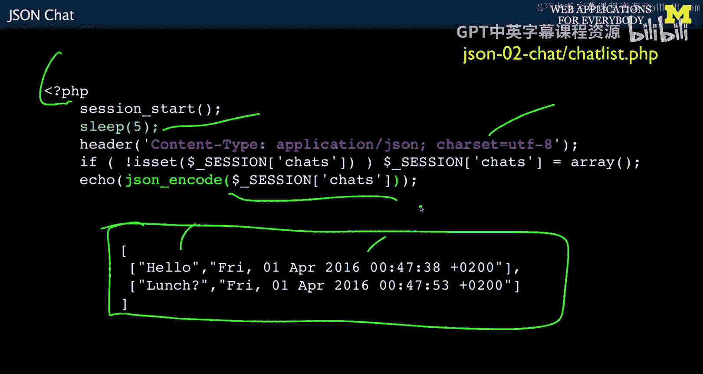

# 密歇根大学《面向所有人的Web应用程序（PHP、SQL、APP、JavaScript和JQuey｜Web Applications for Everybody》 p139 31_JSON聊天应用.zh_en -BV1Lr421A75d_p139-

So now we're going to do is kind of put this all together and do something useful within it。

 So we're going to write a simple chat application。

 Okay and so what we're going to do is chat application that can asynchronously pull。

 see the messages。 And I've used the example of like Facebook saying blink something happening。

 So that's the fun。 And I'll demonstrate this as well。 And so you can see it working。

 But I want to walk through the code and then in a separate video I will demonstrate how it works。

So index PhP in this JSson chat， we're going to use the session。 If there is a reset。

 we'll have a reset button out here。Throws the chats away that just sessions of chats。

 our data model is not a database we're just going to put an array of chat messages in our PhP session and like any post we're going to redirect back to ourselves。

And then we're going to have a message box， blah， blah， blah， and then send。

And if the message has been sent， we're going to just initialize our chats。 Otherwise。

 we're going to add a new item。 That's the message in the date that it was sent。

 and then redirect back。 And so this is the， this is sort of the model code for our chat application that both resets our chats and reusing session。

Under the key of chats， which is nothing more than array of chats， so it's very simple database。

Then we're going to include Jque。 Yep， simple enough。

 and you should be downloading this code so you can look at this code while I'm talking。

 and then we have some HTML Now we're in the view。So we have some HTML。

 we got a form that's going to give us our message， our message box。

 our submit button that says chat， and our submit button that says reset。

And we saw the processing of both chat and reset up there above。

 and all we're going to do is take this and stick it into session。Chats are going to be in session。

Then we're going to have a div。So I showed you an earlier one。

 the div result where theres nothing between the div。

 This is also a common thing because we're going actually load the initial chat。

 So we do is we put a spinner out。 And this one is display， Yes， it's not hidden underneath here。

 you'll see an animated gift until we wipe it out。 So what we're going to do is we're going wipe it out。

 once we get the first batch of chats And so thats So it's a common one thing you do is you hide you start with a hidden spinner。

 and then you start doing something and then you show the spinner。 And when that thing is done。

 you hide the spinner。 And this case， we're going to start by start by showing the spinner。

 And then get rid of it。 as a way of what if everything goes wrong later in the jque code that we're going write。

 what if everything goes wrong。 So this is a pattern of your static HTMLtl comes out and you put the spinner there And if everything goes well in half a second or so。

 you're going wipe that out with a dot empty and we'll see how that works。

 And then were going load j query。 And now we're going to go to the cold。That is now。

 to some degree our application code， we still have a little tiny bit of code in the server。

This code in the server that does our model。 Our model is still in the server， right。

 we tend to keep the model in the server。 We're just moving。

 so the model is going to stay in the server， especially when we start doing databases。

 but we're starting to move the controller。 some of most of the controller into the browser and certainly the view is all going to be in the browser。

 The view is coming out statically just coming out as HTML。 and then the updates to the view。

 the changing of the view。

That is going to be done in the browser。 And that's what we're going to do next。 Okay。

 so we're going to make a function And this function here， it's called update message。

It's not running， we're just defining this function and put a console message out。

 we're going to call chatlist。phP， so that's going to be a bit of PhP code。

It's going to take the chats and return JSO。So we're going to call JON。

 and then this is going to be an array。Of chats。And that's going to be decialized into this variable called rows。

What Z。And then if this works， we're going to say JO received。

 and then we're going to console log it just so we can debug it。

And then we're going to take that chat content and empty it。 and so if you recall chat content。

Is this div right here and empty just as wiping this part out。

 And because we're going to do this over and over and over again every few seconds。

 whatever eventually， this will be the chats themselves。

 and then we'll empty it and grab a new copy of the chats。 Now， right now。

 we're going to wipe it all out。 A smart thing like Facebook would only get the new chats and append to the end。

 That's a little too much work。 We're going to keep our life simple in this one just so we can kind of get through the basic notion。

So we're going to empty it。 and then we're going to loop through。

 And the thing that came back in rows is an array。 It's really an array。 It's been desialalized。

 It's already been desialalized for us。 So it's an array of chat messages。

 And the chat messages are themselves are two item array where the first one is the chat text and the second one is the chat date。

And so we're going to write a for loop。That's going to loop through all the rows that we got back。

And， you know， I equals 0， I rose in length。 lengthth is a method of arrays。

 because that's an array at this point。 We grab the entry and dot chat content append。

 So we got this div up here。It starts out empty because we emptied it。

 and then we're going to append the paragraph to it。 So we're going to just append P and the entry 0。

 which happens to be the message。And then entry sub1， which is the date。

 And so you'll see like high there， I throw a couple of blank spaces in。

 and then it puts the date down there。 And however many that are goes around and it just depends。

And as we're appending to the dom， the view that we have in the windows， See do do do do do， right。

 so we don't know how this is going to be called yet。 but this， this， when it's called。

 it starts a process to retrieve the messages wipes out the chat div。

 then puts the messages that came back from the server into the chat div。 Now。

 how are we' going to cause this to run every few seconds。 Well。There is a jascript。 Now。

 this is not a jQury。 So this is just plain old old jascript。 And so sometimes we use jquery。

 Sometimes we' use old jascript set time out。Says run this code。 Liter， we put code in a string。

 And then every 4 seconds， that's 4000 milliseconds。

 So the way this works is we're going to call this set time out once。

 But we're only going to call it。 So this， this code right here。Is the success code。

So the get request goes in， the PhHP runs。The Json comes back。

And we are sort of waiting here in our success code。This code right here is our success code。

 And so the Json comes back and then success code runs。 And at the very end of the success code。

 we say， okay， and four seconds from now， do it again。

 So this basically registers kind of in a timer event that says in four seconds， we do this again。

 But we only do it at the end of the success code。So it turns out if this blows up。

 then at least we're not trying it over and over every 4，000 milliseconds。

So that still doesn't get it started。 That just tells us once it started， do it again in 04000 mill4。

4000 milliseconds。 So that's the defining the function that's going to run every 4 seconds and causing once it's run。

 because when you， when it runs。Its resets the timers。 so got to reset the timer。

 You can't say every 4000 or every 4 seconds。 You just have to say， okay， now 4 seconds from now。

4 seconds from now，4 seconds from now。But then we're going to end the jascript， we're going to say。

 okay， when the document is ready。 again， that's the idiom。

 That's the jquery idiom that says when the document is ready， run these two pieces of code。

 So this little cut line of code is aja setup cash false。

 And that basically means that the browser might cache this response。 So you would do a get。

 And it wouldn't actually oh shoot。 I didn't mean to hide that。 but that's okay。 I know what it said。

Yet。Does the PhP？That comes the JO。Then we run our code。So， let's draw。This is the Internet。 right。

 That's the internet here。It's a cloud。So caching is the notion that the browser without you telling it might say。

 you know what， I've already got a copy of this。 You ask for that 4 seconds ago。

 I've already got a cache locally cache copy and its short circuits and doesn't actually do it and gives you back the old Json 4 seconds ago。

 That's not what you want。 You really and truly want to go to the server every time。

You want to go to the server every time and so what you say is cache equals false so that that that suppresses this short circuiting that the browser might do on your behalf saying I'm saving us a little bit of network bandwidth by not actually retrieving it because it's the same URL that you've asked for。

And it actually just adds a get parameter。 That's how the caching works， like time。Equals。

 And then the current time。 And then this always changes。 So then the caching。

 it goes past it because you don't have the document that's with this get parameter。

 So if you watch it， you see that the you see a get parameter get added。 And that's the caching。

 That's just something you set once。 And then update message。 And so what update message does。

 Is it runs this code， which grabs it。Grabbs it and then runs the success code and then runs the timer again。

So the first time it do we just call it when the document has donet finished loading。 it runs。

 It fills the chats in， and then it sets itself up to run again 4 seconds later。 So 4 seconds。

It goes and does it again。Update the thing。 Set it 4 seconds。 Wait， wait， wait， wait， wait， update。

 And so that is kind of our way of writing a loop。 Now， this， again， goes back to asynchronous code。

The fact that we can't just sit in a loop and say， go wait four seconds， go wait four seconds。

 We say do something， set a timer to cause me to be called back again in four seconds。

 So you have to always think async。 And again， this is the reason why I don't like teaching ja as the first language because asynchronous programming is something that takes a while for you to kind of get and understand It's super powerful。

 And it's necessary so that the browser can be doing lots of things at the same time。

 You can't have the browser stop and wait because then it can't do the other things because you might have one thing that's running on a foursecond clock that's updating the chat message。

 you might have another thing that's running some other thing。

 which is a little red thing that pops up with need software updates or something。

 So all these things are running simultaneously And so this asynchronous code pattern of you know start something and then record code that runs when it's all said and done。

 And if you start looking at things like no dot js， which is jascript in the server。

You just realized that this is kind of the JavaScript thing because it was necessary。

 It's a called cooperative multitasking where you're giving up the control and saying call me back later。

s it's a powerful， powerful pattern， but it takes a little bit of getting used to。

So if we just take a look at what's inside the server， it's pretty straightforward。

 So this is the code that's listening to the thing coming in the server chatlist。phP。

 we start the session that's so we can read it。 we sleep5 so there' little spin thing waits for a while we tell it that we're going to send JsonN back and we just simply Json and code sessions of chats which gives us a JsonN bit that looks like that because it's an array of arrays。

 two element arrays with a date in a time， two strings and that's what comes back and that's what we parse and that's what produces the output for our chat application。

So the next thing is how to build a cruD application。

 and I'm not even going to bother going through that in slides。

 we'll just wait until I'm going to actually demonstrate that code for you by showing you how the code works。

So。I take you back to the very beginning of this JSON code。And in a very few lines of code。

 we can have amazing cooperation between the browser and the server with a few lines of code。

 we're doing stuff， you know pulling all this stuff across， rendering it in the browser。

 creating all this wonderful interactivity， setting timeouts。

 It's really beautifully simple and it kind of the hard parts of the serialization。

 decentialization in the Json kind of get out of your way after a while。

 And what you find is you're writing more and more code in the browser and less and less code in the server and and in the programming assignments as we go forward you'll see that where we're just moving different ways of thinking about how to best use code in in the browser。

 and then the server code kind of drops down to this really focusing on the model。

 and some of the business rules。 so I hope you found this helpful。

 And I look forward to showing you some of the demonstrations of this actual code when it's working。

😊。

