# 密歇根大学《面向所有人的Web应用程序》：p14：CSS样式设计 🎨


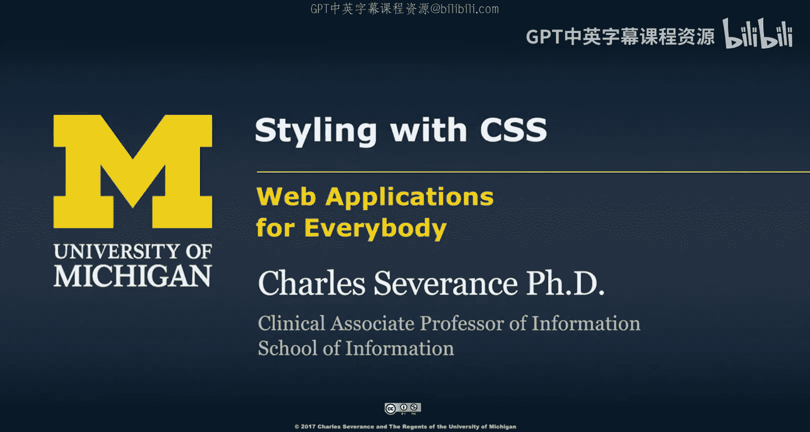


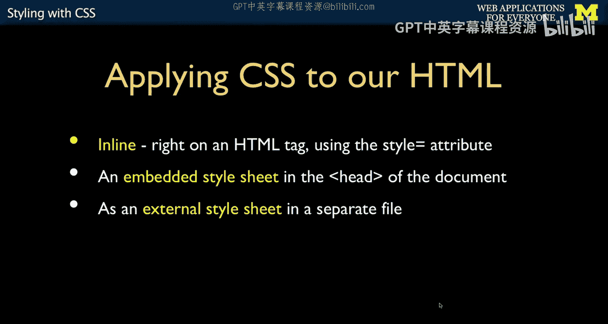

在本节课中，我们将要学习如何在HTML中应用CSS来改变网页的样式。我们将介绍三种主要的CSS引入方式，理解“层叠”的含义，并学习如何使用`<div>`、`<span>`标签以及类和ID选择器来精确控制样式。

## 概述

CSS（层叠样式表）用于定义HTML元素的视觉呈现。要使用CSS，首先需要将其与HTML文档关联起来。有三种主要方式可以实现这一点：内联样式、文档头部样式和外部样式表。理解这些方法以及CSS的“层叠”规则是有效设计网页的基础。

## CSS的三种引入方式

有三种主要方法可以将CSS规则应用到HTML文档中。

### 1. 内联样式

内联样式通过HTML标签的`style`属性直接应用。这种方式定义的样式只对该特定标签有效。

例如，我们可以为一个段落标签添加红色实线边框：
```html
<p style="border-style: solid; border-color: red; border-width: 5px;">这是一个有边框的段落。</p>
```
`style`属性内的规则仅作用于这个`<p>`标签，不会影响文档中的其他段落。

### 2. 文档头部样式

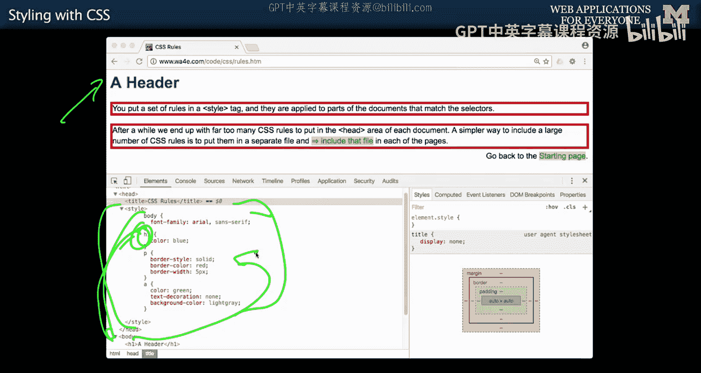

我们可以将CSS规则放在HTML文档的`<head>`部分的`<style>`标签内。这样，样式可以应用于整个文档中的特定元素类型。


例如，在`<head>`中定义规则，使所有`<h1>`标题变为蓝色：
```html
<head>
    <style>
        h1 {
            color: blue;
        }
    </style>
</head>
<body>
    <h1>这个标题是蓝色的</h1>
</body>
```
这种方法比内联样式更高效，因为你无需在每个`<h1>`标签上重复编写`style="color: blue;"`。这遵循了“不要重复自己”的原则。

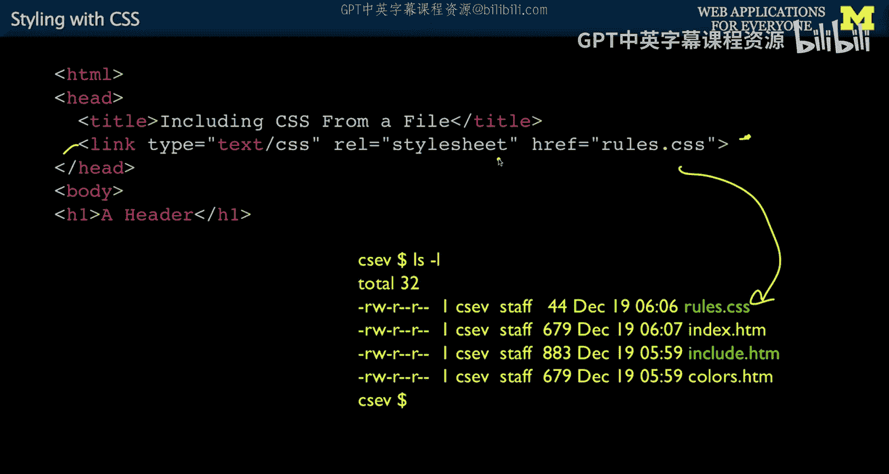

### 3. 外部样式表

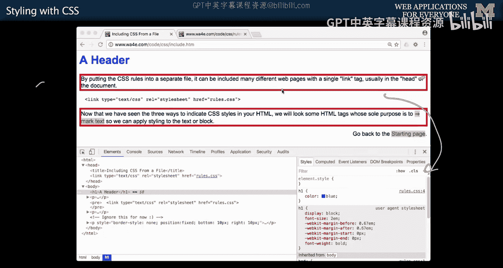

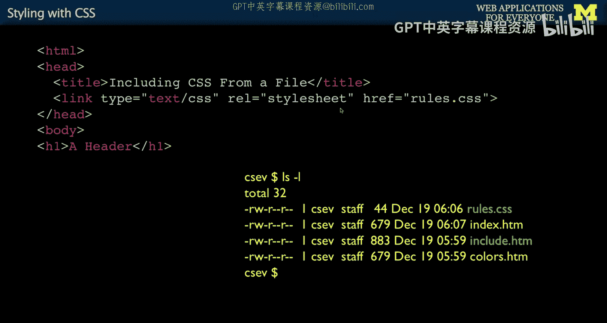

最常用且推荐的方式是将CSS规则保存在一个独立的`.css`文件中，然后在HTML中通过`<link>`标签引入。

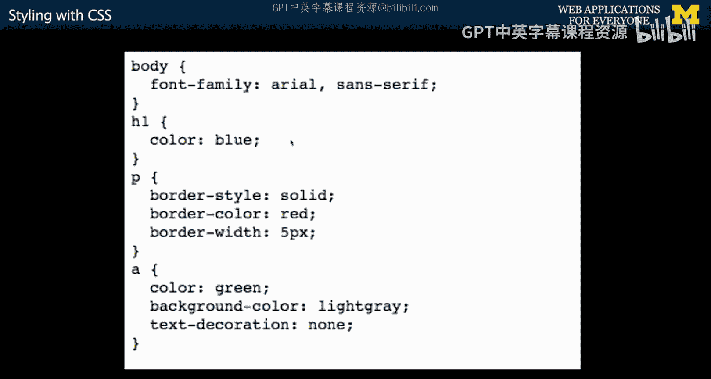

例如，创建一个名为`style.css`的文件：
```css
/* style.css */
h1 {
    color: blue;
}
```
在HTML文件中引入它：
```html
<head>
    <link rel="stylesheet" href="style.css">
</head>
```
这种方式使HTML文档更简洁，并且同一个样式表可以被多个页面共享，有利于维护和浏览器缓存。

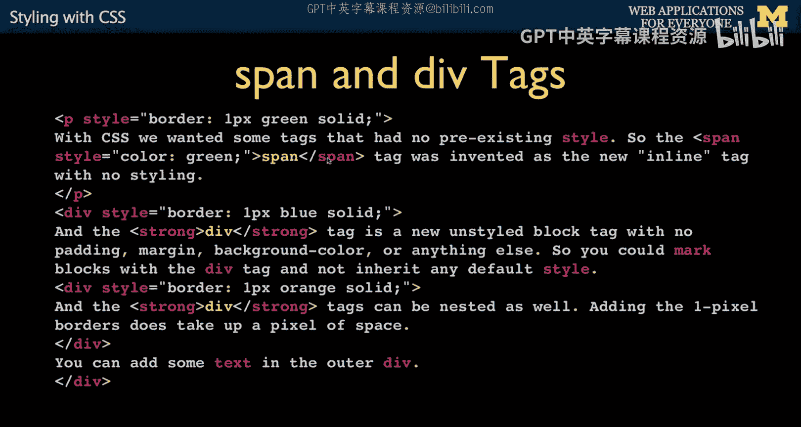

## 理解“层叠”


“层叠”是CSS的核心概念。它意味着样式可以继承自父元素，并且更具体的规则会覆盖更一般的规则。

例如，如果在`<body>`标签上设置了字体：
```html
<body style="font-family: Arial, sans-serif;">
    <p>这个段落继承了Arial字体。</p>
    <p style="font-family: monospace;">这个段落覆盖了继承的字体，使用等宽字体。</p>
</body>
```
第一个段落继承了`<body>`的Arial字体。第二个段落通过自己的`style`属性覆盖了继承的规则，使用了`monospace`字体。离元素“最近”的样式规则具有最高的优先级。

## 使用 `<div>` 和 `<span>` 标签

`<div>`和`<span>`是HTML中两个没有默认样式的通用容器标签，专门用于配合CSS进行布局和样式化。

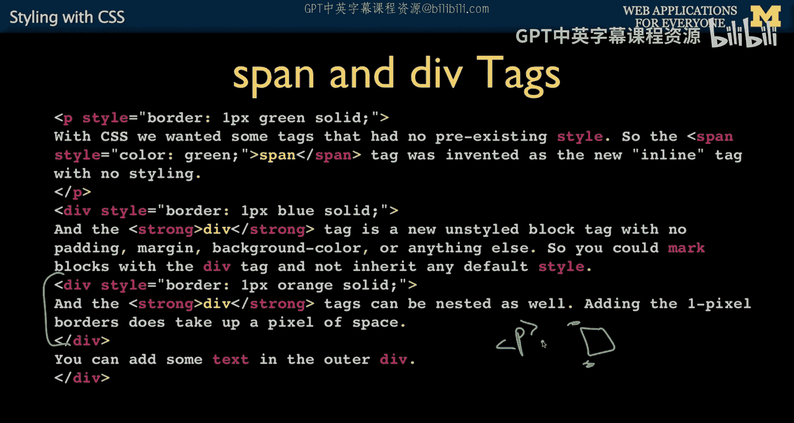

### `<span>` 标签

`<span>`是一个**行内元素**。它不会打断内容的正常流，就像`<b>`或`<i>`标签一样。它本身没有任何视觉效果，仅用于标记文本的一部分以便应用样式。
```html
<p>这是一段<span style="color: red;">红色</span>的文字。</p>
```

### `<div>` 标签

`<div>`是一个**块级元素**。它会独占一行，打断内容的水平布局。与`<p>`（段落）标签不同，`<div>`没有任何默认的边距或内边距。
```html
<div style="border: 1px solid black;">第一个div块</div>
<div style="border: 1px solid black;">第二个div块紧挨着第一个</div>
```
两个`<div>`会上下排列，并且如果没有设置`margin`或`padding`，它们之间将没有空隙。而`<p>`标签则自带上下边距。`<div>`标签可以嵌套使用，常用于构建页面布局结构。

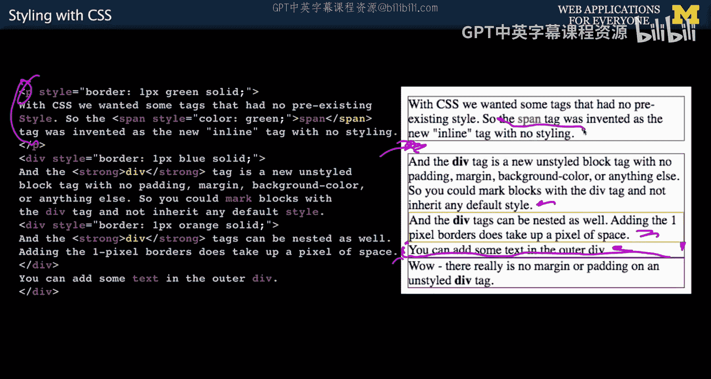

## 使用类和ID选择器

为了更灵活、更高效地应用样式，避免重复代码，CSS提供了类和ID选择器。

### 类选择器

类选择器以点号`.`开头。同一个类可以被多个HTML元素使用，一个元素也可以拥有多个类（用空格分隔）。
```css
/* CSS规则 */
.highlight {
    background-color: yellow;
}
.large-text {
    font-size: 20px;
}
```
```html
<!-- HTML应用 -->
<p class="highlight">这个段落有黄色背景。</p>
<p class="highlight large-text">这个段落既有黄色背景，又是大字体。</p>
```

### ID选择器

ID选择器以井号`#`开头。在一个HTML文档中，每个ID应该是**唯一**的，只能用于一个元素。
```css
/* CSS规则 */
#main-header {
    color: blue;
    text-align: center;
}
```
```html
<!-- HTML应用 -->
<h1 id="main-header">网站主标题</h1>
```

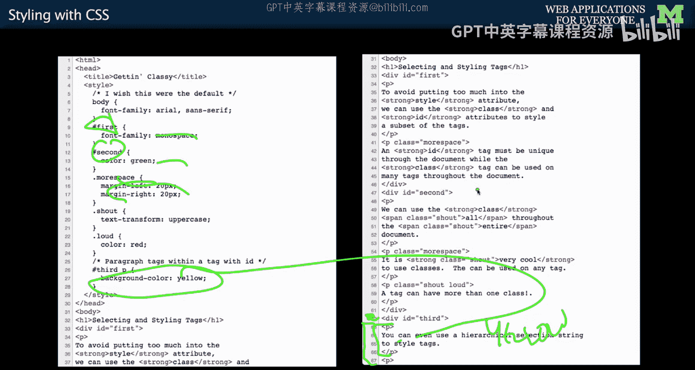

### 选择器组合与层叠示例

选择器可以组合使用，并且层叠规则在此同样适用。更具体的选择器规则会覆盖更一般的规则。
```css
/* 规则1：所有在id为“container”的元素内的段落 */
#container p {
    background-color: lightgray;
}
/* 规则2：拥有“special”类的段落（更具体） */
p.special {
    background-color: orange;
}
```
```html
<div id="container">
    <p>这个段落背景是浅灰色。</p>
    <p class="special">这个段落虽然也在container里，但因为special类更具体，背景是橙色。</p>
</div>
```

## 总结


本节课我们一起学习了CSS样式设计的基础知识。我们掌握了三种引入CSS的方式：内联样式、文档头部样式和外部样式表，其中外部样式表是最佳实践。我们理解了“层叠”的含义，即样式继承和优先级规则。我们还学习了如何使用没有默认样式的`<div>`（块级）和`<span>`（行内）标签作为样式“钩子”。最后，我们探讨了使用类（`.`）和ID（`#`）选择器来创建可重用、模块化的样式规则，从而构建更清晰、更易维护的网页。