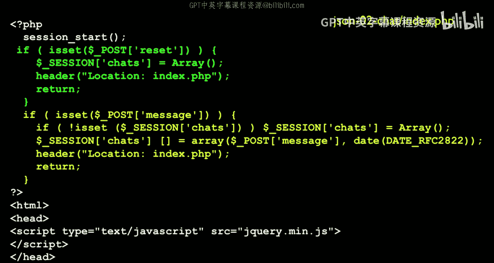
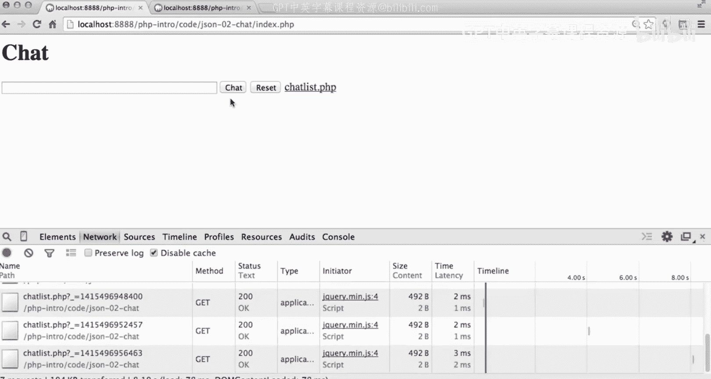
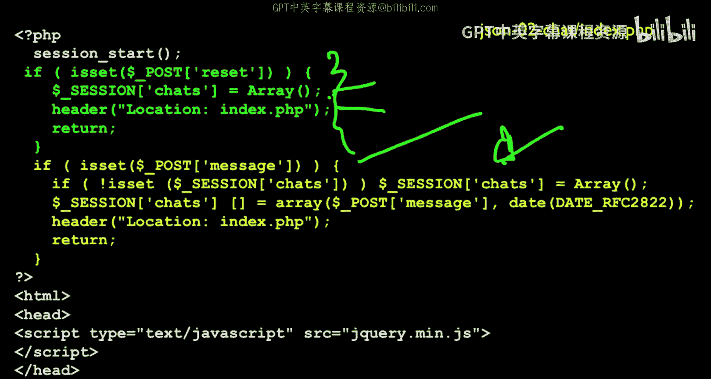
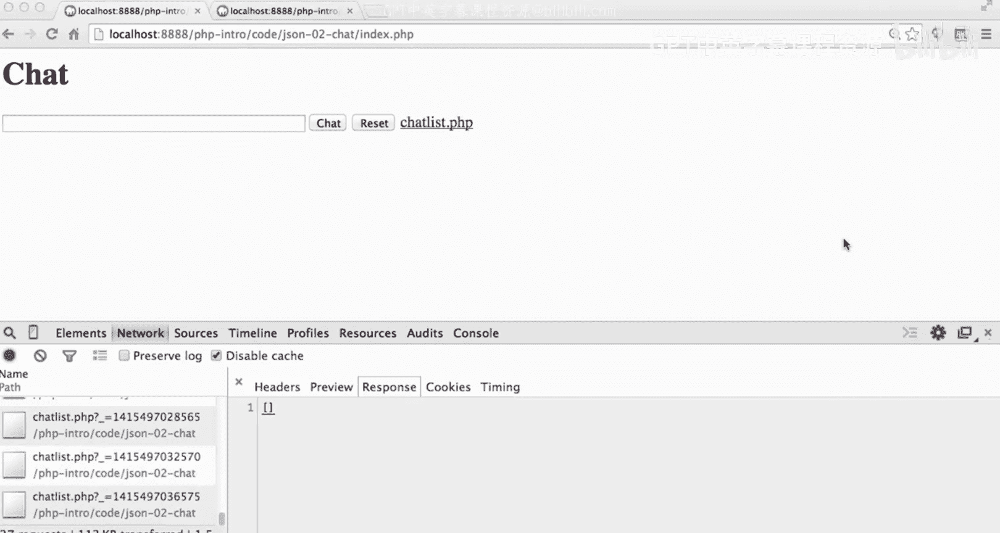
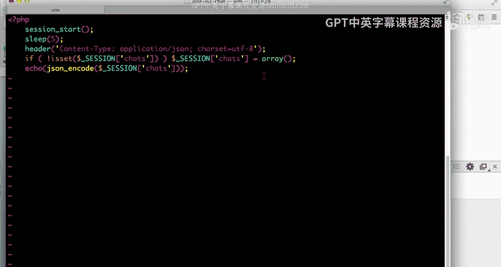
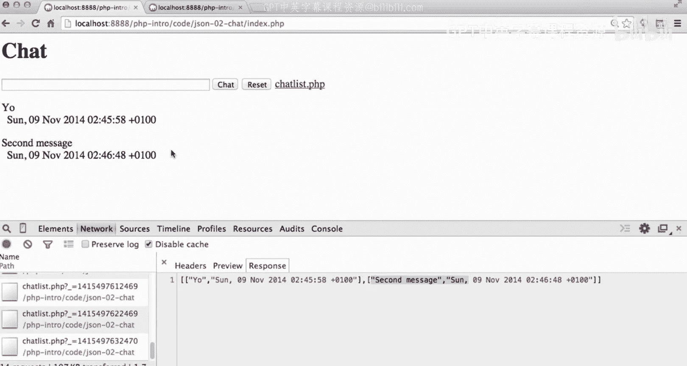

# 密歇根大学《面向所有人的Web应用程序》：第32讲：JSON聊天应用代码详解

在本节课中，我们将学习一个使用JSON、Ajax和JavaScript定时器实现的异步聊天应用。我们将详细解析其工作原理，包括前端如何定时获取数据、后端如何提供数据，以及两者之间如何通过JSON格式进行通信。

上一节我们介绍了异步通信的基本概念，本节中我们来看看一个具体的应用实例。

## 应用概述与演示

这是一个我十分喜欢的应用，本质上是一个聊天程序。它的核心特点是能够异步更新聊天数据。

首先，我们来运行并体验一下这个应用。基本思路是：我在一个窗口中说“hi”，应用会回复“hi”。我可以在第二个窗口中以不同用户的身份打开应用。

现在我有两个窗口，两个窗口都能看到彼此的聊天内容。我可以在第二个窗口输入“window2”并发送，然后回到第一个窗口，它会看到来自第二个窗口的消息。两个窗口都在异步更新并获取对方的聊天记录。

通过开发者控制台可以观察其运行机制。在网络面板中，可以看到它正在调用 `chatlist.php` 来获取当前的聊天列表。当我在第二个窗口中发送新消息后，片刻之后，第一个窗口会通过另一个 `chatlist.php` 请求获取到包含第三条消息的更新列表。这个应用利用JSON、jQuery和一个定时循环来保持所有窗口的聊天内容同步。

这是一个异步聊天应用。我可以重置所有聊天记录，重置操作也无需在两侧窗口都执行，因为几秒钟后，所有窗口的状态都会同步更新。以上就是这个聊天应用的基本功能。

## 后端处理逻辑

接下来，我们深入分析一下代码是如何实现这些功能的。

首先，代码处理标准的POST请求-响应周期。如果是重置请求，我们会将聊天记录存储在会话（Session）中，因为我们暂时不想使用数据库。我们通过检查 `$_POST[‘reset’]` 是否存在来判断是否为重置请求，因为HTML中的重置按钮被命名为“reset”。

如果检测到重置请求，我们就清空会话中的聊天数组，然后重定向回页面本身。如果收到的是消息，代码会先检查会话中是否存在聊天数组，若不存在则创建一个空数组，然后将日期和接收到的消息存入数组，最后进行重定向。

这样，POST请求就会处理这个聊天数组并继续执行。在代码中，我们可以看到这个聊天数组。

在代码中，我们看到返回的聊天数组。目前，聊天数组是空的，因为我刚刚重置了它。

以上是文件上半部分的主要逻辑。接下来，我们看看前端如何与后端交互。

## 前端界面与JavaScript逻辑

在文件中间部分，我们加载了jQuery库。往下看，可以看到聊天相关的代码。这里有一个基本的表单，它会将数据提交回页面自身。表单包含一个文本输入框、一个提交按钮、一个指向 `chatlist.php` 的链接（用于调试），以及一个重置按钮。

然后，我们有一个id为 `chatcontent` 的div元素。我们设置这个id是为了方便用jQuery来操作它。初始时，我们在里面放了一个旋转加载图标（spinner），并设置了“加载中”的替代文本，这样在数据加载时用户能看到提示。

继续往下，我们定义了一个名为 `updateMessages` 的函数。这个函数的核心作用是：启动一个每4秒执行一次的定时器。函数内部首先记录一条日志，然后发起一个Ajax调用，请求 `chatlist.php` 这个URL。

参数 `cache: false` 是为了防止浏览器缓存响应，确保每次都能获取新数据。其原理是在请求URL后附加一个基于时间戳的GET参数。

如果请求成功，我们会收到返回的JSON数据，并将其记录到控制台。然后，我们清空 `chatcontent` div的内容。返回的数据结构是一个数组的数组，每个子数组包含消息和日期。

我们使用一个JavaScript的for循环来遍历所有聊天消息。循环变量 `i` 从0开始，直到小于数据长度 `data.length`。在循环体内，我们提取每条消息：`data[i][0]` 是消息内容，`data[i][1]` 是消息日期。

在清空 `chatcontent` div并解析完返回的JSON数据后，我们将每条消息和日期作为一个新的段落（`
`标签）追加到div中。

最后，我们使用 `setTimeout` 这个JavaScript原生函数（而非jQuery函数），设置在4秒后再次调用 `updateMessages` 函数自身。因此，`updateMessages` 函数的工作流程是：获取数据 -> 清空聊天div -> 插入所有聊天记录 -> 计划4秒后再次执行自己。

函数定义完成后，代码立即调用一次 `updateMessages()` 来启动整个更新循环，这样页面一加载就会立即获取消息。

## 数据接口 `chatlist.php`

现在，我们来看看提供数据的 `chatlist.php` 文件。为了让演示更清晰，我应该始终在 `chatlist.php` 中保留 `sleep(5)` 这行代码，这样数据返回会变慢，便于我们观察异步更新的过程。

`chatlist.php` 的唯一作用就是向我们的应用返回JSON数据。首先，我们设置一个内容类型（Content-Type）头部，这是一种良好的编程习惯。之前我们一直使用 `text/html`，但这里我们明确告诉浏览器，我们将发送的是 `application/json` 格式的数据，并且字符集是UTF-8。这个头部必须在任何实际数据输出之前设置。

接着，代码检查会话中是否存在聊天记录。如果不存在，就创建一个空数组。然后，它简单地使用 `json_encode()` 函数对存储在 `$_SESSION[‘chats’]` 中的变量进行编码。这个变量是一个数组，其中每个元素又是一个包含消息和日期的两元素数组。`json_encode()` 将这个PHP数组转换成一个JSON格式的字符串并输出。

## 运行流程演示

让我再次演示一下整个流程。首先，我取消 `chatlist.php` 中 `sleep(5)` 的注释，这样更容易观察。

清空控制台日志，然后刷新 `index.php` 页面。我们会看到旋转图标，因为此时 `chatcontent` div 的内容还没有被更新。我们请求了 `chatlist.php`，但由于其中设置了5秒休眠，所以需要等待。最终，`chatlist.php` 返回了数据（一个空数组，因为没有消息），然后前端JavaScript用这个空结果覆盖了旋转图标，图标随之消失。

现在，我切换到第二个窗口，输入“yo”并发送。然后回到第一个窗口等待。我们的4秒定时器会到期，但请记住 `chatlist.php` 会休眠5秒，所以总共大约需要9秒才会有反应。过一会儿，第一个窗口的定时Ajax请求完成，它清空了 `chatcontent` div，然后收到了一个包含“yo”消息的数组的数组。JavaScript循环遍历这个列表，将消息和日期插入到div中。

我再在第二个窗口发送第二条消息。回到第一个窗口，再过大约9秒（4秒定时 + 5秒休眠），它会再次获取数据，此时div被清空后重新插入了两条消息。那个JavaScript的for循环清空整个div，然后遍历数据列表，依次输出每条消息及其日期。

## 技术总结

这就是整个应用的实现原理。如果我们回顾代码，其核心机制是：每4秒调用一次 `updateMessages` 函数，该函数请求 `chatlist.php` 获取JSON数据。当请求成功并解析数据后（此时在JavaScript中它已经是一个数组），会调用success回调函数。我们在回调函数中写一个for循环，为数组中的每个条目创建一个段落，其中索引0是消息，索引1是日期。

本节课中我们一起学习了如何组合使用这些技术：利用jQuery驱动JavaScript定时器，通过JSON进行数据交换，然后动态地更新文档对象模型（DOM），而无需完整的页面请求-响应周期。所有这些操作都相当简洁，但清晰地展示了如何将这些基础部件组合成一个功能完整的异步Web应用。