# 密歇根大学《面向所有人的Web应用程序（PHP、SQL、APP、JavaScript和JQuey｜Web Applications for Everybody》 p141 33_代码详解：JSON CRUD操作.zh_en -BV1Lr421A75d_p141-

So I want to continue our discussion of JQuery and JSON and just do a small modification to our cruD application。

 our create， read， update and delete application and you can grab the code from PP intro/ code/ JSsonN03Cd。

 zipip and you have to see this one needs a little database connection and there's some instructions that get your database set up So what this is。

I this is our standard cru application， so here's our credit application， if you recall。

 you can add something， I don't know。Greece。10，10。 and so we can delete things。

Remember all these it's our cru application， but I've done something different in this Ct application。

 I've actually used JSON to give us the list of in this ad and so it's sort of like a hybrid thing so we have JSON that we can look at and so there's this what I've done is。

Let me take a quick look at the code the way it used to work。

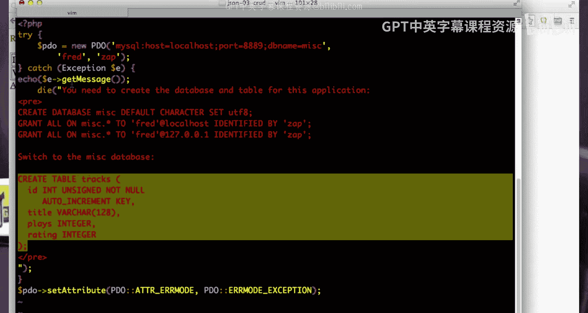

So let me edit the way it worked before just to sort of review how it works。 So we've got our。

Our code here， we've got our little flash messages， we create a table， we start the table body。

 we do a query， then we write a loop that goes through all the rows。

 and then we print all the stuff out， right， the rating the plays， all those things。

 we make up a little edit。 PhP for the edit button and each of the rows， and a way we go。

 and that's how we did it the first time。We're going to do this a little bit differently。

We are going to in this one， we're going to do it in two steps。

We are going to do this in JavaScript with JQuery and pull the list of the tracks using JSON。

So I need to have an HTML entities inside of。Javascript because I don't want to have HTML injection and so I make a function that does that I have standard。

 these are just flash messages so I can see if a worked or not。

 and then I do this interesting thing where I make a table right I have a table with a border of one I have a table body and I give it an ID so I've got a table body where。

That's nothing。 it's totally empty。And then after that。I go and I lapse into JavaScript。Okay。

 and then what I do is I call Doll get JO just like I did in the chat list。And I called get Json。

 PhP and I。I have a function。That is called when that JsonN is successful and parsed， Okay。

 so get Json。 PhP and。I set a variable found。 Now， data itself is going to be a list。

 and that's because。That's what it does， it makes an array。Of the rows。

 And then it Json encodes the exact rows。 and then Prince gives them to me in Json。 So it is a list。

 It has a length。 It's it's a full fledged jascript object at this moment。 So I loop through。

And I pull out。The row and the row has key value pairs。

 so let's take a look at what the row looks like。

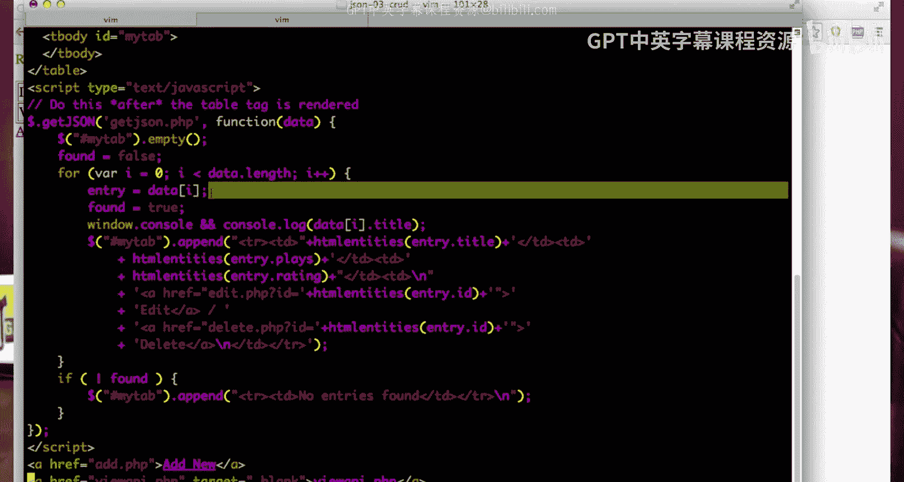

If I am。Go here and I say。Get JsonN。 PhP。So this is what the JSON is going to look like。

 this is JSON， it's a list。And title plays rating ID。

 that is the data coming straight from my database， and if I take a look at the code。

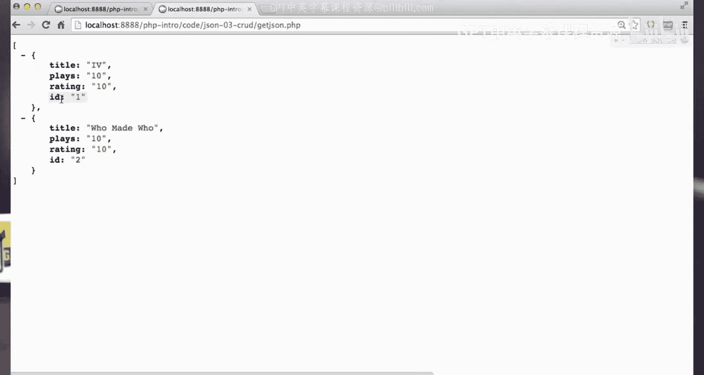

All I did was did a fetch。 And I created an array of rows。 Now， each row is an array。

 So this is like an array of arrays。 And that's why it looks like this。 Actually。

 it's an array of objects because they're key value pairs。 Sorry， So row is an associative array。

 rows is a linear array。 rows and associative array。 So this is a linear array of associative arrays。

 which in javascript becomes a linear list of javascript objects。 and key。

 that's the column from the table column from the table， key value pair， key value pair。

 key value pair。 So get Json。😊。

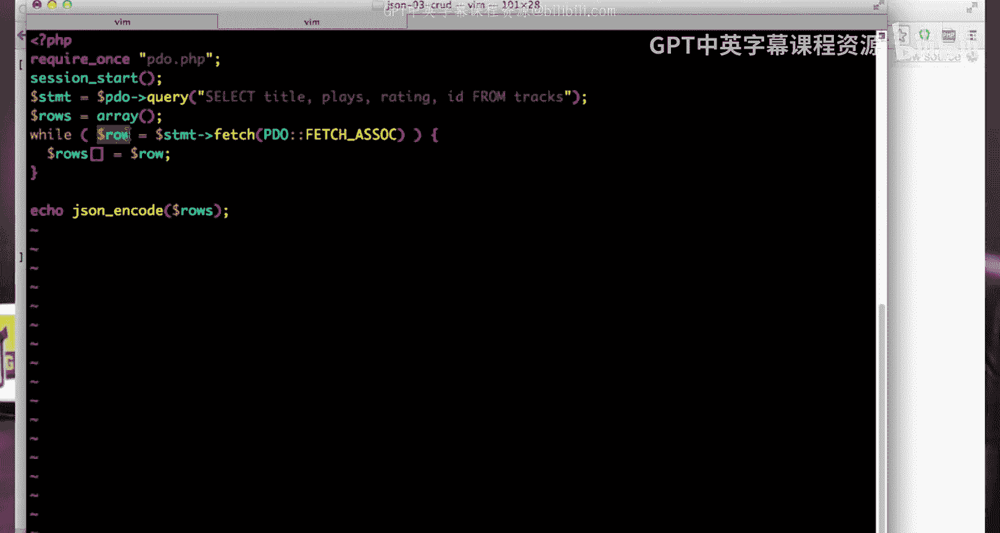

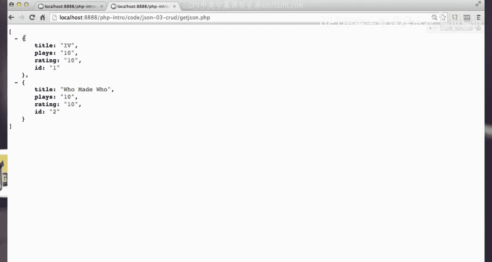

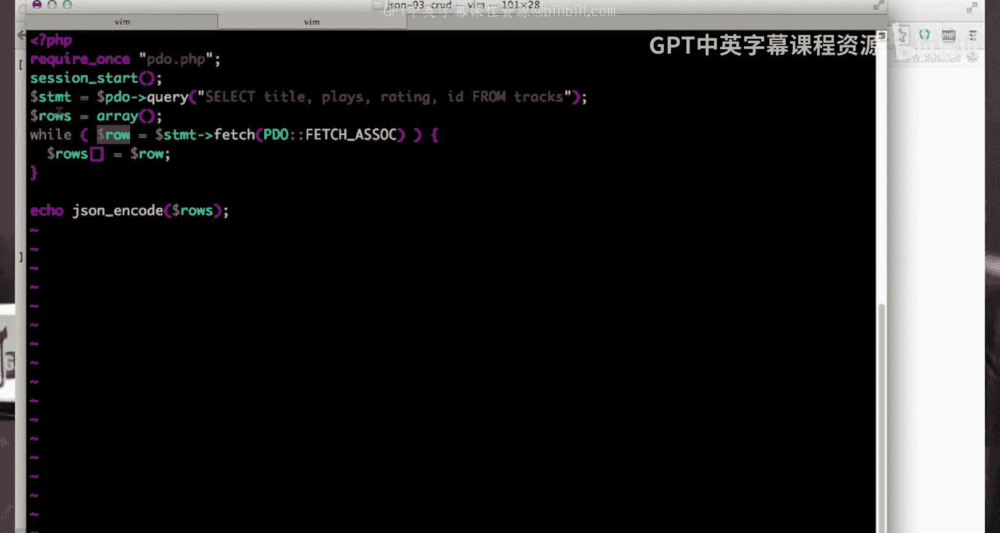

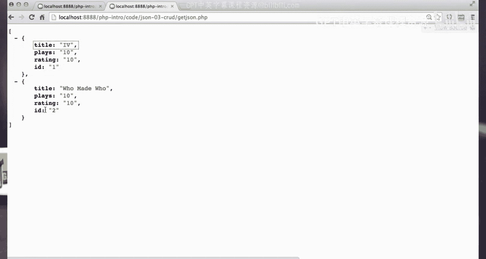

Again， just reads。All these things， select title plays writing an ID from tracks。

 and then loops through that。Results set and then encodes it at the very， very end。

I probably should put a header here to indicate that it's a application JSON to be cleaner。

 but we get away with it。And so and so I have this this each of these items in this case。

 there's going to be two of them， right， two of those items， each of these items。I'm going to log it。

And then what I do is I go with JQury and I grab my tab， now my tab is this table body。

 and I'm going to append some HTML to the end of it。And it's this big long string， it's a table row。

 table identity， Hities of the entity title， This looks a lot like the old PhP that I had except now I'm doing this。

 so let's take a look at the index at old。Right so I was doing all these echoes of the data this was doing it all in PhP。

 but now the PhP has sent JSON the JavaScript and now I'm doing the exact same thing in JavaScript and so I end the table and start a new table the TD and I put out the plays and the rating and then I create the Hf for the edit tag and I take the ID。

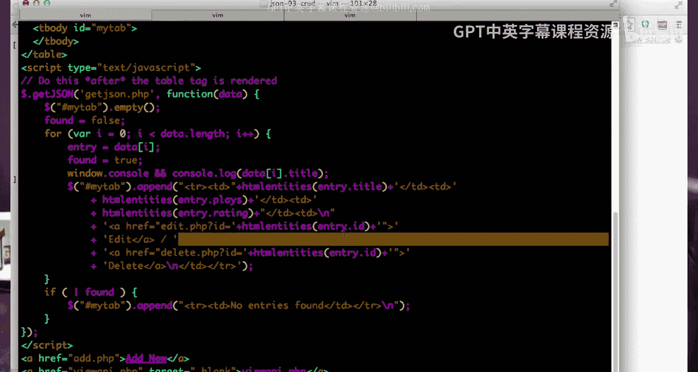

All， the ideas。This guy right here， it's one， right， it gives me that number and I can put that in。

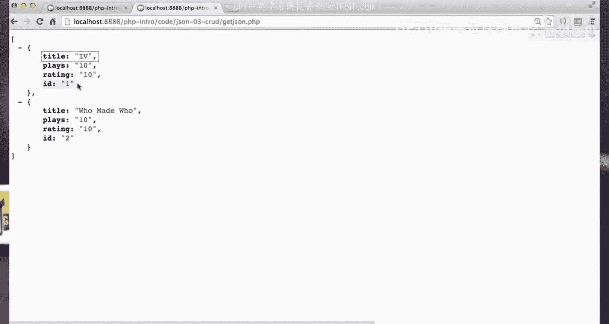

And I create a delete， and so this basically creates the table rows。

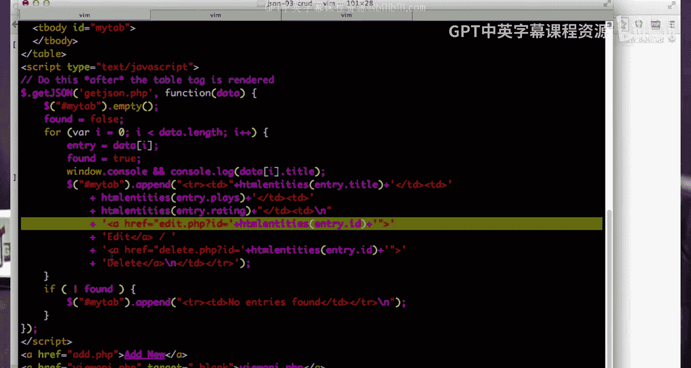

Right so if I hit。Index。phHP， if I do a view source here。If do of View source。

 you will notice the table doesn't have anything in it。

And that's because the JavaScript is actually what put that code in， I put those table。

 these things came from JavaScript， these lines in the table came from JavaScript。

Okay。And so this is， I mean， it's not that super amazing if it goes to this loop and it doesn't find any data。

 then it just says no entries are found。But basically。

 this is a simple example of how you take a database query and you take the results of that database query and then you just send it back as a bunch of JSON。

 and then you parse the results。 Now you could debate what's the best way to do it。

 Is this the better way to do it。It's a little more complex than this way。

 but these kind of techniques allow you to dynamically update so for example you might have a table and then you might have it so that new entries just are added at the bottom automatically。

 which is kind of more like our chat application and so it's really up to you to decide what combination of sort of serverside rendering。

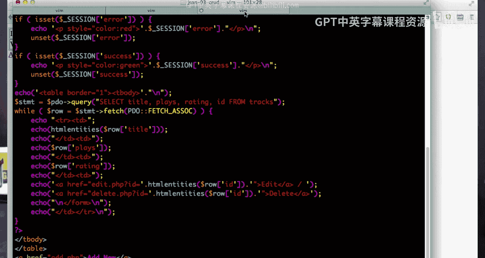

Like this， this is serverside rendering。Because it just comes back with a table fully formed in the request response cycle。

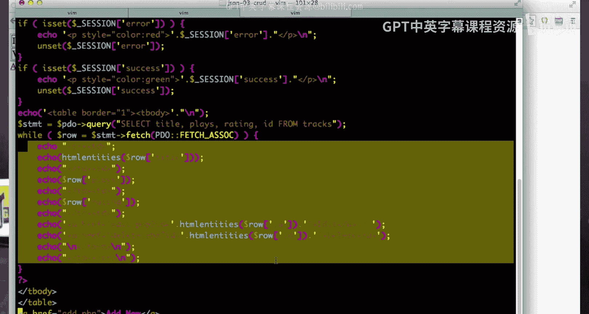

If I change this to。Indexol dot PhP。If I go to index old dot PB。

 all the rendering is going to be done on the server side， and if I do a view source of that。

You will see that my table is fully formed right that was all rendered inside PhHP as it came back in the response to the Ht2B response。

 whereas in this one， when I look at the view source， my table appears to be empty。

But then this JavaScript code filled it up。And so I'm not trying to tell you that one of these techniques is better than the other。

 I'm just sort of showing you that this is a technique that is used on some websites where they would prefer to in a sense。

 give you a relatively empty webage and in the background。

 fill it in piece by piece and that's why you see a lot of the spinning things and things go pop pop pop pop pop pop pop because they're using this technique to sort of do all the rendering in the browser。

 pulling data through JON for the various pieces of the screen。

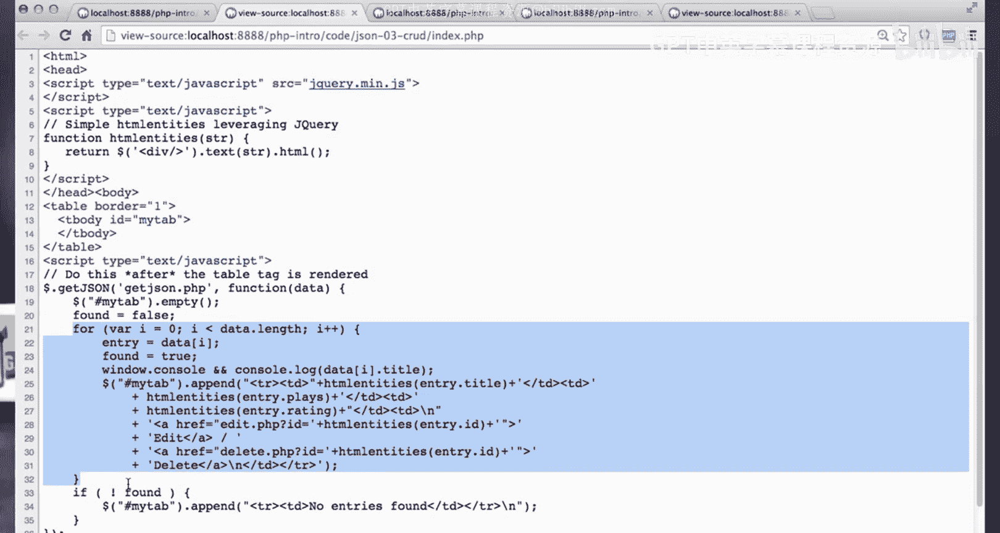

And it's sort of a six and one half a dozen on the other and different designs will prefer different approaches。

 okay so that's sort of our exploration of doing a crud like application。

 but adding some JSON capabilities to it。

🎼Yeah。