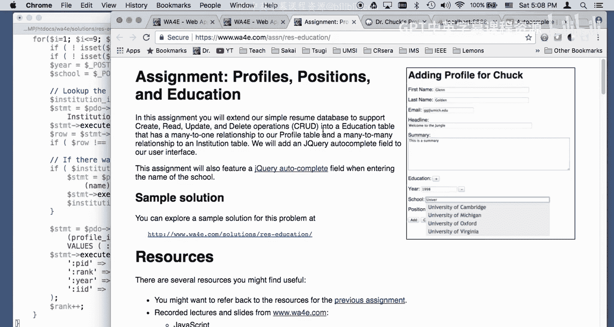

# Web Applications for Everybody：34：配置文件职位信息与JSON详解

在本节课中，我们将深入探讨一个关于个人资料、职位和教育信息管理的代码实现。核心学习目标包括：练习使用JSON数据格式，以及实现一个“多对多”的数据库关系。本教程将逐步解析代码逻辑，帮助你理解如何构建一个功能完整的编辑页面。

## 概述

我们将分析一个包含个人资料、职位和教育背景编辑功能的Web应用。该应用允许用户动态添加、删除和修改信息，并利用JSON和jQuery UI实现教育机构的自动补全功能。课程重点在于理解“多对多”关系的数据库设计以及前后端如何通过JSON进行数据交互。

## 代码演示与数据库准备

首先，我们运行代码并准备数据库环境。应用运行在 `http://localhost/`。

我们清空现有的个人资料数据，以确保从干净的状态开始。使用SQL命令 `DELETE FROM profile` 来删除所有记录。由于设置了级联外键，相关的职位和教育记录也会被自动删除。

接下来，我们创建两个新表来支持教育信息功能。

```sql
CREATE TABLE Institution (
    institution_id INTEGER NOT NULL AUTO_INCREMENT,
    name VARCHAR(255),
    PRIMARY KEY(institution_id)
) ENGINE=InnoDB DEFAULT CHARSET=utf8;

CREATE TABLE Education (
    profile_id INTEGER,
    institution_id INTEGER,
    year INTEGER,
    rank INTEGER,
    PRIMARY KEY(profile_id, institution_id),
    CONSTRAINT education_ibfk_1 FOREIGN KEY (profile_id) REFERENCES Profile (profile_id) ON DELETE CASCADE,
    CONSTRAINT education_ibfk_2 FOREIGN KEY (institution_id) REFERENCES Institution (institution_id) ON DELETE CASCADE
) ENGINE=InnoDB DEFAULT CHARSET=utf8;
```

`Institution` 表作为查找表，存储机构名称。`Education` 表则建立了个人资料（`profile_id`）与教育机构（`institution_id`）之间的“多对多”关联关系，并记录了入学年份（`year`）和排序（`rank`）。

然后，我们向 `Institution` 表预插入一些初始数据。

```sql
INSERT INTO Institution (name) VALUES ('University of Michigan');
INSERT INTO Institution (name) VALUES ('University of Virginia');
INSERT INTO Institution (name) VALUES ('University of Oxford');
INSERT INTO Institution (name) VALUES ('University of Cambridge');
INSERT INTO Institution (name) VALUES ('Stanford University');
INSERT INTO Institution (name) VALUES ('Duke University');
INSERT INTO Institution (name) VALUES ('Michigan State University');
INSERT INTO Institution (name) VALUES ('Mississippi State University');
INSERT INTO Institution (name) VALUES ('Montana State University');
```

## 功能界面展示

完成数据库设置后，我们登录应用并查看编辑界面。

编辑界面包含个人资料、职位和教育背景三个部分。职位部分的实现与之前课程类似，允许用户添加多个职位条目，构成“一对多”关系（一个个人资料对应多个职位）。

教育背景部分是本次的重点。它包含一个具有自动补全功能的文本输入框。当用户输入学校名称时，应用会通过AJAX请求查询数据库，并以下拉列表形式显示匹配的选项。这个功能由jQuery UI的Autocomplete部件驱动。

例如，输入“Uni”会触发查询，后端执行类似 `SELECT name FROM Institution WHERE name LIKE ‘Uni%’` 的SQL语句，并将结果以JSON格式返回给前端。

用户可以选择已有的机构，也可以输入全新的名称。当提交表单时，如果输入的机构名在数据库中不存在，系统会自动将其插入 `Institution` 表，并在 `Education` 表中建立关联。

## 代码结构解析：编辑页面

上一节我们演示了应用的功能，本节我们来深入查看实现这些功能的代码，特别是 `edit.php` 文件。

`edit.php` 文件结构复杂，它依赖于一个共享的 `util.php` 文件来存放通用函数，以减少代码重复。

### 头部与安全验证

文件开头引入了必要的JavaScript和CSS库，包括jQuery、jQuery UI（用于自动补全）和Bootstrap。

接着是PHP代码，它首先进行一系列安全检查：
1.  防止未登录访问。
2.  确保通过URL参数传递了有效的 `profile_id`。
3.  验证该 `profile_id` 对应的个人资料确实属于当前登录用户。这是通过查询数据库，检查 `profile` 表中的 `user_id` 是否与当前会话中的用户ID匹配来实现的，防止用户越权修改他人资料。

### 表单提交处理（POST）

当用户提交表单时，代码会执行以下操作：

1.  **数据验证**：调用 `validateProfile()` 和 `validatePos()` 函数（位于 `util.php`）来检查个人资料和职位信息的有效性。值得注意的是，当前代码中缺少对教育信息的验证，这是一个可以改进的地方。
2.  **更新个人资料**：使用 `UPDATE` 语句更新 `profile` 表的基本信息。
3.  **处理职位信息（一对多关系）**：
    *   首先，删除该个人资料所有旧的职位记录：`DELETE FROM Position WHERE profile_id = ?`
    *   然后，调用 `insertPositions()` 函数（位于 `util.php`），循环处理提交的职位数据，将新的职位记录插入数据库。
4.  **处理教育信息（多对多关系）**：
    *   同样，先删除该个人资料所有旧的教育关联记录：`DELETE FROM Education WHERE profile_id = ?`
    *   然后，调用 `insertEducations()` 函数。这个函数是处理“多对多”关系的核心，我们稍后会详细分析。

### 数据加载与页面渲染（GET）

在显示编辑表单（GET请求）时，代码需要从数据库加载现有数据并填充到表单中。

1.  **查询数据**：使用PDO的 `fetchAll()` 方法，一次性获取该个人资料的所有职位和教育记录。`fetchAll()` 返回一个包含所有行的数组，比传统的 `while` 循环更简洁。
2.  **生成动态HTML**：
    *   **职位列表**：PHP循环遍历职位数组，为每个职位生成一组输入框（如 `year1`, `desc1`, `year2`, `desc2`），并为每个条目生成一个“删除”按钮。这个按钮的点击事件由JavaScript处理，用于在前端动态移除该条目对应的HTML块。
    *   **教育列表**：采用类似的循环方式生成教育条目。每个教育条目包含年份和学校名称输入框。学校输入框被赋予特定的CSS类（如 `school`），以便后续被jQuery选中并启用自动补全功能。
3.  **传递计数到JavaScript**：PHP将当前已有的职位数量（`$countPos`）和教育条目数量（`$countEdu`）直接输出到页面的JavaScript变量中。这是为了在用户点击“+”按钮动态添加新字段时，JavaScript能知道下一个新字段的编号应该从多少开始。

### 前端动态交互

以下是实现前端动态添加字段和自动补全的关键JavaScript代码：

1.  **动态添加字段**：
    *   当用户点击职位或教育部分的“+”按钮时，JavaScript会递增对应的计数变量（`countPos` 或 `countEdu`）。
    *   对于职位，通过字符串拼接生成新的HTML输入框组。
    *   对于教育，采用了一种“模板替换”的方式：预先在HTML中定义一个 `<script type=”text/template”>` 标签，里面是教育条目的HTML模板，其中用特殊标记（如 `@COUNT@`）占位。JavaScript复制这个模板内容，并将 `@COUNT@` 替换为当前计数，然后添加到页面中。

2.  **学校自动补全**：
    *   页面加载后，JavaScript会查找所有具有 `school` 类的输入框。
    *   对这些输入框调用 `.autocomplete({ source: ‘school.php’ })` 方法。
    *   当用户输入时，jQuery UI会向 `school.php` 发送AJAX请求，携带输入的前缀。
    *   `school.php` 接收参数，执行SQL查询（如 `SELECT name FROM Institution WHERE name LIKE ?`，参数为 `$prefix.’%’`），将匹配的机构名称以JSON数组格式返回。
    *   jQuery UI接收到JSON数据后，自动显示下拉建议列表。

## 核心机制：多对多关系的插入

现在，我们聚焦于处理教育信息“多对多”关系的核心函数 `insertEducations()`。

该函数接收个人资料ID和从表单提交的教育数据数组。

以下是其逻辑步骤的伪代码描述：

```php
function insertEducations($pdo, $profile_id, $educations) {
    $rank = 1;
    foreach ($educations as $edu) {
        $year = $edu[‘year’];
        $school = $edu[‘school’];

        if (空值检查) {
            continue; // 跳过空条目
        }

        // 步骤1：查找或创建机构
        $institution_id = false;
        $stmt = $pdo->prepare(‘SELECT institution_id FROM Institution WHERE name = :name’);
        $stmt->execute(array(‘:name’ => $school));
        $row = $stmt->fetch(PDO::FETCH_ASSOC);

        if ($row !== false) {
            // 机构已存在，获取其ID
            $institution_id = $row[‘institution_id’];
        } else {
            // 机构不存在，插入新机构
            $stmt = $pdo->prepare(‘INSERT INTO Institution (name) VALUES (:name)’);
            $stmt->execute(array(‘:name’ => $school));
            // 获取新插入机构的ID
            $institution_id = $pdo->lastInsertId();
        }

        // 步骤2：插入关联记录
        $stmt = $pdo->prepare(‘INSERT INTO Education (profile_id, institution_id, year, rank) VALUES (:pid, :iid, :year, :rank)’);
        $stmt->execute(array(
            ‘:pid’ => $profile_id,
            ‘:iid’ => $institution_id,
            ‘:year’ => $year,
            ‘:rank’ => $rank
        ));

        $rank++;
    }
}
```

**关键点解析**：
*   **查找或创建（Lookup or Create）**：对于用户输入的每个学校名称，首先尝试在 `Institution` 表中查找。如果找到，则使用现有的 `institution_id`；如果没找到，则执行 `INSERT` 语句创建新机构，并使用 `$pdo->lastInsertId()` 获取新生成的ID。
*   **建立关联**：无论机构是已有的还是新建的，此时我们都获得了它的唯一ID。然后，我们向 `Education` 表插入一条新记录，将个人资料ID (`profile_id`)、机构ID (`institution_id`)、年份 (`year`) 和排序 (`rank`) 关联起来。`(profile_id, institution_id)` 共同构成了这个表的主键，确保了同一个人在同一所学校只对应一条记录（年份信息包含在记录中）。
*   **`rank` 字段的作用**：用于控制教育条目在页面上显示的顺序，独立于年份。

## 总结

本节课我们一起学习了如何构建一个管理个人资料、职位和教育信息的复杂编辑功能。

我们深入分析了以下核心内容：
1.  **数据库设计**：理解了“一对多”（职位与个人资料）和“多对多”（教育机构与个人资料）两种关系模型，并通过外键和关联表来实现它们。
2.  **代码安全与结构**：学习了如何进行用户权限验证，以及如何组织代码（将通用函数放入 `util.php`）以提高可维护性。
3.  **前端交互**：掌握了使用JavaScript动态添加/删除表单字段的技巧，以及如何利用jQuery UI的Autocomplete部件和JSON与后端（`school.php`）交互，实现高效的自动补全搜索。
4.  **核心后端逻辑**：重点剖析了 `insertEducations()` 函数，理解了在处理“多对多”关系时“查找或创建”模式的经典应用，以及如何使用PDO安全地操作数据库并获取插入后的ID。




通过本课的学习，你应当能够掌握在Web应用中处理复杂表单和数据库关系的基本方法，并了解如何利用JSON增强前端用户体验。