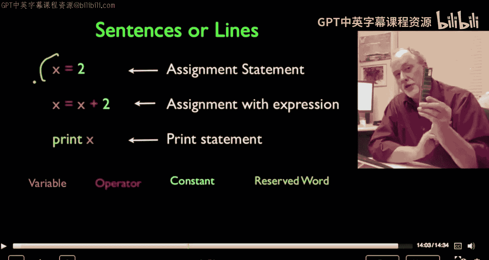
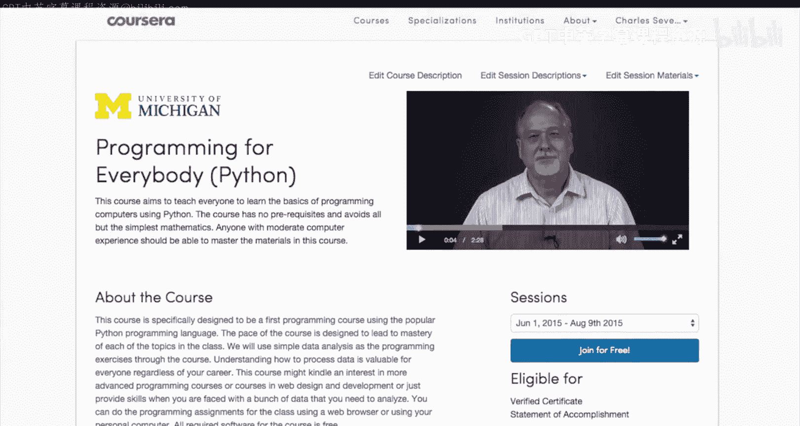

# 密歇根大学《面向所有人的Web应用程序》：第36章：趣味环节：Chuck的巴黎旅游秀

在本节课中，我们将跟随查尔斯·塞弗伦斯教授，了解他如何通过面对面办公时间与学生互动，并分享他在编程教学中的核心思考方式。

---

我的名字是查尔斯·塞弗伦斯。我是密歇根大学信息学院的教员。

自2012年起，我还通过一个名为Coursera的平台，教授了全球超过五十万名学生。

当我旅行时，我会邀请我的学生参加我所谓的“面对面办公时间”。大家好，我是查克。

我们现在在法国巴黎，为Coursera进行又一次的面对面办公时间。

我想让你们认识一些你们的同学。是的，我们在意大利米兰。

我们正在进行有史以来规模最大的办公时间之一，我想进行我们的标准介绍，这样你们就能看到每个人。所以请告诉我们你的名字，打个招呼，或者说说我在写作时的想法。

当我在设计一个操作系统时，我会想，哦，这里有一个我需要解决的问题，这里有这些性能和规格要求，我像一个计算机科学家一样思考。但当我编写一个Python程序时，

那就像是在邮件列表中寻找某种特定的邮件，然后将这些邮件与其他东西匹配起来，或者找出你的论坛中谁是最多产的发布者。

你真正在做的是，缓慢但坚定地将自己融入到那个程序中。在与学生们会面之后，

我和莫奥一起去和萨莉共进晚餐，她自2012年以来一直是我在Coursera上的一名志愿助教。

是的。好的，一件事是Nato sha mug，另一件事是来自另一个没有CTA或只是CTA已经到达的。

---

本节课中我们一起学习了查尔斯·塞弗伦斯教授通过旅行举办面对面办公时间的教学实践，以及他对于编程思维（从系统设计到具体问题解决）的见解。