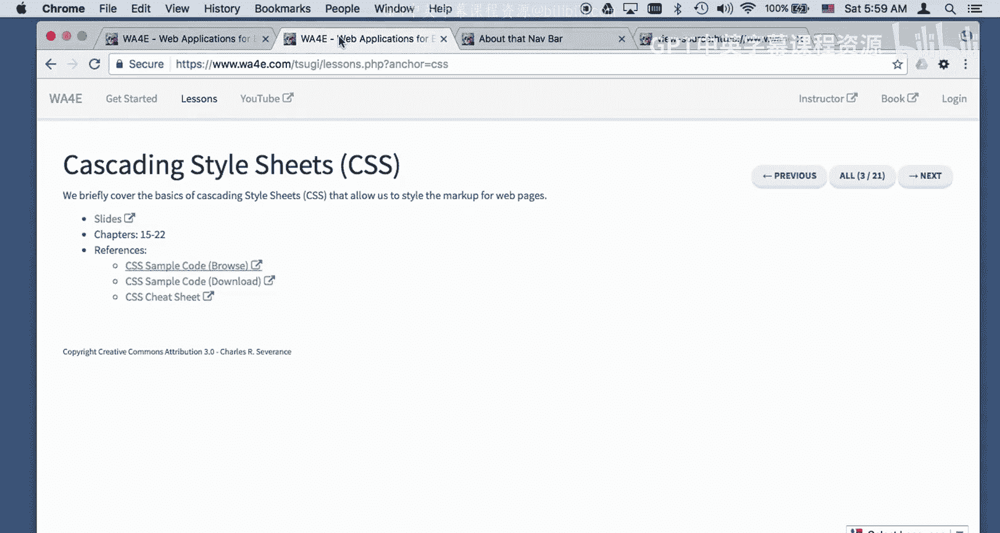

# 密歇根大学《面向所有人的Web应用程序（PHP、SQL、APP、JavaScript和JQuey｜Web Applications for Everybody》 p16 15_代码详解：CSS样式设计.zh_en -BV1Lr421A75d_p16-

So welcome back we're going to now we're going to take a look at some more examples we're not going to the one thing we're not going to look at is exactly how this navigation bar works at least until a little bit later so the next thing we're going to take a look at。

Is how fonts work。And there's a couple of ways that you can put fonts into a file。

 There are default fonts that every browser is required to produce like Serif， Sansif。

 monospace cursive and fantasy。 And so you don't exactly know what's going on but they're often used as fallback fonts and and so you can have those there are any font that is on the system like Arriel or Helvetica And so if you're going to use Arriel。

 not all systems have Arial， although most of them do these days and you have to have more than one font。

 Now another thing that's really common these days is to include a font somehow you find out about a font and here's a Lato font and you go look it up on the web and you find oh include this and so I included this link because I found this really cool font Lato and this extends the browser。

 the browser then learns about this font it downloads the font cachees them and keeps them in the browser and then I can make a font that's Lato but I just in case I'm off the Internet。

I can't download this thing。I have San serif is a fallback for Lato so Lato is a fancy font。

 et cetera， et cetera， so there's Arerel built in fonts， et cetera， et cea。

 and so that's how fonts work。Colors， there's a lot of cool stuff about colors。

 there's a couple different things Northern Nv for the moment。

I'm just using span tags here there' are some default colors in the earliest browsers these days we have all these fancy ones and you can go look these up and just Google for HTML colors and there's a bunch of names and then they're consistent across browsers but there's like 12 or so really solid names that are in all browsers since the beginning of time。

 but more modern browsers have a better palette of colors although really good graphic artists want to have much better control of colors and so this is the pound sign says that this is a hexadeadecimal number and it's got two digits Hex means they go all the way up to f so F is a through FR numbers8b is the red level 45 is the green level and 13 is the blue level and so this is a brownish color and then there's what's called webafe colors where you just have this ends up being 884411 but it sort of reduces。

number of potential colors if you were mixing colors from various sources。

And so and then in HTML5 you can see this color picker when you have a form which we'll talk about in a bit。

 it's a color form for modern browsers and then you can pop up with this button a color picker and I've got a little thing to print out what the color would be and so it just when I picked the green it basically puts00 FF that's red green and blue it puts that in into this thing which then the program could use you know could read this or JavaScript could read it or a server code could read it but right now we're just kind of playing with the picker and we pick a different color and so that that magenta is all the red。

 none of the green and all of the blue and orange。Is all the red。

 some of the green and none of the blue， so those are all just really strong colors and so that's what's called an HTML color picker。

Anchor tags in the old days anchor tags were kind of fununkky。

 they were blue if you hadn't yet visited them and they were purple if you had visited them and so this one I've obviously clicked on and so we have a whole series of styling mechanisms that we can have if we take a look at these I have put these all in the inside of an ID tag of cool so is this is basically saying find the ID tag of cool and then style anchor tags to make them a font weight bold。

So let's take a look here so I got one paragraph that has this one here and then I have a paragraph of an ID tag of cool and that's basically so I don't have to style。

 usually you wouldn't say I'm only styling the anchor tags inside of you know if I'm only st the anchor tags inside the a tag that has an ID of cool but that way I can have the default on this one that was my way of keeping the default。

 so normally you would just say a。So a links is red， if it's visited， it's orange。

 and so this one's been visited so you don't see the red， it means it's unvisited hover。

 you can change it so you notice when I hover in。The text decoration goes away。

 the underscore goes away and I have a color of text font color of white and a background color of na and then there is one last moment and I click on this one click there's one last moment that's really hard to catch and that is。

The moment of active if it the web was slow and you clicked on it。

 then it would tell the user in the old days this made more sense that it would turn red and then blink away I don't know if we'll even see it It kind of saw you sort of saw it So there was a color while you click on it Yeah there was you might not see it in the in the screen but that's what the that's what the。

The active means is you've clicked on it， but it hasn't yet been retrieved。

 and then like a moment letter， the whole page goes away。

Another thing we can do is we can play with images， okay， and so here is an image。

One of the things that's really fun to do with images is float them to the right or float them to the left。

 And then what happens is is that the image the text is drawn around the image。

 So it wraps around the image。 and you'll notice where I floated this left。 Oh。

 I kind of got rid of everything。 I floated it left before the H1。

 And so what happens is the H1 on top of the H1 in the top top of the image I'll line up and then all the text afterwards。

All the text afterwards wraps around it。And so you'll notice that I've got the image first and then the H1 second and that what the float sort of disconnects the image from the normal line of flow。

 floats it over and then takes this next thing and the next paragraph and saves the space for the image and shoves everything shoves the margin over so that it comes over here。

Now once you start floating images， you got to learn about this clear equals all because if we want this next paragraph like this one。

 want want we don't want this paragraph for whatever reason to be on the image now if it goes far enough。

You see this paragraph here moves back to the left margin and then this next one starts there。

 but if the browser is wider and the text is there's not so much text。

 we don't want this to be up in here and so you say BR clears all so between this paragraph and this paragraph we do BR clear equals all。

And you can put images right in the middle of a text like a character。

 you don't have to have them by themselves and you can even make。An image that's a clickable link。

 and so you can click on that image。Now C and CSsS stands for cascading style sheets。

 and so the idea is is that the tag that's closest。

Has more precedence than a further away tag unless you say important Okay。

 so here we have some style。嗯。Here we have a。A body tag， border style of dotted， red and red。

 a border color that's red and important and border width， it's five pixels， background color。

 which is kind of a grayish， that's that gray and an extra padding。

 so we've got put some extra padding all the way around it and extra margin。嗯。And so。

So if we take a look at this， we take a look at this paragraph right here。

 we see some things and we take a look at what we've got so we've inherited this we got a border style of color it wants to have a border color of green。

 but it doesn't because。And it says the border style is solid， so the border style of solid。

Is down here in the second style tag so the second style tag has precedence because it's closer to the paragraph and so we tried to say border color green。

 but that one was overridden。 So otherwise this would have a solid green border except that this red important is up there and so that the red important wins and you can see it really easily here that this was overridden and this is the one this border color from the previous one is taking precedence。

Okay。And so this is the second one and it would normally take precedence over this one except that this important is sort of like it is overriding the one that's closer so another example of closer is the style tag okay and so here we go this is border this is we're putting this I mean style attribute we're saying border style equals dashh bordercol equals blue and so the border style equals。

The border style equals dash holds on， but our attempt to make the border color blue is overridden again by the red important right so important is up above that。

Okay， and so this this dashed is winning and this blue is not winning because there is an overriding red above it。

 I mean， there's an overriding red important above it。

And so if you want to override an important tag。Yay， we override an important tag right here。

 we basically say I want a border style dashed。Come over here。

Border style dashed and I want the bordercol to be blue and this is important so now this one's closer and it says important so among all the important ones the closest important one wins so now we see that the bordercol actually takes here and we are overriding the far away this one this one here from farther away got overridden because of this one and so you can do that now。

In general， while I've shown you how important it works。

 you shouldn't do too much with important because usually you're taking CSSs from other places and you're patching it and you can end up with really inconsistent looks and fields with important。

 usually when you see important， it means kind of something's wrong and you're fighting with a framework or something else。

So let's take a look at some blocks。嗯。And so let's see background color， why each one's color blue。

And I'm going to put some padding and a margin and so div P and H1 sort of live in a box。

 you have sort of like the actual， so let's take a look and say this paragraph right here that's probably the thing to do this is just a plain an old paragraph。

Nothing special right， there we go， that's a paragraph right there。So。

So let's talk about the padding and the margin right so working from the inside out there is the actual text that is and it's wrapped and so if this if I change the width to this。

 this whole block changes right it gets taller and narrower。

 but at some point the inner part this inner part right here。Is。

The inner part is however large it becomes and that in this case it's 318 by 38 pixels right and then what happens is we sort of work from the out work from the inside out so I'll go down here and see the box model so the inside of this。

 the actual text is 619 pixels by 19 pixels and then I've asked to add 10 pixels of padding and that is between this sort of text and the border and then the border itself has a width and I specified that border width。

嗯。I said I want a five pixel border width and so the border width takes up five pixels and then there is outside of that。

There is margin and so margin is space。Notice that the padding and the text itself has the background of the block。

 border has its own color， and then the margin has the background of the color of the background document。

Okay so this is the margin here， it's the color of the background document。Right so content。

Padding border margin， and then but the padding inherits from the text in the box， from a background。

 and the margin inherits from the background document。And you can have different background colors。

 et cetera， et cetera， et cetera， this is an oh by the way。

 this is an ordered list that we've got going on right here。Okay， so that's CSS boxes。

We can change the size of these boxes it's a little tricky and so here we have autosizing div where we're not mentioning anything about the height。

 if we take a look at the box model here， we see that this one is simply you know the size of the text plus the padding plus the border plus the margin and that's sort of how that box gets sized。

 you can say that you want to set the size of the box。Okay so I'm going to set that to be three ms。

 three ms is three characters， but if you look I have too much in here and so you'll see that even though this box is three characters tall。

 it's four lines and so the three would fit but the fourth one doesn't and so it just overflows。

You can also， so three ms， it's good to set sizes and Ms when you can because then if someone makes the screen larger。

 oops， I didn't mean that。This one if someone makes this larger or smaller now the problem is。

 well I don't know about it if we'd call it a problem but。In the old days。

 if you set a height in pixels and you zoom the screen。

 the box where you set height and Ms would zoom and the one that you sent pixels wouldn't。

 but they decided to make zooming work otherwise zooming so many people boxes in pixels that they made it so that the zooming would pretend that pixels are really Ms。

 so it kind of converts pixels to ems but you're really technically you're supposed to avoid using pixels when you really mean characters if you want three lines。

 don't look at your font and say， I'll make this 40 pixels in order to do that and again。

 we still in this box we still have overflowing text and so we have a couple things we can do when we want to change the overflow we can tell a box that we would like the overflow to make little scroll bar。

And so here's here's that same stuff and you can see we got a little tiny baby scroll bar and it didn't sort of blur blop out of the box right and even if the scroll fits。

 you see you get little scroll bars but you can't scroll it because there's only one line there and it fits in the box。

And then another thing that you can do is。You can just say chop it off right chop it off now one thing with some Javavascript。

 you can put a little more here and that expands the box or pops a by or whatever。

 but I'm not going to worry about that for now for now we're just saying overflow hidden means。

Lay this out as much as you need and then you know throw this text away it's just not there anymore。

Like where did all this？All this text go， but it doesn't show it because we told it to chop it off。

Okay， so on to the next one。You can move these things around。啊。This is a little messy， there we go。

 let's make this a little different。Okay， so。So by default。

 I'll show you the HTML in a second for this， or maybe it's just do view source，' do view source。

Okay， so if you just say div div， they just follow after each other and I've given them border because to make them a little picture or give them some border some padding and some margin just so they don't touch each other too much so by default blocks just so I got a little border both on all sides and a little bit of space between them and a nice so they you know however big they get this one gets bigger and I put a width on them just so that so that they wouldn't move around and that's there's a width on it right there 10 ms 10 characters wide。

So they just follow each other。And then you can say， okay， you know， this block right here。

 this number three would lay out right here， but I have told the number three block。

I've told the number three block that I want to move relative to where you would normally be 20 pixels to the left and 20 pixels down from the top and so this block it lays out exactly as if it belongs right here and then we shoved it over and moved it down and it came over top of the number four block and so there you go and so the text afterwards this number four block。

Just comes next。And it's it's basically it's as if this laid out without that without the position relative and then this came afterwards。

 but then we sort of just shifted it and that's why this overlaps because this corner here is where three would have finished and then with a normal layout so you got to be careful with relative。

 I mean you don't usually want to make it so that they sort of blocklop on top of each other。Okay。

 and so now we're in four and then we're going to look at five and six and so five is what's called fixed text and you'll see I'm the five comes right here。

 but because I've got this this position fixed。This is fixed relative to the window。

 so it's 20 pixels up from the bottom and 30% of the way from the left margin。

 so you can see that this is 30% of the way from the left margin and it's the bottom of it is 20 pixels up from the bottom。

And you'll see that that green box never moves and that is because the fixed text is relative to the window and that's how we actually get this little length that never goes away and so there's a length that never goes away absolute texts I don't know why they call it fixed and absolute but absolute text is a little bit different it's relative to the parent element and so in this div right here。

 the parent element is the body tag and so when it's saying I would like this to be 40 pixels from the top and 30 pixels from the 30% of the way from the left。

 that means it's relative to the body tag and so the body tag starts up here。

 and so this has been sized 30% from there and whatever 40 pixels down。

And notice that that one goes with the scrolling， right， so that one goes with the scrolling。

And you'll also notice that between four， five and six， there's like it's as if there's nothing here。

 but if you look at the document， five and six are sitting there and that's because they are plucked out of the normal rendering stream and so they don't take up any space between four and seven。

 so they don't count in sort of the normal layout as the pages being laid out。And so so。

Here's number seven， for example。Actually， number eight。So here's number eight。

 and so this is positioned relative with a left of negative 1001000 pixels and so in a sense this stuff right here has been shoved off the screen to the left and so that's how we often will put text on that nobody sees just move it to the left but it takes up the vertical space anyways because it was just relative。

 it would have normally laid out here but the left shoved it over there and so that's basically some layout。

And so now we're going to talk about Z index， let's take a look at the source code here。

And so a Z index is the ability to what happens when things overlap okay and so this is a div number one has a Z index of 100。

 number two has a Z index of negative 1000 is sort of the background document and it works out pretty straightforward and I'm just moving these so they have to lay on top of each other you know and so you see this one here is negative 100 so it's kind of behind everything this one is positive 100 so it's in front of everything and this number three is。

Yeah， it's and I just put that there to be in the original document at with no Z index whatsoever。

 and so it's behind this thing that has a Z index of 100。Okay， and so that's Z index。

Like this little note way over here by the right margin says Z index is kind of tricky。

 everyone tries to be on top and you'll put the index of 100 and then you'll find that the navigation put itself as z index of 1000 or something like that right and so Z index is hard tobu and hard to fiddle with but at least now you know that Z indexes though when things look weird and they're overlapping in weird ways。

 Z index is what you're taking advantage of。And so now we'll take a look at kind of how this navigation works。

 okay。And so here's a couple things that the navigation does the body， of course， is font family。

 Ariel San Serif， the navigation bar itself。I guess I'll do a view source on this so we can look at the navigation bar。

 the navigation bar itself。This block， it's a block tag right that has a position of light gray and I've given it a height to 3M so it's like three lines and if I zoom this page in and out。

That gets bigger and smaller。I't get back to 100% it's three lines tall and I guess I didn't mean to say Arriel saying Sarah if I did that in case someone else wanted to change the body tech I guess so then I have within I want UL tags within the nav and that's one of the nice things about this nav being its own tag。

 I can style just the ULs inside here。OkayAnd so what I'm doing here is I'm saying I don't want any little circles。

 little dots， little bullets， I don't want any of those。

 I want to take away any padding that it has by default。

 this is one of those things that this UL inherits let's go down here and take a look at this and you'll see that。

This UL right here， so what's happening is this is the things that I've said in my CSS and I'm overriding some default things it's normally would be display it's a display block that's okay。

And so I overrode the list type style。And continuing on。呃。The list item inside of nav。

 that's what it is nav in list item I wanted to make that so let's inspect this guy right here inspect。

So if you look here。So and oh and I've got a class of back and so I have this position absolute which is relative to the parent right here and I have 20 pixels to the left of that upper left hand corner and so that's how this comes over here and and then I have a colored dark blue because it's it's a nav an anchor tag within。

An anchor tag within an LI tag within an A， that's what this is saying。

 dark blue text decoration of none， and so that that's where I get this color blue and no underlines。

嗯。And then this is the dot back， and so I use a back class to position this right here。

 and then I use the forwardry class to position this。Relative on the right， 20 pixels from the right。

 and so that's how I make the navigation bar work。And CSS is really a。A lot of work。

 we learn a lot about CSS and this is just a really short introduction to get you a sense of what the basic mechanics of CSS are。

 thanks for watching。

