# 密歇根大学《面向所有人的Web应用程序（PHP、SQL、APP、JavaScript和JQuey｜Web Applications for Everybody》 p18 17_在Macintosh上安装MAMP.zh_en -BV1Lr421A75d_p18-

Hello and welcome to our screen recording in this screen recording we're going to install the MP software for the Macintosh。

 so we're going to download from mapP。org。

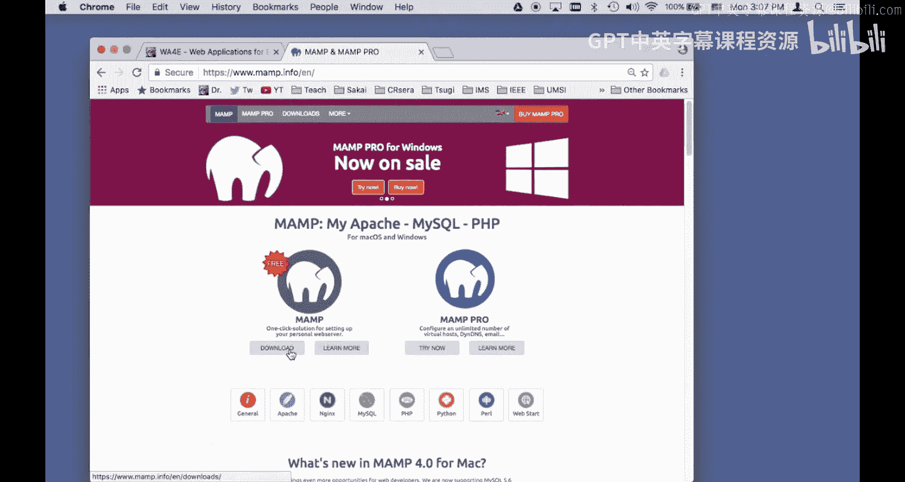

So I'm going to keep this， I don't quite know why a Macintosh is unhappy with that。

 and so I'm going to go into my downloads folder and here I have this folder and it's MAP Pro 0401 that's because I downloaded it twice and so I'm just going to click on this。

And it opens an installation。And I'm just going to accept all of the defaults here。Okay。

 so it's been installed， so let's take a look at where it's at。

 so if I open Finder and I go to my computer and I go into my hard drive applications。

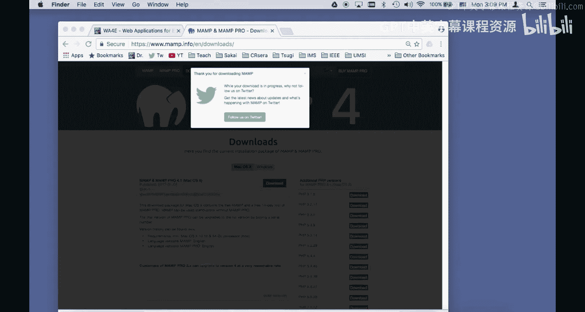

It's in map。And I can start map up。And this tells me a bunch PP info here is really useful because it tells you about the configuration of the system that you've got I've got。

I've got version 7 PhP， and it tells me where the configuration is for this and so I'm going to。

I'm going to go take a look at the configuration file and I'm going to make sure I going to do control F and look for display errors。

 so this is the problem we have when we're doing development with MA is a display errors is off okay and so I want to fix this by editing the initialization file and youve got to go to the right one applications map B PhHP。

 PP7。10 PhP I and I file。Okay and by the way， I've got the map control panel。

 this is your map control panel， starts and stop little green dots means that it's running。

 so I am going to run the Adamom text editor。

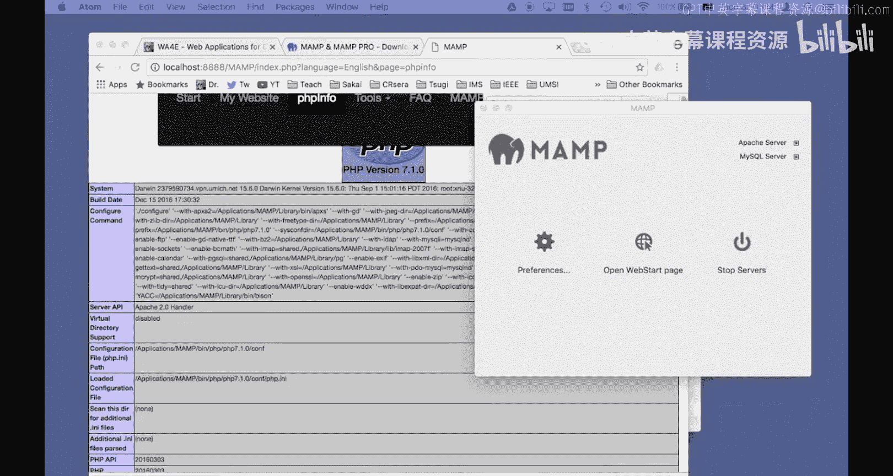

And I'm going to open a file。And I'm going to go to my Mac。Oh， wrongg， wrongg。

My Macintosh applications。Mamp。Let's see。 let's see。Mamp bin， PhP， Mamp bin。PH P。😔，PHP 7。1。0。Kanf。

PHP I and I yay， I found the file， so I opened this up and it's a nice little text file and this is the PhP configuration。

And I'm going to scroll down here。I look for a display。Arrors， if you don't do this。There we go。

 So we're looking for this line。 This says display errors equals off。 It talks about this。

 printout errors as part of the output for production websites do not， I mean。

 do not do this for production。 Sure， but we're doing development on our local hard drive。

 And so we won't turn this on because if you don't。You won't always see the errors。

 I'm going to turn up display startup errors I'm going to turn those on and so I want we want as many errors as we can in development。

 of course if you were running in production you would turn these differently and so what I'm going to do then is I am going to then save this file。

Command S， I've saved it Okay， now the thing you've got to do at this point is you' got to stop map and restart it。

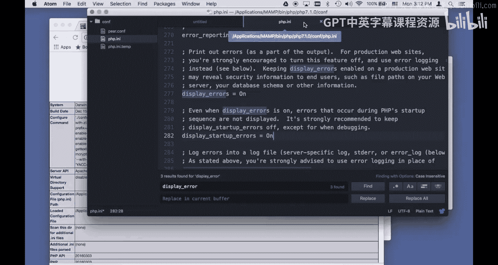

Stop the servers。Now the servers are stopped。And if I go to refresh this。

 it'll blow up because it's not there， but when I start these servers。It'll。They'll come up。

And I'll go to the web start page and I'll look for PhP info。I can close these tabs now。

And I should go down and look for display errorss on and on， see that's the success。

 that means that you are successful and that's great。Okay， so let's then also write a simple。

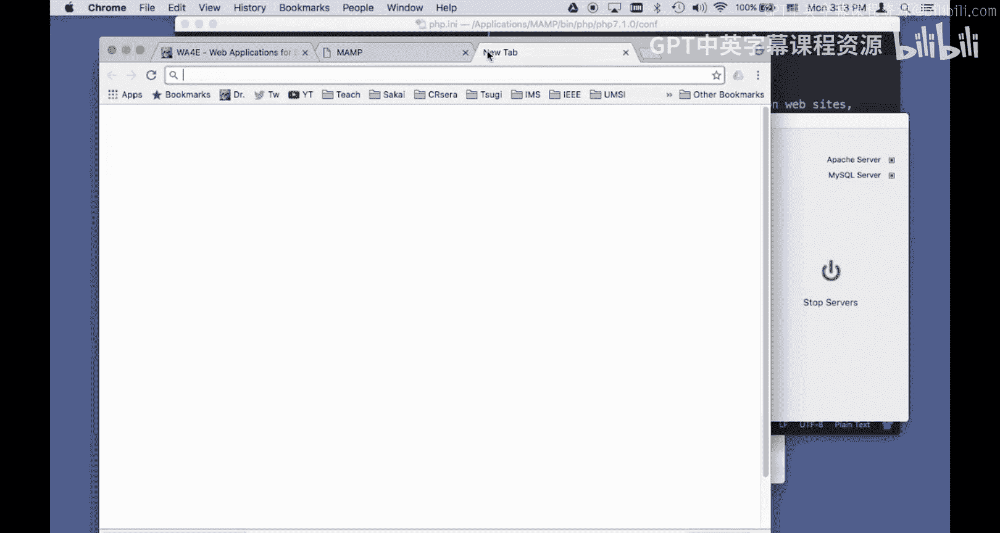

Little page I just。How do I get of I got to， I think， yeah， there we go。

I'm going to make a little file。Hello。From。My first web page。

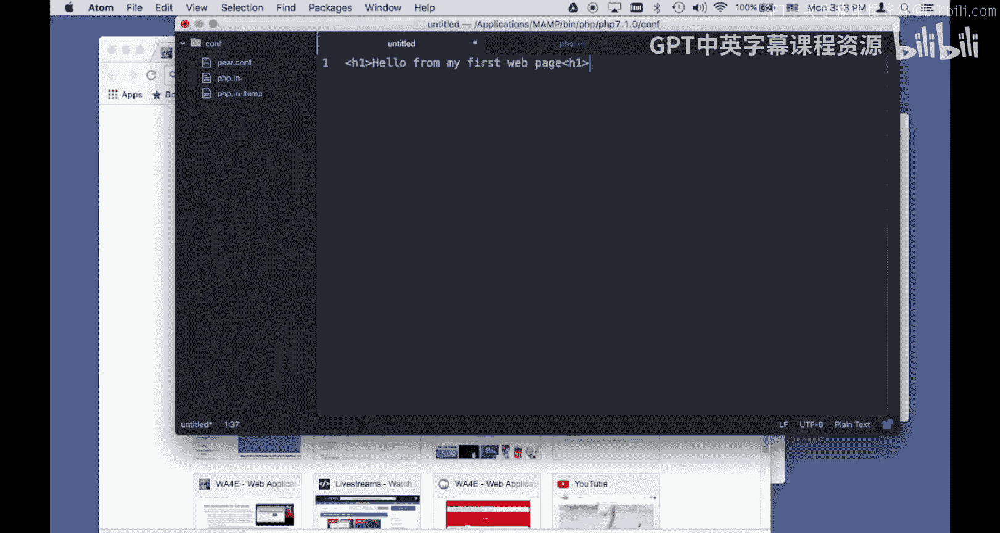

Okay， so。Were going to。Find out where this is at， Localhost 888 because this is now a web server running on your local computer。

And if you go into your finder。It is， well， let me start at the top。Where's my computer。

 come on computer。BackacBook Pro。Hard drive applications， map。H T docs。

 that's the folder we want to be in。 Okay， that's the one we want to be in。

 So I'm going to take this file here。 I'm going to say， save as。

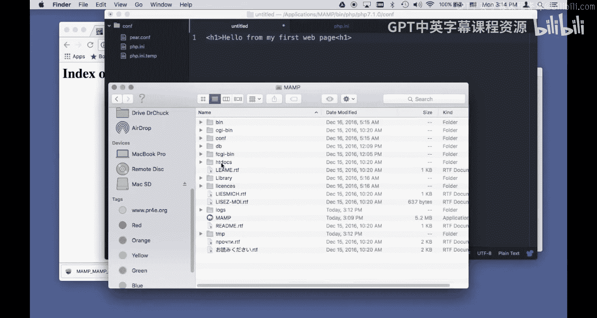

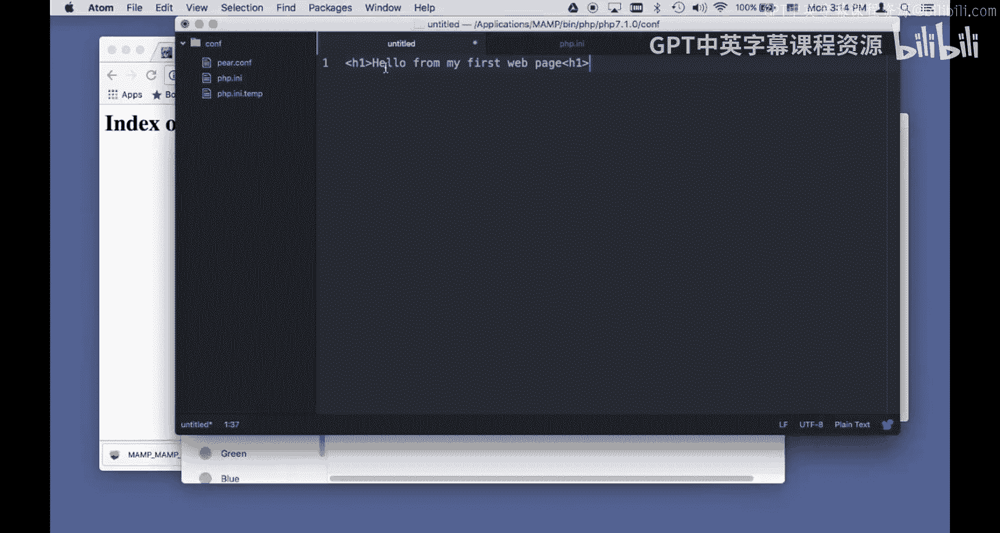

And I'm going to go to map。啊。Ht docs， H docs， I'm going to make a new folder called first。

Make a new folder。And then I'm going to save this as index。phP。

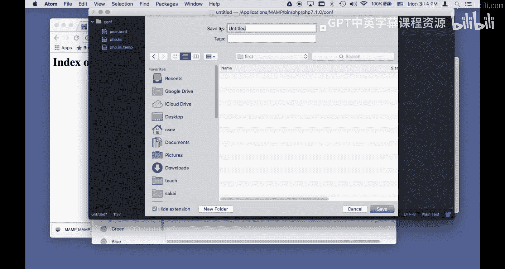

Sve。

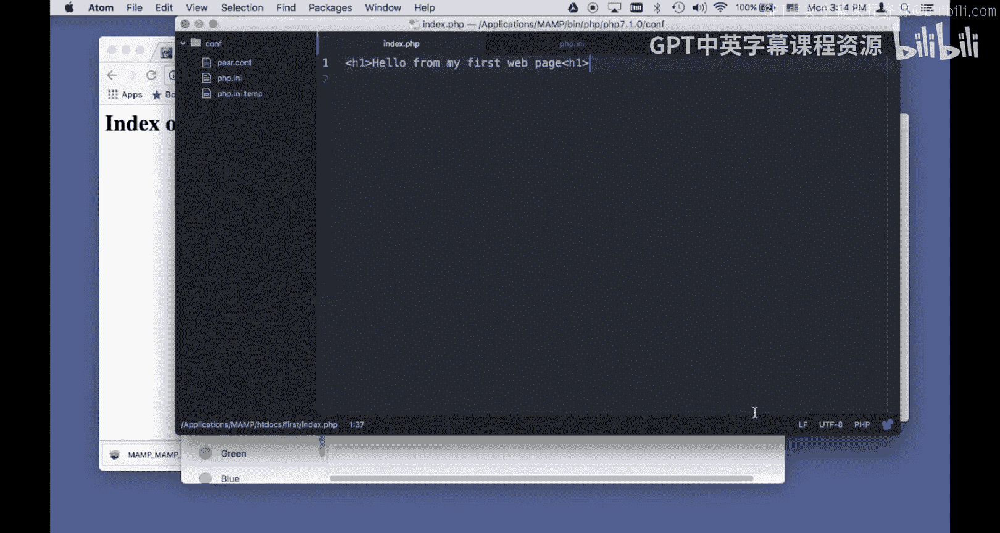

It also nicely highlights it。So now if I hit refresh here。

 you'll see that I got this folder name first and if I go into first， the slash。

 if I don't have anything there， it's as if I typed index。phP because that's called for a folder。

 index。phP is the default file。That a web server， one of the several default files that the web server looks at。

To to load it and so that's pretty much it away we go we have a successfully installed map and changed the starting startup variables and written our first little program okay。

 hope it helps。

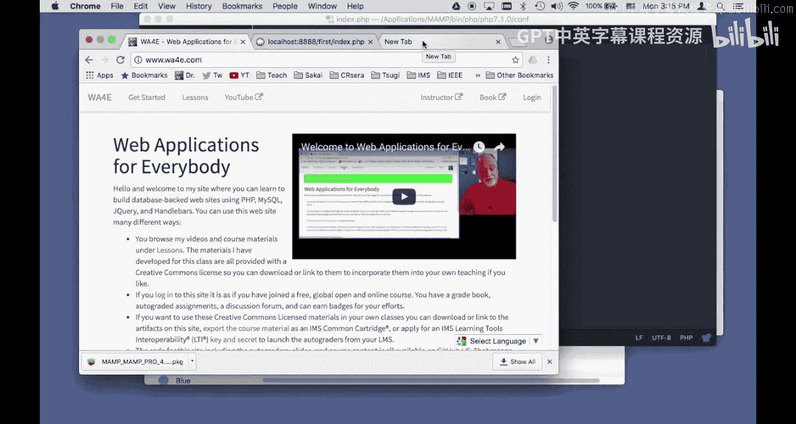

