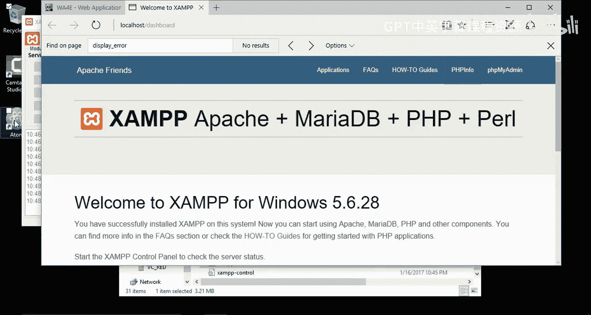
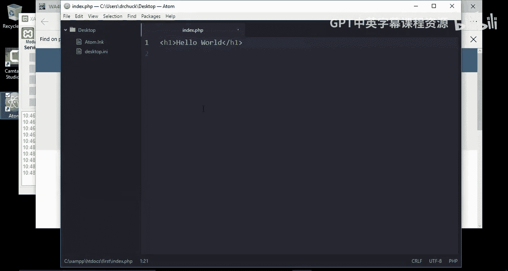
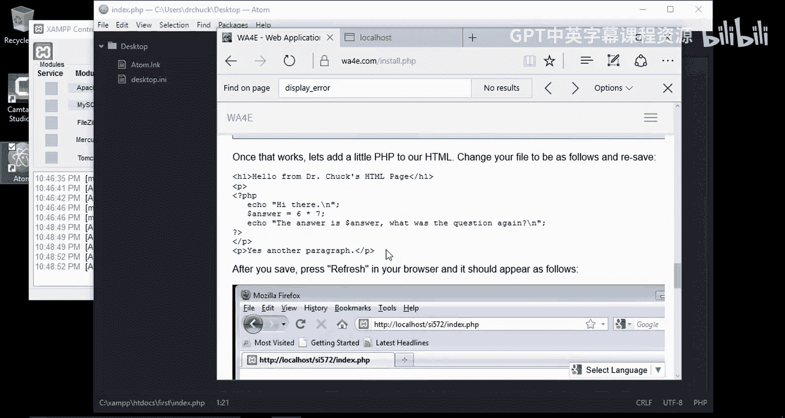
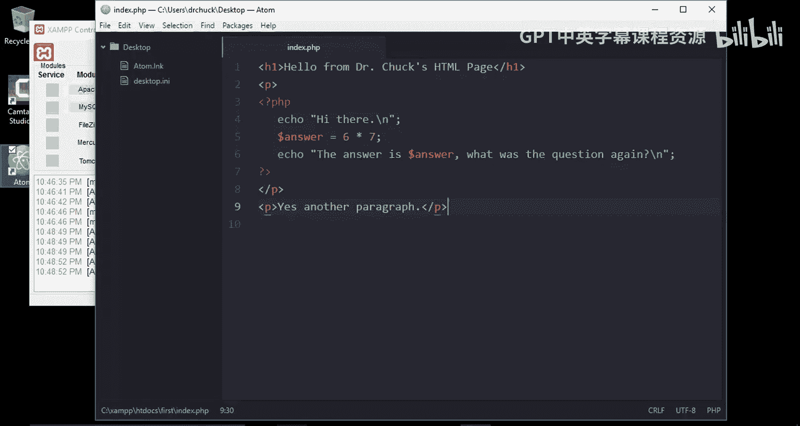
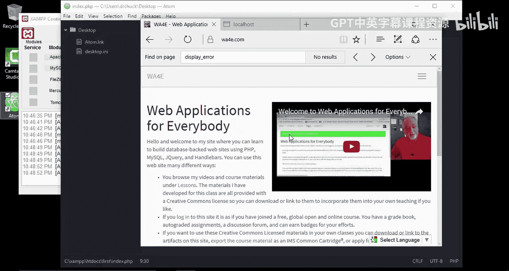

# 密歇根大学《面向所有人的Web应用程序（PHP、SQL、APP、JavaScript和JQuey｜Web Applications for Everybody》 p20 19_在Windows10上安装XAMPP.zh_en -BV1Lr421A75d_p20-

Hello and welcome to Web applications for everybody。 In this， we're going to get started。

 We're going to learn a little bit about how to install Xamp on。Windows， and I'm using Windows 10。

 and so I'm going to go to the Apache Friends website。

And let me make this a little bigger。IGot a great video here。 I won't show it right now。

 so I'm going to download Xamp for Windows。So I'm going to click here to make sure the download gets started。

Okay， so it's finished downloading and we're going to go ahead and run it。

 it's in the folder downloads if we wanted to take a look at that。

So I got my download running。Okay， so it says install it。

Don't avoid in the program files because so the thing to do is install in the default location。

 which I will show you is Se and backslash Xam。And I don't need a few of these things。

 I don't need Tomcat， I don't need pearl， I don't need fake send mail。So I't do that。

I'm going to stick it in that default， which is a little inconvenient。

 but it's nice because it makes life a little simpler。Okay， so this will take a little while。

So now that the installer is finished， I'm actually not going to start the control panel right away because I want to show you how to start it。

In case you don't do this， although you can just skip ahead and do that。

 so I'm going to finish the install， so the install is now complete。

So I'm want to show you where it's been installed to， so I'm going to go up to my Windows browser。

 my local system， go to my C drive and go into Xamp。

 and so I'm in Windows C Xamp and this is where it's installed and if I scroll down here。

 I can find the Xamp control panel and I'll start that。Oops。It's asking me for which language。Now。

 when this first starts up， it's important to if you're getting being given any security dialogues that you say yes to those security dialogues。

 it's a little tricky。 So this is the control panel and the things we're doing is the web server。

 which is Apache and my SQL， So I'm going to start those。let me do one thing here。

 I am going to right click and pin this to the task bar。 So now this will stay down here。

 Okay so I'm going to start the Apache web server now watch for red mistakes or watch for pop ups and it's good。

 So it's I got no red errors and I think it's because I'm running on my administrator account and I'm going to start the web server for I mean。

 the database server and that's running。 And so that's really good。

 You may have some other tro I click the stop by mistake。 I got to not hover over them and then。Okay。

 so， so there we go。 We are。I've got to get them both started。Okay， so now that they're both started。

 I can take a look at the details and now this is the examp dashboard， it's running on localhost。

 that means it's running on a web server that's running on my computer and a couple things that we can do is we can look at the details of our PP installation that's nice to have。

 we'll look at that in a second you can also look at PhP myadmin and this is how we talk to our database and so the fact that this is running and it's successfully connecting it doesn't get error messages that means we've got a very successful installation。

 This screen here tests a whole bunch of things。Okay。

So one of the things that we need to make sure is look for a variable called display。Errors。

So let's go find that。It's right here。And it's on。 If it's off， you have to change the configuration。

 So it's off on。 So let me show you how you would change it。

 even though Xamp seems to install with this the right way， We'll see in a second。

 This is something you want off in production and on when you're doing development to keep you from going crazy。

So you go to this configuration for Apache and you pick a PhP configuration。

 and then you scroll down， I'm going to use controlrl F to find it， display errorss。Find next。

And so it's and I'll go down here until we find it to be。 Now。

 this is exactly describing what's supposed to be on for developers you want this on and for production。

 you want it off if we were going to change this。And there's a。Display startup errors as well。

 we would save this。We can save it， we didn'tops come back， come back。We would save this。

And then we have to restart our Apache web server so we'd stop it。

 and then they would start it back up。And then when we come back。To the amin page。

And then when you go to PhP info。And they would look for display。Errors。And we see that it's on。

 so you shouldn't do development until that's on Now we didn't really have to change it。

 but I showed you how to change it if it was wrong。Okay。So I'll close some of these windows。

We don't need the web page for downloading anymore。 So now we're looking at the dashboard。

 And so what I want to do is I want to write a very， very simple program。

 So I'm going to start up my Adam text editor， which I assume you've installed。

 You can use any text editor you like。 I just like。

Aam， because it works the same on Windows Mac and Linux。 So I'm going to make a new file。

And I'm going to put some HTMLtl into it。And I'm going to save the file， file。

 save as Now I have to put this file in a particular location。

On my C drive under Xampmp， under H T docs。 And so this is all the stuff that this local web server see cone back slash Xamp。

RightC call and Xampmp H docs。 So what I'm going to do is I'm going to make a new folder right here。

 I'm going to call that folder first。NowYou'll be making lots of folders in here。

And then I'm going to save this file as index。

打PHP。So in the folder。First。

H D Docs first index dot P H P。 I've got Hello world。

 Now I can go over here to this URL and take off dashboard and type first， slash index dot P， H P。

If I get this right， I should see that little file。And so there we go。

 now I've created the first my first little bit of web code that's coming out through this web server。

And so what I want to do now is I want to。Grab some of the code that's got some PhP in it just to test。

 not that it's a big deal。 I got a little PP in this handout。 That's the old handout that I'm fixing。

 Here's this。

PHP code， I'm going to copy that。And then I'm going here and I'm going to control。There and go。

Paste that in， oops。needat a paste。Ctrol A， control V， There we go。

And it knows it's PhP and it's got syntax highlighting this is flat HTML。

 this is switching into PhP and doing some computations， doing a printout， and away we go。

 And so now I'm going to save this with control S。You'll always know that when that little blue dot there is you've got to save it or I won't save correctly。

 So now I go back to my browser。

Here， and I hit refresh and it'll run that code and so this part was from the HTML。

 this part is running PhHP， it did a calculation， and there is another paragraph。

So I hope this has been。Helpful。To get this installed， you'll be doing a whole bunch with this。

 you'll be building databases， you'll be writing PhP code。

 and so we just have to get you going and get you up and running cheers。

