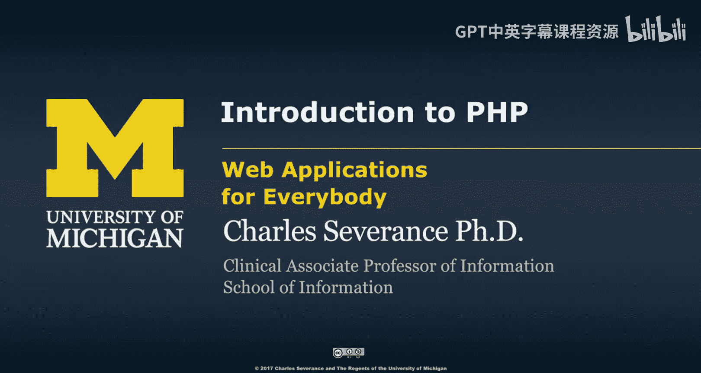
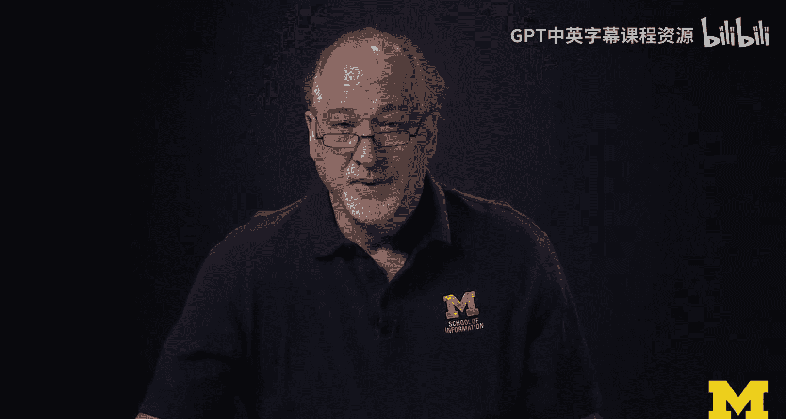

# 密歇根大学《面向所有人的Web应用程序（PHP、SQL、APP、JavaScript和JQuey｜Web Applications for Everybody》 p23 22_PHP入门.zh_en -BV1Lr421A75d_p23-

So welcome to the Inuction to PhHP。I was like to put what we're talking about in a historical context。

 And PhP is a language that owes its inspiration to many different languages。

 If we go all the way back to the beginning of sort of programming。

 We had machine code where we built hardware and we programmed it very directly。

 We had very little memory。 So we had to be very careful with our programming。

 The early days of computing were science calculations where you're doing weather and you're doing you know。

 ballistics calculations and very mathematical things in languages evolved that were just sort of slightly above the as language it made us more productive in languages like Fortre 1955。

 really some of the earliest things that we did。 But what happened as we move from the 50s through the 60s to the 70s it became increasingly clear that numeric data was not just what we were going to do with computers and so strings。

 I mean letters like hello， like the word hello。And so writing programs like text editors and Twitter and stuff like that in a language like Fortran what it just not worked very well。

 And so we began to see in the early 70s as human interaction。

 human interaction mediated by a computer became an important part of what we were going to do。

 A string oriented languages started to evolve。 And there were lots of string orient。

 There are just thousands of different languages。 And I remember working through that。 and like， oh。

 here's Pascal， that's really cool。 Here's snowball， that's really cool。

 And Fortran 77 had strings in it， but then what happened was is this language C came out。

 And C was this amazing language。 It's crude。 Someday I'd love to teach a mocon C。

 It's very crude but very powerful。 And it turns out that C is the language that's used to write things like PP and Python and Pearl。

 The C language gave us the speed of assembly language with portability between different computer systems。

 but it also did strings pretty well。 It doesn't do strings as well as modern languages， but。

Did strings really well。 And so this moment where we sort of transition from Fort Trat to C as sort of the most important language of computing is when humans start to send messages through computers and talk。

 And so C has sort of。Created lots of offshoots。 and anytime you see a language that has curly braces。

Then you know some of its inspiration to C。 So we see languages like C plus plus。

 which is an object oriented version of C， Ob C， which is another object oriented version of C Java。

 which was kind of this web language that you know， it was a web kind of version of C。

 Microsoft C sharpp was really inspired by a combination of C plus plus and the Javascript language。

 which came out in 1995， really took a lot of its inspiration from C and other kind of weird languages of the time because it has a different object oriented pattern than all these other ones。

 So Java C plus plus and objective C have kind of one object oriented pattern。

 and Javascript actually has a very different And we'll talk about that later。

So there's all these kind of system， the kind of nerdy languages at the same time that we were building and innovating and nerdy languages。

 we were building languages， not so much for end users， but for like system administrators。

 people who didn't see themselves as professional programmers and these languages were very much inspired by C and written in C So Pearl。

 which is the report generator it was started in 87， Python， which started in 1991。

 which now has become a super popular1， I teach a popular MOO on Python as well。

 they were written in C and so they took their inspiration from C。

 And so while Python doesn't have curly braces and Pearl doesn't have curly braces。

 they have things like stir functions， et cetera that sort of inspired themselves from C but they were written in C and so sort of Python and Pearl inherited a lot of what they basically do at low levels in terms of functions that they do from C So PhP the language we're talking about today。

Is also a derivative C。 And actually， it has a lot of inspiration from C because it has curly braces。

 It has the same some of the same stir functions， stir blah， blah， blah。

 Those came from C and were sort of adapted to work in Ph P。 And so sort of below this line。

 one of the focuses was simplicity ease of use。😊，Because this was sort of the pro computer scientist。

You know， if you're a computer scientist and this is sort of like。

Building this and building games and doing data analysis， sort of noncomputer science stuff。

 And so that's why if you look at computer science curriculums， they're all up here。 eventually。

 like I said， someday I want to teach a C class because I think that even if you're not a computer scientist。

 I think there's a lot to learn to go kind of back to the origins I even like to so what I'd like to do is I teach this class。

 this class I don't think I'm ever going to teach a pro class and I would teach both of these classes because I want I want you to be able to see even if you're not a computer scientist I kind of want to see you want to see the whole history of how your language came to be。

And so with that。UNext， we're going to talk about PhP。

