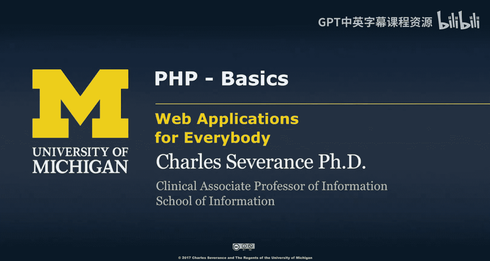
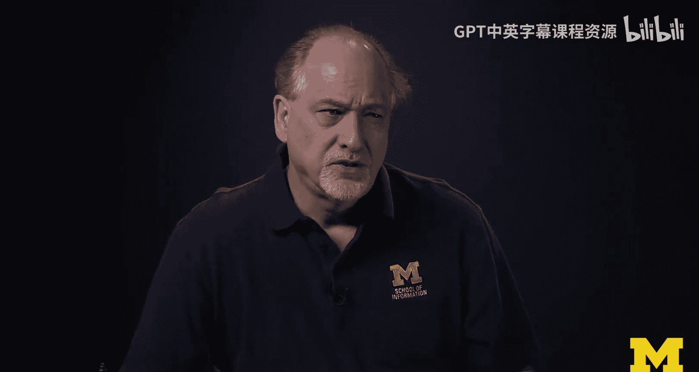
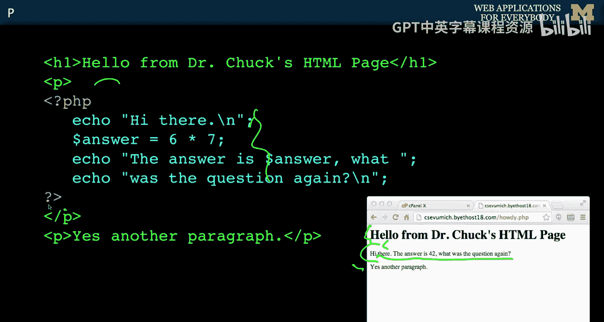
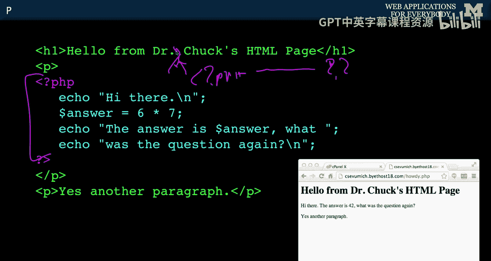
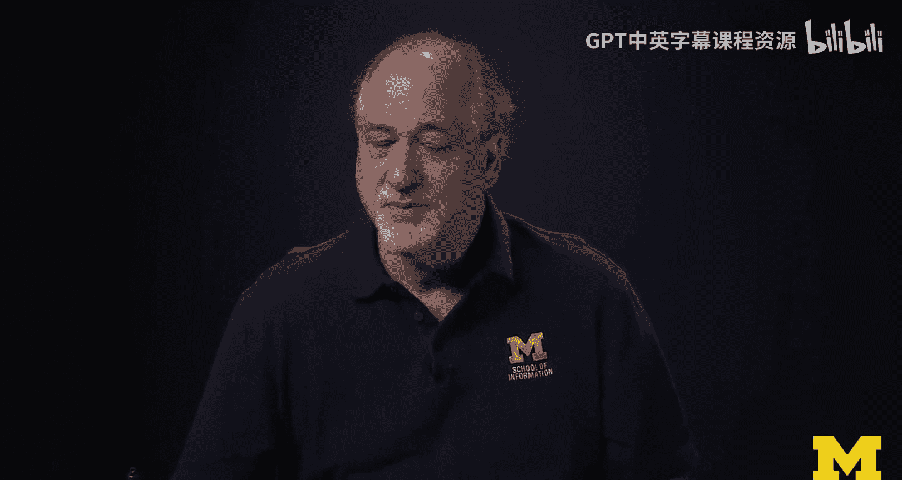
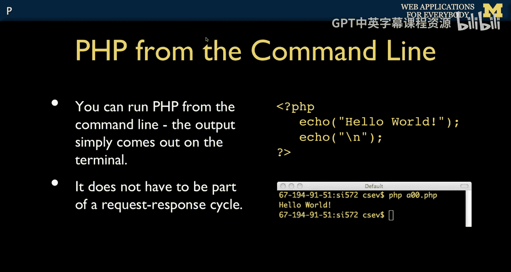
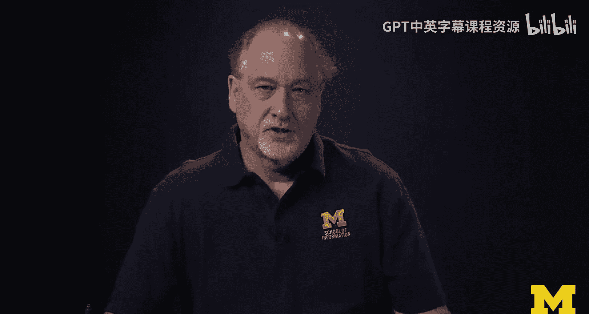

# 密歇根大学《面向所有人的Web应用程序（PHP、SQL、APP、JavaScript和JQuey｜Web Applications for Everybody》 p24 23_PHP基础.zh_en -BV1Lr421A75d_p24-

So on we go about the PhP language， like I said， it comes from the C language， you see curly braces。

 we're also going to learn JavaScript and that has curly braces， no significant white space。 Again。

 that's all from C。 there are some things where PhP is inspired by pearl dollar signs for variables which is one of the things that people find annoying about it and associative arrays which people love and the idea is is that PhP is a language while you can use it for things other than HTML。

 it really is intended to be on HTML templating language。

 and it really exists to serve web applications， and that's one of the reasons that I really like it。

One of the things about PhP is it's a productivity tool。

 it's not a tool that's really designed as a teacher so if you take a Python class。

 Python blows up all the time， PP doesn't blow up， it figures if you typed it you probably meant for it to happen and so PhP is trying as hard as it can to just interpret what you're saying and and just do what you want and ideas you're supposed to be able to write code fast。

 you know what you want to do sometimes errors are silent。

 so you're supposed to be a responsible programmer and so you may find this responsibility on your part as like oh wow why don' why don't you stop me from making mistakes but that's not necessarily the philosophy of PhP。

So as I said， PhP is like an extension of HTML， so we create files that end in dot PhP。And in that。

 they start， the first line is HTML。 And so this is just HTML。

 and at some point you switch into PhP with a special kind of tag。

 and it turns out there are a couple things is less than question mark is something that was built into HTML for various programming language is kind of like escape to the server side So the browser is interpreting this and then the server is running this code as it's producing the response cycle Re response cycle。

 and so your switch and now you're in the PP language this code emits output。

 So the output to this code like an echo statement。

 which is a print statement that actually becomes part of the page and then it runs code。

 we're going to answer6 times 7。 you'll know semicolnes down statements another echo statements。

 some more output， some more output。 So what happens is what the browser sees is not this code at all。

 but instead the output that's produced by that code and now that the question mark less than finishes that and now we're back into HTML。

 And so if we run this we're going。To see this HTML， the results of this PhP execution。

 not the code itself， and then that HTML。And so that's what it looks like。 Okay， And so here it is。

 the answer is 42。 We can't really tell the difference between just looking at the H。

 This came from the static HTML part。 This came from。

The paragraph tag came from the template and all this text came from this code running and then another paragraph came from that。

 So you switch back and forth。 And justca I showed only one you can have a long file。

 you can switch in and out of HTML and PhP as much as you like。

 sometimes we'll switch in and out of HTML and PhP in a single line。

 we'll just kind of like right here in between Dr。 Chuck， we'll do less than question mark PhP。

Some stuff question mark less than， and we can do it right in the middle of the line。

 it doesn't have to be a whole block of text。 It can be right in the middle of the line。

 and then the output of this is stuck into the HTML right at that point。

Just for completeness。PHP is really designed as web language and that's why I like it。

 But I've also seen people who only know PhP and can and have done things that are command line with PhP。

 you can open files， you can read them。 PP is good at parsing strings。

 but I would say that Python is probably a better use of command line if you're going to write command line applications。

 I saw so over their shoulder。 I'm like really you know that。 So I didn't realize it， but you can。

 but I don't recommend it。 So up next we're going to talk about the basic syntax of PhP。

