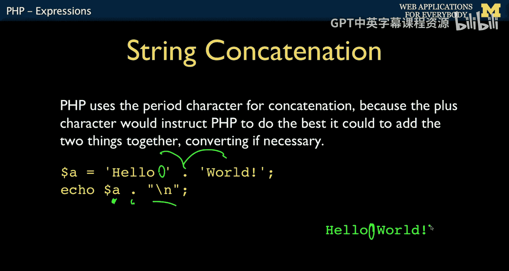
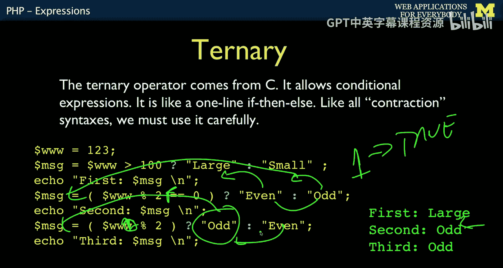
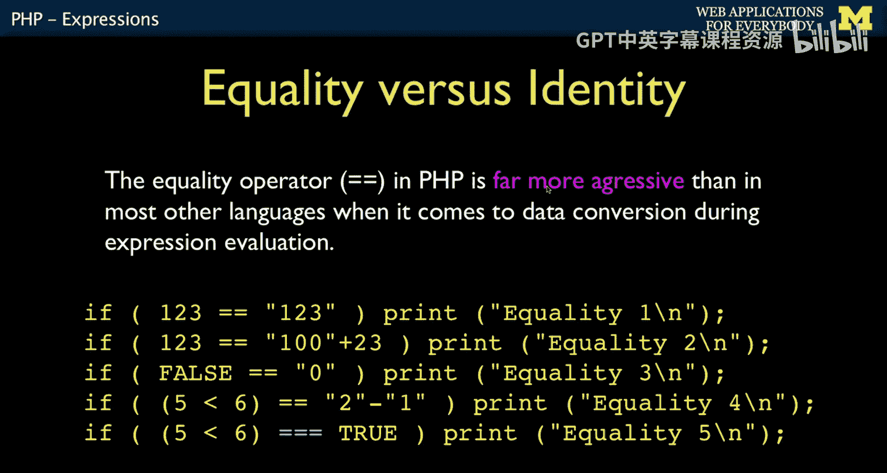
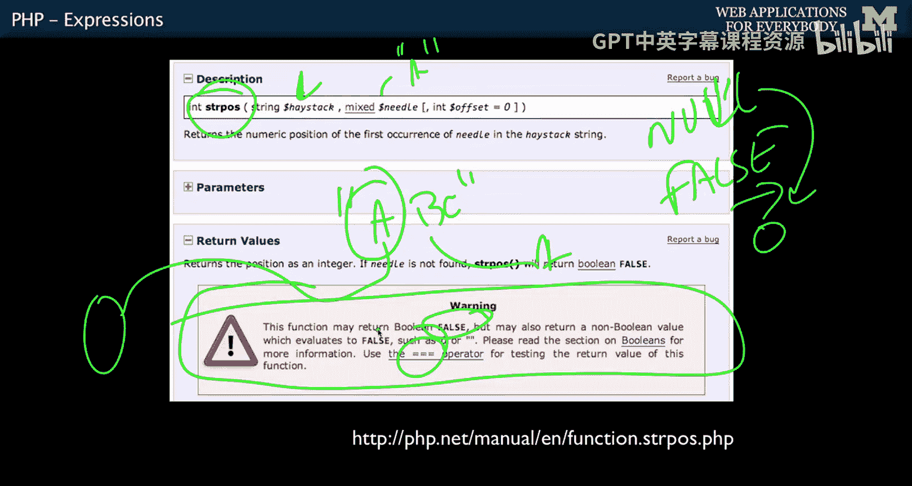
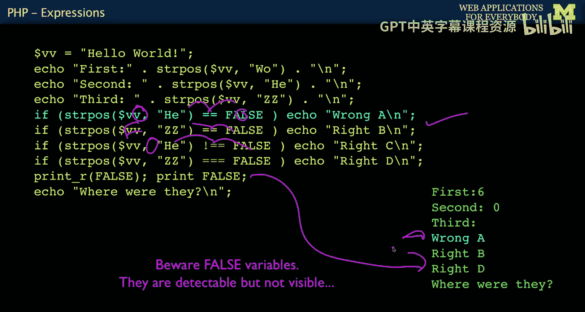

# 密歇根大学《面向所有人的Web应用程序》：P26：PHP表达式 🧮

在本节课中，我们将要学习PHP编程语言中一个核心部分：表达式。我们将了解PHP如何处理不同类型的表达式，包括算术运算、字符串连接以及PHP特有的类型转换行为。通过学习这些概念，你将能够理解PHP代码中各种运算背后的逻辑。

---

## 表达式基础

任何编程语言的一个重要部分都是它如何处理表达式。表达式通常出现在赋值语句的右侧，或者代码的各个地方。

如果你使用加号、减号等运算符，其工作方式与其他语言非常相似，使用 `+`、`-`、`/`、`*`。实际上，这一整套约定来自Fortran语言。这非常古老，可以追溯到1955年。当时他们决定用星号表示乘法，可能比那更早。我们至今仍在使用它。所以，每次你想做乘法时输入星号，请记住这来自1955年。

最简单的表达式通常出现在赋值语句的右侧。PHP的一个有趣之处在于它有一个相当罕见的特点，尽管JavaScript是另一种具有非常激进类型转换的语言。PHP不希望代码出错，它希望进行转换。

例如，当它看到字符串 `"15" + "27"` 时，可能会发生两种情况。它可以将其视为字符串，最终得到 `"1527"`，将两者连接在一起。但PHP实际上不是这样做的。它会将这个字符串转换为整数，然后将它们相加，得到 `42`。因此，PHP中存在很多隐式类型转换。这里的 `+` 是数值运算符，所以它会尝试将其操作数转换为数字，这就是我们得到 `42` 的原因。

值可以是字符串和数字，我们可以使用函数调用，并且存在一个所有编程语言都相同的求值顺序。表达式也可以产生操作。

---

## 运算符概览

以下是一些值得注意的运算符。如果你来自Python，其中一些有Python等效项，一些则没有。我们将讨论其中一部分。

*   **递增/递减运算符**：`++` 和 `--`，用于给变量加一或减一。
*   **连接运算符**：`.`，用于连接字符串，这很特殊。
*   **相等与不等运算符**：`==` 和 `!=`，这在所有类C语言中都很常见，也来自C语言。
*   **恒等运算符**：`===` 和 `!==`。`==` 是带类型转换的值相等，而 `===` 是不带类型转换的值和类型都相等。
*   **三元运算符**：`? :`，我们稍后会讨论。这也是1972年C语言的一个经典思想。
*   **副作用运算符**：如 `+=`。
*   **位运算符**：这些也来自C语言，是面向位的运算符，处理0和1，进行与、或、移位等操作。除非你在做压缩或加密之类的事情，否则通常没有用处。所以你不会经常使用这些运算符。

---

## 递增与递减运算符

现在，让我们具体看看递增和递减运算符。`++` 会产生副作用。

假设我们有 `$x = 12`。在表达式 `$y = 15 + $x++` 中，像任何右侧表达式一样，它需要先解析这个右侧。所以它必须首先获取 `$x` 的值，将 `12` 取出作为表达式的一部分。但是，由于 `++` 在 `$x` 之后，作为一个副作用，它将 `$x` 的值变为 `13`。此时，`12` 仍然存在于 `15 + 12` 中，所以我们最终得到 `$y = 27`。但在下一个语句中，`$x` 已经变成了 `13`，因为读取并加一产生了这个副作用。

你也可以写成 `++$x`。这唯一的区别是，它在将值复制到表达式之前就加一。在这种情况下，`$y = 15 + ++$x` 的结果会是 `28`，而 `$x` 仍然是 `13`。

大多数文明人倾向于不使用这种写法，除非在某些特定场景。通常我根本不用它。我们倾向于显式地加一，比如 `$x = $x + 1`。这样我们在下一个语句中单独执行加法，使代码意图更清晰。有些人喜欢炫耀，写尽可能紧凑的代码。我倾向于避免那样做。

---

## 字符串连接运算符

`.` 字符是一个字符串运算符。它不仅仅是连接字符串，还会将其操作数转换为字符串。它不会自动添加空格，是纯粹的连接。

如果我想得到 `"hello world"`，我必须在 `"hello"` 后面加上空格。例如，我可以 `echo "hello world"` 不加换行，然后连接一个换行符变量，这样我就能得到带换行的 `"hello world"`。

PHP运算符的一个特点是它们有“态度”，它们会根据类型进行期望和转换。`.` 是字符串运算符，`+` 是数学运算符。这在某些方面比一些语言（如JavaScript）更具可预测性，因为JavaScript的运算符更面向对象，你并不总能预测它在做什么。

---

## 三元运算符

三元运算符来自C编程语言，源于我们希望代码非常简洁的时代。三元运算符基本上是将 `if-then-else` 放在一行中。

我们这里有一个赋值语句，它包含三个部分。之所以叫三元，是因为有三个部分。

1.  第一部分是一个问题，其求值结果为真或假。
2.  第二部分是表达式的结果（如果问题为真）。
3.  第三部分是表达式的结果（如果问题为假）。

你可以把它想象成有两个值“悬在空中”，准备进入变量 `$message`，然后我们根据条件选择其中一个。

例如，`$message = ($ww > 100) ? "large" : "small"`。如果 `$ww` 大于100，条件为真，我们选择 `"large"`，它被放入 `$message`。

我们还可以做这样的事情：取一个数除以2的余数，判断它是否为零，这意味着它是偶数或奇数。例如，`$message = ($ww % 2) ? "odd" : "even"`。如果 `$ww` 是123，余数为1（非零，在布尔上下文中为 `true`），那么 `"odd"` 被放入 `$message`。我调换了 `"even"` 和 `"odd"` 的顺序，因为如果结果是1（`true`），就是奇数；如果结果是0（`false`），就是偶数。

我希望我不必教你这些，但我们确实在某些情况下大量使用它，比如检查一个键是否在数组中。有一些语法我们反复使用，所以我必须教你。我宁愿不教，但如果不这样做，在某些非常特定的情况下我们会有太多的 `if-else` 语句。这些是惯用的情况，你看一眼就知道他在做什么，你理解那是什么，这真的是一种习惯用法，他用了三元运算符，所以你会原谅他。但你不应该过度使用任何这些花哨的副作用运算符。

---

## 赋值运算符与字符串构建

你可以使用这些运算符。例如，`$count += 1` 等同于 `$count = $count + 1`，这只是该表达式的缩写。

我永远不会使用 `$count = $count + 1` 这种写法。我也不会使用 `$count += 1`。但在构建字符串时，我确实会使用 `.=`，因为在某些代码位置，你开始一个字符串，然后不断向其中添加内容。

一种方法是：你开始一个字符串，然后想在其末尾添加一个空格。你可以写 `$out = $out . " "`，这是在末尾添加一个空格。如果你要反复这样做，我们可以将其缩写为 `$out .= "world"`，这会将 `"world"` 连接到其末尾，然后再连接一个换行符。这样就能打印出包括换行符的内容。

这通常是一个简单的例子。但我们使用这种方法来增长字符串：开始一个字符串，添加一点，再添加一点，再添加一点。我们使用 `.=` 来向字符串末尾添加内容。这个我倾向于使用，我喜欢它。

---

## 类型转换与强制转换

正如我提到的，PHP中会发生很多激进的类型转换。你也可以在需要时显式地强制转换。实际上，在PHP中，显式强制转换比其他编程语言中使用得更少。

让我们看看这里会发生的一些“疯狂”的事情。

*   **除法**：即使两个操作数都是整数，除法也会产生一个浮点数，这实际上是一个合理的想法。像Python 2那样，整数相除产生非浮点数的做法反而不那么符合逻辑。
*   **混合运算**：`36.25 + true + "100"`。`+` 是数值运算符。`36.25` 是浮点数。`true` 被转换为 `1` 以成为数字。字符串 `"100"` 变成数字 `100`。所以这将是 `137.25`，确实如此。这不是语法错误。你看着PHP可能会觉得这很糟糕。但你会习惯它，并说：“嗯，我想只要明智地使用，我不介意这是一种强大的能力。”当然，这行代码本身并不明智，我只是向你展示什么是可能的。这是一行糟糕的代码，但确实如此。
*   **字符串连接**：`.` 是字符串操作。所以 `"Sam is " . 42` 中，`42` 是数字，但 `.` 会自动强制将其转换为字符串。你可以写成 `(string) 42`，这是一种类型声明，表示将那个非字符串变量转换为字符串。但这并不太有用，因为 `.` 无论如何都会将其转换为字符串。
*   **整数转换**：你可以将像 `9.9` 这样的值转换为整数 `(int) 9.9`，这会将其截断为 `9`，然后 `$y = (int) 9.9 - 1` 得到 `8`。这实际上是一种向整数的截断转换。
*   **字符串与数字**：再次强调，`"Sam" + 25` 中，`+` 是数值运算符，这意味着它会强制其操作数变为数字。所以它把 `"Sam"` 变成了 `0`，因此 `"Sam" + 25` 是数字 `25`。而 `"Sam" . 25` 是字符串运算符，所以它会将 `25` 转换为字符串，你最终得到 `"Sam25"`。

`+` 用于数字，`.` 用于字符串。这部分是相当一致的。如果有 `+`，我们将以某种方式强制将它们转换为数字，包括像字符串 `"Sam"` 变成 `0` 这样的疯狂行为。但 `.` 是用于字符串的。我实际上希望更多的编程语言这样思考。

像Python这样的编程语言倾向于“报错”。在PHP中，我们可以将字符串 `"100" + 25` 作为数值相加，得到 `125`。我们可以连接 `"100" . 25`，得到 `"10025"`。我们可以将 `"Sam" + 25`，得到 `25`，因为 `"Sam"` 变成了 `0`。

在Python中，我们必须显式地处理。我们必须说 `int("100")`，然后转换并相加，得到 `125`。或者如果我们想连接，我们使用相同的 `+` 运算符进行连接，但我们必须将 `25` 转换为字符串 `str(25)` 才能连接。如果我们愚蠢地尝试将 `"Sam"` 转换为整数 `int("Sam")`，我们会得到一个回溯错误。

这某种程度上告诉了你PHP的哲学：它允许你做一些在Python中会“爆炸”的事情。在某种程度上，这也是我喜欢Python作为入门语言的原因之一，因为它让你处于一个非常严格的约束中。你必须非常精确地表达你想做什么。如果你尝试做一些愚蠢的事情，它会阻止你，这样你就可以说：“等等，我做了什么？为什么我那样做？哦，也许这很愚蠢。但如果那是一个变量呢？哦，那是一个字符串，我忘了。我忘了他们有时会把‘sal’放进去。”所以这很有帮助，因为虽然得到一个回溯错误可能令人沮丧，但它也可以告诉你你做错了什么。而PHP，再次强调，它很“负责任”。它会做你说的事情，即使你说的事情不是最合乎逻辑的，它也会做点什么。

---

## 类型转换的细节与陷阱

强制转换方面，`true` 变成 `1`，我提到过。作为一个程序员，最令人沮丧的事情之一是 `false` 变成空值。

如果我使用 `.` 作为字符串操作，它会强制将 `false` 转换为字符串。当它强制将 `true` 转换为字符串时，`true` 变成 `"1"`。所以 `$x . "1" . $y`，如果 `$x` 是 `true`，`$y` 是 `false`，结果会是 `"1"`，因为 `false` 是空字符串。如果你尝试用 `echo` 语句打印 `false`，它不会打印任何东西。这让我不止一次抓狂，因为我心想：“`echo` 这个变量 `$x`，怎么什么都没有？是不是没执行到那一行？哦，等等，20分钟后才意识到，那是个 `false`。这就是为什么我什么都没看到。”所以，`false` 打印不出来。

正如我之前提到的，相等运算符 `==` 是一个激进的类型转换运算符，它尝试匹配类型转换。所以这里有一些在许多语言中会“爆炸”但在PHP中完全没问题的事情。

*   `123 == "123"`：因为它尝试转换它们，发现它们相等。
*   `" 123" == 123`：字符串 `" 123"` 会转换成 `123`，所以成立。
*   `false == 0`：`false` 可以变成整数 `0`，`0` 也是整数 `0`，所以成立。
*   `(5 < 6) == ("2" - "1")`：`5 < 6` 是 `true`，变成 `1`。`"2" - "1"` 中，`-` 是算术运算符，所以变成整数 `2 - 1`，结果是 `1`。看，`1` 和 `1` 相等。这简直是你能写出的最疯狂的、还不会产生语法错误的代码行之一。我不是说你该这么做，我只是说这就是PHP中所有运算符的“侵略性”。

有时，我们想阻止这种 `==` 的侵略性。所以我们使用 `===`。这基本上是在没有转换的情况下比较是否相同。如果值相同且类型相同，则为 `true`。如果像 `1` 和 `true` 比较，就会是 `false`，因为 `===` 抑制了类型转换。与Python相比，`===` 类似于 `is`，`!==` 类似于 `is not`。`===` 的概念几乎完全相同。

---

## 一个常见的陷阱：`strpos` 函数

一个会让你陷入麻烦的事情是任何数值上下文中的 `false` 都会变成 `0`。`null` 在数值计算中也会自动变成 `0`。

特别是 `strpos` 函数。`strpos` 的工作方式是寻找一个字符串（“干草堆”）中的子串（“针”）。例如，如果我在 `"ABC"` 中寻找 `"A"`，它返回位置 `0`。如果寻找 `"B"`，返回 `1`。问题是，如果它返回 `0`，意味着它在开头找到了。而如果没找到，它返回 `false`。所以你必须小心区分是在开头找到了还是根本没找到。

因此，你需要阅读文档。即使在文档中，它也警告你使用 `===` 运算符。这就是 `===` 运算符在PHP中有多重要。

---

## `strpos` 函数示例

这里有一些 `strpos` 函数的简单例子。

我们有 `"hello world"`。我们寻找 `"wo"` 的位置，它是 `0,1,2,3,4,5,6`，所以会给我们 `6`。我们寻找字符串 `"he"`，它会在位置 `0`。然后我们问 `"zz"` 的位置，这将返回 `false`。我们连接它，你会注意到又没有打印出任何东西。这就是当我尝试打印 `false` 而它们不显示时让我抓狂的地方。

这是一个你可能犯的错误。你可以写 `if (strpos($s, "he") == false)`。这将会找到 `"he"`，你以为你在问是否找到了它，但由于 `==` 的激进转换，`0` 会被转换为 `false`，所以这个条件会错误地成立。如果我们寻找 `"zz"`，这个会正常工作，因为返回 `false`，`false == false` 在类型转换后仍然匹配，这符合你的预期。但这就是你容易出错的地方。

你必须使用 `===`，因为如果它返回 `0`，它并不恒等于 `false`。`0` 不等于 `false`，因为 `===` 抑制了类型转换。这里也一样。

所有这些都说明：阅读文档。`print` 不显示 `false`。`print_r` 允许你打印更多细节，但它们也根本不显示。有很多方法尝试打印 `false`，但只有一种方法可以真正显示它们，那就是 `var_dump`。

---

## 总结与预告

本节课中，我们一起学习了PHP表达式的核心概念。我们了解了PHP中算术和字符串运算符的使用，重点探讨了PHP独特的隐式类型转换机制，以及 `==` 与 `===` 运算符的关键区别。我们还学习了三元运算符、递增/递减运算符以及字符串连接运算符 `.` 和 `.=` 的用法。最后，我们通过 `strpos` 函数的例子，理解了在特定场景下使用 `===` 避免错误的重要性。

接下来，我们将讨论控制结构，例如 `if-then-else` 等。