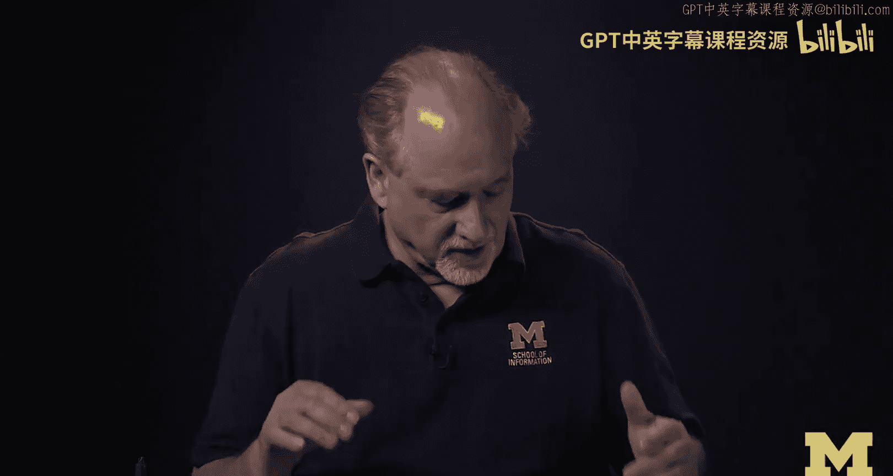
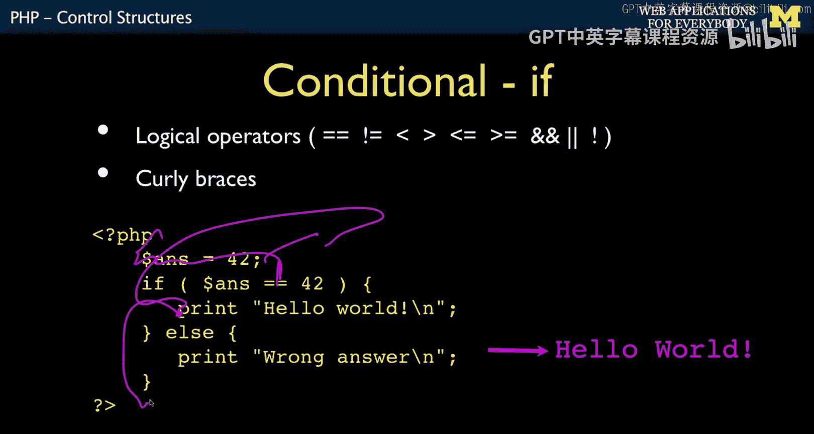
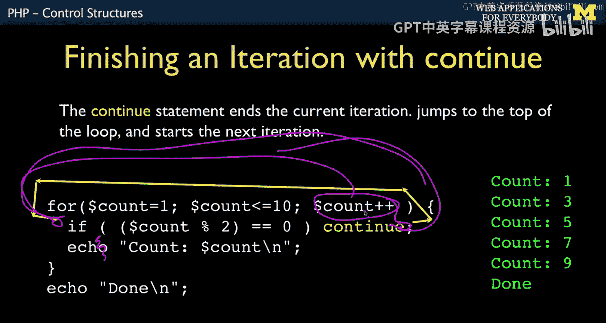
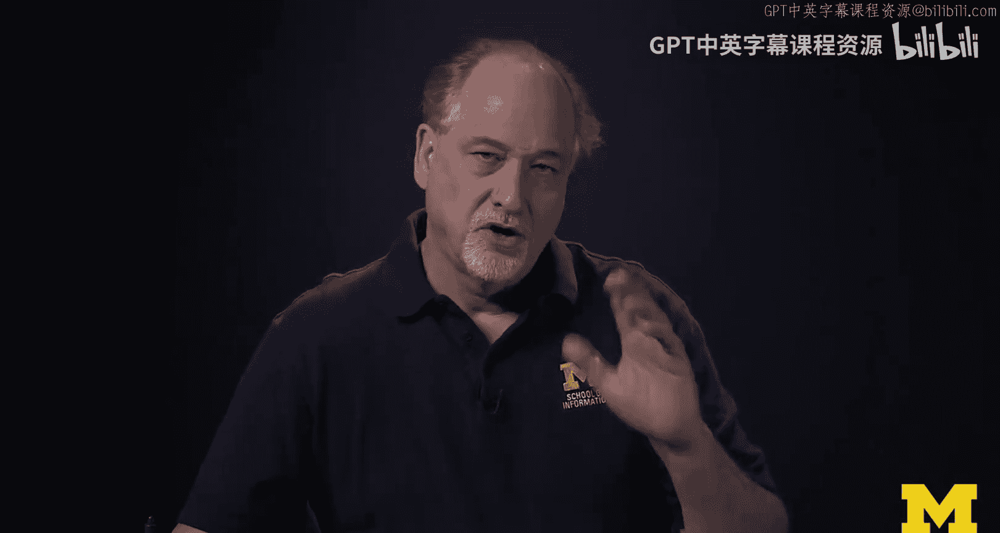

# 密歇根大学《面向所有人的Web应用程序》：P27：PHP控制结构 🧠


在本节课中，我们将要学习PHP中的控制结构。控制结构是编程的基石，它允许程序根据条件做出决策，并重复执行某些任务。我们将从基础的`if`语句开始，逐步介绍循环、逻辑运算符以及`break`和`continue`等关键概念。



## 逻辑运算符与`if`语句

上一节我们介绍了控制结构的重要性，本节中我们来看看最基础的条件判断结构——`if`语句。`if`语句允许程序根据条件的真假执行不同的代码块。

PHP使用一系列逻辑运算符来构建条件。其中一些运算符与其他编程语言类似，例如：
*   `==` 等于
*   `!=` 不等于
*   `<` 小于
*   `>` 大于
*   `<=` 小于或等于
*   `>=` 大于或等于

对于有C语言背景的开发者，以下运算符也很熟悉：
*   `&&` 逻辑与
*   `||` 逻辑或
*   `!` 逻辑非

`if`语句的基本结构如下。它需要一个用圆括号包裹的条件表达式，该表达式最终会求值为`true`或`false`。值得注意的是，在PHP中，非零值会被视为`true`，零值被视为`false`。



```php
if ($ants == 42) {
    echo "Hello World";
} else {
    echo "Goodbye World";
}
```


在上面的例子中，如果变量`$ants`等于42，条件为真，程序将执行第一个代码块，输出“Hello World”。如果条件为假，程序将跳过第一个代码块，执行`else`后的代码块，输出“Goodbye World”。

## 代码风格与多分支`if`

理解了基础`if`语句后，我们需要注意PHP的代码风格。PHP是一种基于C的语言，它对空格和缩进没有强制要求。这意味着你可以将所有代码写在一行，但这会严重影响可读性。

以下是两种常见的花括号风格。第一种是“K&R风格”，花括号与控制语句在同一行。第二种是“Allman风格”，花括号独占一行。选择哪种风格是个人或团队的偏好，关键在于在同一个项目中保持风格一致。

```php
// K&R 风格
if ($x) {
    // ...
} else {
    // ...
}

// Allman 风格
if ($x)
{
    // ...
}
else
{
    // ...
}
```

接下来，我们看看多分支条件判断，即`if-elseif-else`结构。程序会按顺序检查每个条件，一旦找到第一个为真的条件，就会执行对应的代码块，然后跳过其余所有分支。

```php
if ($fuel > 10) {
    echo "Fuel is high";
} elseif ($fuel > 5) {
    echo "Fuel is medium";
} elseif ($fuel > 0) {
    echo "Fuel is low";
} else {
    echo "Out of fuel";
}
```

如果`$fuel`的值为8，程序会检查第一个条件（`$fuel > 10`）为假，然后检查第二个条件（`$fuel > 5`）为真，于是输出“Fuel is medium”，并忽略后面的`elseif`和`else`。

## 循环结构：`while`与`do-while`

掌握了条件判断，现在让我们进入循环的世界。循环允许我们重复执行一段代码。首先介绍的是`while`循环，它是一种“先测试”循环，意味着在执行循环体之前会先检查条件。

`while`循环在循环开始前检查条件。如果初始条件为假，循环体一次也不会执行。在循环内部，程序员必须负责更新迭代变量，否则可能导致无限循环。

```php
$fuel = 10;
while ($fuel > 1) {
    echo "Vroom vroom\n";
    $fuel = $fuel - 1; // 更新迭代变量，避免无限循环
}
```

与`while`循环相对的是`do-while`循环，它是一种“后测试”循环，意味着循环体至少会执行一次，然后再检查条件。

`do-while`循环保证循环体内的代码至少执行一次，执行后再判断条件是否满足以决定是否继续循环。

```php
$count = 1;
do {
    echo "Count is: $count\n";
    $count++;
} while ($count <= 5);
```

在上面的例子中，即使初始时`$count`可能不满足`<=5`的条件，`echo`语句也会先执行一次。

## `for`循环与循环控制

对于已知循环次数的场景，`for`循环是更简洁的选择。它是一种功能强大的计数循环，将初始化、条件判断和迭代更新集中在一行。

`for`循环的语法包含三个用分号分隔的部分：初始化表达式、循环条件、以及每次循环结束后执行的表达式。它同样是“先测试”循环。

```php
for ($count = 1; $count <= 6; $count++) {
    echo "Count: $count\n";
}
// 输出：Count: 1 ... Count: 6
```

有时我们需要更精细地控制循环流程，这时就会用到`break`和`continue`语句。

`break`语句用于立即终止整个循环，跳出循环体继续执行后面的代码。`continue`语句则用于跳过当前循环迭代中剩余的代码，直接进入下一次循环的迭代条件判断（在`for`循环中，会先执行第三个表达式）。

```php
// break 示例
for ($i = 0; $i < 10; $i++) {
    if ($i == 5) {
        break; // 当 $i 等于5时，终止循环
    }
    echo $i;
}
// 输出：01234



// continue 示例
for ($i = 0; $i < 5; $i++) {
    if ($i == 2) {
        continue; // 当 $i 等于2时，跳过本次循环的剩余部分
    }
    echo $i;
}
// 输出：0134
```

## 总结



本节课中我们一起学习了PHP的核心控制结构。我们从基础的`if-else`条件判断开始，了解了逻辑运算符的使用。接着，我们探讨了代码风格的重要性以及多分支`if-elseif`结构。然后，我们深入学习了三种循环：至少执行零次的`while`循环、至少执行一次的`do-while`循环，以及用于明确计数的`for`循环。最后，我们介绍了用于精细控制循环流程的`break`（终止循环）和`continue`（跳过本次迭代）语句。掌握这些控制结构是进行有效PHP编程的关键。下一节，我们将探讨PHP中的数组。