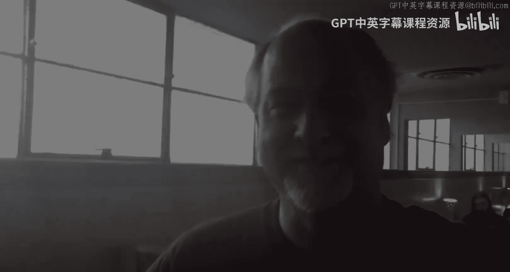

# 密歇根大学《面向所有人的Web应用程序（PHP、SQL、APP、JavaScript和JQuey｜Web Applications for Everybody》 p29 28_附加办公时间：华盛顿州西雅图.zh_en -BV1Lr421A75d_p29-

Hello everybody here we are in Seattle， Washington with a heck of a turnout of office hours and I would like you to meet some of your fellow students so they can say hi to you okay。

 so we'll come over here， say your name， say hi to the students anything anyone want I'm Raul it's a good class so far Okay thanks a lot。

Hey， I'm Josh。Josh， and you're going to like Bay Area next Bay Area next， okay。

 so maybe we'll you in the Bay Area。He I'm Muhammad I completed the three courses from the Pon sexual really love your teaching style lecturechuk and looking forward to finished in the database and the capstone project cool thanks a lot and I'm Brian Chuck is awesome have fun okay。

Hi I'm Eileen good job learning probably your first programming language Keep up the good work Thank you Hi I'm D and Python is my favorite programming language so far and I love Chuck humorer and his Harry Potter reference。

😊，Cool cool。Hello， Gerardo Garcia， just growing Python， okay？🎼Hi， I' am Amanda。

 It's a really good close。 Thank you。Hi I'm Heidi I'm only on class two so I'm excited to learn a lot more so tell us a little bit about what you're doing with your Python skills Well I work at Seattle Shakespeare and they let me do some data and data management so I'm excited to eventually be able to incorporate Python into Shakespeare exactlyact。

Hi I'm Steph， I took Chuck's class and now I have a job in global health doing data analysis and programming and it's so fun。

Give us a timeline， quick time timeline I took the class the fall a year and a half ago and it took me a while so I worked my way through it by。

June， the next year I saw Chuck at a previous meetup and was done the first class， the first year。

 whatever， anyway。And by September， I had a job programming Python R and other stuff Can you take a boot camp I did not Oh there was no boot camp in there No。

 so you just took the class I just took a class。But。

Food camp't at work pretty cool can't at work I may not be his bosses that lady but my name's John two words of advice for you One Chuck says do his course work before Rs he's totally right I'm right about that two。

 if you get a chance to do a meetup with him， make it happen because he'll answer questions It'll blow your mind thanks Chuck y Thank you Hi everybody I'm Osvaldo I really enjoy this meet up I enjoy the python for everybody course。

I welcome you to。We'll talk about that course Okay so there we go。

 I think the next one meetup is going to be in 40 hours in Vancouver I just had to find a bar or something that I can meet people in so so cheer。

 see online。

