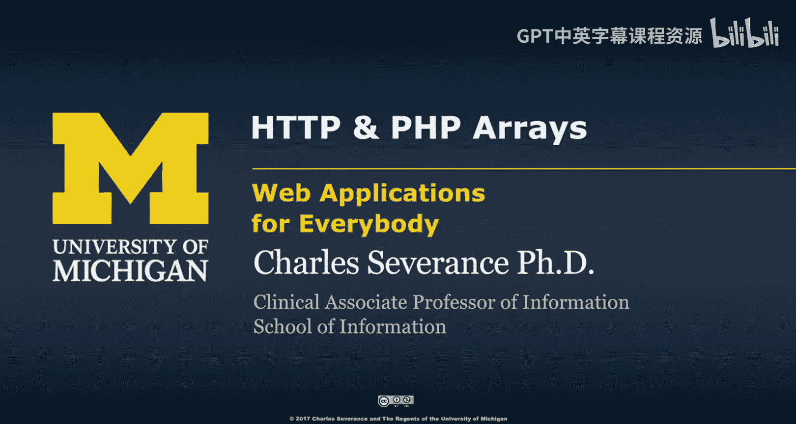
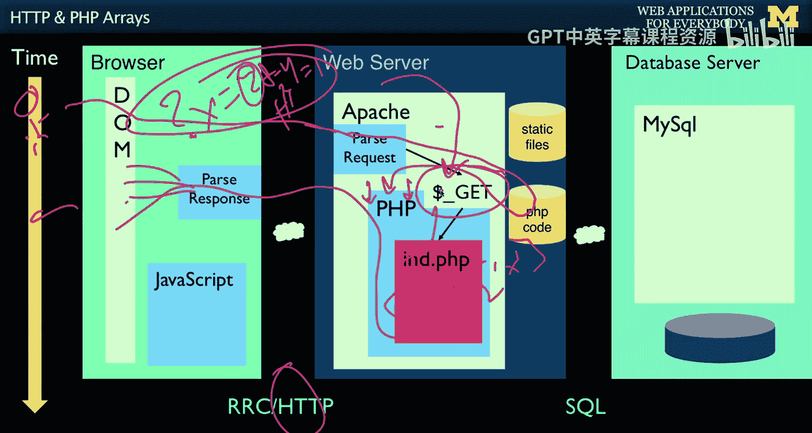
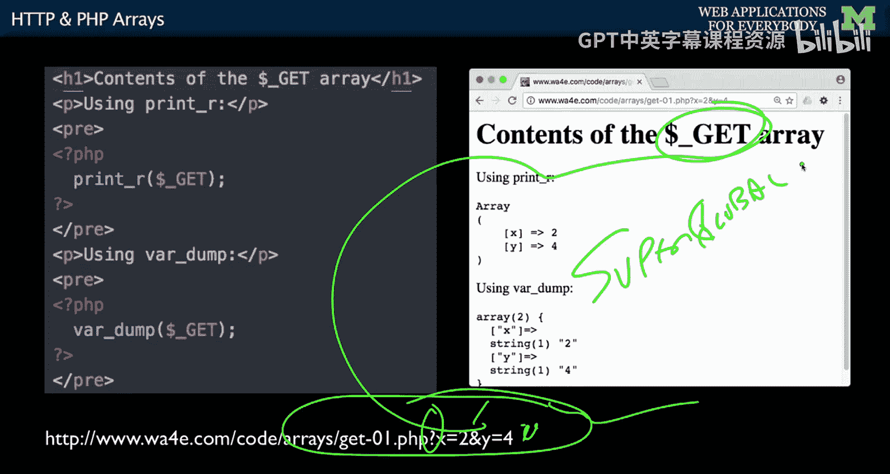

# 密歇根大学《面向所有人的Web应用程序（PHP、SQL、APP、JavaScript和JQuey｜Web Applications for Everybody》 p32 31_HTTP与PHP数组.zh_en -BV1Lr421A75d_p32-

So now we're going to connect two of my favorite things about PhP。

 We're going to connect the request response cycle and。

PHP arrays。 So let's take a look。 Remember our happy little request response cycle that I love so much。

 And that as you're sitting out here。😊，You click on a link。The browser sends a request with HTTP。

HTEV Apache， our web server retrieves it。It says， oh， this is some PhP code。

 so I'm going to start this thing up， start your code up。And if on the end of your URL。

 there are these parameters like question mark x equals 2。Actually。

 these values and then ampersand y equals1， these two values get parsed and put automatically into a global array that I've already mentioned called Do underscore get。

 so this is a variable that is defined before the first line of your code executes。

And so if you want to see what this value is， you can say dollar underscored get。Sub quote X quote。

So you don't have to write any of this parsing code。

 PhP understands the request responsible request response cycle with these get parameters。

 parses the get parameters and puts them into a dollar underscore get。

 and then you just write your code and then of course you send back HTML which goes back and parses in the Dom and then you get to see your next page。

So we look at data that's coming from the browser often in the form of what are called superg arrays。

And so here we can take just a quick print。This is a PhP file。You can run it right here with X and Y。

 And so it'll come in and remember that P P files are H until we tell them otherwise。

 We're gonna run a pre tag just so that so we don't get new lines because there's new lines here。

 If you don't have pre tag， it's gonna wrap it all up。 So it'll be one long line。

 I sometimes don't put the pre tagag out because I can read it。 but it's a lot easier to read。

 if you do put a pre tagag out。 So I'm gonna print this dollar get。 so。

This the first line of code dollar get came from these two parameters。

 So these two parameters are parsed and placed in the dollar get under x and Y。

 And that just saves you because it turns out it's not as simple as it looks。

 Itll be splitting and doing some other splitting and then convert these things because there's actually weird characters that can go in here。

 et cetera， et cea， et cea。 You know， that's not your problem。 That's PhP's problem。

 It parses all these things and puts them in an array and a story。

 I'm going to print it out with print R and will print it out again with var dump just because Var dumpump is a little more explicit。

 But basically these things go into this array。 and you just access that array。

 And those are the get parameters because this is an H TtP get because I hit enter here。 H TtP Gi。

 So it's the parameters after the question mark。 So this question mark the question mark here。

 And then key value and then ampersand next key value。 Ampersand next key value， et cea， eta。

 et cetera。 So you can add these to the end of a URL。

Pass them right into the get array and PP does that。 It's called a super global。

Because it exists in the main code and in any function within all of PhHP。

So that sort of zooms us through the fun stuff that we can do with PhHP arrays。

 and so we'll see in the next lecture。

