# 面向所有人的Web应用程序：P34：在Macintosh系统上使用Ngrok连接自动评分器 🚀


在本节课中，我们将学习如何使用Ngrok工具，将运行在你本地电脑（如Macintosh）上的Web应用程序暴露到公网，以便课程中的自动评分器能够访问并评估你的作业。这对于完成“猜数字游戏”等需要在线评分的作业至关重要。

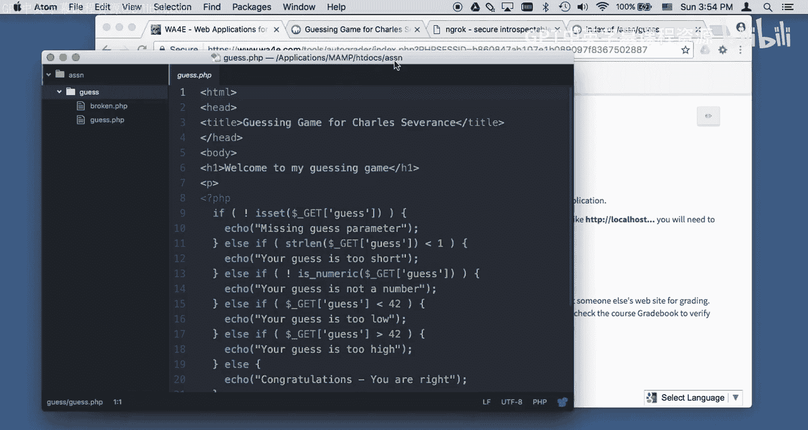

## 概述与问题背景

上一节我们介绍了如何在本地的MAMP环境中运行PHP应用程序。本节中我们来看看如何让互联网上的自动评分器访问到你本地运行的代码。

核心问题在于，自动评分器运行在真实的互联网上，而你的应用程序运行在本地服务器（如`localhost:8888`）。互联网上的服务器无法直接访问你电脑上的`localhost`。因此，直接提交类似`http://localhost:8888/assignments/guess/guess.php`的链接给评分器会导致连接失败。

## 解决方案：引入Ngrok

为了解决上述连接问题，我们需要使用一个名为**Ngrok**的工具。Ngrok能创建一个安全的隧道，将你本地服务器上的一个端口（例如8888）映射到一个临时的、公开的互联网地址（如`https://xxxxxx.ngrok.io`）。这样，自动评分器就可以通过这个公开地址访问到你本地的应用程序。

其工作原理可以用一个简单的模型表示：
```
互联网上的自动评分器 <---> [你的公开Ngrok地址] <---> [Ngrok隧道] <---> [你的本地服务器 localhost:8888]
```

## 在Macintosh上配置Ngrok的步骤

以下是配置Ngrok的具体操作流程。

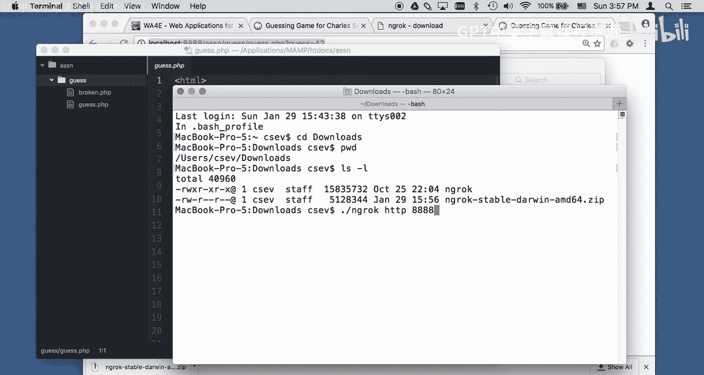

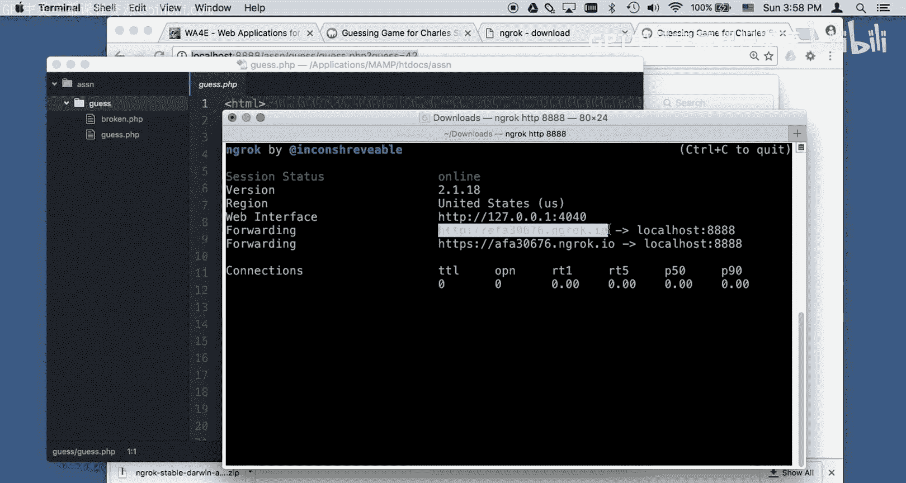

### 第一步：下载Ngrok软件

首先，你需要从Ngrok官网下载适用于Mac系统的软件。下载完成后，文件通常位于你的“下载”文件夹中，是一个ZIP压缩包。

### 第二步：在终端中启动Ngrok

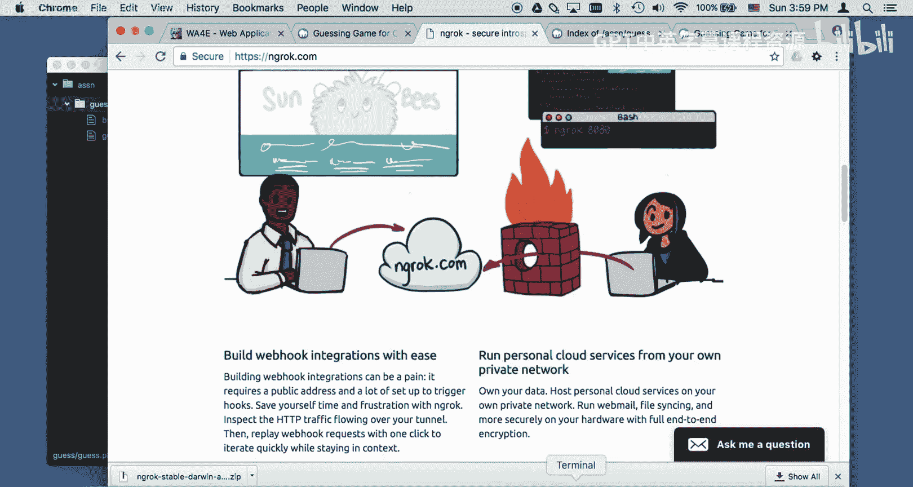


1.  打开Mac的“终端”应用程序。
2.  使用`cd`命令切换到存放Ngrok文件的目录。例如：
    ```bash
    cd ~/Downloads
    ```
3.  解压并运行Ngrok。你需要指定协议和本地端口。对于运行在`localhost:8888`的MAMP服务器，命令如下：
    ```bash
    ./ngrok http 8888
    ```
    运行此命令后，Ngrok会启动并在终端中显示一个公开的URL（例如 `https://a1b2c3d4.ngrok.io`）。**这个URL只有在Ngrok程序运行时才有效。**

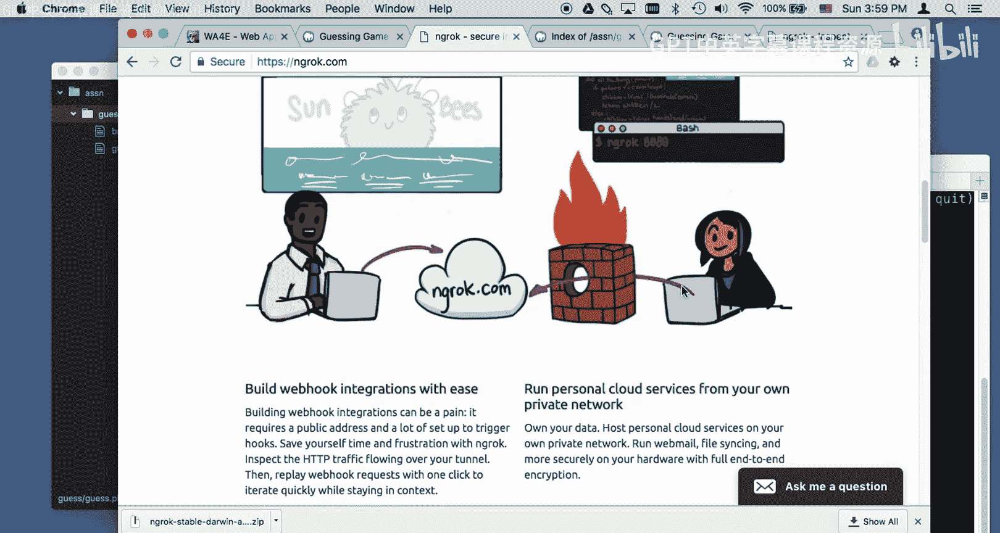


### 第三步：在自动评分器中使用Ngrok地址


现在，你可以用这个生成的Ngrok公开地址（例如 `https://a1b2c3d4.ngrok.io/assignments/guess/guess.php`）替换原来的`localhost`地址，并将其提交到课程的自动评分器中。评分器现在可以通过互联网访问到你本地的应用程序了。

### 第四步：调试与修改代码

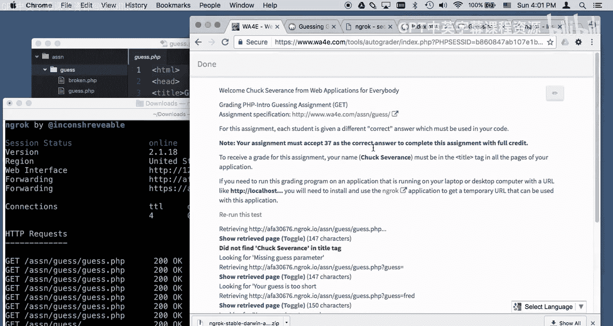

提交后，自动评分器会访问你的应用程序并进行测试。你可以在运行Ngrok的终端窗口或Ngrok提供的Web监控界面（通常访问 `http://127.0.0.1:4040`）查看请求和响应的流量。


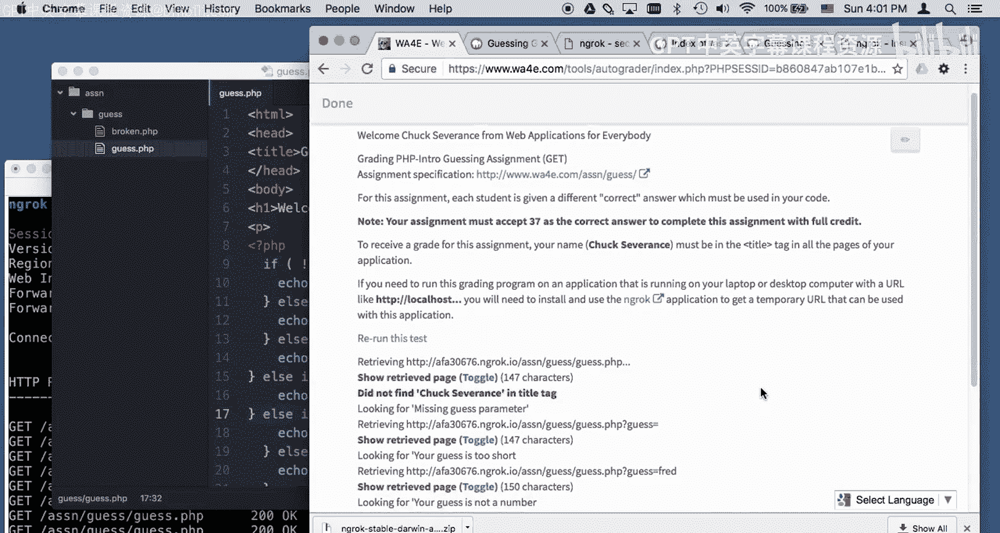


如果测试失败，评分器会给出错误提示。例如，它可能提示“在标题标签中未找到‘Chuck Severance’”或“你的猜测值太高”。这时，你需要根据提示修改本地的PHP代码（例如，将正确的答案从42改为37，或在HTML标题中加入要求的名字），保存文件，然后重新在评分器中运行测试。


### 第五步：完成与关闭

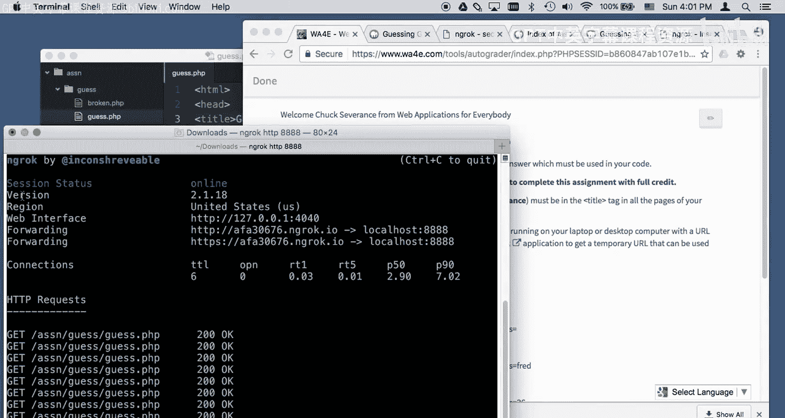

当作业全部通过评分后，你可以在运行Ngrok的终端窗口中按 `Control + C` 来停止Ngrok服务。此时，对应的公开URL将立即失效。下次启动时，Ngrok会生成一个全新的随机地址。

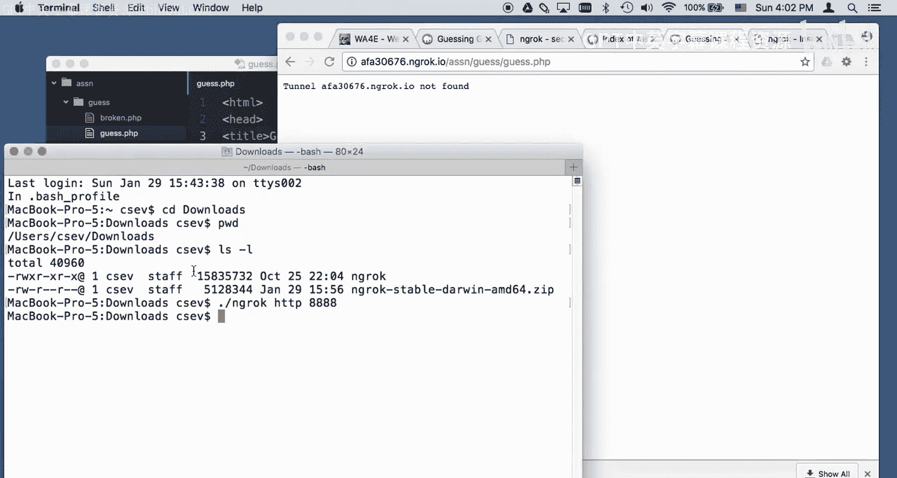


## 总结

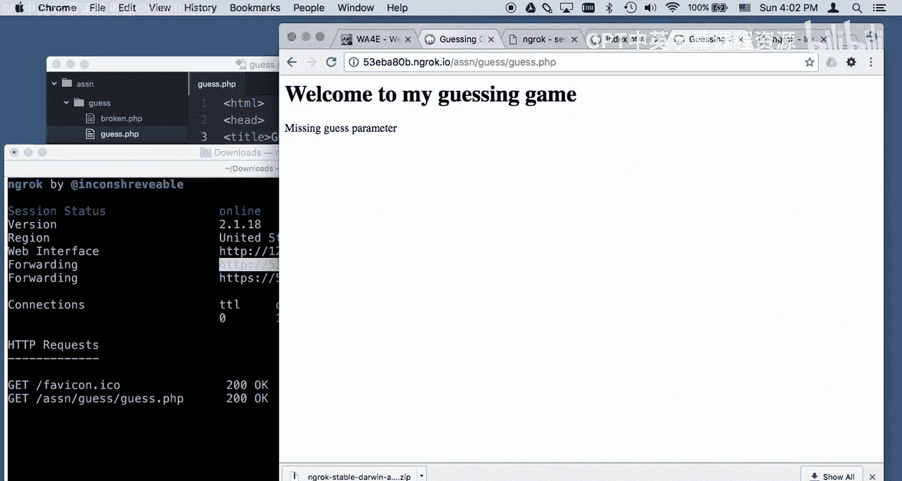

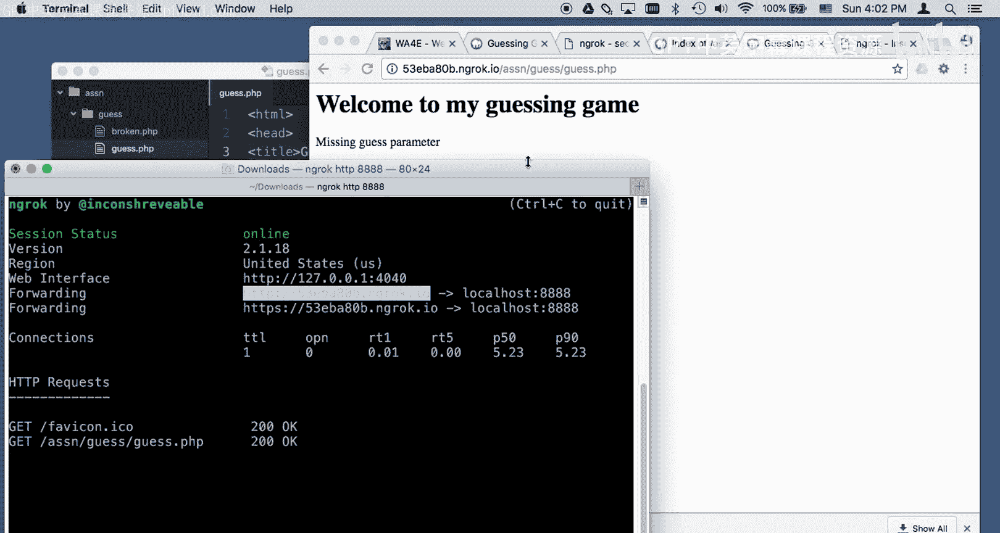


本节课中我们一起学习了如何使用Ngrok工具搭建桥梁，将本地开发的Web应用程序临时暴露到公网。关键步骤包括：下载Ngrok、在终端中启动隧道指向本地服务器端口、将生成的公开URL提交给自动评分器，并根据反馈调试代码。记住，Ngrok地址是临时的，每次启动都会变化，且必须在Ngrok运行期间评分器才能正常工作。掌握这个方法，你就能顺利提交并完成需要在线自动评分的编程作业了。