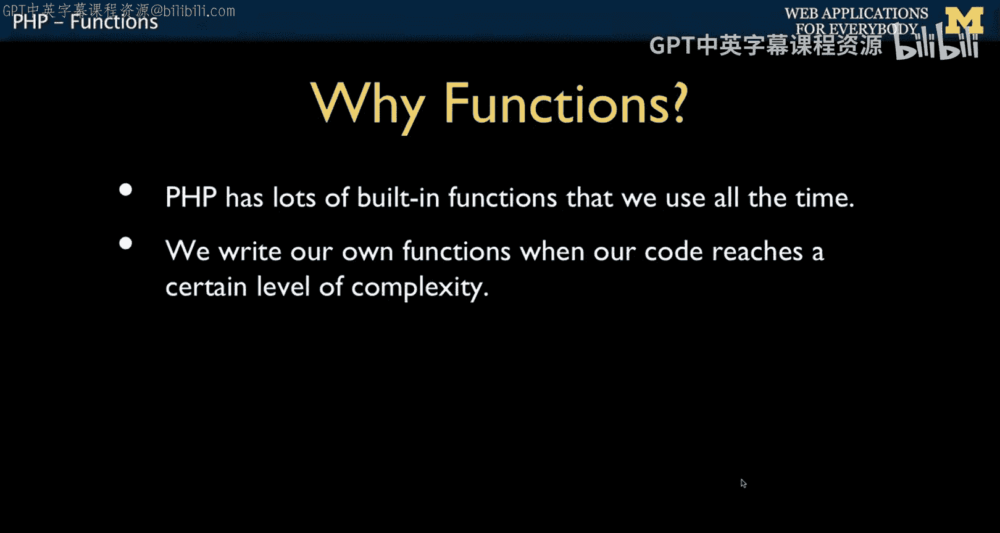
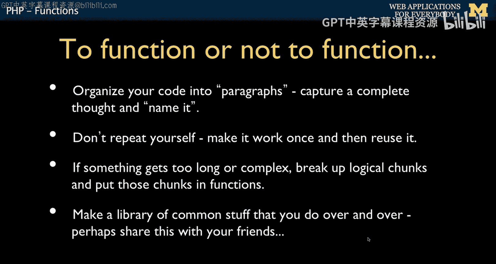
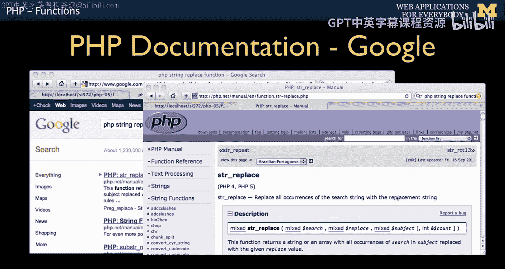
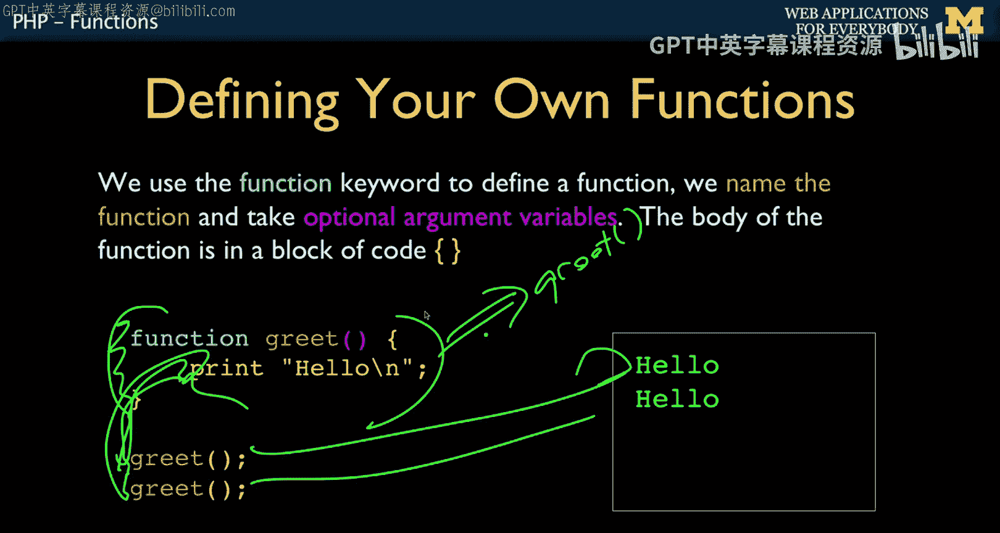
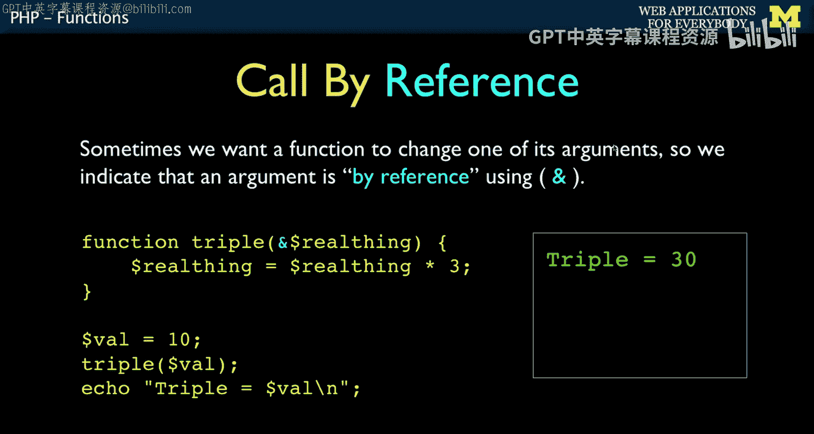
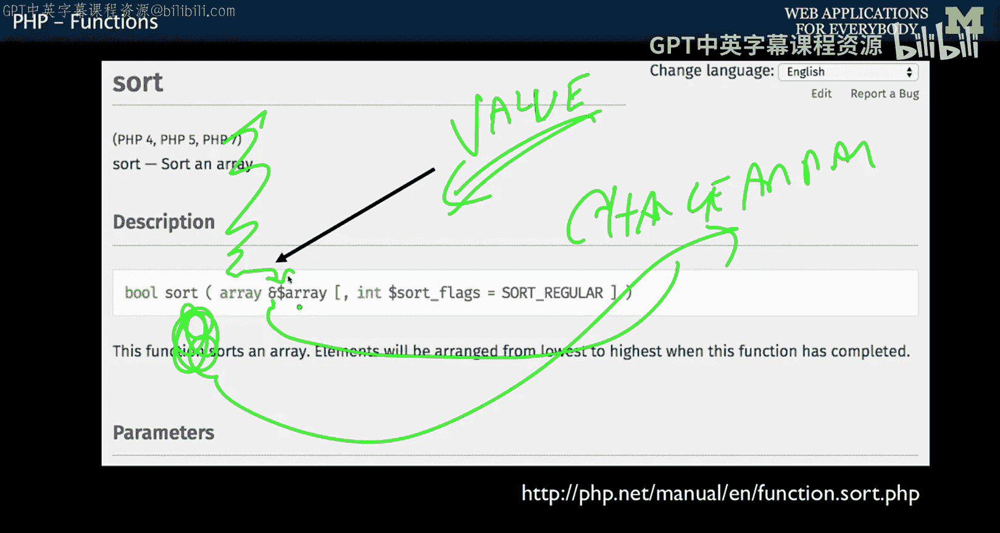

# 密歇根大学《面向所有人的Web应用程序》：第36讲：PHP函数 🧩


在本节课中，我们将学习如何编写和使用PHP函数，以及如何将功能拆分到多个文件中。函数是代码复用的核心，能帮助我们避免重复劳动，使代码更整洁、更易于维护。

## 概述







PHP是一门大量使用函数的语言。学习函数不仅是为了编写它们，更是为了有效地使用它们。我们将探讨何时应该创建函数，以及PHP内置函数和自定义函数的使用方法。

## 函数的基本概念

上一节我们概述了函数的重要性，本节中我们来看看函数的具体定义和调用。




函数是一段被命名的、可重复执行的代码块。你可以将数据（参数）传递给它，它也可以返回一个结果。定义函数使用 `function` 关键字。

**代码示例：定义一个简单的函数**
```php
function greet() {
    echo "Hello, World!";
}
// 调用函数
greet(); // 输出：Hello, World!
```

## 内置字符串函数示例

PHP提供了丰富的内置函数来处理各种任务，尤其是字符串操作。以下是几个常用的字符串函数示例：

*   `strrev($string)`：反转字符串。
*   `str_repeat($string, $multiplier)`：重复字符串指定次数。
*   `strtoupper($string)`：将字符串转换为大写。
*   `strlen($string)`：获取字符串的长度。



**代码示例：使用内置字符串函数**
```php
echo strrev("Hello"); // 输出：olleH
echo str_repeat("Hip ", 2); // 输出：Hip Hip
echo strtoupper("hooray"); // 输出：HOORAY
echo strlen("Hello"); // 输出：5
```


## 定义与调用自定义函数

了解了内置函数后，现在我们来学习如何创建自己的函数。定义函数时，需要指定函数名、可选的参数列表以及用花括号 `{}` 包裹的函数体。

**代码示例：定义和调用带参数的函数**
```php
function greetPerson($name) {
    echo "Hello, " . $name . "!";
}
// 调用函数两次
greetPerson("Glen"); // 输出：Hello, Glen!
greetPerson("Sally"); // 输出：Hello, Sally!
```

## 函数的返回值

函数不仅可以直接输出内容，更常见的做法是通过 `return` 语句返回一个值，供调用者使用。

**代码示例：使用return返回值**
```php
function getGreeting() {
    return "Hello";
}
$message = getGreeting() . " Glen!";
echo $message; // 输出：Hello Glen!
```

## 函数参数与默认值

我们可以向函数传递参数来改变其行为。PHP的一个优雅特性是支持为参数设置默认值。

**代码示例：带默认参数的函数**
```php
function sayHello($name, $language = 'en') {
    if ($language == 'es') {
        return "Hola, " . $name;
    } elseif ($language == 'fr') {
        return "Bonjour, " . $name;
    } else {
        return "Hello, " . $name;
    }
}
echo sayHello("Glen"); // 输出：Hello, Glen
echo sayHello("Sally", "fr"); // 输出：Bonjour, Sally
```

## 变量的作用域与传值方式

在函数内部使用的变量通常与外部隔离。这引出了两个重要概念：**按值传递** 和 **按引用传递**。

### 按值传递

默认情况下，PHP函数参数是“按值传递”的。这意味着函数内部获得的是参数值的一个副本，修改这个副本不会影响外部的原始变量。

**代码示例：按值传递**
```php
function doubleValue($num) {
    $num = $num * 2;
    return $num;
}
$value = 10;
$result = doubleValue($value); // $result 是 20
echo $value; // 输出：10 (原始值未改变)
```

### 按引用传递



有时我们需要函数直接修改外部的变量。这时可以在参数前加上 `&` 符号，表示“按引用传递”。

**代码示例：按引用传递**
```php
function tripleValue(&$num) {
    $num = $num * 3;
}
$value = 10;
tripleValue($value); // 直接修改了 $value
echo $value; // 输出：30 (原始值已被改变)
```
理解这一点对于阅读PHP文档非常重要。如果你在文档中看到函数参数前有 `&` 符号，就意味着这个函数可能会修改你传入的变量。



## 总结


本节课中我们一起学习了PHP函数的核心知识。我们了解了如何定义和调用函数，如何使用参数和返回值，并探讨了按值传递与按引用传递的区别。函数是构建模块化、可复用代码的基石，掌握它们对任何PHP开发者都至关重要。下一节，我们将深入探讨变量的作用域。