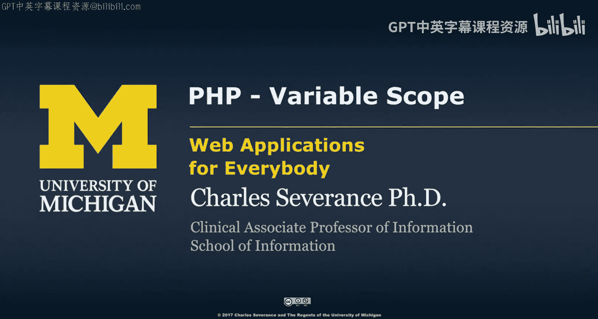
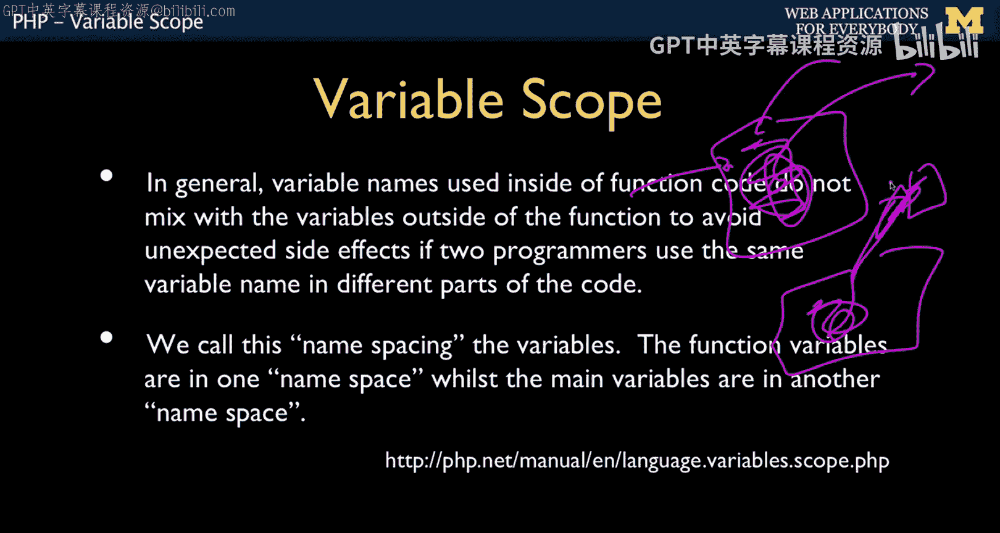
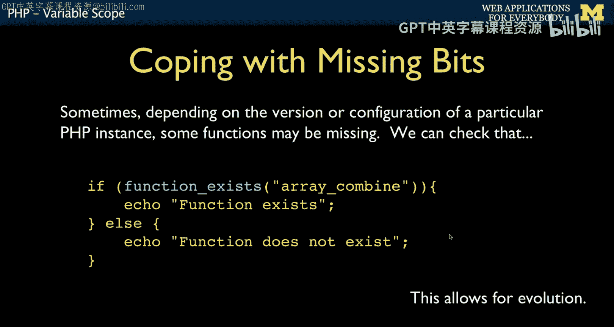
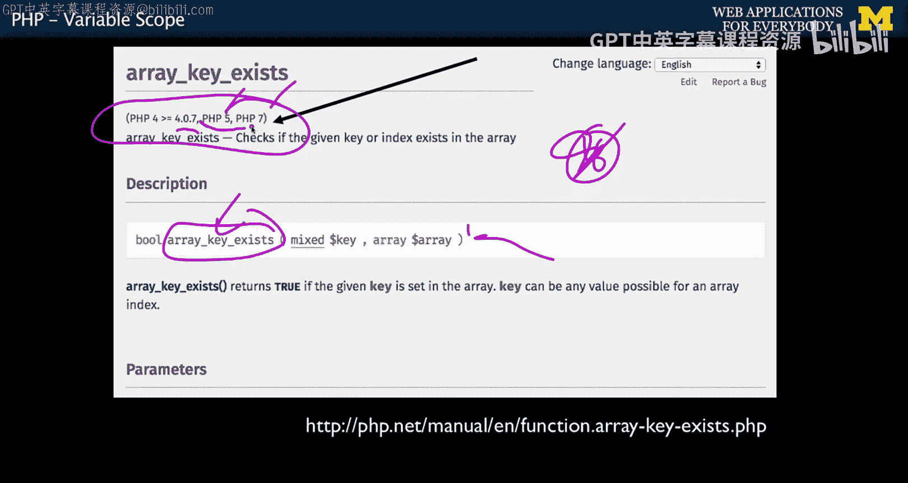
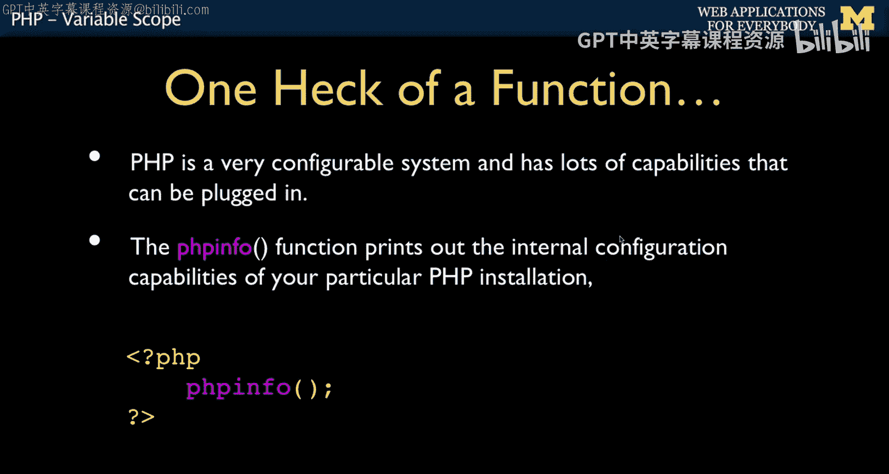
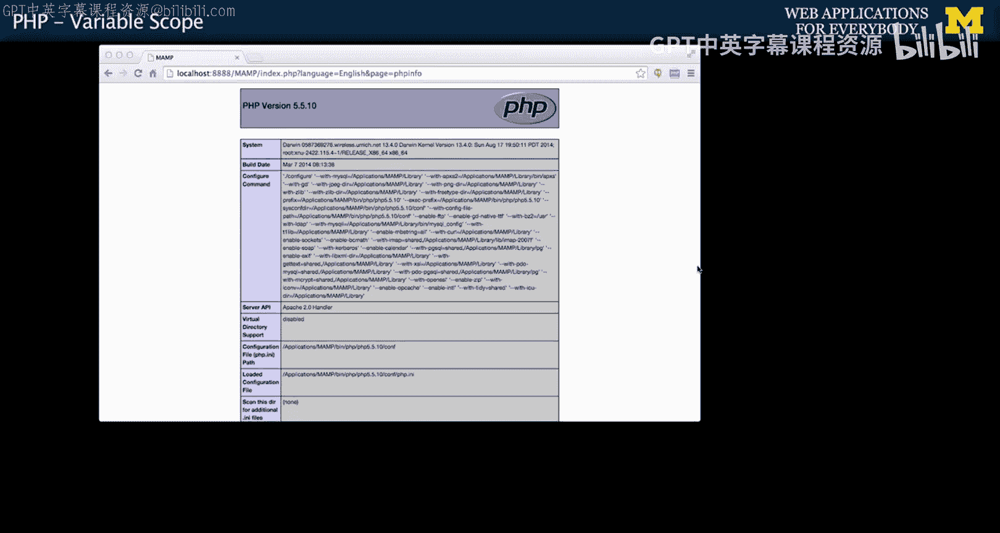

# 密歇根大学《面向所有人的Web应用程序（PHP、SQL、APP、JavaScript和JQuey｜Web Applications for Everybody》 p37 36_PHP变量作用域.zh_en -BV1Lr421A75d_p37-

So now we're going to talk about variable scope and what is variable scope。 Well。

 we have code that's in a function， right variables inside the function and this basically whatever we do is not supposed to affect the outside world。

 And we talked about call by value where you pass a copy in。 and then we have call by reference。

 which is like there's this little tiny doorway to one thing out here that you can mess with through the little doorway。

 So that's what scope is scope is we are going to hide stuff or we're going to let this like leak out right。

 But in general。

What it really means is the things inside of a function do not leak out。 There's no mixing。 the。

 you can choose the variable names， the same， and there's no mixing。 right， And so in this case。

 we have this function。 The normal case is it's fully isolated。 right。

 We're not even passing a parameter in here。 So this vowel is not really the same as this vow。

 There is a vow out here。

And inside here， there's also a vow。These are not the same thing。 They're not the same thing。

 This one is living inside it。 It's name spaced。 It's the vow within the function trizaap is the way to think about this。

 And this is the vow that is in the global context。 It's the global。 This is a big script。

 The outer vow， and then the inner vow。 So we make a wall wall， big wall。

 Nobody sneaks through the wall。And of course， oh yeah。

 superglos right dollar get sneaks through the wall if it's the dollar get or dollar post or dollar session。

 which well learn about later， they're called superglobals， but let's ignore that for the moment。And。

 of course， once I draw you a picture of a wall that cannot be penetrated。 and I say， oh。

 here's how you get out。 So how to escape the wall。 So the way you escape the wall is。Using global。

Global says， open a door and go find me outside making if necessary that variable name vowel。

 So out here， we got this vowel 10， we stick 10 in。 we say global。

 So now Val is really just an alias to that vow。 The name's got to be the same because it's matching based on the name。

 Go find me。 The variable name vow outside of me。 right， go to the global  one。

 And now if I set it to 100。 It's 100， come back， Ch out 100 because it pulls this out。 Okay。

 really simple。 break the little wall， the wall's really bit solid。

 except for this one doorway that we put in and poof， we sneak out。😊，Now。Be careful。

Les thing you want to do is a lot of global variables， especially with funky names。

 especially a variable named Val or a dollar I variable。

 because you might be in a loop on the outside and I might be going up and you global eye。

 and you can blow the loop up。 You can mess it up。 You can mess up code that you're supposed to be serving as a function And yet you mess it up because you're messing with the variables that the outer code is using。

 So this is supposed to be very rarely done， right， And so。

If I grade a global variable that I tend to avoid it at all costs。

 know if you can pass it in by a parameter， passing it back by return value。

 these are like the two happiest things and they make every programmer happy if you can make a function that takes in copy by value parameters and passes return value。

 that's like a pure function that has no side effects。You can see read about。

So if you have a no side effects function， that's like ideal that everything inside the function。

 the contract or the outside world is in goes the parameters。

 but you can't change them and I'll go the return。 nice passing a variable by reference。 well。

 that's okay。 but you know， if you can avoid that， this is the best。

 these two things are ideal passing a reference is okay and PP。

 it's okay more okay than other languages。And if the so global variables are like your last resort。

 like I gotta have a global variable。 And then what I suggest And what most people do is have used long。

 long names because you don't want to inadvertently collide with somebody that just happens to be used in your code。

 now maybe you're communicating and you're saying， hey。

 I'll set this global variable when my functions all done。 and you can grab it。

 And so these are example variables that I've created for some actually the code that does your autograders。

 Last owath body bass string。 Sometimes I make them really long with camel case。

 Sometimes I like them really long with uppercase snake case。 Caml case is is。😊。

The first word is capitalized snake cases is this where it all stays lowercase。

 and this case this is。Uppercase， snake case， but I use these long names with nice unique prefixes because hopefully it also emphasizes to me that I'm not supposed to use them and it reduces a chance of collision because there is only one namespace for global variables。

Another thing interesting about PhP is that。PH P。Evolves over time。 And I mentioned， you know。

 Ph P 1，2，3，4，5，7。 Member 6 doesn't exist。 There's a lot that's changed over the years。

 Like object rank came in 5 and they'll coales and came in 7。

 And so there are things that only exist in later versions of P P。

 If you want to write code that runs on these earlier versions。

 you have to come up with something that deals with that。 If function exists。 array combined。

 this returns a true false。 You pass a string with a name of the function， and you can ask。

 and it allows your code to evolve and cope with different environments。 And sometimes。

You don't have everything installed a PhP。 And so you can check to see if your particular instance of PhP has a function that is an optional thing。

 So there's core stuff and optional things。 If you've installed one of our map or Xamp distributions。

 you'll find that you get a lot of the optional stuff。 And so you don't worry so much about this。

 although you'll move into production， be be like， oh。

 where did all these things go and they're like， well。

 we didn't put those things in So you have to find ways to work around So function exists is a way for you to write code that's smart enough to declare enough sometimes。

What you'd say is like if array combined doesn't exist in the version。

 you can actually go to stack over and flow and say。

 could you give me a pure PhP implementation of array combined。

 So the thing you'll do is you'll check to see if array combined doesn't exist in your PhP。

 and if it does， you'll actually put function that says。In this not exist， right。

 you'd actually define the function here。 So that's a way。

 you can't define the function if it's already there。 And that would cause an error。

 So you just say if this function is not already here， then add this function。

 which is a way for you to be backwards compatible。 or sometimes forwards compatible。

 Sometimes they take things out。 And then you can say， oh， wow， it doesn't exist。

 So I'm going to write this。 or I'm going to check set a variable So I do it differently， et cetera。

And one of the things that they're very good and very consistent about in the PhP documentation is telling you which versions this PhP works in。

 So this array key exists was clearly introduced in PhP4。0。7。 So it's there and then PP5 and PhP7。

 Remember 6 is the magical produce that doesn't exist for PhP。 And so you're want to use this。

 You can check to see if it doesn't exist And if not。

 you could write your own little simple version of it， and you can probably say stack overflow。

 array， give me a pure PhP version of array key exists for earlier than PhP4。 Now。

 PP4 is pretty darn old。 So you're probably not going to run into PhP4。

 but you will run into for some time。 you than PhP7s been out for a while and it's awesome。

 You will still run into PhP5 systems for a very， very long time。

Now， one of the things that I mentioned is that PhP is like super configurable and has lots of capabilities that can be optionally plugged in。

 and sometimes you actually have to figure out what is in your PhP installation。

Call the system administrator say， hey， what's going on。

 But it turns out PhP has a really cool built in way to dump this stuff for you。

 So you write one file。 I often call this file info do PhHP。And you put the exact three lines in it。

 And this is a function that's built in a PhP that dumps the configuration of a particular。

 So if you can run this on your laptop。 You could run this on your server。

 You could run it somewhere else， And you can figure out what version it is how it's configured where it stores its log files。

 et cetera， et cea， et cetera。 And we will be looking at this。 If using map or Xamp。

 there's usually a button called PP info that just shows you this stuff。

 which is quite nice because it's important to figure out what's in there because there's lots of things that are plugged in。

 This is why I recommend Xamp。😊，And maam。Because they put a ton of stuff into them so you can like you don't have to go like oh I'm missing something so that's that's nice because they choose all that stuff。

 And so this is what the output of that looks like and it's page upon page of configuration dump of where this is at。

 what the configuration setting is what's been compiled into PhP because it's so darn flexible。

So next we're going to talk about how you take an application， the web pages。

 and move them into multiple files for common elements that occur on many pages。

