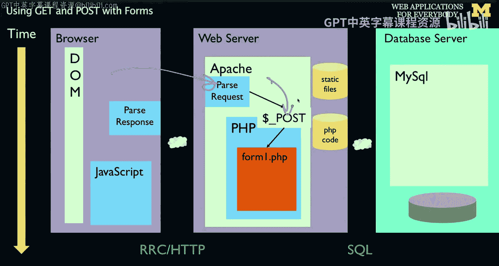
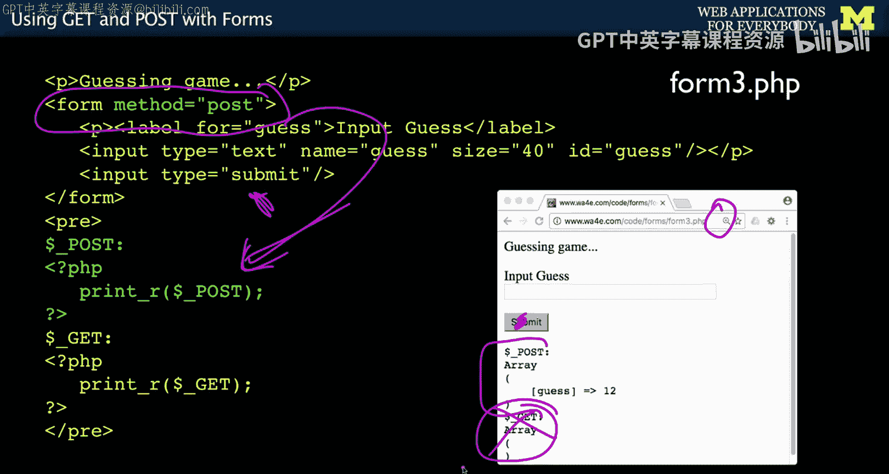
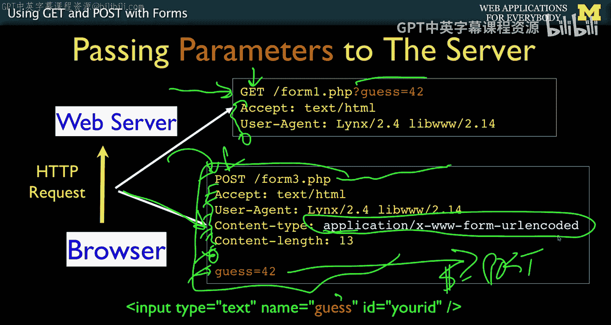
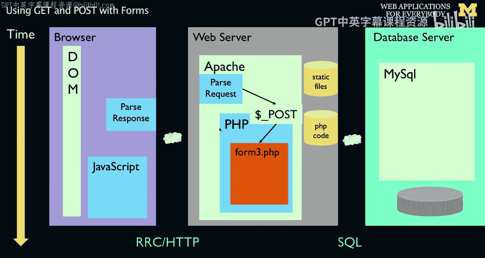
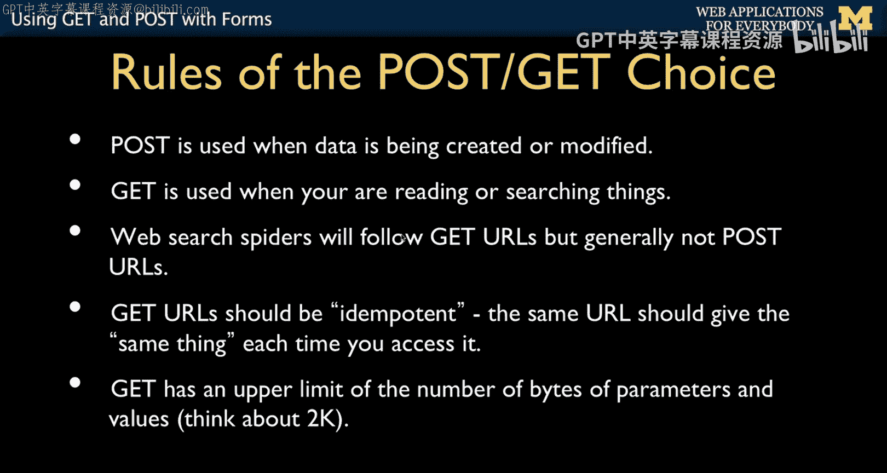

# 密歇根大学《面向所有人的Web应用程序（PHP、SQL、APP、JavaScript和JQuey｜Web Applications for Everybody》 p41 40_表单GET与POST方法.zh_en -BV1Lr421A75d_p41-

So we just talked about how the get request sends data in。

 Now we're going to talk about the post request and we'll draw our forms a little differently。

 but ultimately it's a different form of the HTTP request。 The data comes in by a post。

 It doesn't come in on the URL and we'll talk all about that。

 so now we're going to show how we get post data in。

So the simplest thing， as you tell the form tag， please， when I hit the submit button。

 When I hit the submit button， send this data into post via a post。

 and we'll talk about what that means kind of in a low level technical bit。

 And it just comes in in the post array And instead of the gett array。 So in this case。

 the get is empty。 There are no parameters。 That's the nice thing about post。 is there no parameters。

 Your URLls don't look ugly。 The data comes in。 and it magically comes in。 This post array。

 not the get array。 So that's how we do it。

It's important to know when to use get and know when to use post when you do get。

 the parameters are posted on the URL and the users see them。

 The nice thing is if you want them to bookmark those parameters。

 they can because the thing that gets bookmarked when you drag a URL on your browser is the whole URL。

 including the parameters。 The post you don't see the parameters。

 And so sometimes that's exactly what you want。 but they're actually sent。

 they're just not sent on the URL。 So if we're to look at the request response cycle， this is HttP。

 right we're looking at for the browsers talk into the server。

 So in the browser remember if we went to port 80 and we sent this get command。

 sort of an abbreviated version of it。 So when you're doing a get sending data。

 it says get form 1 do php and then send this get parameter。

 and then there's some things and then you put the blank line and then it sends it。

 If you're sending a post request。 It's a different HttP verb， these things are called verbs。

 there's a get verb， there's a post verb， there's a put， there's a delete and there's a。

Head， there's other ones。 So the post verb says we're going to send data differently。

 and we don't put the parameters here。 We' still are sending a key of guests with 42。

 And there's some data。 And we say this is a particular kind of data。

 says this is URL encoding the data。 And then it has a blank line。

 and then it actually sends it down here。 And this is why on a post。 you don't see it。

 It's part of the connection。 This is a connection to the server。 send， send， send， send， send， send。

 send a blank line。 send the data。 And then that gets copied into the dollar underscore post。Allray。

 okay， so that's the D post array。

So again， that what we just were watching is what's coming across here， it's doing a post。

 Apache sees the post， it pulls the data out and sticks it into the dollar post array for us。

 and then our code， the first line of our code starts up。

Now you can choose whether or not to do getter post and as a developer。

 you're responsible for choosing the right thing， so first off。

 post is to be used when you're creating or modifying data。Gett is to be used if you're searching。

 so for example。If you are like selling something online you had a catalog and you'd typed in a part number and you hit search。

 It would be in your best interest to use get。 And that's because if they bookmark the part。

 you'd actually have the part number right there in the URL。 If on the other hand。

 you're taking money out of a bank and you're saying I'd like to take 100 dollars out and you hit the button。

 The last thing you want is that 0 dollars withdraw 10 dollars to be right on the URL。

 because then if they bookmark that every time they hit it， they're going to withdraw 100 dollars。

 So that's why we use post when data is being changed。 Also， Web spiders were follow get URLs。

 but not generally post URLs。 And so Web spiders know that if you type stuff into a form that says it's gonna to post and you hit to submit something might happen。

 So the last thing you want it would like to do is you like have a blog and you have a delete button。

 and that's a get request。 And then web search engine goes through and tries to read all your blog post and ends up deleting them by mistake。

The nerd word that we use for this is that get URLs are idpotent。

 meaning that you're supposed to you hit the same URL， you should get the same thing back。

 The example of in a catalog a part number equals。 you should get the same part number。 Now。

 maybe there's less in inventory。 doesn't have to be identical page。 It just means the same thing。

 right， So part number is this is our skateboard。 and there's4 in stock， and then you hit refresh。

 It should be the same skateboard， but there might be 40 in stock， right。

 So that's what it means by the same thing。 It's not identical HTML。 It's the same thing。

 Another reason why you might want to use post is there is a length limit that's unknown on get parameters。

 different browser depending on your browser， depending on your web server。

It's not exactly a number， it's not exactly known and it's not exactly the same。

 but there is a limit， and so you just don't want to run into it so we tend to like the URLs themselves to not get very long。

 if you're going to send a paragraph text， it would be really bad to send it on a get request right but a few parameters you have to worry like if you have x and Y and something else and part number or whatever。

 but you just don't want it too big。So I' next， we're going to talk a little bit about how we can create different input pipes in the form。

