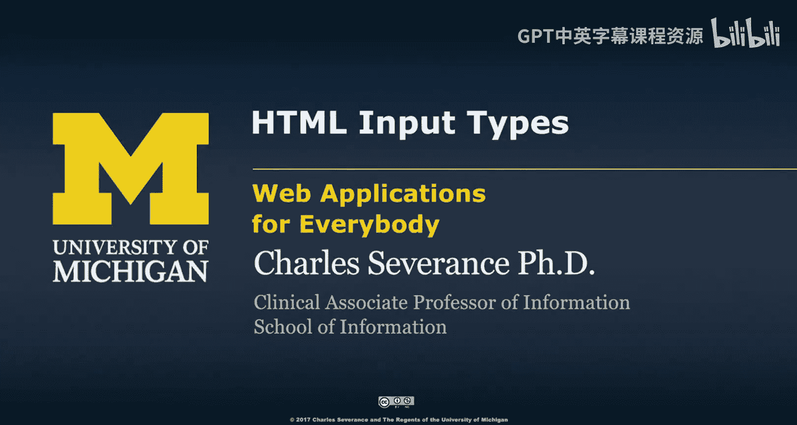
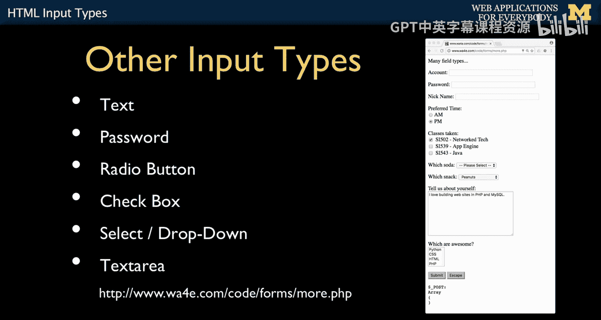
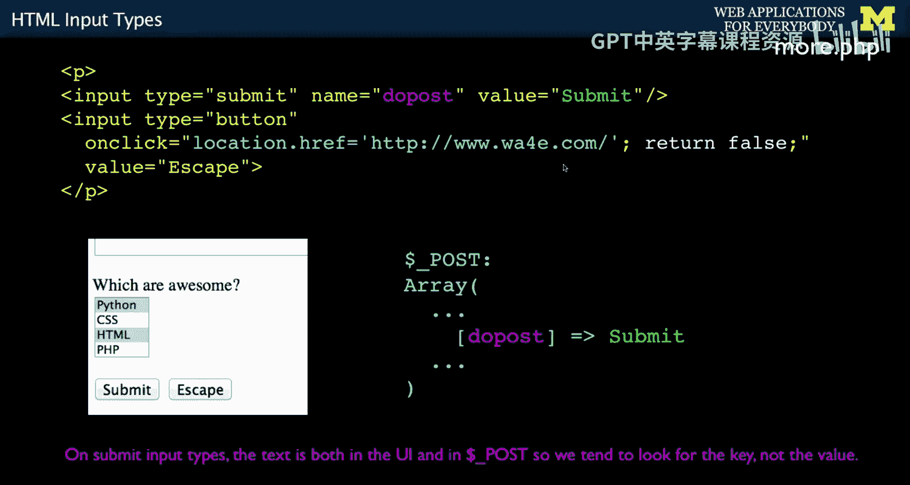

# 密歇根大学《面向所有人的Web应用程序（PHP、SQL、APP、JavaScript和JQuey｜Web Applications for Everybody》 p42 41_HTML输入类型.zh_en -BV1Lr421A75d_p42-

So now let's just briefly talk about some input types。

 I'll give you another video that sort of goes through this in a viewaurus and plays with it in a browser。

 so this is just kind of an outline of the kind of text you're going to look at。

 And often there's lots and lots of good online documentation like how to do a text area。

 What says give me a sample select。 And so I tend to just go to the web and say。

 what's how does the password fields。 So this is more of an outline than sort of instruction on how to do this。

 The web itself。 is the outline。 So here is a couple of fields。 So text field is the basic field。

 we have a box and we can type stuff in a password field is effectively exactly the same as a text field。

 It sends the data in plain text between the browser and the server。 that is a plain text。

 It shows this asterisk So someone can't shoulder serve。 of course， can watch you type。

 but they can't see your password on the screen。 It just hides it visually。 Nothing else is hidden。

The other thing we're kind of seeing here is how each form field has a different name。

 and these are the names when we're going to package this data up and send it to the server account equals Pw equals and the NickI equals。

 So the name is what we're going to show in the dollar getar or the dollar post array。

 And so that's the key value。 You'll also see an I tag on these things。 an I tag。

 this is a CSss slash HTML thing。 So in this case I am connecting。In this case。

 I am connecting this input tag with this label， mostly to improve accessibility。

 but that is an HTML thing。 So that's not， you know， here's the browser。And then， here's the server。

The name affects the browser to server connection， but the I is just all here in the browser。

 This I in the four。 that's all here in the browser。 sizeizes in the browser。

 That's all just sizes telling how long to make this little box？ And so that's all browser stuff。

 That's HTML and CSS stuff。 But the name equals is part of the request response cycle and how that data is passed in represented parsed and then presented to you inside of your PhP code。

 The name is the key thing。 Some people use the I in the name to be the exact same thing。

 which is perfectly okay， but they have two very different and distinct functions。A radio button。

 just is something that people like。A radio button is a button。That if you push one。

 the other one turns off， and you can have many of these。 as many as you want。

 And as soon as you push one， you push this one， this one turns off。

 and you don't have to have them right next to each other。

 Although sameane usability basically says you should。

 And the way you do this is you say typepes radio。 And then you give them the same name。 And a value。

So what this now says is when is going to be equal to A or PM。

 depending on which of these two things is checked。 And so you see this， right， In this case。

 we checked PM， hit the submit button。 And so it looked and figured which one it was。

 and then it pulled the value out of that one to drive to the PM and then the when。

 So key value pair。 And so literally I could stick another one of these， you know。

 way down here and another one up here as long as I named them when then pushing this one would turn all four of these on and off。

 And so you associate them not by having them near each other。

 you associate them by having the same name。So that's a radio button。 prettyt good user experience。

 as long as you got the right number of things， and it's the kind of thing that you want check boxeses。

 when you have a list of things， key to check boxeses as they can all be on or off and so you give them different names So class 1 class 2 class 3 and then I mean that's with this check boxes。

 Class 1 class 2 and class 3。 and if I check one and then hit submit button you put a value for each one right So class 1 equals S 502 So class 1 drives into the post array and the S502 tells me which of those things was checked If you don't put it。

 it assumes value equals on。So by default， that's the default。

 So if I checked the third one and hit submit， I would get on。Select， dropdown。

 we use these all the time。 They're really cool， especially because we can read like what brand a car or whatever from a database and fill this stuff up。

 and it's really nice。 saves us a lot of pretyping。

 although later we'll find out how to pretype stuff and put that in a form field text field so you can type something in a prefix。

 but that's way later in the class for now we're keeping it simple。 And so this is one field。

 not six fields。 And so you put the text of please select。

 And if I just submitted the button right now， it would actually send soda equals0。

 which is exactly what it shows right here。 so it equals 0 because that's the one that was selected but if you pick and you switch down and you pick Mountain De。

 then it will send soda equals3。 And so that's what it's doing。

 there is one name and multiple values and based on the gesture that the user is picking。

 that's going to do it。 And if you give it this top one， know your code will be like hey。

You were supposed to select one so you'll know that zero you write these01 too。

 it doesn't have to be numbers， it could be now Fred， Sam， Sally。

 whatever you pick them and then you make sense of them inside your program and so inside your program if you got this one that said zero you might say。

 hey you didn't select a soda and then go back to the screen with an error message and ask for the soda again。

You can have a default。 That's something other than the first one。 And again。

 this value is just a thing you're choosing， right， Chis， peanuts cookies in that case。

 it's just a string。 It's not always a number。 a lot of people do use a number because it's just a way for us to keep things sane in our minds。

 but it's just a string。 So we got a name， which is going to give us our key S gives us our key。

 right， And then based on whichever one this is selected， if you don't have this one。

 this one is selected by default。 But if you say selected， you only want to do it on one of them。

 And then that says it'll start at peanuts。 So if you pop it up， there'll be some's above it。

 something's below it， you can switch。 But if you hit submit。

 you're going to get peanuts because that's the value， the value decides that name。

 the name value pairs。 name value pairs。Okay， the text area is like a blog comment or a blog post or whatever。

 and there's actual little JavaScript which we'll talk about later that makes these things where it puts bold tags and fancy stuff and you can see these text areas sometimes a toolbars。

 that's all JavaScript that's augmenting the text area。

 the fundamental thing that's in HTML for blocks of text is our text area now。

The text area is intended for longer chunks of text， and so it has a little different pattern。

 everything we've seen up till now has value equals。

That sort of determines the thing that's going but that's not how it works in text area。

 T area and slash text area。Surround a bit of text。 There's things like rows and columns and name。

Name is how it's going to be submitted to the server。

 Whatever you type in here is going to be submitted in server， the previous data。

You can put the old data in here， I love building websites in my SQL。Then you come in。

 you type anything you want。You hit the submit button。

 and then this is all bundled up and sent in under the key about in your post data， okay。

So that's a little different， everything else。Everything else we've done。

 the thing that gets sent is part of the value that attribute， right， the value attribute。

Value peanuts。 But in this one， it's not the value attribute。 It's the stuff in between。So this。

Is a multiple select checkbox and。Most people。Just say， never， ever do this。

 Build some other user interface。 I just included it。For completeness。So it's a type。

 a multiple select。And the key that you're going to send in is actually an array。

 that's what this little thing is saying， it's array。And then you have a set of options， values。

 and with enough gestures， you can check more than one。And then when you check more than one。

 you get an array of the check thing。 So code itself inside of post。

 remember we've talked about how you build simple data structures by putting arrays within of arrays。

 So this is an outer array with a key of code and do post and the data under code is itself an array which is a two item array with item0 with CSS an HTML because we've checked those two。

 and then we hit submit and that's what comes into our server。 But no， no， no， no。

 more most UI people will tell you just don't do that。And I have to agree totally with that。

Another thing that we see is the submitit button。Submit button itself can have a name and a value。

Name and value。 Now， the value is weird。In that。The value also shows the text。

 And that's completely different than everything else。

 meaning that when I said option a value equals 0 in in the previous thing。

 you never saw the0 as as the user。 This is this actually you see as the user。

 which to me is kind of。I mean， it's just， it value should not be that it should be the value should be the thing that gets sent to the server。

 The name， of course， is the thing you can send to the server。

 The value is the thing that gets sent to the server。But the value also is the thing that you see。

 And that's the part that I don't like about this。 But hey， how what I think about it。

 this is like 25 years old。 So we're not going to argue about it anymore more。

 I just think it's tacky。 So what happens is when I'm writing code， I sort of don't think about this。

 I use the existence of the key using is set。Member is set。So I can say if the Due post is set。

 then I know that this button got submitted， and if I have multiple buttons。

 I can determine which of them is by giving each of the buttons a different name rather than having the buttons have the same name and different values。

 the value I just use for the visible part of that。And another thing that you're going to see is。

How we're going to actually override the behavior of a button and do something with it that's kind of more like an anchor tag。

 And so just you'll see this。 And so it's a button。Value is escaped tells what text it is。

 and oncl is a bit of javascript。 and we'll talk more about this when we get the ja。

 oncl is a bit of jascript code。 And for now， you'll just see me use this and lots of my examples。

 So I want to explain it。 What we're saying is location do af。

 And what that really is doing is if this is your browser and you got this location bar that's H T what this is saying to the browser in jascript because remember jascript can modify the document object model。

It actually is putting this string， this string right here into that as if you typed it and then hinting the enter for you Lo H F equal says put that in the browser and then go to that page。

 So it's caused as a get request to go to that page。 And this return false。

 which you'll see each in a lot of these little onclick guys。

 What the return false says is don't actually submit the form。 because this is a button。

 and it might submit the form。 And what I've really done here is I have made on anchor tag。

That looks like a button。Now， those of you who are CSS experts will say you should have done that with CSS and the answer is。

 yeah， I probably should have， and if I'm using Boottrap or another CSS framework。

 I would do that but this is kind of the old school low CSS way to accomplish that。

So the next thing we'll talk about is HTML5 input types。

