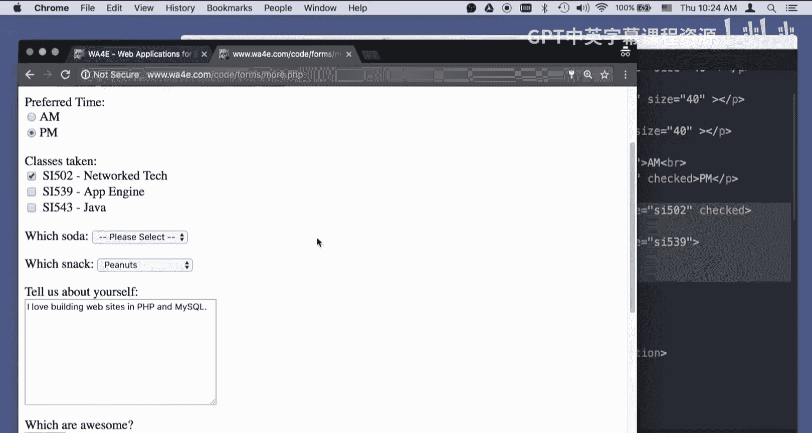
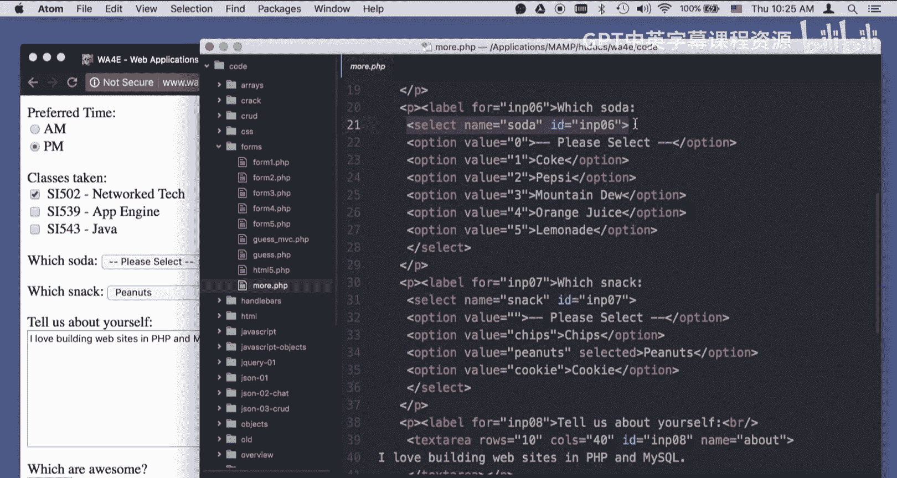
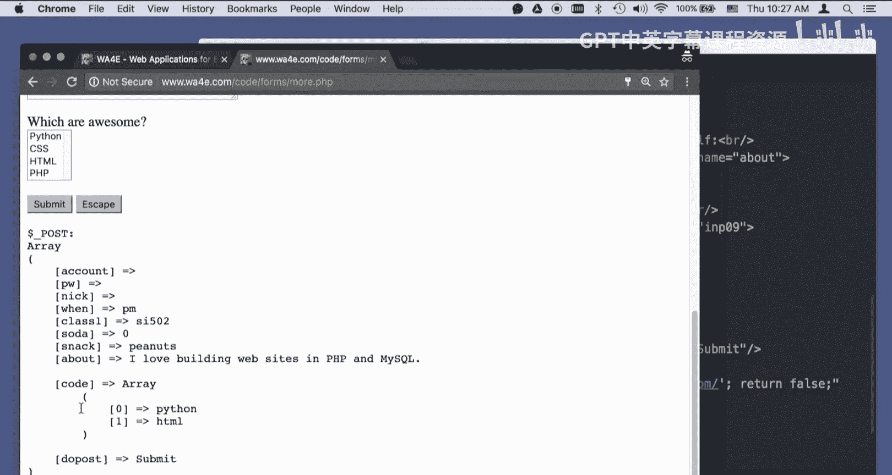
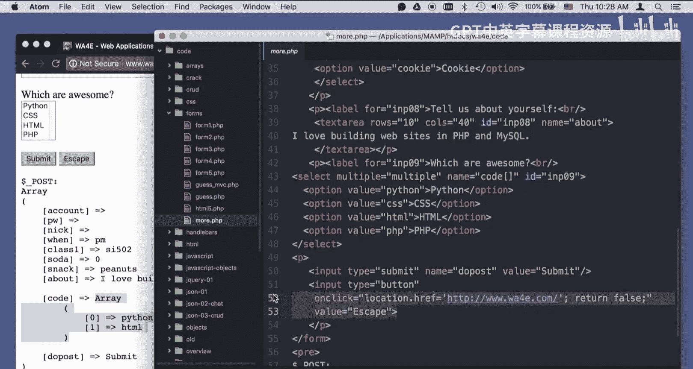
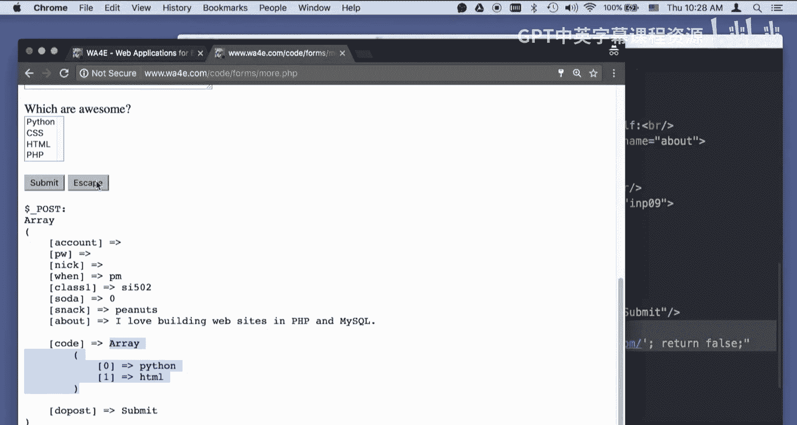

# 密歇根大学《面向所有人的Web应用程序（PHP、SQL、APP、JavaScript和JQuey｜Web Applications for Everybody》 p43 42_代码详解：HTML输入类型.zh_en -BV1Lr421A75d_p43-

Hello， everybody and welcome to Web applications for everybody。

 I'm going through some of the sample code in the form section of the course。 right now。

 I'm just going to go through a few of the extra form form fields and literally my。😊。

This page is not the greatest。 You can Google all these form types of away you go。

 So here's the code we're looking at。 we have your basic text。

 And you notice I'm using this label for pattern over and over and over again just because I'm trying to make my markup semantic。

 You notice I'm not perfect at that。 The next type that we're going to talk about is the password。

Blaah。And then the password is， you know。You know， super secret， secret， the most common password。

And so password is just like a text field， except that it doesn't show it while you're typing。 Now。

 if I'm going to submit this as a post variable， look it the secret just goes in plain text。

 It goes into the PhP and plain text。 If I was to do a view developer console。And watch the network。

What was that credit card？So if I type in the password for secret。And I press submit。

And I look at the post that just happened。It sent the password across the network in plain text。

 So password is really only there for you to keep people from shoulder surfing as you're typing the password。

Okay， so nickname is another text。 Okay， this is a radio button。

 And so type equals radio and radio button is like a， you know， a station selector on a car radio。

 And the idea is that no matter how many of these things there are。

 they only can one can be turned on at the same time。And you do this by naming it typey equals radio。

 But then grouping them by having the same name。 Remember， name is what's sent to the server。

 key value。 and then different values。 So value equals A is what's going to be sent to the server。

 If this one is checked value equals PM is sent to the server。 If this one is checked。

 and then there's an optional attribute that just says checked。

 which indicates when this first is refreshed that PM is going to be the default one that's checked。

 So if I hit A and press submit。Then you can see when equals AM。

 and so it really picked among the things when equals AM from the source code。Okay。

 so that's that one check boxes。Check boxes are independent。

 so you can have any combination of check boxes that you want， all of them， none of them， whatever。

 So they each have a different and distinct name and a different and distinct value。

 If the value is not given then on the string on is what's sent。

 So I'm going to see all three of these class 1 class 2 and class 3 are going to be checked from that checkbox。

 Okay， and on is because I didn't specify a value。 But most of the time we're just doing an is set to see if this key is set in the dollar post as compared to looking at the actual value。

 but it depends。Okay， so next the next two examples are dropdowns。

And again， I got a label。And I have the name of the data that's going to be submitted and then option。

 option， option， option option and those options effectively in order。

Pick these things。 And then when we hit submit。3 if I pick Mountain Dew。

 then three is going to be sent in this next one。 all we're doing is we're picking a selected one so that it's not the top one。

 right， peanuts。 I can change it to chips or cookies if I want to。 And then in this one。

 snack equals chips is what's going to be sent in this one。 Soda equals3 is what's going to be sent。

 So let's go ahead and submit that。And so so does three and snack equals chips。

 and so that's how the drop down works。Um。Text areas。

Text areas are cool in that they don't have a value equals like most。

 You just put the existing text that you want in between text area and slash text area。

 Na is how it's going to be sent。 You can put like blanks in here， blah， blah， blank， blah， blank。

 blank， blank， blank， blah， blah， bla， blah， blah， Okay， And now if I hit submit。

You'll see all this is bundled up into a single value。 right， So this is the about。

 and it's a string。 It has new lines and all the spaces and whatever。

 And that's why you can write little paragraphs in here。 Now。

 there's all kind of plugins that will turn this into something that turns into bold。

 because I could say。And I'm not filtering this very well， so it's going to look bad。あ。

And so I submit some HTML。And look at that。 It's bold。 Now。

 the danger is as I could submit some jascript and ugly stuff。

 And so there's another filtering any time I'm not。

 I'm clearly not filtering this stuff when I'm just using printr。 And so， you know。

 this is a dangerous page because HTML could come out。

The last thing is something that you pretty much will second last thing is a multiple select。

 And so this is sort of like the option value except you've said it's multiple and it actually sends an array of codes because they can all be turned on at the same time。

 This is generally a horr way to do。User interface and let's see if I can get it。

 an option doesn't work。 I can never remember not control doesn't work。Command works。

 So now I've got two of them done。 This is terrible users。 I because no one， including myself。

 knows how to use it。 But when you send it， you get an array that tells you which of the things were checked based on this thing。

And then the last little trick that well show we got a submit button。 And in this case。

 we got a name and a value。 So the value in submit buttons is a little bit weird and then it both changes the text on the button and it sets what is sent。

 Most people just name their button's different names So this name equals do post and check to see the existence of the button in the post data to figure out which of more than one button if there are more than one button rather than look and get the value。

 because the value is often translated if you have a multilingual application。

 Sub would not be the text that was here。 So checking for the text is a little problematic and then we have one more little trick and that is how to turn a button into a anchor tag And that is you say input type equals button oncl is a bit of jascript and then you simply say switch this browser to this particular URL and then don't submit the form。

 That's it return falses and you'll just see we will use this for escape or。

ancel or done or all kinds of things to get out of a form without actually submitting the form so if I click this it's going to take me back to web applications for everybody。

Now is a really quick zoom through the sample form code， and I hope that it was helpful to you。

