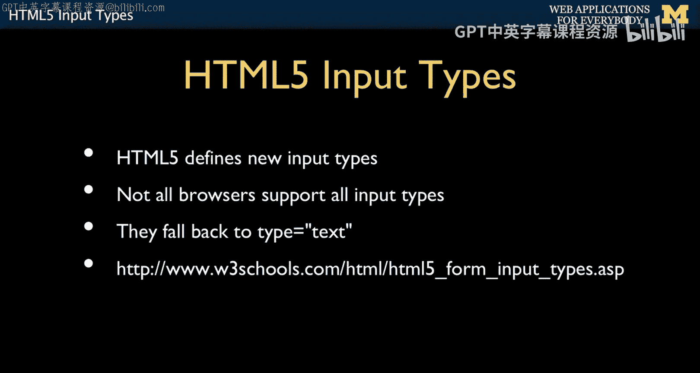
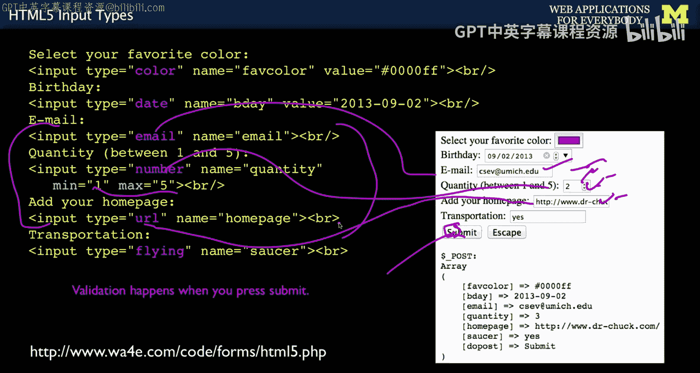
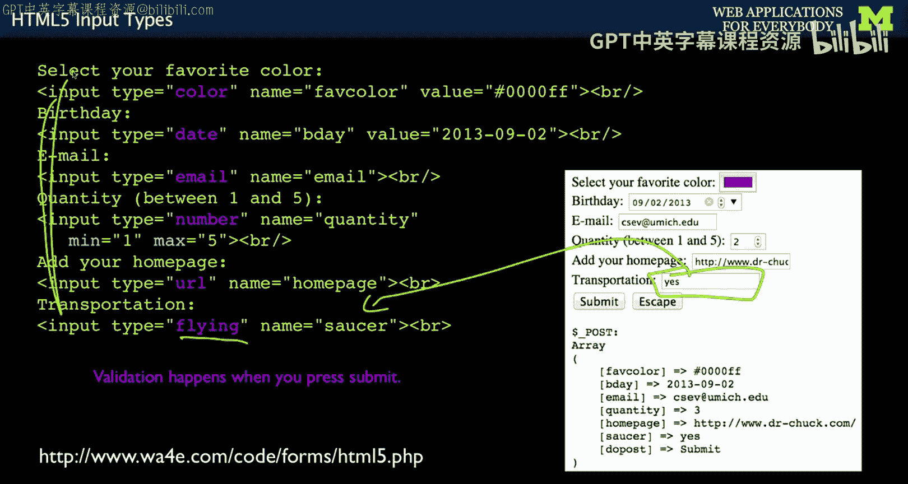

# 密歇根大学《面向所有人的Web应用程序（PHP、SQL、APP、JavaScript和JQuey｜Web Applications for Everybody》 p44 43_HTML5输入类型.zh_en -BV1Lr421A75d_p44-

So HTML over the years has had multiple versions， the original 1。0， and HTML5 is the latest one。

 and it's actually。

Well established。 And so we tend to use HTML 5 HTML 5 have introduced some new input types。

 And if you go to super old browsers， they're not going to support these and they all sort of fall back to being type equals text。

 And so there's lots of good examples。 I'm just going to show you a little bit about them just to kind of get you started。

 And so these are new input types type equals color。

Right and and so if you didn't have a browser， this would just be a text box here and you could put in this is a hex number。

 but this is like a little bit of a UI thing that the browser provides。

 the browser provides that if it provides it。So it's not something you have written。

 it's not something CSS does。 It's not something Javascript does。

 You could write your own ja color picker， but this is a color picker built into the browser。

 So if you're on a Mac， this will look different than if you're on Windows or on Linux because whatever you said is make a color picker that's native to the system that's on this。

 And so you click it and if you're on an Apple it'll look just like the color picker that you use in PowerPoint or whatever。

 And so you pick a color it shows a little square you pick it and then it sends this string back which is the hex value and puts that in and sends that in when you post okay。

Similarly， a date。And again， you got to remember these things all fall back to text。

 So date says make a date picker that makes sense within the context of that operating system。

 and it sends back a string based on whatever date you picked that's in kind of like this year month day。

 But it's this you didn't write that code， and it's consistent with what the operating system does for dates。

 which is kind of nice E is really just like a text field， except that it has a validation。Number。

Also is a text field that has validation in these little arrows that go up and down。

 and you can give it a range。Now， and the same thing is for URL。

 URL is another field that basically you're saying I'm expecting this to be a URL， these three。

Are all validated in the browser。 The way this works is when you press the submit button before the form is submitted。

 it checks this， this and this to see if the format's right。 If the format's wrong。

 it puts up little message that you don't control and says， I didn't submit your form。

 So it doesn't actually go to the browser in the request response cycle。

 it stops before it sends the data and makes you finish this。

 And so it'll block you from sending the data until you meet the criterion says that email is in the right format numbers the right format URLs in the right format。

 but。

You inside the server， still， there's ways for people to bypass this stuff。

 so you got to be careful so that there's no guarantee that you it just because you ask it to be a number doesn't mean you can assume it's a number in the server。

 So the service does to protect itself from bad data， which we're going talk about in a little bit。

And then the last thing to talk about is fact that if there is something that it doesn't recognize so flying saucer or isn't flying is not a type that's in HTML 5。

 maybe we'll be an HTML 6， but it's not。 it's just like。

 oh okay whatever I don't know what that is So I'm going to give you a basic text field。 So yes。

 iss going to come in with a name saucer。 And so that's this sort of the safety net when they put these things in that they all on a browser that came before HTML 5。

 And there's code that you can drop in that sort of shims these things in with jascript but basically。

These are just one form of an option that you have to affect your user experience。

So up next， we're going to talk about talk data coming into the server and validating that data and how we might handle that data。

