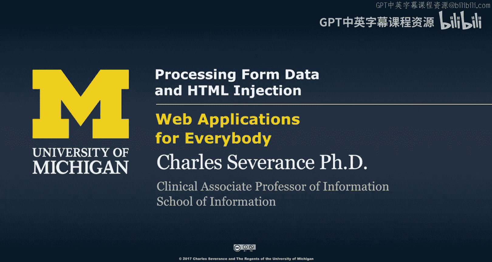
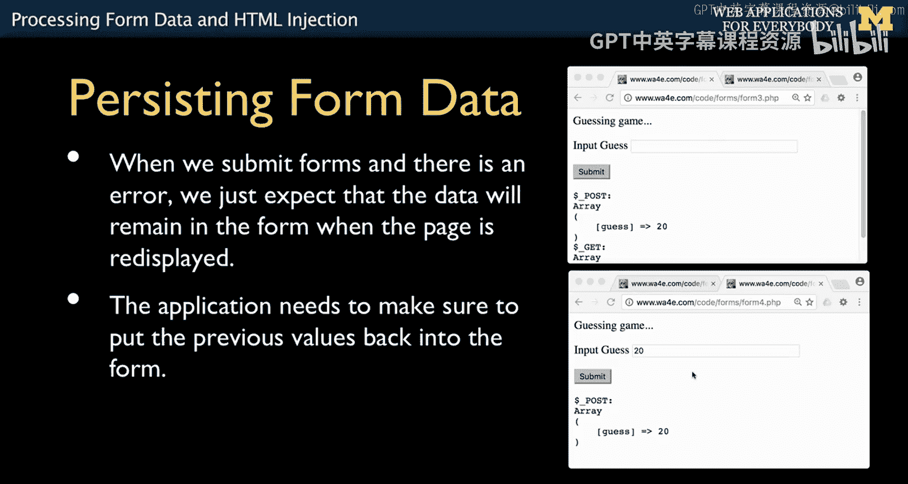
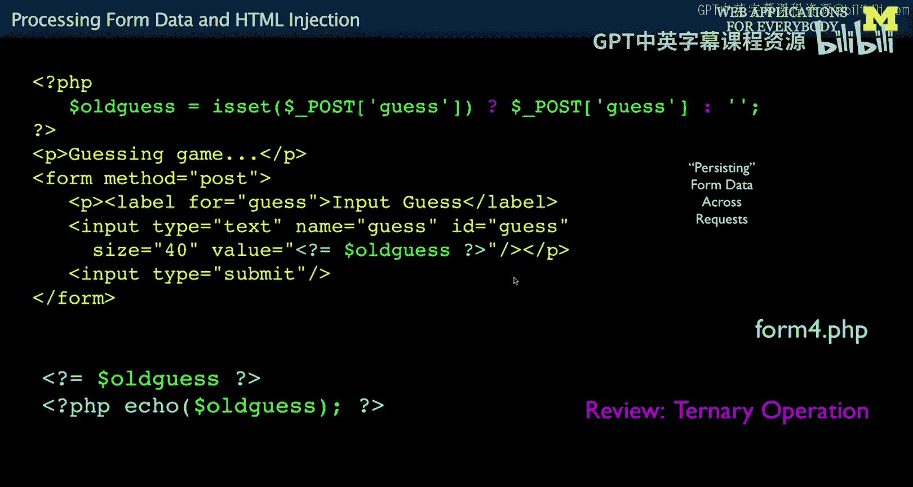
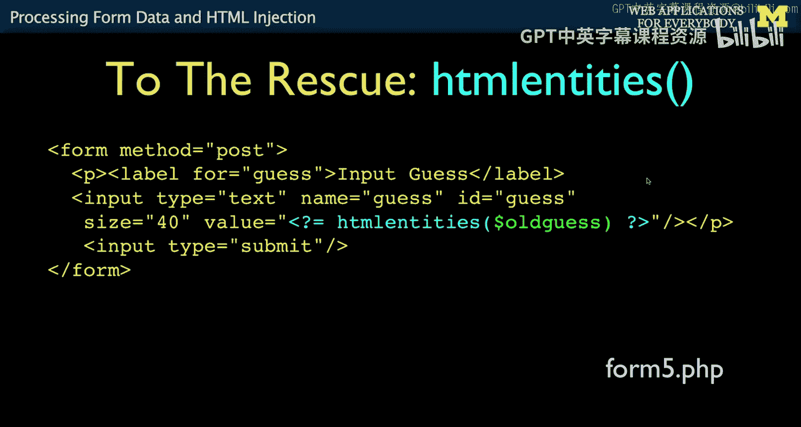
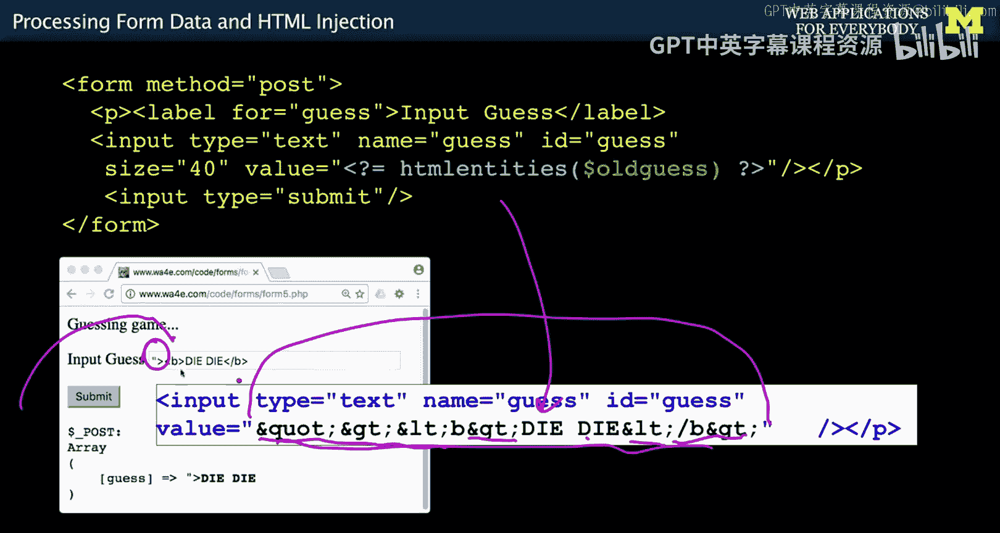
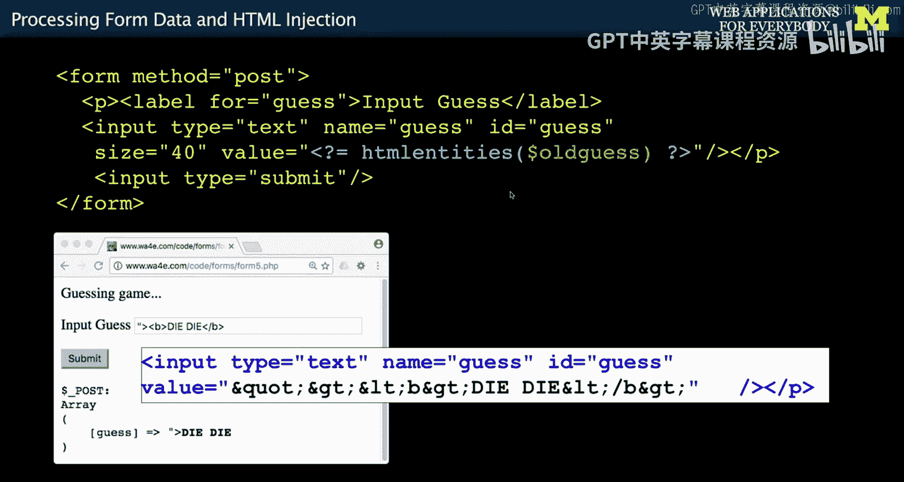

# 密歇根大学《面向所有人的Web应用程序》：第45讲：表单数据处理与HTML注入 🛡️




在本节课中，我们将学习如何处理从服务器接收到的表单数据。我们将重点关注如何在不同页面间持久化表单数据，以及如何防范一种常见的安全漏洞——HTML注入攻击。

---

## 数据持久化：在请求间保留表单值


上一节我们介绍了如何创建HTML表单以及如何通过`$_POST`接收数据。本节中，我们来看看如何处理`$_POST`数据。首先要讨论的是如何将表单数据从一个页面持久化到另一个页面。

用户提交表单后，如果出现错误，他们通常希望看到之前输入的值，以便进行修改。例如，用户输入了“20”并提交，如果数据没有保留，表单再次显示时输入框将是空的。作为开发者，我们需要主动将旧值从一个请求复制到下一个请求。

这是一个非常普遍的需求，但实现它需要我们编写特定的代码。同时，这也成为了最常见的安全漏洞来源之一。



我们的脚本会在两种情况下运行：
1.  首次通过GET请求访问URL时，显示空表单。
2.  用户填写表单并提交后，脚本通过POST请求再次运行，此时需要显示带有上次输入值的表单。

我们需要使用`isset()`来判断当前是POST请求（包含`guess`值）还是GET请求（仅显示表单）。首次访问显示空表单，第二次则显示包含上次猜测值的表单。

以下是实现此逻辑的代码示例，我们使用三元运算符来简化判断：

```php
$old_guess = isset($_POST['guess']) ? $_POST['guess'] : '';
```

变量`$old_guess`将传递到模板代码中。表单的其他部分与之前类似，关键区别在于输入框的`value`属性：

```html
<input type="text" name="guess" value="<?= $old_guess ?>">
```

`value`属性允许我们在生成HTML时预填充表单字段。这样，用户上次提交的“42”就会显示在输入框中。

---

## PHP短标签：简化输出

通常，在HTML中嵌入PHP变量需要这样写：

```php
value="<?php echo $old_guess; ?>"
```

这表示切换到PHP模式，执行`echo`命令，然后切换回HTML。由于这种操作非常频繁，PHP提供了一个简写语法：

```php
value="<?= $old_guess ?>"
```

`<?=` 是 `<?php echo ... ; ?>` 的快捷方式。我们在混合HTML和PHP代码时经常使用这种简写，特别是当只需要输出一个变量值时。

---

## 安全漏洞：HTML注入攻击 ⚠️

然而，上面展示的代码 `value="<?= $old_guess ?>"` 是你能写出的最糟糕的应用程序代码之一。原因在于“HTML实体”和“HTML注入”问题。

如果用户足够聪明，他们可能会在表单字段中输入一些能构成有效HTML的代码。例如，他们知道你的代码会生成 `value="用户输入"`。但如果用户输入的内容本身包含引号呢？

假设用户输入了：`"><b>die die die</b>`

提交后，页面上显示的旧猜测值不再是文本，而是加粗的“die die die”。这是因为用户输入的内容“破坏”了原有的HTML结构，并插入了他们自己的代码。

这被称为**HTML注入**。用户通过精心构造的输入，在一定程度上“接管”了页面。通常，攻击者做的远比显示“die die die”更邪恶，他们可能窃取信用卡号，或者诱使教师登录系统后篡改成绩——本质上，是让浏览器执行攻击者希望的代码。

问题的根源在于，浏览器解析HTML时，无法区分哪些是开发者编写的原始代码，哪些是来自用户输入的数据。当用户输入包含特殊字符（如引号、尖括号）时，这些字符会改变页面的HTML结构。

对于开发者来说，每当使用来自用户的输入数据生成HTML输出时，都必须高度警惕。`$old_guess` 不是一个普通的变量，它是一个**来自用户输入的变量**。打印用户输入时，必须确保以安全的方式进行。

---



## 解决方案：使用 `htmlentities()` 函数进行转义

幸运的是，修复这个问题非常简单。PHP提供了一个名为 `htmlentities()` 的函数。


回顾HTML基础，我们知道某些字符需要用实体（Entity）来表示：
*   小于号 `<` 表示为 `&lt;`
*   与号 `&` 表示为 `&amp;`
*   双引号 `"` 表示为 `&quot;`

这些替代表示法就是HTML实体。`htmlentities()` 函数的作用是，将数据中所有可以表示为HTML实体的字符，都转换为其对应的实体形式。

因此，安全的写法应该是：

```php
value="<?= htmlentities($old_guess) ?>"
```

让我们看看经过 `htmlentities()` 处理后的输出是什么：



```
value="&quot;&gt;&lt;b&gt;die die die&lt;/b&gt;"
```

现在，用户输入的双引号 `"` 被转换成了 `&quot;`，尖括号 `<` `>` 被转换成了 `&lt;` 和 `&gt;`。当浏览器解析时，它会正确地将 `&quot;` 识别为值内部的一个普通字符，而不是属性值的结束引号。因此，页面上会安全地显示出用户输入的原始文本：`"><b>die die die</b>`。

无论用户提交多么“疯狂”的内容，都会被安全地转义显示。在本课程的自动评分系统中，我会反复检查这一点，因为很多人在构建Web应用时都会在此犯错，从而暴露于HTML注入攻击之下。

请务必牢记（在接下来的课程中我还会提醒无数次）：**来自用户的数据是危险的，我们必须对它们进行转义（Escape）**。



---


## 总结

本节课中我们一起学习了：
1.  **数据持久化**：如何使用 `$old_guess = isset($_POST['guess']) ? $_POST['guess'] : '';` 和 `value="<?= $old_guess ?>"` 在请求间保留表单值。
2.  **PHP短标签**：`<?=` 是 `<?php echo ... ; ?>` 的快捷输出语法。
3.  **HTML注入风险**：直接将用户输入（如 `$old_guess`）输出到HTML中会导致安全漏洞，攻击者可以注入恶意代码。
4.  **安全转义**：使用 `htmlentities()` 函数对输出到HTML中的用户数据进行转义，例如 `value="<?= htmlentities($old_guess) ?>"`，这是防止HTML注入攻击的关键措施。




记住，处理用户输入时，永远要保持警惕并正确转义。